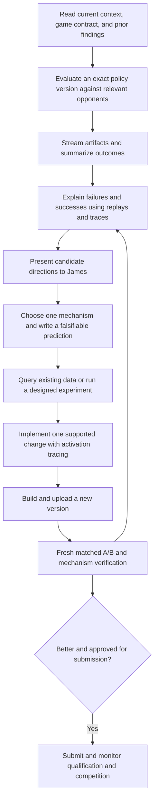

# Player lab policy optimization: current setup

> Pre-modernization snapshot at `bd38453830a884ff954795967a4d4b3e65ad2ab6`. For the resulting setup, use the [capability map](../capabilities.md) and [modernization audit](../reports/modernization-audit-2026-09-14.md). Historical line citations refer to the inspected source state.

**Investigated September 14, 2026.** Repository: `JBoggsy/player_labs`, checkout `personal_labs_main`, commit `bd38453830a884ff954795967a4d4b3e65ad2ab6`. A fresh fetch found HEAD equal to `origin/main`; the working tree was clean before this report.

## Summary

The lab is a **human-directed optimization workshop**: you choose strategic directions, and the coding agent gathers evidence, builds the necessary instruments, implements focused changes, and measures them. Its main asset is a combination of operating instructions, experimental discipline, reusable scripts, and accumulated game knowledge. It is not a single optimizer service that automatically manages every stage. That distinction follows from the documented skill chain and the separate per-game instruments. [Operating model](../../AGENTS.md:8), [method versus bindings](../reports/experimentation-guide-2026-07-14.md:265).

The intended flow is coherent, but implementation and documentation are uneven. Crewrift has the fullest analysis pipeline. Several other labs have substantial specialist tools without the shared adapters needed to use every generic skill. Important instructions also conflict: evaluation pricing, experiment approval, competitor access, and supposedly universal build recipes. These are detailed below rather than silently resolved into a cleaner story than the repository supports.

**Scope:** all eight requested questions, the shared skills and scripts, lab-level guides, representative game instruments, and recordkeeping. This is a repository-state report. I did not launch evaluations, query current standings, verify hosted prices, update dependencies, or operate any player. Historical league and experiment claims remain historical.

## 1. What is the overall optimization flow?

This diagram combines the root loop with the experiment method. The ordinary loop starts with evaluation; a new lab first needs enough game understanding and a runnable baseline to produce that evidence. [Root sequence](../../AGENTS.md:40), [cold-start procedure](../reports/experimentation-guide-2026-07-14.md:66).

The operating priorities are:

- **Iterations per day.** Make a focused change, rebuild, upload, and use hosted evaluation to test it. Routine local smoke tests and broad pre-upload test gates are explicitly excluded from the standard player iteration.
- **Rigor in conclusions.** Fast uploads do not justify weak performance claims. Comparisons need appropriate opponents, fresh matched conditions, decomposition by role or matchup, and evidence that the intended behavior activated.
- **Separate upload from competition.** Upload creates a version to evaluate; league submission is a separate human decision.
- **Stop at the agreed thread boundary.** Propose the next step and pause instead of automatically starting a new gameplay direction.

Sources: [speed and conclusion discipline](../../best_practices.md:9), [measurement](../../best_practices.md:41), [activation tracing](../../user_preferences.md:28), [submission and pause](../../AGENTS.md:76).

An experience request is a batch of episodes with a specified policy version, roster, roles/configuration, and count. Results should download while games are still running. The generic downloader does this; Crewrift adds incremental warehouse construction. A completed request is not enough by itself: artifact retries can be exhausted while the downloader still exits successfully, so completeness must be checked. [Request workflow](../../.claude/skills/coworld-experience-requests/SKILL.md:103), [downloader completion](../../.claude/skills/coworld-episode-artifacts/scripts/fetch_artifacts.py:619).

## 2. What general-purpose knowledge, skills, practices, and tools exist?

### Knowledge and practices

The shared knowledge has several distinct homes:

| Source | What it teaches |
|---|---|
| `AGENTS.md` | The optimization loop, human/agent responsibilities, scope boundaries, and skill index. |
| `best_practices.md` | Measurement, causal diagnosis, hypothesis discipline, provenance, and recurring platform traps. |
| `user_preferences.md` | Your standing decisions about speed, tracing, evaluation, account use, and access boundaries. |
| `player-build.md` | The runnable player image and platform contract. |
| `docs/player-engineering.md` | Choosing scripted, LLM, or hybrid architectures; separating decision logic from transport; tracing; robustness; navigation. |
| `docs/reports/experimentation-guide-2026-07-14.md` | A portable explanation of the method and how instructions, skills, records, and hooks deliver it to agents. |

Sources: [root orientation](../../README.md:27), [engineering doctrine](../player-engineering.md:1), [portable guide](../reports/experimentation-guide-2026-07-14.md:234).

The most consequential practices are: analyze batches rather than isolated games; split by role and opponent; normalize by exposure; distinguish operations failures from gameplay; match controls in the same time window; replicate; inspect full distributions; and test competing explanations before claiming a cause. The objective determines the opponent field—strong, middle, and weak opponents can reveal different gains. [Measurement practices](../../best_practices.md:41).

### Shared skills and executable support

| Skill | Job | Actual support |
|---|---|---|
| `coworld-experience-requests` | Resolve policies/rosters, create and monitor hosted batches | Request CLI plus a local progress dashboard. |
| `coworld-episode-artifacts` | Collect evidence | Metadata, results, replays, logs, telemetry artifacts; one-shot or resumable streaming. |
| `coworld-experiment` | Decide whether one explanation survives a test | Design/critique/verdict procedure plus HTML report renderer. |
| `coworld-ab` | Measure whether a change helped | Shared statistics, Markdown/JSON output, HTML renderer; game supplies metric extraction. |
| `coworld-hypothesis-miner` | Generate candidate directions from score variation | Shared feature-analysis/ranking engine; game must supply feature adapter. |
| `build-and-upload` | Produce and record an evaluable version | Build/upload instructions and version inventory helper; current recipe is heavily Crewrift-specific. |
| `coworld-policy-lifecycle` | Enter and follow competition | Submission instructions and version/membership/qualification monitoring. |
| `coworld-local-run` | Debug an artifact that cannot play | Local own-image run and replay inspection. |
| `coworld-community` | Read public game-community knowledge | Forum/wiki read/search/history; separate write operations with human authorization. |

Sources: [shared index](../../AGENTS.md:103), [A/B adapter interface](../../.claude/skills/coworld-ab/scripts/ab_stats.py:1), [miner adapter interface](../../.claude/skills/coworld-hypothesis-miner/SKILL.md:65), [community implementation](../../tools/coworld_community.py:228), [build recipe](../../.claude/skills/build-and-upload/SKILL.md:3).

There is also a shared Python environment, rather than a new environment per instrument. Its declared dependencies include the Coworld client/SDK, numerical/data libraries, DuckDB/Parquet support, plotting, and an optional learned-policy training group. Individual policies may use Python or native builds. This report inspected declarations, not installed-package freshness. [Dependency and packaging configuration](../../pyproject.toml:1).

## 3. How does exploring the state of a game work?

“State of a game” has three useful meanings here, and the setup supports each differently.

### A. Understand the game and its current competitive field

Read the lab's game reference, then verify the rules against authoritative source: what the player can observe, legal actions, scoring, timing, role asymmetry, and protocol. Architecture follows those facts. For competition research, inspect current opponents and representative episodes, and use public forum/wiki material as additional evidence. Community assertions are leads to verify, not substitutes for rules or measured behavior. [Mechanics-first checklist](../player-engineering.md:15), [ground-truth discipline](../../best_practices.md:179), [community research](../../.claude/skills/coworld-community/SKILL.md:8).

The intended freshness discipline is to verify source versions and API/CLI contracts before relying on old recipes. Old league IDs, opponent versions, and game pins are not timeless facts. A current example of the maintenance burden is the parked request-roster resolver repair. [Freshness practice](../../best_practices.md:253), [resolver issue](../../TODO.md:8).

### B. Explore what happened during episodes

Start broad and inexpensive: score distributions, role/matchup breakdowns, completion failures, and conspicuous wins/losses. Then examine selected replays and sequential events. A static heatmap cannot establish a chase or an interception; those require ordered trajectories or event-centered windows. [Diagnosis practices](../../best_practices.md:142), [Crewrift survey and warehouse](../../crewrift_lab/AGENTS.md:87).

In the most developed pipeline, episodes become a **policy-indexed event warehouse**: a queryable store connecting events to policy, version, seat, role, episode, and time. This makes questions such as “how often does an opportunity lead to a successful action?” answerable across many games rather than by watching them one at a time. [Warehouse role](../../crewrift_lab/AGENTS.md:94).

### C. Explore what the player thought was happening

Join objective replay events to the player's subjective traces: observation → belief → selected strategy → action, with reasons and activation counts. Check identity and clock alignment before interpreting the join. Crewrift has a dedicated belief audit that writes aligned belief partitions and scans for divergences between belief and truth. [Belief-audit design](../../crewrift_lab/.claude/skills/crewrift-belief-audit/SKILL.md:8), [alignment and identity](../../crewrift_lab/.claude/skills/crewrift-belief-audit/SKILL.md:41).

This produces two complementary hypothesis sources:

- **Divergence:** the player was wrong about something or acted inconsistently with what it knew.
- **Outcome variation:** an observable behavior separates this policy version's good episodes from its bad ones.

The miner supports the second route, while diagnosis connects both routes back to code. Correlation generates candidates; it does not establish causation. [Diagnosis procedure](../../crewrift_lab/.claude/skills/crewrift-diagnose/SKILL.md:38), [miner limitations](../../.claude/skills/coworld-hypothesis-miner/SKILL.md:23).

**Access boundary:** your later explicit preference prohibits elevated access to competitor artifacts for optimization. Older warehouse and working-context recipes still recommend it; those recipes must not be followed for that purpose. [Preference](../../user_preferences.md:13), [conflicting older recipe](../../crewrift_lab/.claude/skills/crewrift-belief-audit/SKILL.md:26).

## 4. How am I instructed to interact with you?

The division of labor is deliberate: **you originate strategic jumps and judge gameplay quality; I make those judgments cheaper through evidence and implementation.** I should present meaningful alternatives, agree on the behavioral model before a substantial change, explain what I am doing, and translate results into what the player actually does. [Role definition](../../AGENTS.md:14), [direction step](../../AGENTS.md:60), [communication guidance](../getting-started.md:3).

In ordinary authorized work, I should carry out the mechanical steps without repeatedly asking: gather artifacts, query data, turn up existing tracing, run relevant hosted evaluations, build, and upload. Your preferences explicitly authorize targeted evaluations without an additional permission question. Requests over 16 episodes should be accompanied by the local dashboard link. [Evaluation authorization and dashboard](../../user_preferences.md:44).

I should return decision-ready hypotheses, rather than silently choosing and implementing a new strategy. At a thread's end I propose and pause. League submission and public community writes require appropriate explicit authorization. [Pause rule](../../AGENTS.md:85), [community gate](../../AGENTS.md:142).

**The instructions are inconsistent about experiments.** The experiment skill still says to obtain go-ahead even before querying existing data. That conflicts with the broader autonomy instructions and your later evaluation authorization. Existing authorization should control; an agent should not make you reapprove already authorized work merely because an older skill says “always.” The unresolved repository problem is that its files still communicate different defaults. [Experiment gate](../../.claude/skills/coworld-experiment/SKILL.md:74), [later preference](../../user_preferences.md:44).

## 5. How are ideas, experiments, and lessons tracked?

There is no single universal experiment database. The design distributes different kinds of records across files:

| Record | Intended contents and lifecycle |
|---|---|
| `<lab>/WORKING_CONTEXT.md` | Current objective, active version, live findings, open questions, and pointers. Read on resume; prune and reseed on a pivot. |
| Root `TODO.md` | Deferred tasks and ideas, including why they were parked; Open/Done organization. |
| Experiment preregistration in lab `docs/designs/` | Mechanism, prediction, data/configuration, decision rule, and controls written before running. |
| Experiment reports and analysis scripts | Evidence and verdict: confirmed, refuted, or inconclusive; the script should make the result reproducible. |
| Player version log | Uploaded version → change, identity, and supporting context. |
| Game best practices / closed-lever notes | Distilled findings about mechanisms already tested; avoid repeatedly rediscovering rejected ideas. |
| `<lab>/TENTATIVE_LESSONS.md` | Eager session notes about possible reusable lessons, with evidence. |
| `<lab>/lessons_archive/` | Previous session buffers; human-led review promotes recurring, supported lessons into durable practices. |
| `user_preferences.md` at root or lab | Standing collaboration decisions, separate from experimental results. |

Sources: [working context and lesson lifecycle](../../crewrift_lab/AGENTS.md:154), [deferred work](../../AGENTS.md:154), [experiment records](../../.claude/skills/coworld-experiment/SKILL.md:32), [versioning](../../.claude/skills/build-and-upload/SKILL.md:66), [closed mechanisms](../../crewrift_lab/best_practices.md:340).

The strongest recorded durability practice comes from the Crewrift multi-loop run: **preregister → commit → run → verdict → commit**, and preserve analysis instruments alongside the preregistration. Re-fetchable episodes are different from irreplaceable decision records and scripts. That is a documented run practice, not a universally enforced transaction system. [Durability rules](../../crewrift_lab/docs/designs/2026-07-28-improvement-loop-alpha.md:75).

### What is actually automated?

The repository's `.claude/settings.json` configures session-start lesson rotation for seven labs and a common stop reminder. Rotation preserves nonempty buffers, avoids byte-identical duplicate archives, and does not rotate on resume/compaction. The stop hook looks for Claude-style tool-use records and untouched lesson headings. These are **Claude Code hooks**, not evidence of automatic execution in this Codex session. Sugarscape is absent from this configured list. [Hook configuration](../../.claude/settings.json:1), [rotation](../../crewrift_lab/tools/rotate_lessons.sh:1), [reminder](../../tools/lessons_stop_nudge.sh:20).

There is a separate committed agent-memory snapshot under `docs/agent-memory/`. Its README explicitly says it is point-in-time and not automatically synchronized with the external live Claude memory. It is another reference source, not the experiment ledger. [Memory snapshot contract](../agent-memory/README.md:1).

## 6. How are shared and game-specific tools tracked?

The intended discovery path is **root README/AGENTS → lab README/AGENTS → lab documentation index → relevant skill or tool**. Skills contain trigger descriptions, procedural instructions, references, and sometimes executable scripts. Generic methods belong under root `.claude/skills/`; game-specific bindings and tools belong under the game lab. [Root ownership rule](../../AGENTS.md:149), [skill discovery model](../reports/experimentation-guide-2026-07-14.md:265).

That is a documentation convention, not a machine-validated catalog. The current inventory has shared A/B adapters in Crewrift and archived CTF, while Paintbot explicitly lists its adapter as missing. The generic hypothesis miner has a documented adapter interface, but I found no game-local implementation of that interface in this checkout. The other files named `features.py` are specialist analysis modules, not evidence that the generic miner is wired up. [A/B contract](../../.claude/skills/coworld-ab/SKILL.md:69), [Paintbot gap](../../paintbot_lab/AGENTS.md:172), [miner contract](../../.claude/skills/coworld-hypothesis-miner/SKILL.md:65).

Discovery also needs filesystem verification: Crewrift has a `crewrift-field-study` skill that is not listed in its AGENTS skill index. Documentation alone can therefore understate available tools. [Actual skill](../../crewrift_lab/.claude/skills/crewrift-field-study/SKILL.md:1), [index](../../crewrift_lab/AGENTS.md:83).

## 7. What components make up the setup?

The useful architecture is six layers:

1. **Operating guidance:** how agent and human collaborate and what constitutes evidence.
2. **Platform operations:** authentication/client dependencies, uploads, experience requests, artifact retrieval, and league lifecycle.
3. **Experimental methods:** diagnosis, falsification, A/B comparison, and candidate mining.
4. **Game instruments:** parsers, warehouses, metrics, viewers, probes, and game-specific evaluation designs.
5. **Player implementation:** perception, belief, strategy, action execution, transport, configuration, and telemetry.
6. **Durable records:** current context, experiments, versions, decisions, and lessons.

This is a synthesis of the root layout, method/binding split, and player architecture guidance—not six separately deployed services. [Repository layout](../../README.md:27), [method/binding split](../reports/experimentation-guide-2026-07-14.md:265), [player structure](../player-engineering.md:57).

### Game-lab landscape

| Lab | Repository shape relevant to optimization |
|---|---|
| Crewrift | Full survey, event warehouse, belief audit, diagnosis, experiment/A/B, and specialist field-study tools; the reference implementation for much of the framework. |
| Paintbot | Native player, replay/belief/navigation visualization, campaign tools, and a separate learned-policy track; missing a completed game-specific shared A/B binding and appropriate full survey/warehouse integration. |
| Heartleaf | Player implementation plus game-specific replay, movement, and event-warehouse tools; its front-page “no policy yet” status is stale. |
| Cue-n-Woo | Multiple player versions and specialist probing/analysis; less of the standardized survey/A/B wrapper stack. |
| Emerg-ant | Native player variants, mechanics research, local probes and hosted evaluation scripts; a lab-specific local-self-play exception. |
| Vanilla WoW | Player and specialist route/navigation/runtime tools; distinct operational needs. |
| Proxy War | Recon-oriented foundation; README records no player yet. |
| Sugarscape | Small movement-policy comparison lab with explicit competitive metrics and limits on observable hypotheses. |
| CTF | Archived lab; its A/B adapter and older analysis tools remain as reference material. |

Sources: [Crewrift tools](../../crewrift_lab/AGENTS.md:83), [Paintbot tools and gaps](../../paintbot_lab/AGENTS.md:94), [Paintbot learned-policy track](../../paintbot_lab/WORKING_CONTEXT.md:6), [Heartleaf implementation](../../heartleaf_lab/cady/README.md:1), [Cue-n-Woo](../../cue_n_woo_lab/README.md:1), [Emerg-ant](../../emergant_lab/AGENTS.md:49), [Vanilla WoW](../../vanilla_wow_lab/README.md:1), [Proxy War](../../proxywar_lab/README.md:15), [Sugarscape](../../sugarscape_lab/README.md:1), [CTF archive](../../ctf_lab/README.md:1).

There is also a **documented autonomous multi-loop mode**, developed in Crewrift. Its pipeline adds field-scale sampling, aligned belief events, variance mining, divergence scans, preregistered experiments, and confirmatory comparisons. A historical run report records completed iterations. However, its standing submission permission was explicitly limited to that run. It does not authorize future autonomous campaigns or prove a general turnkey optimizer exists. [Run-specific authority and pipeline](../../crewrift_lab/docs/designs/2026-07-28-improvement-loop-alpha.md:9), [historical report](../../crewrift_lab/docs/designs/2026-07-29-improvement-loop-alpha-run-report.md:1).

## 8. How do I decide what game tools to build, and how do I build them?

The intended trigger is **a concrete unanswered question**, not a predetermined toolkit checklist.

1. **Read mechanics and existing instruments.** Establish scoring, observations, timing, and protocol; inspect the game starter, existing player, replay readers, and lab docs before adding anything.
2. **Start with the cheapest evidence.** Use an existing-data query when it can decide the question; design a new batch when it cannot; add instrumentation when the required signal is missing.
3. **Identify the failing layer.** Missing observation needs a decoder/trace; wrong belief needs truth alignment; uncertain conversion needs event queries; unclear spatial sequence needs a timeline/viewer; missing outcome comparison needs a metric adapter.
4. **Build only that missing instrument.** Reuse shared methods, renderers, and the project's dependencies. Keep game semantics in the game lab.
5. **Verify that the instrument measures what it claims.** Check source-defined event semantics, policy/seat identity, timing, completed-game filtering, and behavior activation against concrete artifacts.
6. **Make it discoverable and reusable.** Add its command, inputs, outputs, assumptions, and purpose to the lab docs; preserve the analysis script with its experiment when it supports a verdict.

Sources: [mechanics and architecture](../player-engineering.md:15), [cheapest-instrument ordering](../../.claude/skills/coworld-experiment/SKILL.md:32), [diagnosis/observability](../../best_practices.md:142), [game ownership](../../AGENTS.md:149), [instrument durability](../../crewrift_lab/docs/designs/2026-07-28-improvement-loop-alpha.md:75).

Two concrete extension interfaces already exist:

- **A/B:** load game results into per-appearance records, define metrics and whether higher/lower is better, define grouping and aggregators, then call the shared delta/report engine.
- **Hypothesis mining:** implement `adapter(raw_row) -> Episode | None` and `METAS` describing timing/presence/count features, descriptions, and candidate change hints. The adapter must encode game meaning; the engine cannot discover useful semantics from arbitrary raw replay bytes.

Sources: [A/B interface](../../.claude/skills/coworld-ab/scripts/ab_stats.py:1), [miner interface](../../.claude/skills/coworld-hypothesis-miner/SKILL.md:65).

**My assessment:** the setup teaches a capable agent how to choose and build instruments, but does not supply a complete new-game onboarding generator or automatically check that every game has the tools its advertised skills require.

## 9. Material gaps and contradictions

### Operational guidance has drifted

- **Pricing:** root AGENTS/best practices repeatedly say hosted requests are free; the later user preference says they cost money and prohibits paid self-play. Actual current billing was not queried. Use the later preference for planning, and do not claim evaluations are free. [Root claim](../../AGENTS.md:27), [later preference](../../user_preferences.md:23).
- **Approval:** “one gate” is an incomplete description given strategic decisions, the experiment skill's approval language, and public community writes. Existing authorization must be recognized rather than repeatedly requested. [Root gate](../../AGENTS.md:76), [experiment gate](../../.claude/skills/coworld-experiment/SKILL.md:74).
- **Access:** older competitor-artifact recipes conflict with the explicit no-elevated-intelligence preference. [Preference](../../user_preferences.md:13), [older recipe](../../crewrift_lab/.claude/skills/crewrift-belief-audit/SKILL.md:26).
- **General versus game-specific:** root preferences contain universal-sounding Crewborg LLM/telemetry recipes; shared build instructions also hardcode Crewborg, and the dashboard computes crew/imposter metrics. These are not universally applicable game interfaces. [Preferences](../../user_preferences.md:56), [build recipe](../../.claude/skills/build-and-upload/SKILL.md:3), [dashboard implementation](../../.claude/skills/coworld-experience-requests/scripts/xp_dashboard.py:155).

### The declared statistical discipline exceeds the shared implementation

Best practices request multiple tests and multiple-comparison correction. The generic A/B engine implements normal-approximation tests for rates and means, with per-metric significance verdicts. It does not itself implement rank tests, paired/cluster-aware inference, or multiple-comparison correction. Its `noise` verdict means “not significant under this test,” not “equivalent.” The agent or a specialist experiment script must supply the stronger analysis when required. [Practice](../../best_practices.md:50), [actual tests and verdict logic](../../.claude/skills/coworld-ab/scripts/ab_stats.py:33).

Similarly, the miner's estimated recoverable points are a ranking heuristic derived from correlations and score contrasts. They should not be presented as measured causal upside. [Calculation](../../.claude/skills/coworld-hypothesis-miner/scripts/variance_miner.py:134), [correlation warning](../../.claude/skills/coworld-hypothesis-miner/SKILL.md:23).

### A tool's location does not establish game compatibility

Paintbot's `event_warehouse.py` still describes a CTF/Beacon warehouse, falls back to alternating red/blue teams, and calculates a two-team winner. Paintbot's guide correctly lists a proper game-specific warehouse as unfinished. Moving the file did not complete the semantic adaptation. [Implementation](../../paintbot_lab/tools/event_warehouse.py:1), [team fallback](../../paintbot_lab/tools/event_warehouse.py:57), [winner calculation](../../paintbot_lab/tools/event_warehouse.py:126), [acknowledged gap](../../paintbot_lab/AGENTS.md:172).

### Recordkeeping exists, but “current context” is often an archive

Working-context files are intended to be short and pruned. Several now contain long sequences of historical objectives and completed runs. This increases the chance of treating an old champion, permission, or operational workaround as current. Likewise, Heartleaf's README says no player has been built while the Cady implementation and version log exist. [Context contract and accumulated history](../../crewrift_lab/WORKING_CONTEXT.md:3), [stale Heartleaf status](../../heartleaf_lab/README.md:15), [player record](../../heartleaf_lab/cady/VERSION_LOG.md:1).

## Conclusion and suggested next step

**The strongest part is the method:** it connects outcomes to traces, traces to mechanisms, mechanisms to falsifiable experiments, and accepted changes to versioned evidence. The weakest part is consistency across games and across the files that instruct agents. Shared capability is sometimes described more broadly than the implemented bindings justify.

My suggested next step is a **focused documentation and capability-map cleanup**: reconcile the conflicting operating rules, identify which shared interfaces each lab actually supports, and prune live-context files into current state plus historical links. That would make future agents faster and less likely to repeat old mistakes. This report does not perform that cleanup or initiate another optimization thread.

## Unresolved / verification limits

- All eight requested setup questions are answered from repository sources.
- Current hosted pricing, standings, deployed versions, installed CLI freshness, and service health were not checked; no historical status in this report should be read as live verification.
- I found no game-local generic-miner adapter or universal workflow controller in the searched skill/tool paths. Untracked code in another checkout or an external agent harness may provide additional capabilities.
- Claude hook configuration is present; its execution in Codex is not established.
- Script behavior was inspected, not exercised against the hosted platform. No performance claim is based on a new run.

## Main source groups inspected

- Root README, AGENTS, practices, preferences, TODO, packaging, player-build, onboarding, engineering doctrine, and portable experiment guide.
- Shared skill instructions and their request, artifact, dashboard, statistics, miner, community, lifecycle, and reporting implementations.
- Lab guides and documentation/tool inventories across all game directories; deeper inspection of Crewrift and Paintbot instruments.
- Working-context/version/lesson records, Claude hook configuration and scripts, committed agent-memory documentation, and the historical multi-loop design/report.
