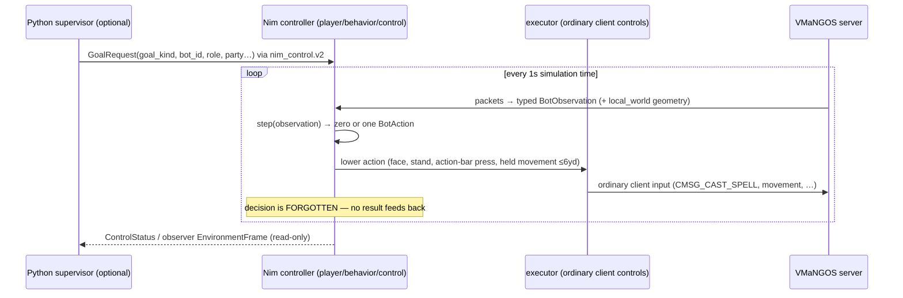
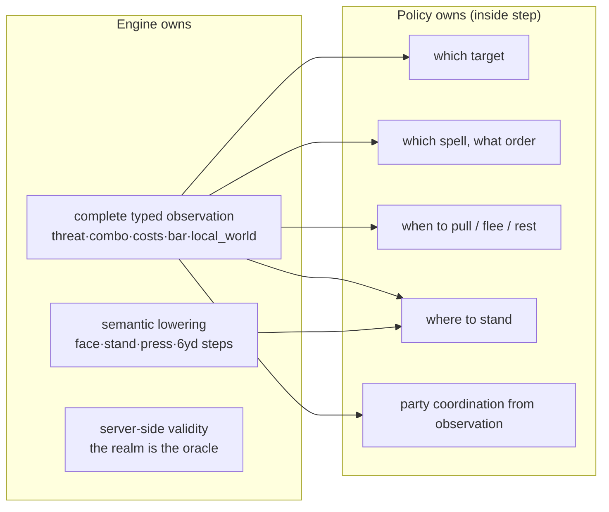
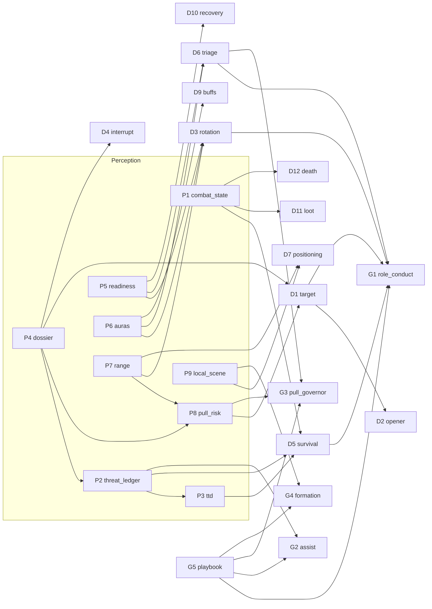

# Coworld Vanilla WoW combat: the complete capability report

**Topic:** what combat *is* in the coworld Vanilla WoW game, what the current contract lets a policy observe and do, and a catalog of atomic combat capabilities for wowborg — structured so we can composite them into higher-level skills later.
**Audience:** this lab (James + coding agents building wowborg). **Date:** 2026-07-24; **revised 2026-07-27** against game repo `788e22147` (327 commits past the original `da32437e8`) after a line-by-line audit found the upstream contract had been rebuilt.
**Sources:** the game repo at `788e22147` (pulled 2026-07-27), the **pinned 0.1.31 SDK snapshot** (what wowborg v4 actually runs against), the lab's reference docs, and web research on 1.12 mechanics and bot architectures. Citation roots: `GAME` = `~/coding/coworlds/coworld-vanilla-wow`, `LAB` = `vanilla_wow_lab/`, `PIN` = `vanilla_wow_lab/.sdk-snapshot/wow_sdk/`. Web claims carry URLs.

> **📍 Orientation for a fresh reader (start here).** Four ideas untangle everything below. **(1) Platform vs client:** the *platform* contract never changed — a player is any Docker image speaking the real WoW 1.12.1 protocol over the session's byte pipes. Everything that changed is inside *upstream's reference client*. **(2) What that client used to offer:** at our pinned 0.1.31, it exposed a per-step seam — Python read a frame with legality masks and a recommended action, and answered with one action. wowborg v4 is built on that. **(3) What it offers now (v2):** the client makes decisions *in-process* (Nim `step(observation) → action`, once per simulated second); Python can only arm goals and *watch*. The `bot_environment.v2` protocol still exists, but frames are read-only observer artifacts — there is no way to answer one. **(4) Our decision (2026-07-27):** fork the client, re-add the per-step answer channel ourselves (its deleted 0.1.31 implementation is the reference), and wrap it in a Gym-like Python interface — so our existing Python brain (nav stack + the combat capability catalog in §7) keeps driving. §3.5 has the full option table and rationale; §9 has the build order.
>
> **⚠️ The 2026-07-27 revision in one paragraph.** Between 07-23 and 07-26 upstream **deleted the external-selection contract this report's first edition was built around**. At HEAD (and in the deployed `0.1.121` packages) there are no FactorizedActions, no action masks, no per-frame policy selection, no `recommended_action`, no `ActionSettled` — the bot boundary is one in-process Nim function, `actions = step(observation)`, and Python may only arm goals and observe (GAME `docs/bot-environment-contract.md:8-24,42-45`). The hosted player is now a **pure native Nim binary** (`vanilla-wow-reference-player --scenario=coworld-session`); the Python wrapper and the `KING_NIMROD_COMMAND` injection seam are deleted (commits `f68817e35` "Replace hosted Python bridge with native player runtime", `263dcad3d`). The game itself split into **three separate hosted coworlds** (`accelerated-wow`, `persistent-wow`, `speedrun-wow` — GAME `release/build_coworld_package.py:109-146`), and the RFC benchmark moved to a **level-19, role-profile, mixed-party format** scored in lower-is-better minutes. This edition targets the new contract; §3.5 covers what it means for wowborg's pinned 0.1.31 stack.

---

## Executive summary

Combat is the lab's queued capability and the proven residual: navigation planning generalizes, but a level-1 character dies every ~500 yd crossing level-10 territory (LAB `WORKING_CONTEXT.md`, session 5h). Under the **v2 contract** (`vanilla_wow.bot_environment.v2`), the central finding of the first edition still holds, but lands differently: the platform owns combat *mechanics* — a typed, complete per-tick observation (now including threat summary, combo points, the visible action bar, and bounded `local_world` Detour geometry), semantic action lowering through ordinary client controls, and server-authoritative validity ("an invalid cast is rejected by the server, and the result appears in later packets" — GAME `docs/bot-environment-contract.md:125-128`). What changed is *where our decisions can cheaply live*: upstream no longer ships a per-step Python seam. Important precision — this is a property of **their reference client**, not the platform: the player contract is still "any image that speaks the 1.12.1 protocol over the session's byte pipes", so our own code in our own repo remains fully legal (wowborg v1 was exactly that). The realistic homes for custom per-step combat decisions are now: **Nim code in a fork of their client** (where their `step()` lives), **a fork that re-opens a Python-facing policy seam** (we maintain what upstream deleted), or **goal supervision** (no per-step decisions at all). The 25-capability catalog survives as the *decision decomposition* — it is seam-agnostic by construction — but its build surface, fallback story, and testing story are rewritten in §7-9.

Three operational facts now dominate strategy. **(1) The deployed games moved and wowborg's seam is a frozen island**: wowborg v4's external-selection stack still runs, because our digest-pinned 0.1.31 image carries its *own* old Nim client and the platform explicitly preserves the v1 session payload for immutable players (GAME `docs/protocol/player_protocol_spec.md:9-13`) — but upstream deleted that seam from all current code, so it receives no fixes and drifts from realm-side behavior. **(2) The RFC competition is unrecognizable**: level-19 normalized characters (not 30), per-role submitted profiles (tank/healer/DPS from a 13-profile menu, druid included), an all-role self-play qualifier followed by **mixed-policy scored parties**, tank-invoked `.rfcreset` launch, and scoring by `rfc_elapsed_minutes` (a failed run = 60.0; the old `max(1.0, 1_000_000 − clear_seconds)` formula is gone — GAME `roles/commissioner.py:1198-1218`, `docs/participate-rfc-speedrun.md`). **(3) Per-slot dungeon deaths now actually count** in the raw score (GAME `game/server.py:772-910`), and druid is now a playable eighth class (GAME `docs/leveling-character-selection.md:50-53`). The strategy fork this created is laid out in §3.5 — and was **decided on 2026-07-27: path (d)**, fork their client, re-open the per-step seam, wrap it in a Gym-like Python interface, keeping our brain (nav + the capability catalog) in Python.

---

## Contents

1. [What combat is worth (scoring)](#1-what-combat-is-worth-scoring)
2. [Combat in WoW 1.12: the mechanics that matter](#2-combat-in-wow-112-the-mechanics-that-matter)
3. [The seam: what a combat policy observes and does](#3-the-seam-what-a-combat-policy-observes-and-does)
4. [What the engine already does (and what it leaves to us)](#4-what-the-engine-already-does-and-what-it-leaves-to-us)
5. [The eight classes as decision profiles](#5-the-eight-classes-as-decision-profiles)
6. [RFC: the party combat problem](#6-rfc-the-party-combat-problem)
7. [The capability catalog](#7-the-capability-catalog)
8. [Composition: from capabilities to skills](#8-composition-from-capabilities-to-skills)
9. [Build order and measurement](#9-build-order-and-measurement)
- [Appendix A — the 47 action verbs](#appendix-a--the-47-action-verbs)
- [Appendix B — pin (0.1.31) vs HEAD contract diff](#appendix-b--pin-0131-vs-head-contract-diff)
- [Appendix C — engine constants worth stealing](#appendix-c--engine-constants-worth-stealing)
- [Appendix D — spell failure codes](#appendix-d--spell-failure-codes)
- [Appendix E — playerbots architecture notes](#appendix-e--playerbots-architecture-notes)
- [Appendix F — sources](#appendix-f--sources)

---

## 1. What combat is worth (scoring)

**Key points**
- The game is now **three separate hosted coworlds**, each one league, each one variant: `accelerated-wow`, `persistent-wow`, `speedrun-wow`.
- All three scores are combat-bound: the two leveling scores are XP-rate; the RFC score is clear time in minutes (lower is better), with 60.0 as the failed-run penalty.
- The RFC format is `rfc-19-v1`: normalized level-19 characters, role profiles, mixed parties after a self-play qualifier.
- Per-slot dungeon deaths now feed the raw score (−10,000 each) — dying is no longer free on the scorecard.

The manifest is no longer one game with fifteen variants: a release cuts **three dedicated coworlds** from one commit, each carrying exactly one variant (GAME `release/build_coworld_package.py:109-146,286`):

| Coworld | Variant | Score |
|---|---|---|
| `accelerated-wow` | `custom-fresh-start-10x` (720 wall s at 10× sim speed ≈ 2 simulated hours) | `level + xp / next_level_xp`, best across last 3 rounds (GAME `docs/participate-accelerated-leveling.md:15-21`) |
| `persistent-wow` | `persistent-leveling-session` (sealed 10-minute windows on a durable realm) | `highest_character_total_xp` leaderboard / `top_character_xp_gained` per session (GAME `game/constants.py:10-15`) |
| `speedrun-wow` | `rfc-five-player-clear` (300 ticks / 0.1 ≈ 50-min envelope, 3,000 gameplay seconds) | **`rfc_elapsed_minutes`, lower is better**: a verified four-boss clear scores its shared authoritative clear time in minutes; a partial, timed-out, or failed run scores **60.0** (GAME `roles/commissioner.py:82,231,1198-1218`; `game/constants.py:14`; `docs/coworld-rfc-roles.md:160-180`) |

The old clear-then-speed formula (`max(1.0, 1_000_000 − clear_seconds)` vs. boss fraction) is gone; so is the guarantee-by-formula that any clear beats any partial — but the ordering consequence survives, because non-clears take the 60.0 penalty and "rank behind clears in that round" (GAME `docs/coworld-rfc-roles.md:176-179`). The strategic rule stands verbatim: **cross the full-clear threshold reliably first, then shave minutes.**

The per-slot raw dungeon score survives with one important change — **deaths are now counted** (wipe reports and per-slot death tallies feed it, GAME `game/server.py:772-910`):

```
score = max(0, objectives_completed × 1_000_000 + bosses_defeated × 250_000
             + xp_gained − deaths × 10_000 − elapsed_seconds)
```
(GAME `game/dungeon_domain/controller.py:193-245`.) Note this raw score is *context metadata* for RFC — the round ranks on `rfc_elapsed_minutes`.

On the leveling side nothing structural changed: XP is kills and quests, so solo combat quality plus downtime discipline *is* the score. The accelerated league's `level + xp/next_level_xp` at 10× speed makes deaths proportionally more expensive (a corpse run burns a bigger fraction of 720 wall seconds).

---

## 2. Combat in WoW 1.12: the mechanics that matter

**Key points**
- Combat is auto-attack plus ability presses gated by a 1.5 s global cooldown, resources, range, facing, and line of sight.
- The 1.12-specific rules a bot must respect: uncapped spell pushback (never hard-cast while being hit), the 5-second mana rule, tick-based energy, swing-generated rage, and level-gap hit/aggro scaling.
- Threat is arithmetic: mobs switch targets at 110% (melee) / 130% (ranged) of the current victim's threat; healing generates half-value threat split across the pack.
- Positioning is a first-class mechanic: behind = no parry/block but daze risk when fleeing; casters have min/max range bands; runners chain-pull adds.

*(This section is game-version-independent real-WoW knowledge; it is unchanged by the upstream contract rewrite and survives the 2026-07-27 audit as written.)*

### The combat loop

A fight is: acquire a target → get in range and facing → open (pull) → sustain damage while managing resources and health → the mob dies (loot) or you disengage. Auto-attack runs continuously on independent main/off-hand swing timers once toggled; abilities are pressed on top of it, most sharing a **1.5 s global cooldown (GCD)** (rogue abilities 1.0 s; on-next-swing attacks like Heroic Strike are off-GCD) ([warcraft.wiki.gg/wiki/Global_cooldown](https://warcraft.wiki.gg/wiki/Global_cooldown)). Hits resolve on a single attack-table roll — miss → dodge → parry → glancing → block → crit — where attacking **from behind removes parry and block** ([wiki/Attack_table](https://warcraft.wiki.gg/wiki/Attack_table)).

### Level gaps change everything

Fighting *up* is expensive: melee miss climbs to ~9% at +3 levels, spell hit drops to 83% at +3, crit falls 1%/level, and glancing blows strip ~35% of white damage against +3 mobs ([wiki/Miss](https://warcraft.wiki.gg/wiki/Miss), [wiki/Glancing_blow](https://warcraft.wiki.gg/wiki/Glancing_blow)). Fighting *down* is nearly free: a level-19 RFC party vs 13-16 trash still hits ~96-99% and mob aggro radii shrink toward the floor ([wiki/Aggro_radius](https://warcraft.wiki.gg/wiki/Aggro_radius)) — though the margin is far thinner than the old level-30 format's (§6). This is why the authored engine caps grind targets at player level − 1.

### Resources are three different games

- **Mana** obeys the **5-second rule**: spirit regeneration halts for 5 s after every spend, ticking every 2 s otherwise ([wiki/Mana_regeneration](https://warcraft.wiki.gg/wiki/Mana_regeneration)). Drinking between pulls beats waiting; the engine gates voluntary pulls at ≥85% mana (§4).
- **Rage** is generated *by* combat — `Damage / RageConversion × 7.5` dealt, `× 2.5` taken, where RageConversion ≈ 109 at level 25 (Blizzard formula, forum.elysium-project.org/topic/22647) — so a warrior opens every fight near-empty and stance-switching dumps the pool. This is the root cause of the RFC threat-ramp problem (§6).
- **Energy** refills 20 per 2-second server tick regardless of combat, making rogue ability use naturally bursty and pooling-before-Gouge a real tactic (noobtoboss.com/wow-classic-rogue-energy-guide).

Health itself regenerates **zero in combat** (spirit-based ticks resume out of combat, +33% sitting), which is what makes bandages, potions, self-heals, and food the entire downtime economy.

### Casting under pressure

**Vanilla pushback is uncapped**: every melee hit adds 0.5–1.0 s to a cast in progress — the familiar "only the first two hits" cap is a 2.3+ change ([wiki/Pushback](https://warcraft.wiki.gg/wiki/Pushback) for the modern contrast). A caster being melee'd can effectively never finish a hard cast. The bot rules that follow: open at max range, finish mobs with instants or the **wand** (a toggle that costs no mana, doesn't suffer pushback, and lets mana regen continue — [wiki/Wand](https://warcraft.wiki.gg/wiki/Wand)), and treat "enemy reached melee" as a state change, not a nuisance.

### Threat, in numbers

Damage = 1 threat/point; healing = 0.5 threat per effective point, **split across all mobs aware of the healer**; a mob switches targets when a rival exceeds the current victim's threat by **10% in melee range or 30% at range** ([wiki/Threat](https://warcraft.wiki.gg/wiki/Threat)). Defensive Stance multiplies warrior threat ~1.3×; Taunt (5 yd, 10 s cooldown, Defensive-only) equalizes to top threat and force-attacks briefly ([wowhead.com/classic/spell=355](https://www.wowhead.com/classic/spell=355/taunt)). Two behaviors fall straight out: DPS should ride below the 110/130 ceiling, and a healer should not cast until the tank lands a hit (a pre-threat heal aggros the entire pack onto the healer).

### The movement mechanics that kill bots

- **Daze:** a mob meleeing you **from behind** (i.e., while you run away) can daze you to 50% speed for 4 s ([wiki/Daze](https://warcraft.wiki.gg/wiki/Daze)). Fleeing by turning your back is how bots die; back away facing the mob, or snare it first.
- **Runners:** many humanoids flee at ~15% health and path through spawn areas, chain-pulling adds (snippet-grade; VMaNGOS drives this via `creature_template` flags — the DB is ground truth). Snare or burst runners.
- **Leash/evade:** a mob dragged too far or unable to path becomes immune, heals to full, and walks home ([wiki/Evade](https://warcraft.wiki.gg/wiki/Evade)) — kiting has a hard boundary, and "combat stall" needs a typed detection.
- **Social packs:** linked mobs aggro together regardless of individual radii ([wiki/Aggro_radius](https://warcraft.wiki.gg/wiki/Aggro_radius)) — pull sizing must count links, not just proximity.

---

## 3. The seam: what a combat policy observes and does

**Key points**
- The v2 bot boundary is one in-process Nim function at a fixed 1-second simulation cadence: `actions = step(observation)`. **No masks, no bindings, no external selection, no recommendation, no settlement events.**
- Actions are semantic verbs with *real arguments* (GUIDs, spell IDs, world points) — 47 kinds, lowered through ordinary client controls; the real server is the only validity oracle.
- The observation got *richer*: threat summary, combo points, shapeshift form, effective spell costs, the visible action bar, per-unit `combat_distance`, and bounded `local_world` Detour geometry are all first-class now.
- Python's role is supervision only: arm/hold/resume/cancel a goal (`bot_id` selects the policy), read `ControlStatus` and observer `EnvironmentFrame`s.
- **§3.5:** wowborg's pinned 0.1.31 external-selection stack still *runs* but is a frozen island; the strategy fork is real and human-gated.

### The step loop



The contract doc states it flatly: *"There is no offered-frame phase, external selection callback, factor binding, action mask, admission checker, policy deadline, or action deadline. The next observation is the only gameplay feedback to the policy"* (GAME `docs/bot-environment-contract.md:22-24`). And for Python: *"Python may install, hold, resume, or cancel a goal and inspect the latest Environment Frame. It does not choose, approve, rewrite, or resubmit actions"* (:42-45). The controller returns at most one action per window and then **forgets it** — no retained route failures, failed targets, or action outcomes as policy input (GAME `docs/bot-author-guide.md:17-24`; `docs/bot-control-guidance.md:42-53`).

### The action shape

A `BotAction`/`SemanticAction` is a verb plus real arguments — no more frame-local indices:

```json
{"kind": "cast", "target_guid": "17379390962022711297", "spell_id": 403}
```

(GAME `docs/bot-environment-contract.md:100-115`.) The Python mirror `SemanticAction` shows the full argument surface: `target_guid`, `target_name`, `spell_id`, `item_guid`, `destination: WorldPoint`, `self_cast`, `cast_without_target`, `combat_egress`, `interrupt_spell_id`, `orientation`, `jump`, an optional observed one-based `action_bar_slot`, and more (GAME `player/sdk/nim_control.py:754-789`). The 47 verbs (Appendix A) are nearly the same vocabulary as before with two membership changes: `buy_vendor_item` added, **`interrupt_watch` removed** (interrupts are now chosen in-combat by the shared selectors — §4). Movement is one physical step of at most 6 yards within a shared 1.5-second simulation-time action horizon; a farther goal asks Detour for one bounded route prefix (GAME `docs/bot-control-guidance.md:88-99`).

**Validity is server-authoritative.** *"The adapter does not ask another layer whether that action is allowed. The real game client and server remain authoritative: an impossible move collides, an invalid cast is rejected by the server, and the result appears in later packets"* (GAME `docs/bot-environment-contract.md:125-128`). The legality intelligence that used to be surfaced as a mask still exists — it moved into the shared rotation *selectors* the policy calls before choosing (cooldown, resource, range, form, creature-type gates — §4). Cast failures still carry the raw reason byte for executor diagnostics (Appendix D; GAME `player/sdk/protocol_actions.py:209-246`), but **policy never consumes results** — the next observation is the feedback.

### The observation (combat view)

`BotObservation` is "a complete immutable client value for one tick" (GAME `docs/bot-environment-contract.md:49-58`). Everything the first edition flagged as pin-missing is first-class at HEAD (GAME `player/sdk/nim_control.py:483-620`):

- **Vitals & class state:** health/max, all five power pools, `shapeshift_form_id` (:540), `combo_target_guid`/`combo_points` (:542-545), `base_mana`, **`spell_power_costs`** (effective, talent-adjusted, :548), `potion_cooldown_remaining_ms`.
- **Combat state:** `in_combat` (:553), `active_cast_spell_id`/`active_channel_spell_id`, `auto_attack_guid` (:566), `auto_repeat_spell_id/target`, `combat_focus_guid`, and the aggregated **`threat: BotThreatObservation`** — attacker count, nearest-attacker distance, highest level delta, elite presence, incoming damage rate, recent damage source (:417-428, 572).
- **Per-unit** (`units[]`): `target_guid` (who it's attacking), `is_casting`/`casting_spell_id`, `active_aura_spell_ids`, `line_of_sight_blocked`, exact **`combat_distance`** (server CheckRange metric), `player_reaction_hostile` (exact faction truth vs the coarse attack-eligibility `reaction`), creature type (GAME `player/sdk/nim_control.py:184-209`).
- **New since the first edition:** the **visible action bar** (12 slots with per-slot state, :582-584), `current_area_level` (:521-522), containing area-trigger IDs, `selected_target_guid` as *exact client-local selection* (never a policy-derived focus — contract §Observation), captured `simulation_time` on every observation, and **`local_world`** — bounded Detour polygons with vertices/flags/liquid, directed connections, and nearby doodad/WMO placements with world-space bounds (:609; contract :60-80). Navigation intelligence that used to live behind an HTTP oracle now arrives *in the observation*.
- **Party:** per-member vitals, power, death state, location — the healer-triage inputs (unchanged in role).
- **Death:** `is_dead`, `is_ghost`, `resurrect_offer_guid`, corpse location, `can_reclaim_corpse` (:573-578). *The 0.1.31 escalation counters (`corpse_reclaim_failures` etc.) are gone from the observation* — recovery memory now lives inside controller state, not the wire.
- `world_knowledge` (aged sightings, visited areas, frontiers) is controller memory on the frame, explicitly *not* injectable policy truth: remembered units cannot be targeted until re-seen (contract :86-97).

### The supervision surface (what Python still does)

`nim_control.v2` keeps the local TCP socket (default 41114+slot — GAME `player/reference_player/runtime/nim_control_server.nim:26-38`) with frame types 1/2/4/5/6/8 — ACTION_SELECTION (3) and ACTION_SETTLED (7) are gone (GAME `player/sdk/nim_control.py:29-34`). `GoalRequest{goal_kind: leveling|dungeon, bot_id, role, leader_name, party_members, stop_level, practice_reset, rfc_launch}` — `bot_id` picks the policy: leveling ids `richard-rail(-fast)`, `relh-roam(-fast)` (default), `king-nimrod`, `bloogbot-datagod`, `wowee-leveling-pilot`, `grindbot-goap`; **RFC ids `richard-rfc` / `relh-rfc`** (GAME `player/sdk/nim_control.py:37-52,88-105`; `player/behavior/control/bot_identity.nim`). Client methods: `status()`, `try_status()`, `submit_goal()`, `directive()` (hold/resume/cancel), `cancel_goal()` (:924-960). `ControllerPhase` is now `idle|running|held|complete|failed` (:55) — no `offered`/`executing`, because nothing is ever offered. Supervision artifacts (`leveling-performance.jsonl`, `decision-audit.jsonl`, `dungeon-pilot-metrics.json`) and `state.json`'s `combat_analytics` (damage/heal/interrupt event stream, GAME `player/sdk/protocol_state.py:838-868`) remain our measurement channels — *"operator evidence, never policy input"* (GAME `docs/bot-control-guidance.md:60-73`).

### 3.5 The wowborg fork (the strategy decision this rewrite forces)

Our v4 stack — shim spawning the 0.1.31 `king_richard --scenario=nim-control`, bridge doing per-frame external selection — is built on a seam that upstream deleted *from their client*. Before weighing paths, fix the boundary precisely: **the platform contract never changed.** A player is any image that connects to the `/player` session socket and speaks the real 1.12.1 protocol over the `/tcp/*` byte pipes (GAME `docs/protocol/player_protocol_spec.md`); language, repo, and architecture are ours. The `step(observation)` boundary, the "no per-step Python" rule, and `player/behavior/` conventions govern *upstream's reference client only* — they bind us exactly as far as we choose to reuse that client. Any fork lives in *our* lab as a pinned copy built into our own image; their checkout stays read-only.

Four facts frame the decision:

1. **The island still runs.** Our image is digest-pinned and carries its own old Nim client; the platform session contract explicitly keeps *"the original strict v1 payload… for immutable submitted players"* (GAME `docs/protocol/player_protocol_spec.md:9-13`). Nothing breaks tomorrow.
2. **The island is wasting.** No upstream fixes reach it; realm-side format changes (level-19 RFC, `.rfcreset` roster contract, asset serving) evolve against the new client; and the first edition's core leverage — masks as legality oracle, `recommended_action` as fallback — no longer exists to grow into.
3. **The new surface is better for the *decision* work; the seam is the cost dimension.** At HEAD the observation hands us everything we planned to derive (threat, combo, costs, geometry). Upstream's client keeps decisions in-process Nim (`player/behavior/` is "the place to put policy" — GAME `docs/bot-author-guide.md:13-16`); keeping our decisions in Python means *we* maintain a cross-language per-step seam upstream no longer does.
4. **Building our own client remains legal but was already priced**: a faithful independent 1.12.1 client is a 20-45k-line effort (the session-4 sizing that led to shim adoption) — the option exists; its cost hasn't changed.

The paths, honestly weighed:

| Path | What wowborg becomes | Combat capability surface | Cost |
|---|---|---|---|
| **(a) Stay on the 0.1.31 island** | v4 as-is; catalog built in Python against the pinned external-selection seam | Full per-step control, masks, oracle fallback — the first edition's plan | Frozen contract; realm drift risk; work is disposable if v1 compat ever drops |
| **(b) Goal supervision on current packages** | A thin Python supervisor arming goals (`bot_id`, profiles), tuning *submitted preferences* (RFC role profiles, character tuple, pace identity) | Selection among authored policies + their parameters; no per-step decisions | Minimal build; capability catalog reduced to configuration; competitive ceiling = authored bots |
| **(c) Fork their client, decisions in Nim** | Our pinned fork of the reference player, our decision modules inside `step()`, our image | The full catalog (§7), zero seam maintenance, richest observation | Nim toolchain adoption; heavier build loop; rebasing against a fast-moving upstream |
| **(d) Fork their client, re-open a Python seam** | Our pinned fork that keeps/re-adds a per-step control socket (what upstream deleted); catalog stays Python | The full catalog in Python; preserves our bridge/testing investment | We own the seam upstream abandoned (maintenance + latency + rebase burden — the fork cost of (c) *plus* the seam) |
| *(e) Own client from scratch* | wowborg v1's road: our packet-level client | Everything | ~20-45k lines before the first combat decision; rejected in session 4, unchanged since |

The catalog below (§7) works under either fork path, with goal supervision (b) as the on-ramp baseline.

> **✅ DECIDED (2026-07-27, human call): path (d) with a Gym-shaped seam.** Fork their client as the body; re-add a per-step external-selection mode to the v2 `nim_control` server (the deleted 0.1.31 implementation, in git history and our `.sdk-snapshot`, is the reference — and v2's single-decision-per-step `step()` boundary makes the re-add *simpler* than the original); wrap the seam's Python side in a **Gym-like interface**: observation space from HEAD's `BotObservation` (threat/combo/costs/action bar/`local_world`), action space from `SemanticAction` (verbs with real GUIDs/ids/points — no masks; legality checks are selector-style on our side, server rejection is ground truth; their deleted `gymnasium_env.py` is the space-design reference). Rationale: this is the only path where the proven Python nav/policy stack (v5-v45) carries over nearly intact, and the capability catalog builds in Python as designed. Costs accepted: we own the seam (bounded: one server mode + one client) and the fork rebase burden; mitigation is keeping the seam patch minimal/mechanical and pinning the fork per iteration. Note the premise correction that shaped this: **the v2 body ships no gym environment** — the 0.1.31 one was deleted with the seam; we restore and own it.

---

## 4. What the engine already does (and what it leaves to us)

**Key points**
- Rotations are still pure data: per-class tables of `RotationSpell` rows interpreted by class-agnostic selectors — the shape and the data both survive; we bootstrap from them either way.
- The authored planner's decision ladder and constants survive with new addresses (Appendix C): flee evidence, potion triggers, rest/mana gates, the aggro-radius pull model.
- The dedicated interrupt-reflex and action-bar-loadout machinery was **deleted**: interrupts are now ordinary in-combat selector choices; the action bar is *observed* and bound per-press.
- The dungeon stack gained the real RFC production path: role assignment via `VANILLA_WOW_RFC_ASSIGNMENT`, tank-invoked `.rfcreset`, two pace identities (`richard-rfc` 50% / `relh-rfc` 65% party-mana advance gates).

### Rotations as data (unchanged shape, slimmer profiles)

Every class is a `ClassRotation` of `RotationSpell` rows tagged by role (Damage, Heal, Resurrection, WeaponBuff, SelfBuff, Finisher, Interrupt, Control, MeleeDefensive, ResourceRecovery, Defensive, Pet* — GAME `player/behavior/rotations/model.nim:2-16`) with the same behavioral flags the first edition catalogued: `meleeWeave`, `castCadence`, `periodicDamage` (DoT-once), `blockingAuraSpellIds` (PW:Shield ↔ Weakened Soul), `minimumComboPoints`, `targetHealthPercentAtMost` (Execute = 20), form machinery, per-rank train levels/costs. The per-class tables (`shaman.nim`, `warrior.nim`, …, and a now-live `druid.nim`) are intact; `MeleeStrikeRange = 5.0`, settlement margin `4.0` (GAME `rotations/spell_ids.nim:350-355`). The selectors survive (`damageChoiceForCast` — cadence weave → missing DoT → direct by priority — GAME `rotations/selectors.nim:358`; interrupt/finisher/recovery/control/self-buff choices likewise).

One simplification to note: `RotationRoutineProfile` was slimmed to `{classId, partyRole, combatFormId, restHealthPercent, restResourcePercent, recoverKeys}` — the pull ranges, pull/combat key lists, and phase sets of the old 16-profile table are gone; profiles now carry only rest thresholds and recovery spells (GAME `rotations/model.nim:175-185`, `rotations/routine_profiles.nim`, 117 lines).

### The authored solo-combat brain

The leveling planner survives as the arbiter-shaped priority ladder (`chooseBotActionOption`, GAME `player/behavior/leveling/planner.nim:404`; self-heal thresholds 65% in combat / 90% out at `:119`). Its combat constants — the numbers our capability thresholds should start from — live in stable homes in `leveling/model.nim` (full table: Appendix C). Highlights, re-verified at HEAD: pull candidacy caps at player level − 1 with the add-risk veto over a scaled aggro radius (base 20 yd, +1.5/level above, −1.0/level below, floor 5, cap 35, +2.0 per area-danger level — GAME `leveling/model.nim:126-134`, fn `targets_and_recovery.nim:344-357`); flee evidence typed as ≥4 attackers at ≤85% health, or ≥2 attackers with time-to-death ≤12 s, or elite/+3-level with TTD ≤18 s, suppressed when the focus is finishable at ≤20% (GAME `leveling/model.nim:102-108,147`, fn `targets_and_recovery.nim:834`); emergency heal potion at ≤35% or TTD ≤8 s at ≤80%, mana potion at ≤20% (GAME `model.nim:25,88-93`); rest to 95%, no voluntary pull below 85% mana (GAME `model.nim:23`, `routing_and_actions.nim:158-283`).

### What was deleted (and what replaced it)

- **`interrupt_reflex.nim` is gone** (with the `interrupt_watch` verb). Interrupts are now ordinary in-combat choices: the party dispatcher calls `readyInterruptChoice` against a casting hostile every step (GAME `player/behavior/party.nim:431-450`), and `SemanticAction` carries `interrupt_spell_id` for the lowering path. There is no armed zero-latency reflex anymore — interrupt reaction time is bounded by the 1 s step cadence, a real design constraint for caster packs (§6).
- **`action_bar.nim` (background loadout reconciler) is gone**, replaced by `action_lowering.nim` plus a contract rule: the *observation* now carries the visible action bar, and a cast/attack/item action "may bind only its own stable button, or an explicit observed one-based `action_bar_slot`, before pressing it; do not restore a background loadout synchronizer" (GAME `docs/bot-control-guidance.md:88-92`).
- **`gymnasium_env.py` is gone** with the factorized space it enumerated.
- **No decision memory.** "Do not retain route failures, failed targets, or action outcomes as policy input" (GAME `docs/bot-author-guide.md:21-22`). The 0.1.31 deferral lists (`unresponsive_combat_target_guids` etc.) and corpse-escalation counters left the observation; what recovery memory exists is controller-internal.

### The authored party/dungeon brain (now the production RFC path)

`chooseDungeonDecision` (GAME `player/behavior/dungeon.nim:1442`) sequences the real scored flow: RFC task data is authored in-repo (entrance trigger **2230** at `:123`, boss entries 11517/11520/11518/11519 at `:139`, the authored route with a ridge-descent ghost path), `actionableHostile` keeps its priority ladder (threatens-teammate first for tanks, non-tanks never self-pull — `:415`), the healer triages the lowest member below 0.7 (GAME `party.nim:230-252`), and the **two RFC identities differ by exactly one parameter**: `richard-rfc` advances at ≥50% observed party mana, `relh-rfc` at ≥65% (GAME `dungeon.nim:72-73` — upstream is A/B-testing pull pace, which tells you they think it's the binding constraint too). Party coordination remains observation-only: "Policies do not exchange private phase, route indexes, teammate classes, or character-name conventions" (GAME `docs/bot-control-guidance.md:108-110`).

### The division of labor, v2



The mask is gone but its knowledge isn't — it lives in the selectors the policy calls. The `recommended_action` oracle is gone as a wire field — under the decided path (d) the authored planner's choice returns in a related role, as the seam's *timeout fallback*, and its selector logic is the reference for our Python-side legality checks. Either way, the decision surface we identified — target choice, rotation order, pull/flee/rest timing, positioning, coordination — is untouched and is exactly what the capability catalog decomposes.

---

## 5. The eight classes as decision profiles

**Key points**
- Druid is now playable (Tauren) and fielded in RFC profiles — eight classes, not seven; paladin remains the only unreachable class.
- Classes remain data: five playstyles parameterize the same decision modules; per-class lore maps onto rotation-table flags that exist at HEAD (including `druid.nim`).
- For RFC, "class choice" is now literally **profile selection**: 2 tank / 3 healer / 8 DPS submitted profile IDs.

The five playstyles hold: **melee sustain** (warrior, rogue, enh. shaman, feral druid), **caster nuke** (mage, elem. shaman, balance druid, smite priest), **DoT/drain** (warlock, shadow priest), **pet split** (hunter, warlock), **support/heal** (priest, resto shaman, resto druid). The per-class table from the first edition stands (openers, weaves, pitfalls — real-WoW facts unaffected by the contract change); the additions and corrections:

- **Druid** (new): seedable as Tauren (GAME `docs/leveling-character-selection.md:50-53`); rotation table live (Bear/Cat forms, Furor powershift, Rebirth combat-res). RFC note: the level-19 format means **Cat Form and Rebirth (level 20) are unavailable** — the druid DPS profile casts Wrath/Moonfire, and a druid healer *cannot resurrect dead members*; policies "must tolerate that role combination rather than assuming every healer owns a resurrection spell" (GAME `docs/participate-rfc-speedrun.md:96-101`).
- **Race/class truth** (leveling submissions): Orc warrior/hunter/rogue/shaman/warlock; Tauren warrior/hunter/shaman/druid; Troll warrior/hunter/rogue/priest/shaman/mage (GAME `docs/leveling-character-selection.md:50-53`).
- **Class order for our build** shifts with the contract decision. Under (c), the pin-gap argument (combo points invisible) dies — the HEAD observation has everything, so class order becomes purely a difficulty/leverage call: shaman first stands (forgiving melee sustain, self-heal, interrupt-in-weave); warrior second *if RFC is the target* (the tank profile owns pull pace); rogue no longer needs to be last.
- **For RFC specifically**, class thinking becomes profile thinking: tank ∈ {`botwartank` (default), `botdruidtank`}, healer ∈ {`botpriheal` (default), `botshamheal`, `botdruheal`}, DPS ∈ {`botwardps`, `botpridps`, `botshamdps`, `botdrudps`, `bothundps`, `botrogdps`, `botmagedps` (default), `botlockdps`} — every profile spends all ten level-19 talent points with fixed twink gear and capped skills (GAME `docs/participate-rfc-speedrun.md:66-101`).

---

## 6. RFC: the party combat problem

**Key points**
- The format is `rfc-19-v1`: five normalized **level-19** characters (tank/healer/3×DPS from submitted profiles), 13-16 elite content — a ~3-6 level edge, not the old 14.
- Qualification is all-role self-play (your policy in all five seats, must down ≥1 boss); **scored rounds mix policies** from the qualified pool — you cannot assume teammates share your brain.
- Launch is in-game: the tank invites, then invokes `.rfcreset` (4-attempt budget); timing is godview-authoritative from the first frame with the exact roster on map 389.
- Score: `rfc_elapsed_minutes`, lower is better; failed/partial = 60.0; any failed seat ends the party run.

The problem got materially harder in three ways and easier in one. **Harder:** the level edge shrank from ~14 to ~3-6 (level-19 vs 13-16 elites — trash hits matter, boss abilities matter, the healer's mana is a real budget); the party is **not necessarily same-brain** in scored rounds ("distinct players when at least five are qualified" — GAME `docs/participate-rfc-speedrun.md:22-24`), killing the first edition's "five copies of the same deterministic brain converge without a channel" assumption — coordination must work with *foreign teammates* purely through party observation (roles arrive per-seat via `VANILLA_WOW_RFC_ASSIGNMENT` — GAME `docs/coworld-rfc-roles.md:117-121`); and interrupts now react at step cadence (~1 s), so the Ragefire Shaman / Searing Blade caster packs are the tightest reflex test. **Easier:** launch, roster formation, reset, and even the ghost-route back to the entrance are now solved, authored engine behavior (§4; `.rfcreset` contract GAME `docs/coworld-rfc-roles.md:126-153`), and the two shipped pace identities give us a measured baseline A/B on the one knob upstream considers binding (50% vs 65% party-mana advance).

The boss annotations stand as data (Oggleflint: Cleave, face away, 2 adds; Taragaman: Uppercut knockback + Fire Nova on the lava lake — still the wipe risk, now with less over-level slack; Jergosh: Immolate/Curse pressure; Bazzalan: SS/Deadly Poison, don't chain with Jergosh). What the score turns on, in order: (1) don't fail a seat (any failed seat ends the party run — GAME `docs/participate-rfc-speedrun.md:123-125` — and the party eats 60.0); (2) full clear; (3) pull pace — the mana-gate threshold, chain-pull discipline, and death avoidance (deaths cost minutes via recovery, and now score directly in the raw metadata).

---

## 7. The capability catalog

**Key points**
- The 25-atom decomposition survives the contract rewrite — it was decision-level, not seam-level. What changed per-atom: inputs (richer at HEAD), the execution home (Python behind the Gym seam, per the decided path d), and the fallback story (the authored planner is the seam's timeout fallback, not a per-frame oracle).
- Perception atoms P2/P3/P5/P7 collapse from "derive it" to "read it": threat, TTD inputs, spell costs, and combat_distance are observation fields now.
- One new perception atom (P9 `local_scene`) earns a slot: `local_world` geometry fuses nav and combat positioning (lava edges, LoS terrain, kite room).
- The no-memory rule reshapes P1/P4: cross-step state must be controller-owned, observation-reconstructible, bounded — and never action-outcome-derived.

Contract conventions, restated for the v2 world: a perception atom is `update(observation, prior) → DerivedState` — pure per-step, with any retained state "reconstructable from observations" (the controller-memory rule, GAME `docs/bot-control-guidance.md:25-27`); a decision atom is `propose(observation, derived, profile) → list[Proposal]`; the arbiter picks the highest-priority proposal and returns **zero or one action**; abstention by all modules yields the authored planner's choice (the seam's timeout fallback under the decided path d). No proposal may consume an action result — failure is observed as "the world didn't change" in the next observation.

### Group P — perception

| # | Atom | v2 status |
|---|---|---|
| P1 | `combat_state_machine` — idle→pulling→engaged→recovering\|fleeing\|dead | **Build.** As designed; state is observation-reconstructible (in_combat, auto_attack_guid, is_dead/is_ghost). Combat-stall detection loses the deferral-list shortcut — detect via no-health-progress windows. |
| P2 | `threat_ledger` — who attacks whom, per member | **Mostly read.** `threat` (self) is a field (GAME `nim_control.py:417-428,572`); per-member attacker sets still derived from `units[].target_guid` — the party case remains ours. |
| P3 | `ttd_estimator` — time-to-death | **Read + divide.** `incoming_damage_rate` is supplied; TTD = health/rate; engine thresholds in Appendix C. |
| P4 | `target_dossier` — cross-step unit identity, health trajectory, runner status | **Build, carefully.** GUIDs are stable (actions take GUIDs directly now), but retained per-target state must stay bounded and observation-derived (no failed-target memory). |
| P5 | `spell_readiness` | **Read.** `known_spells`, `cooldown_spell_ids`, `spell_power_costs` (talent-adjusted) all supplied; affordability is arithmetic. |
| P6 | `aura_tracker` — DoT-on-target, buffs missing, Weakened Soul, res-sickness 15007 | **Build (thin).** Membership lists supplied self + per-unit; durations still unobserved — track apply-times. |
| P7 | `range_model` | **Read.** `combat_distance` per unit is the server's own CheckRange metric; bands from profile data. |
| P8 | `pull_risk_map` — expected adds for a candidate | **Build.** Same aggro-radius model (Appendix C); corridor check against `units[]` + patrol splines; `local_world` geometry improves the corridor test. |
| P9 | `local_scene` *(new)* — hazard and positioning geometry: lava surfaces (liquid kind on polygons), ledges, LoS-relevant obstructions, kite room | **Build.** Fuses `local_world` polygons/doodads with combat state; serves D7 and G4/G5 (Taragaman's lava edge is finally *observable geometry*, not authored annotation). |

### Group D — decision

All twelve stand as designed (D1 target_selector, D2 engage_opener, D3 rotation_engine, D4 interrupt_policy, D5 survival_governor, D6 heal_triage, D7 positioning, D8 pet_commander, D9 buff_upkeep, D10 recovery_manager, D11 loot_harvester, D12 death_recovery), with these v2 deltas:

- **D3** proposes from the class profile intersected with *selector gates* (the mask's successor): cooldown/resource/range/form checks via P5/P7 — a proposal should be "server-likely-valid", with server rejection observed, not prevented.
- **D4** loses the armed reflex (`interrupt_watch` deleted): interrupt latency is one step (~1 s). The policy compensates by *pre-positioning* the decision — when a known caster pack is engaged, D4 raises the interrupt proposal's priority so the step that observes `is_casting` fires it immediately. (The engine does exactly this in `party.nim:431-450`.)
- **D5**'s flee thresholds and potion triggers keep the engine constants (Appendix C); `combat_egress` is a first-class action argument now.
- **D7** gains P9: hazard egress becomes geometric (magma liquid on polygons) instead of purely reactive (`environmental_damage_recent`).
- **D12** simplifies: release → ghost-route → reclaim uses the authored ghost routes (RFC's ridge descent is authored); escalation counters are controller-internal — our version keeps its own bounded counts.

### Group G — group play (RFC)

- **G1 `role_conduct`** — unchanged in concept; now anchored to the *assignment*: branch on `VANILLA_WOW_RFC_ASSIGNMENT` role, never slot/name (GAME `docs/participate-rfc-speedrun.md:110-113`).
- **G2 `assist_discipline`** — focus-fire from the tank's observable `target_guid`; must now work when teammates are **foreign policies** — assist the *assigned tank*, not "our other copies".
- **G3 `pull_governor`** — the pace knob: party-mana advance gate (the 50%/65% A/B), pull sizing via P8, healer-mana veto via D6. This is where upstream's own experimentation says the minutes are.
- **G4 `formation_keeper`** — follow/converge on the tank, healer in range, ranged spread, off the lava (P9).
- **G5 `encounter_playbook`** — boss data rows unchanged; add the level-19 recalibration (boss abilities are no longer trivial).

Dependency structure and the coverage check from the first edition carry over unchanged (perception → decision → group, no D-on-D coupling — P9 slots beside P8 feeding D7/G4/G5); the arbiter shape in §8 still holds, minus the recommended-action fallback node.

### Dependency structure



---

## 8. Composition: from capabilities to skills

**Key points**
- The arbiter spine survives; its fallback is now the authored ladder itself (path c) or nothing (path b — no custom decisions at all).
- Skills = configurations: `solo_grind(profile)`, `journey_survival(route)`, `dungeon_role(assignment)`, `rfc_clear`.
- The playerbots convergence argument still applies — and the authored engine itself is now a second convergent witness (its planner is trigger-ladder-shaped; its rotation is the low-priority fallback).

Under the decided path (d), composition happens in Python behind the Gym facade: the arbiter is our per-step loop consuming the observation and emitting one `SemanticAction`; the authored `chooseBotActionOption` ladder (death → hazard → flee → potions → interrupt → heal → in-combat block → rest → …) remains the *reference ordering* for our priorities and the seam's timeout fallback, and the supervision artifacts (`decision-audit.jsonl`) remain the trace channel. Goal-supervision mode (the fork keeps it for free) is the configuration-only degenerate case: goal + `bot_id` + submitted profiles + (for RFC) the pace identity — worth running *first* regardless, because it establishes the authored baseline our custom work must beat.

The skills stand: **`solo_grind(class_profile)`** (the XP engine), **`journey_survival(route)`** (nav × combat — the residual that motivated this whole line of work), **`dungeon_role(assignment)`**, **`rfc_clear`**. Their definition as proposal-set + profile configurations is untouched by the seam change.

---

## 9. Build order and measurement

**Key points**
- Step 0 is new and human-gated: choose the path (§3.5). Everything below assumes (b)-then-(c).
- The deterministic testbeds survive at HEAD (`z7-class-combat-lab` dummy 200×hp/0.001×dmg; `five-geared-party` — verified in the current manifest), but they live in the *development* manifest; released coworlds carry one variant each, so testbed runs are local/dev-image runs.
- Measurement channels survive: `combat_analytics`, supervision artifacts, replays; the headline metrics are now the league metrics (`level + xp/next_level_xp`; `rfc_elapsed_minutes`).
- The authored bots are still the permanent baseline — now literally: goal-supervision mode *is* the baseline, and beating it is the bar for our custom per-step work.

**Build steps, revised for the decided path (d — Gym-seam fork; see §3.5):**

0. ~~Path decision~~ **DECIDED 2026-07-27: (d).** Fork + re-opened per-step seam + Gym-shaped Python interface.
1. **Fork + toolchain spike:** pin a fork of the game repo in the lab; build the reference player image from source; run `z7-class-combat-lab` locally with the unmodified authored bot. This prices the fork loop time and validates the build path.
2. **Re-open the seam:** re-add external selection to the v2 `nim_control` server at the `step()` boundary (offer `BotObservation`, await one `SemanticAction`, authored choice as timeout fallback); ship the Python-side **Gym facade** (`reset/step`, observation + action spaces from HEAD models). Smoke: wowborg drives one grind kill end-to-end through it locally.
3. **Port the brain:** nav L0-L2 + world_race onto the new observation (`local_world` replaces the HTTP nav oracle for local decisions); re-validate on the route-lab equivalent. Baseline sweep (goal-supervision mode, which the fork retains for free) prices the authored ceiling on the three new leagues in parallel.
4. **P1/P4/P8 + D1/D3-minimal** on shaman through the Gym seam — first custom XP, measured against the step-3 baseline.
5. **D5 + D10** — survival + downtime: deaths/hour down at equal-or-better XP/hour. Unlocks `journey_survival`.
6. **P9 + D7 + D4** — positioning and interrupts (the caster-pack test; measure the seam's real reaction latency here).
7. **G1-G3 with the RFC assignment contract**, `five-geared-party` locally, then qualification, then scored rounds; iterate on the pull-pace knob upstream already exposed.

**Measurement:** headline = league metrics (`level + xp/next_level_xp`; `rfc_elapsed_minutes`); forensics = `combat_analytics` (unchanged at HEAD — GAME `player/sdk/protocol_state.py:838-868`), `decision-audit.jsonl` + `dungeon-pilot-metrics.json` (wipes, boss timings, per-signature action counts), replays. Per-fight trace events land in the supervision artifacts rather than a bespoke channel; `fight_report.py` stays in the plan, reading those artifacts.

**Risks & open questions, revised:**
1. **Upstream velocity** — 327 commits in 3 days rewrote the contract once; a Nim fork must track or re-freeze. Mitigation: keep our modules behind the same selector/data seams upstream uses, so rebases are mechanical.
2. **Step cadence vs combat tempo** — 1 s decisions with no reflex mechanism; interrupts and knockback dodges live at the cadence floor. Measure in z7 before designing around it.
3. **Foreign-teammate RFC** — our coordination must survive parties where four seats are other policies. Design G2/G3 against the *assignment + observation* contract only.
4. **v1-island longevity** — unknown horizon on the session-compat guarantee; treat any further wowborg-v4 investment as expiring.

---

## Appendix A — the 47 action verbs

At HEAD (GAME `player/sdk/nim_control.py:702-750`; Nim enum `player/contract/actions.nim:81-129`), grouped; **bold** = combat-core:

- **Combat:** **`target`, `attack`, `stop_attack`, `cast`, `face`, `assist`, `pet_attack`**
- **Movement:** **`move`** (destination or target), `follow`, `area_trigger`, `take_taxi`, `bind_home`
- **Recovery/consumables:** **`use_item`, `release_spirit`, `reclaim_corpse`, `spirit_healer_resurrect`, `accept_resurrect`**
- **Economy:** **`loot`**, `sell_junk`, `buy_vendor_item`, `train_spell`, `learn_talent`, `equip_item`, `unequip_item`
- **Quests:** `accept_quest`, `turn_in_quest`, `interact`
- **Party/social:** `invite_party`, `accept_party`, `chat_say/yell/whisper/emote`, `join_channel`, `leave_channel`, `channel_say`, `add_friend`, `remove_friend`, `who_query`
- **Guild:** `guild_invite`, `guild_accept`, `guild_motd`, `buy_guild_charter`, `sign_guild_charter`, `offer_guild_charter`, `turn_in_guild_charter`
- **Null:** `noop`

Deltas vs the 0.1.31 pin: **`interrupt_watch` removed** (interrupts are in-combat cast choices; `SemanticAction.interrupt_spell_id` supports the lowering), `buy_vendor_item` added. Arguments are real values (GUIDs, ids, world points), not binding indices — see §3.

## Appendix B — pin (0.1.31) vs HEAD contract diff

The diff now runs in *both* directions. PIN = `vanilla_wow_lab/.sdk-snapshot/wow_sdk/nim_control.py`; HEAD = GAME `player/sdk/nim_control.py` @ `788e22147`.

**HEAD has, pin lacks (observation got richer):** `threat: BotThreatObservation` (:417-428), `combo_points`/`combo_target_guid` (:542-545), `shapeshift_form_id` (:540), `spell_power_costs` (:548), `spell_damage_bonuses`, unit `combat_distance` (:194-195) and `player_reaction_hostile` (:184-185) and `creature_type`, `movement_mode`/`rooted`/liquid block (:500-517), `zone_id`/`area_id` (:494-497), `current_area_level` (:521-522), **visible action bar** (:582-584), **`local_world`** geometry (:609), `world_knowledge`, `simulation_time`, `selected_target_guid`, `bot_id` on goals (:93).

**Pin has, HEAD deleted (the seam itself):** `FactorizedAction` + dense `PolicyBindings` + `FactorizedActionSpace`/`ActionMask`, `ActionSelectionRequest` (frame type 3), `ActionSettled` (frame type 7), `recommended_action`, `action_ready`, phases `planning/offered/executing`, `selection_mode="external"`, `interrupt_watch`, per-frame `previous_transition`, the observation's deferral lists and corpse-escalation counters, the `navigation` contract object on the frame. Protocols bumped: `nim_control.v1→v2`, `bot_environment.v1→v2`; `ControllerPhase` now `idle|running|held|complete|failed` (:55).

**Consequence:** the first edition's rule "shape perception like HEAD so a pin bump deletes code" is superseded — there is no pin bump that preserves the seam. The fork of §3.5 replaces it.

## Appendix C — engine constants worth stealing

Re-verified at `788e22147`; these remain the realm's tuned truth for our thresholds.

| Constant | Value | Where (GAME) |
|---|---|---|
| Melee band | 5.0 yd (+4.0 settlement margin on nonzero min ranges) | `player/behavior/rotations/spell_ids.nim:350-355` |
| Grind level margin | player − 1; quest objectives gated above quest level | `player/behavior/leveling/model.nim` (margin block near `:110-166`) |
| Aggro radius model | base 20 yd, +1.5/lvl above, −1.0/lvl below, floor 5, cap 35; +2.0 per area-danger level | `leveling/model.nim:126-134`; fn `targets_and_recovery.nim:344-357` |
| Flee evidence | ≥4 attackers & ≤85% hp; ≥2 & TTD ≤12 s; elite/+3-delta & TTD ≤18 s; suppressed if focus ≤20% hp | `leveling/model.nim:102-108,147`; fn `targets_and_recovery.nim:834` |
| Emergency heal potion | ≤35% hp, or TTD ≤8 s & ≤80% | `leveling/model.nim:88-93` |
| Emergency mana potion | ≤20% mana | `leveling/model.nim:25` |
| Self-heal thresholds | 65% in combat / 90% out | `leveling/planner.nim:119` |
| Rest finish / pull mana gate | 95% / ≥85% | `leveling/model.nim:23`; `routing_and_actions.nim:158-283` |
| Healer triage threshold | 0.7 member health | `party.nim:230-252` |
| RFC advance gates (pace A/B) | richard-rfc ≥50% party mana; relh-rfc ≥65% | `dungeon.nim:72-73` |
| RFC entrance trigger / bosses | 2230; 11517, 11520, 11518, 11519 | `dungeon.nim:123,139` |
| Res sickness aura | 15007 | `leveling/model.nim:53` |
| Rest thresholds per class-role | e.g. warrior-tank rest 65%, ele-shaman 50/25, sham-healer 60/… | `rotations/routine_profiles.nim` (slimmed model `rotations/model.nim:175-185`) |
| RFC failed-run penalty | 60.0 minutes | `game/constants.py:14` |
| Per-slot raw score | obj×1e6 + boss×250k + xp − deaths×10k − elapsed (deaths live) | `game/dungeon_domain/controller.py:193-245`; deaths wired `game/server.py:772-910` |

*(Dropped from the first edition's table: the 0.1.31 potion item-id ladders, corpse-escalation counter constants, `freshPullRange`, the dungeon 50/70 advance-gate constants, and interrupt-list spell 547 — those exact constants/functions were removed or restructured in the control-stack simplification; re-derive from `targets_and_recovery.nim` / `dungeon.nim` at implementation time rather than from this table.)*

## Appendix D — spell failure codes

Unchanged: `SMSG_CAST_FAILED` reason bytes (GAME `client/packets/combat_spell.nim:133-146`): LoS 42, no-power 77, out-of-range 89, target-dead 101 (also too-close 118, interrupted 35, moving 46, not-ready 60). At v2 these are **executor/diagnostic evidence only** (`spell_failure_reason` in the action-result artifact, GAME `player/sdk/protocol_actions.py:209-246`) — policy observes consequences in the next observation instead of consuming codes.

## Appendix E — playerbots architecture notes

Unchanged from the first edition (the convergence argument is strengthened — upstream's own controller is now a second witness for "prioritized trigger ladder with the rotation as low-priority fallback"): cmangos/playerbots structures combat as strategies contributing trigger→action mappings with float relevance; survival/utility outrank rotation; separate combat/non-combat/dead state machines; tuned thresholds CriticalHealth 25%, LowHealth 45%, LowMana 15%; target strategies "tank aoe"/"attack weak"/"dps assist" (github.com/cmangos/playerbots; ike3.github.io/mangosbot).

## Appendix F — sources

**Lab:** `docs/vanilla-wow-strategy-guide.md`, `docs/designs/wowborg-t1-combat-modules.md`, `docs/recon/player-contract-0131-2026-07-21.md`, `docs/vanilla-wow-gameplay.md`, `docs/vanilla-wow-rfc-roles.md`, `WORKING_CONTEXT.md`, `.sdk-snapshot/wow_sdk/nim_control.py` (the pin). **Note:** the lab docs' contract/scoring sections predate the v2 rewrite and are stale where they conflict with this report.

**Game repo** (`~/coding/coworlds/coworld-vanilla-wow` @ `788e22147`, pulled 2026-07-27): `docs/bot-environment-contract.md`, `docs/bot-control-guidance.md`, `docs/bot-author-guide.md`, `docs/coworld-rfc-roles.md`, `docs/participate-{rfc-speedrun,accelerated-leveling,persistent-leveling}.md`, `docs/leveling-character-selection.md`, `docs/coworld-release.md`, `docs/protocol/player_protocol_spec.md`; `player/sdk/{nim_control,protocol_state,protocol_actions}.py`; `player/behavior/{dungeon,party}.nim`, `player/behavior/control/{controller,bot_identity}.nim`, `player/behavior/leveling/{planner,model,targets_and_recovery,routing_and_actions}.nim`, `player/behavior/rotations/*`; `player/contract/actions.nim`; `player/reference_player/runtime/{nim_control_server,coworld_session_runtime}.nim`; `client/packets/combat_spell.nim`; `roles/commissioner.py`; `game/{constants.py,dungeon_domain/controller.py,server.py}`; `release/build_coworld_package.py`; `infra/coworld_manifest_template.json`. Key commits: `f68817e35` (native player runtime, 07-23), `b27cded53`/`fa050a369` (control-stack simplification / one-step observation contract), `51aa3869d` (direct steps, 07-26), `81d3aaf7b` (level-19 RFC standings, 07-23), `263dcad3d` (KING_NIMROD_COMMAND removal).

**Web:** unchanged from the first edition (warcraft.wiki.gg mechanics pages; wowhead classic; icy-veins classic guides; elysium rage formula; cmangos/playerbots).

**Working files:** `.reports-working/coworld-wow-combat-2026-07-24/` (bib, dump, agent reports from both editions).
