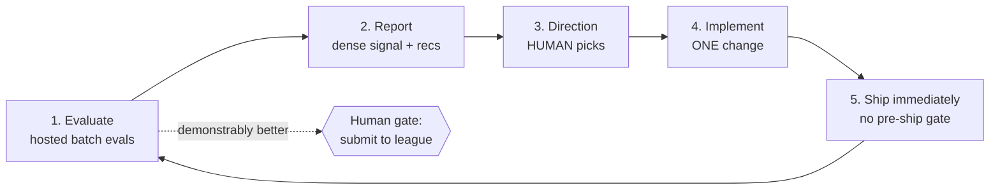
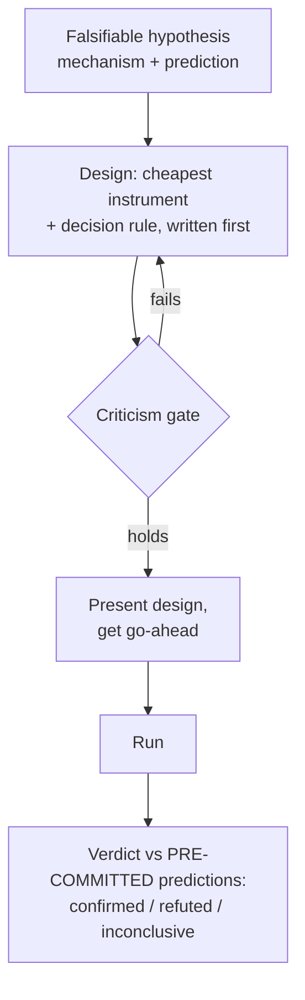
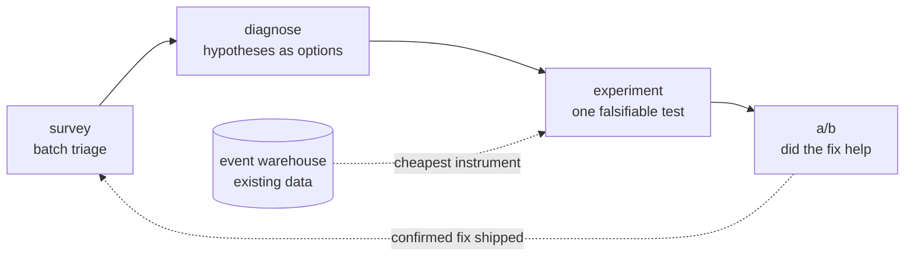

# How We Experiment: A Portable Guide for Coding Agents

A distillation of the hypothesis-and-experiment methodology from James Boggs's `player_labs` repo (a human-in-the-loop lab for improving Coworld game-playing agents), written so another agent — in another repo, possibly another domain — can adopt the same discipline. 2026-07-14.

**What this is:** everything our agent is given about generating hypotheses and running experiments, plus *how* it's given (the delivery system matters as much as the content). Sections 1–6 are the method; section 7 is how to wire it into your own repo so your agent actually follows it.

**Executive summary.** The method rests on three ideas. First, an **improvement loop** with exactly one gate: evaluate → diagnose → the human picks a direction → change *one* thing → ship it immediately and let the next evaluation be the test — speed everywhere except the single irreversible action. Second, **falsifiability as a hard gate**: a hypothesis must name a mechanism pinned to a code location and predict an observable effect; an experiment must have *differing* if-true/if-false predictions and a pre-committed decision rule, and gets adversarially criticized before it runs. Never run an experiment whose outcome couldn't change your mind. Third, **rigor lives in reading results, not in shipping code**: causal claims require the falsifying query (they're wrong about half the time, often backwards), aggregates hide broken subgroups, comparisons must be matched and fresh, and "plausible" is a reason to test, never to assert.

## Contents

1. [The improvement loop](#1-the-improvement-loop)
2. [Generating hypotheses (diagnosis)](#2-generating-hypotheses-diagnosis)
3. [Designing and running one experiment](#3-designing-and-running-one-experiment)
4. [A/B testing a change](#4-ab-testing-a-change)
5. [Measurement doctrine](#5-measurement-doctrine)
6. [Provenance discipline](#6-provenance-discipline)
7. [The delivery system: how the agent receives all this](#7-the-delivery-system-how-the-agent-receives-all-this)
8. [Appendix A: the hard-won failure catalog](#appendix-a-the-hard-won-failure-catalog)
9. [Appendix B: minimal file templates](#appendix-b-minimal-file-templates)
10. [Appendix C: sources](#appendix-c-sources)

**Terms used in examples.** Our domain is competitive game-playing agents, so examples use its vocabulary; translate to yours. A **policy** is the program being improved (your equivalent: the model, service, or system under optimization). An **episode** is one game (one trial/run/sample). An **experience request** is a hosted batch of episodes — our cheap, parallel evaluation (your equivalent: an eval suite run, a backtest, a canary batch). **Upload** publishes a new numbered version to storage — cheap, inert, enters no competition (your equivalent: pushing a build to a registry). **Submission** enters a version into the public league where it competes and may become champion — our one irreversible action (your equivalent: a production deploy, a public release). A **role/group** is a distinct sub-population within an evaluation (in our game: crewmate vs imposter; yours might be user segments, request types, or market regimes).

---

## 1. The improvement loop

**Key points:**
- One loop, run over and over: evaluate → report → human sets direction → change one thing → rebuild + ship immediately → re-evaluate.
- The KPI is **iterations per day**. Care is reserved for the one irreversible action; everything else is retryable.
- The human makes strategic jumps and judges quality; the agent builds observability, measures, and keeps iterations flowing.

The lab exists to run a single loop:



Division of labor: the human originates strategic jumps and judges gameplay quality; the agent implements fast, builds the observability that reveals where a jump is possible, and keeps iterations flowing. The agent's highest-leverage work is *making the human's strategic judgment cheap and well-informed* — clear options, visible behavior, trustworthy numbers — not replacing the human's decisions.

**Speed is the meta-priority.** The loop's cost is dominated by the agent being careful, not by the agent being wrong. In our setting, a broken upload costs one free evaluation round; a cautious afternoon costs the whole afternoon. Concretely:

- Write the focused change fast; rebuild; ship. No polishing, no defensive code, no test scaffolding around the change.
- **The next evaluation IS the test.** No smoke tests, no pre-ship gate. Hosted evaluations catch breakage *and* measure behavior in one step. Run a unit test only when it's the *fastest* way to answer a question you already have — never as ritual.
- Careful is reserved for the genuinely irreversible. For us that's league submission (public, champion-making, hard to roll back) and destroying data. Everything else — code, uploads, versions, evals — is cheap and retryable.
- **Rigor lives in *reading* results, not in shipping code.** The disciplines in sections 2–6 gate *conclusions*, not shipments.

One behavioral rule keeps the human in the loop: **propose-and-pause**. When a thread of work finishes, propose the next step and stop — don't auto-chain into unrequested strategy changes.

> **Adapting this:** the loop transfers to any setting with a cheap, trustworthy evaluation and one expensive irreversible action. Identify your equivalents: what's your "upload" (cheap, inert artifact), your "experience request" (parallel hosted eval), and your "submission" (the one human gate)?

## 2. Generating hypotheses (diagnosis)

**Key points:**
- Diagnosis is the *explanatory* half: locate the weakness, explain what the signals mean, produce 2–4 **varied, mechanistic** hypotheses. It offers options; it never decides or runs the test.
- A valid hypothesis = mechanism + evidence + code location + predicted observable effect. Missing any of these makes it "a vibe, not a hypothesis."
- Read evidence at three tiers — group-decomposed distributions, the objective timeline, and the policy's own logs; the mechanism usually lives in the gap between what was true and what the policy chose.

**Cold start — when you have no signals yet.** Diagnosis consumes signals, so on day one in a new domain, manufacture them: (1) run a baseline evaluation batch of whatever you have — a minimal artifact that connects, acts, and exits cleanly beats a clever one, because the first eval reliably pinpoints the highest-leverage missing capability; (2) triage operations before behavior — does it even complete/connect? If not, that's the first hypothesis class; (3) if it runs, take the simplest objective metric, decompose it by group, and treat the worst subgroup as your first lever. After *every* subsequent eval, re-ask "where is the biggest gap now?" instead of continuing to polish the thing you just touched.

Diagnosis turns signals (batch statistics, event queries, standings) into understanding plus candidate directions. Its shape:

1. **Locate the weakness** — quick triage against the small recurring set of failure classes for your domain, pick the highest-leverage one. Keep this short; it's the on-ramp, not the point.
2. **Explain the signals** — translate flags and numbers into *what is happening*. Read at three tiers:
   - the **distributions** (always decomposed by role/group — see §5);
   - the **objective timeline** at the flagged moments — what actually happened;
   - the **policy's own logs** at the same moments — what it perceived, believed, and decided.

   **The gap between what was true and what it chose is usually where the mechanism lives.**
3. **Generate 2–4 varied mechanistic hypotheses.** Each must be:
   - **a mechanism, not a tweak** — *"X happens because Y in the code, causing Z"*, never "lower the threshold";
   - **grounded in evidence** — cites what you actually observed (episodes, log lines, query rows). "This should obviously help" is a reason to *test*, never to assert or ship — roughly half of "obviously good" ideas regress, and a mechanism can be flat backwards;
   - **pinned to a code location** — the mode/strategy/threshold that drives it. If you can't point at the code, keep investigating;
   - **with a predicted, observable effect, per group** — what should move, and roughly how much.

   *Varied* means independent mechanisms, not three versions of one. And mine the **positive outliers** too: "we did unusually well here" is a mechanism to find and make fire on purpose. The three shapes of improvement: **stop** a bad behaviour that fires, **enable** an absent good one, **amplify** a lucky one.
4. **Present hypotheses as options, not directives.** Render a readable report (evidence → mechanism → proposed change → predicted effect → confidence → suggested test per hypothesis). The human — or the agent, if delegated — picks one to hand to the experiment process (§3).

Supporting disciplines:

- **You can't debug an outcome, only a trace.** Pivot immediately from the result to the policy's internal reasoning stream.
- **Observability is built, not given** — reason traces (mode / options / choice + a *why*), belief snapshots, time-keyed lines, tiered verbosity. Building the instrument often precedes the fix. In particular, log every sensed value a gated decision depends on: a gate silently reading `None` is invisible for hours until the input itself is in the trace.
- **Tracing-escalation is autonomous.** If the logs are too thin to find the mechanism: turn up tracing → re-run → re-examine, without stopping to ask. Only flag the human if getting the signal needs a code change.
- **Triage by failure class; chase the surprise.** Aggregate first, then sample the worst case per class. The most informative episode is the one that "should have been a win."
- **Name the layer first** — perception / belief / strategy / execution — because the layer determines where the fix goes. Keep **operations** failures (can't connect/build) strictly separate from **behavior** failures (plays badly).
- **Ground truth beats inference.** Extract exact rules, constants, and timings from the authoritative source *before* building rule-gated behavior — an approximately-right mental model of a clock or threshold fails silently.
- **"Capability exists" ≠ "capability is used."** A signal the policy never consults is a silent no-op; verify it's consumed, not just emitted.

## 3. Designing and running one experiment

**Key points:**
- One hypothesis at a time. The governing discipline: **never run an experiment whose outcome couldn't change your mind.**
- Pick the *cheapest* instrument that can decide it; write the measurement and decision rule down *before* running.
- Every design passes an adversarial criticism gate — most importantly, the if-true and if-false predictions must *differ*.



**Input — a falsifiable hypothesis.** State it as a claim with an observable consequence:

> **Mechanism:** *what* is happening and *why* (pinned to a code location if you can).
> **Prediction:** *if this is true, then **X** should be observable; if false, **X** should not.*

Worked example (from our social-deduction game, but the shape is general): not "lower the flee threshold," but *"we abandon kills because the flee gate trips on any believed-enemy within 60px regardless of kill-readiness — so we should see many proximity intervals that end without a kill, far more than a baseline that converts."*

**Step 1 — design with the cheapest instrument that can decide it:**

1. **Re-analyse existing data** *(default — free, instant)*. A query or log read over data you already hold. Most mechanistic claims about timing, positioning, and choices are already answerable from existing traces.
2. **A designed fresh run** *(when existing data can't isolate the variable)* — a matched batch built to vary exactly one thing (§4 is that run).
3. **Instrumentation or a code change** *(last — when the signal isn't observable yet)*. Add tracing or a probe behaviour, re-run, re-analyse. Needing to add tracing is itself a finding about your observability.

Write down, concretely, **before running**: what you will measure, on what data, and the **decision rule** — the threshold or comparison that will read as "true" vs "false."

**Step 2 — criticize the design (the gate — every time).** Attack your own design before spending anything. A design that fails any of these gets **redesigned, not run**:

- **Construct validity** — does this measure the *mechanism*, or just a correlate? A proxy can move while the goal doesn't. Test the thing that maps to the objective.
- **Does the eval config let the effect show?** A masking configuration hides the very thing you're testing — a pinned-role A/B once buried a 30-percentage-point gap that only appeared under natural role assignment. Match the config to the question.
- **Two differing predictions** — write what you'd see if TRUE and what you'd see if FALSE. *They must be different.* If both worlds produce the same observation, the experiment is worthless.
- **Falsifiability** — is there a concrete result that would make you *abandon* the hypothesis? If no outcome could, it's not an experiment.
- **Confounds** — what *else* could produce the "true" signal even if the hypothesis is false? (Field drift, group mix, opponent identity, small n, an unrelated bundled change.) Control or measure each.
- **Power & cost** — enough samples to separate signal from noise? Is there a *cheaper* experiment (usually an existing-data query) that decides the same question?

**Step 3 — redesign until it holds**, looping steps 1↔2 until the design is valid (differing, falsifiable predictions; confounds controlled) and cheap.

**Step 4 — present the design for go-ahead.** Render it readably — the hypothesis, the instrument, the if-true vs if-false predictions side by side, the decision rule — and get explicit human approval before running anything that spends resources. Even for a free query, present first: the point is the human sees *what's being tested and why*, and that the predictions actually differ.

**Step 5 — run it.** Iterate autonomously on mechanical issues (fetching, tracing); flag the human only for code changes to the subject.

**Step 6 — verdict, read against the pre-committed predictions** (no post-hoc goalpost-moving):

- **Confirmed** — the if-true prediction held and the if-false one didn't. State the evidence and the directed change it supports.
- **Refuted** — the if-false prediction held. Say so plainly; **a killed hypothesis is a real result.**
- **Inconclusive** — neither cleanly held (underpowered, confounded, or the predictions weren't as distinct as you thought). Say what a better experiment would be and whether it's worth running. Note: **"inconclusive" ≠ "neutral"** — a test that can't see the effect says nothing about it.

Two more rules from the discipline block: **the mechanism can be backwards** — design so a result can refute the *direction*, not just the presence, of the effect; and **one variable, same tree** — for a designed run, build the baseline by stashing the candidate change so both arms share everything else (concretely: build the candidate from the working tree, `git stash`, build the baseline from the identical tree minus that one diff; any other difference — a dependency bump, a build flag, a data snapshot — is a confound you introduced).

**When to stop.** Refuted → record it in the refuted-levers ledger (§7.4) and return to diagnosis; do *not* test minor variations of a refuted mechanism. Confirmed → make the change, A/B it (§4), ship if it helped, and return to evaluation. Inconclusive → decide explicitly whether the better experiment is worth its cost; "run it again but bigger" is only justified when the direction was consistent and the mechanism is confirmed.

## 4. A/B testing a change

**Key points:**
- The question is targeted: *did the thing I tried to improve move, and did anything regress?*
- Validity rests on one principle: **fresh + matched.** Both arms run in the same window, against the same explicitly pinned field.
- The verdict is quantitative (conservative significance-tested deltas, decomposed by group) *plus* a qualitative side-by-side that numbers can't give.

When a confirmed hypothesis produces a change, the A/B decides whether it *actually helped*.

**The one principle that makes it valid: fresh + matched** (run both arms in the same time window, against the same explicitly pinned field). The competitive field drifts — other participants change constantly. You cannot compare the candidate's fresh games against the baseline's stale history; that difference is confounded by everyone else's changes. So: run both versions in the same window, in matched batches that are byte-identical except the subject version. Field drift then hits both arms equally, and the delta is attributable to *your* change.

Matched means, concretely:

- **Pin every opponent seat explicitly** — never "top-N" or "random" selectors in an A/B. Auto-selected seats drift between arms (one partner swing alone once moved a win rate from 87% to 37%) and can even seat *your own* entry as an opponent.
- Same target, same roster, same role assignment (natural roles unless you're testing a specific role — a pinned-role config can *mask* a gap), same episode count, same window (fire back-to-back).
- Testing a config-flag change? The baseline must carry **all** of the candidate's runtime environment *minus the one flag* — isolate exactly the change.
- **Same tree** — build the baseline by stashing the candidate change, so only the subject differs.

Then:

1. **Frame** the baseline, the candidate, and the **target axis** — the one metric the change was meant to move. Fix a qualitative lens too (an opponent you lose to, a fault you're chasing).
2. **Run both matched batches**; pull both arms' artifacts.
3. **Quantitative diff:** every metric, decomposed by group, each marked improved / regressed / noise with a significance test, plus a regression scan across everything you *didn't* target. Our engine is deliberately conservative — a borderline move reads as noise. **Believe it.** Rates need a few hundred observations per side.
4. **Qualitative compare — the part numbers can't give.** Read both arms side by side through your lens; read the subject's own logs at the moments that matter. Write a focused finding.
5. **Synthesize:** did the target move, did anything regress, and does the qualitative story explain (or contradict) the numbers? A common, important outcome: numbers say noise but behaviour visibly changed → you need more episodes, a sharper metric, or the change didn't do what you thought.

Hygiene rules that have each earned their place:

- **Recompute on clean data only.** Infrastructure failures (timeouts, connect errors) hit arms asymmetrically; drop affected episodes *at the episode level, never per-seat* (per-seat filtering once produced a 14-point error by keeping auto-scored seats of dead games) before comparing.
- **Read the A/B only from complete, verified data.** Check the on-disk count matches the requested count and both arms finished — partial mid-run pulls once fabricated a fake +20.8pp delta.
- **A directional-but-insignificant result on a *confirmed mechanism* is worth powering up, not discarding** — one +5.9pp at p=0.20 (n=240) resolved to +14.4pp at p<1e-9 when re-run at n≈955.
- **If the change routes through an optional dependency (an LLM, a service), gate the verdict on that path actually firing, measured per arm.** Otherwise you silently A/B'd the fallback path.

## 5. Measurement doctrine

**Key points:**
- The aggregate headline is a trap: decompose by role/group, by opponent, and by sub-metric before judging anything.
- 🚩 **No causal claim without the falsifying query** — the single most-violated discipline. Expect your mechanism stories to be wrong about half the time, often backwards.
- Pull distributions before naming mechanisms — bimodal outcomes and pooled event types routinely send the story to the wrong mechanism.
- Batches not single games; effect sizes not just means; per-seat rates not raw totals; proxies screen but never judge.

These gate *conclusions* (they should never slow the ship step):

- **Evaluate on a batch, never a single game.** Within-game variance (std can exceed the mean), role/seat asymmetry, and opponent dependence each swamp one game.
- **Decompose before judging.** Cut by **role/group** (the most important cut — aggregates have repeatedly hidden one group being *completely broken*), by **opponent/matchup**, and by **behavioral sub-metrics** (wins, mean *and* median, action counters). Their disagreement localizes *why*.
- **Apply statistical rigor.** Report effect sizes (not just means), run a mean-based *and* a rank-based test, apply multiple-comparison correction, pool matched batches for power. A leaderboard that looks cleanly ranked is mostly noise until corrected. (Nothing exotic is required: for rates, a two-proportion test; for continuous metrics, Welch's t *and* Mann-Whitney U; Holm or Benjamini-Hochberg across the metric table. As a planning rule of thumb, detecting a ~10-point rate difference needs a few hundred observations per side.)
- 🚩 **No causal claim without the falsifying query** — important enough to get its own subsection, §5.1 below.
- **Normalize every stat by exposure.** When the subject holds a different number of seats/opportunities than others, report per-opportunity rates, never raw totals. Two traps beyond the obvious: (1) counting non-events as events inflates volume — exclude them first; (2) **team-outcome metrics carry a composition confound that per-seat normalization does NOT remove** — isolating an individual's contribution to a team result needs a controlled design (vary one seat, hold the rest fixed). Individual stats are clean per-seat; team stats are not.
- **Cheap proxies screen; only live evaluation judges.** Any offline probe that fixes the opponent measures only the half you influence — probe deltas have reversed on the live field in more than one lab. Use proxies to rank candidates cheaply, never to declare a change good.
- **Replicate before believing; run comparison arms time-tight.** A measured delta from one sample flips sign often enough that a second independent replication is a mandatory gate. When any part of the evaluator drifts over time, a verdict conditioned on one window rots with it.
- **Score finished episodes only; infra failures are not skill.** Drop dead episodes at the episode level, report the failure rate alongside the result, and treat a *cluster* of failures in one window as one infra event, not a behavior rate. A reliability floor gates everything: a fast adequate player beats a slow excellent one that gets disqualified — completion rate first, win rate second.
- **Evaluate a fix in the SAME conditions the problem was diagnosed in, and judge against the same-window field average** — the field itself moves; one apparent "collapse" turned out to be exactly field par for that window. Re-check window-conditioned verdicts after the field pivots.
- **Evaluations are not scarce (in our setting).** Use them liberally; target them to the question (matched roles when the change was role-specific; the specific opponents you struggle against); harvest results asynchronously/streamed rather than babysitting the run.

### 5.1 🚩 The falsifying query — the discipline that gets violated most

**No causal claim without the falsifying query.** When a result appears, the reflex is to narrate a plausible mechanism and ship it as a finding. Every such mechanism has **observable preconditions**, and the query to check them is almost always one cheap join away — and it *repeatedly* overturns the story, often showing the **opposite**. This failure once recurred three times in a single session, each refuted by one query (a "helps us win by voting X out" story where the vote-out rate was ~1%; a "helps win" story where the delta wasn't even significant; a "puts us in witnessed crowds" story where the data showed we were near *fewer* others). Treat every "because / since / due to" in your own draft as an un-run query, not a conclusion.

The procedure, every time, before writing the "why":

1. **Is the effect even real?** Effect size + a significance test — a 10-point swing at n=100 may be noise. If it's not real, there is nothing to explain.
2. **Name what this mechanism would make observable, and what the *competing* mechanism would** — including a rule of the domain you may have forgotten.
3. **Run the query that separates them and report it, refutations included.**

Watch your own language: borrowed metaphors ("snowball", "momentum") smuggle in a model the domain doesn't have. **Pull the distribution before naming a mechanism** — a bimodal outcome under a mean, or two distinct event types pooled into one count, routinely sends the story to the wrong mechanism. A claim about *why* is not done until a number distinguishes it from the alternatives — and you should expect to be wrong about half the time, so go look.

## 6. Provenance discipline

**Key points:**
- Every conclusion depends on knowing exactly what artifact produced the data. Most "phantom findings" trace to broken provenance, not bad statistics.

- **Change one component at a time** so the next evaluation is attributable.
- **Rebuild after every change** — a stale artifact reads as "the change did nothing."
- **Keep a version log** mapping each shipped version to the changes it carries, written *in the same breath* as the ship — parallel sessions have left gaps.
- **Verify success, not capability.** Before claiming an integration works, find the log line proving a successful call actually happened — coherent-looking output is not evidence. This exact mistake has shipped "working" players with no LLM more than once.
- **Use explicit positive/negative controls** — a silent fallback can run a reference implementation instead of yours; a verified A/B beats a source review.
- **A regression in a path your change can't mechanically touch means another bundled diff did it** — audit everything that rode along before re-diagnosing the domain.
- **Attribute by stable unique ID, never by display name or list position** — name collisions, duplicate seats, and pooled data have each produced phantom findings.
- **Watch for identity-clobbering when parallelizing.** Shared build tags and upload names interleave across concurrent sessions, so a sibling session's build can silently overwrite the artifact you then ship. Give each candidate a unique tag/name and verify the artifact actually carries your change before shipping.
- **Know your platform's binding semantics.** In ours, env flags bake at upload time and identical images dedup to one version — so A/B'ing a config flag requires building distinct images. Find your platform's equivalent traps *before* they cost you a cycle.
- Stay alert to the classic looked-like-success failures: **local↔live drift**, **stale rotating IDs/docs**, **over-reading a small batch**, and **position-based joins**.

## 7. The delivery system: how the agent receives all this

**Key points:**
- The doctrine only works because of *how* it reaches the agent: layered docs read at startup, method-vs-binding skills, session state files, and an automated lessons pipeline that turns experience into doctrine.
- Skills separate the game-agnostic **method** from per-domain **instruments**, so the method is written once and every new domain gets it for free.
- Lessons graduate on **recurrence across sessions**, not on how convinced one session was.

This is the part most worth copying. The content of sections 1–6 would be ignored if it were one giant document; instead it's structured so the right piece surfaces at the right moment.

### 7.1 Layered guidance, read at startup

```
repo root
  AGENTS.md            ← the operating model: the loop, the agent's role, skills index
  best_practices.md    ← the doctrine (sections 2-6 of this guide), read on startup
  user_preferences.md  ← the human's durable standing decisions
  .claude/skills/      ← game-AGNOSTIC method skills
  <game>_lab/
    AGENTS.md              ← the game layer: same loop, this game's instruments
    best_practices.md      ← this game's failure modes, layered on the root
    user_preferences.md    ← game-specific preferences
    WORKING_CONTEXT.md     ← live, one-screen state of the current objective
    TENTATIVE_LESSONS.md   ← this session's candidate-lesson buffer
    lessons_archive/       ← rotated buffers from past sessions
    .claude/skills/        ← game-SPECIFIC skills + adapters
```

The layering rule: **the root defines process; the lab defines the game.** Agents are told to read root `AGENTS.md`, `best_practices.md`, and `user_preferences.md` on startup, then the lab-level equivalents of whatever lab they're working in — and, crucially, to **treat the practices as defaults and warn the human if a request would contravene one** before proceeding (then do what the human decides). That makes the doctrine load-bearing without making it a straitjacket.

A session-start hook injects the repo README and rotates the lessons buffers automatically, so none of this depends on the agent remembering to look.

### 7.2 Skills: method vs binding

Reusable procedures live as **skills** (self-describing procedure files the agent can invoke), split into two tiers:

- **Game-agnostic method skills** at the root own the *how*: the experiment method (§3), the A/B method (§4) with its shared statistics engine, plus the mechanical loop halves (create evals, pull artifacts, build & ship, submit & monitor).
- **Game-specific binding skills** in each lab supply the *instruments*: which data store answers "re-analyse existing data," which tracing flags exist, worked examples in the game's own terms, and game-specific criticism checks that have burned us before. The A/B binding is one small adapter (metric definitions + grouping) over the shared stats engine.

Each skill's frontmatter description carries explicit trigger phrases ("test this hypothesis", "did my change help", "why is X weak at Y"), so the agent matches the moment to the method. Several skills open with an **announce line**, stated to the human the moment the skill is invoked ("Testing one hypothesis. I'll design an experiment, criticize it for falsifiability, then run the cheapest valid one.") — making the method legible to the human every time it runs.

The improvement pipeline is itself expressed as a skill chain:



### 7.3 Human gates, encoded

Three gates are written into the method rather than left to judgment: experiment designs are **presented for go-ahead before running**; diagnosis **offers hypotheses as options, not directives**; and the one irreversible action (league submission) is **the human's alone**. Everything between those gates is the agent's to run autonomously — including mechanical escalations like turning up tracing and re-running.

### 7.4 Session state and the lessons pipeline

Two files carry state across sessions:

- **`WORKING_CONTEXT.md`** — the live, minimal state of the current objective (active version, working lens, open threads). A recorded objective is the "resume the loop" signal; it's pruned continuously and reseeded on pivots.
- **`TENTATIVE_LESSONS.md`** — an *eager, noisy* per-session buffer. The agent writes candidate lessons the moment something looks reusable — a gotcha, a surprise, a "next time I'd…". Most entries are noise; that's by design.

The lifecycle is automated: a session-start hook archives each session's buffer and creates a fresh one; a stop hook nudges once if substantive work ends with the buffer untouched; and a ≈weekly, human-driven review clusters lessons that **recur across independent session buffers** and graduates the keepers into `best_practices.md`. **Recurrence across sessions — not in-session conviction — is the graduation signal.** This is where most of sections 5–6 came from: they are graduated lessons, each earned by a real failure.

Two more memory habits close the loop:

- **Preferences are recorded on repetition.** If the human re-instructs the same thing twice, it goes into `user_preferences.md` — "don't make the human be your memory."
- **A refuted-levers ledger.** The lab's best-practices file keeps distilled experiment *results* ("kill volume is structurally capped — refuted ≥3× independently; the real levers are contact and kill→win conversion"), so refuted directions aren't re-proposed from scratch and confirmed ones are re-verified rather than re-discovered. The rendered experiment reports (design + verdict, §7.5) double as the per-experiment audit trail; the ledger is the distillation that survives.

### 7.5 Reports as the human interface

Every design, diagnosis, and A/B verdict is rendered as a clean HTML report from a shared renderer — hypothesis, if-true/if-false predictions side by side, decision rule, verdicts with significance markers. The templates are explicitly "a starting point, not a form": the agent adapts the layout to the content and *looks at the rendered page* before presenting it. The reports are what make the human gate cheap — the human can judge a design or a verdict in one glance.

### 7.6 Porting checklist

To give your agent this capability in your repo (Appendix B has starter templates for each file):

1. **Write the loop** (§1) in a root `AGENTS.md`: the steps, the agent's role, the speed policy, and — explicitly — your one irreversible gate.
2. **Seed a root `best_practices.md`** with sections 2–6 of this guide, adapted to your domain's terms. Instruct the agent to read it at startup, treat it as defaults, and warn before contravening.
3. **Install the method as skills/procedures.** In Claude Code, a skill is a directory containing a `SKILL.md` whose YAML frontmatter has a `name` and a `description` with explicit trigger phrases, followed by the procedure in Markdown (put repo-level skills in `.claude/skills/<name>/SKILL.md`). Write the experiment method (§3) and A/B method (§4) essentially verbatim as two skills; then one thin binding per domain naming your instruments — what "existing data" is, what tracing exists, what a matched fresh run means for you — and your domain's own criticism checks. If your harness has no skill mechanism, the same files work as linked procedure docs from `AGENTS.md`.
4. **Create the session-state files** (`WORKING_CONTEXT.md`, `TENTATIVE_LESSONS.md`) and, if your harness supports hooks, automate the rotate/nudge lifecycle (a session-start hook that archives the buffer to `lessons_archive/<timestamp>.md` and recreates it empty; a stop hook that nudges once if the buffer is untouched). If not, instruct the agent to append lessons as it goes and review them weekly by hand.
5. **Start the ledgers**: a version log (`version_log.md` — one entry per shipped version: date, version, one-line change, commit) and a refuted/confirmed-levers section in your best practices.
6. **Encode the human gates** as instructions inside the skills themselves — the experiment skill says "present the design and get go-ahead before running"; the diagnose skill says "offer hypotheses as options, not directives"; `AGENTS.md` names the irreversible action as human-only.
7. **Optional, high value: report templates** (HTML or Markdown) for experiment designs, A/B verdicts, and hypothesis presentations, so the human can judge each gate at a glance (§7.5).

Start with 1–3; they carry most of the value. The lessons pipeline (4–5) is what makes the system improve itself.

---

## Appendix A: the hard-won failure catalog

Each of these is a real incident that graduated into doctrine — useful as a checklist of ways experiments go wrong:

| Failure | What happened | Doctrine it produced |
|---|---|---|
| Masking config | A pinned-role A/B buried a 30pp gap visible only in natural roles | "Does the eval config let the effect show?" (§3) |
| Backwards mechanism | "The change hurt because it put us in crowds" — data showed we were near *fewer* others | The falsifying query (§5) |
| Explaining a non-effect | A mechanism narrated for a win delta that was p=0.12 | "Is the effect even real?" first (§5) |
| Unpinned seats | One auto-selected partner swing moved win rate 87%→37% | Pin every seat explicitly (§4) |
| Partial data read | A mid-run artifact pull fabricated a +20.8pp delta | Verify counts before analysis (§4) |
| Per-seat filtering | Dropping only the timed-out seat kept dead games' auto-scores; 14pp error | Drop dead episodes whole (§4, §5) |
| Silent fallback | An A/B of an LLM change where the LLM was throttled — only the deterministic fallback path was ever exercised, so the change under test never ran | Gate on the path firing, per arm (§4) |
| Proxy reversal | Offline probe deltas reversed on the live field (multiple labs) | Proxies screen, live judges (§5) |
| Phantom attribution | Own champion drawn as opponent under the same display name | Attribute by unique ID (§6) |
| No-LLM "success" | Players shipped "working" with no LLM — output looked coherent | Verify success, not capability (§6) |
| Bundled-diff regression | A 10σ regression from a "harmless" co-packaged change | Audit what rode along (§6) |
| Underpowered discard | +5.9pp p=0.20 (n=240) nearly discarded; resolved to +14.4pp p<1e-9 (n≈955) | Power up directional results on confirmed mechanisms (§4) |
| Raw-total flattery | A 4-of-8-seat policy showing ~4× totals for the same skill | Per-exposure rates (§5) |
| Meetings read as idle | ~1272-tick meeting pauses read as "wandering"/"idle" in timing metrics | Know your domain's clock; exclude non-play time (domain instance of §5's "pull the distribution") |

## Appendix B: minimal file templates

Starter shapes for the porting checklist (§7.6). These are deliberately skeletal — the content grows out of your own sessions.

**`.claude/skills/experiment/SKILL.md`** (frontmatter + method):

```markdown
---
name: experiment
description: "Use to test ONE falsifiable hypothesis rigorously — design an
  experiment, adversarially criticize it, run the cheapest valid instrument,
  reach a pre-registered verdict. Triggers: 'test this hypothesis',
  'how do we find out if X', 'I think it might be Y — let's check'."
---
# Experiment
<section 3 of the portable guide, plus: your domain's three instruments
(what "existing data" is; what a designed run is; what tracing exists),
and the criticism checks that have burned you.>
```

**`WORKING_CONTEXT.md`**:

```markdown
# Working context  (one screen max — prune constantly; clear on pivots)
**Objective:** <the current objective — its presence = "resume the loop">
**Active version:** <subject vN — what it carries>
**Working lens:** <the fault/opponent/metric being chased>
**Live findings:** <2-5 bullets>
**Open threads:** <what's parked mid-flight>
```

**`TENTATIVE_LESSONS.md`**:

```markdown
# Tentative lessons — session buffer  (write eagerly AS YOU GO; most entries
# are noise, that's fine. Archived per session; recurrence graduates.)
- <one candidate lesson: the gotcha, the surprise, the "next time I'd…">
```

**`version_log.md`**:

```markdown
| date | version | change (one line) | commit |
|---|---|---|---|
| 2026-07-14 | v42 | widen kill-ready window 60→90px (hypothesis H7) | abc1234 |
```

**Refuted/confirmed-levers section** (inside `best_practices.md`):

```markdown
## Levers — what the evidence keeps saying
- **<lever>**: REFUTED n× (<dates/experiments>) — <one-line why>. Don't re-propose.
- **<lever>**: CONFIRMED (<effect, p, n>) — <the real mechanism>. Re-verify after field shifts.
```

## Appendix C: sources

All content distilled from James Boggs's `player_labs` repo (private), 2026-07-14. Primary sources, for anyone with access:

- `AGENTS.md` — the operating model and loop (§1, §7.1).
- `best_practices.md` — game-agnostic measurement/diagnosis/hypothesis/provenance doctrine (§2, §5, §6).
- `user_preferences.md` — standing human decisions (§7.4).
- `.claude/skills/coworld-experiment/SKILL.md` — the experiment method (§3).
- `.claude/skills/coworld-ab/SKILL.md` — the A/B method and adapter architecture (§4, §7.2).
- `crewrift_lab/AGENTS.md` — the lab layer, session state, lessons lifecycle (§7.1, §7.4).
- `crewrift_lab/best_practices.md` — the mature graduated-lessons file and failure catalog (§5, §6, Appendix A).
- `crewrift_lab/.claude/skills/crewrift-diagnose/SKILL.md` — hypothesis generation (§2).
- `crewrift_lab/.claude/skills/crewrift-experiment/SKILL.md` — the method-binding pattern (§7.2).
