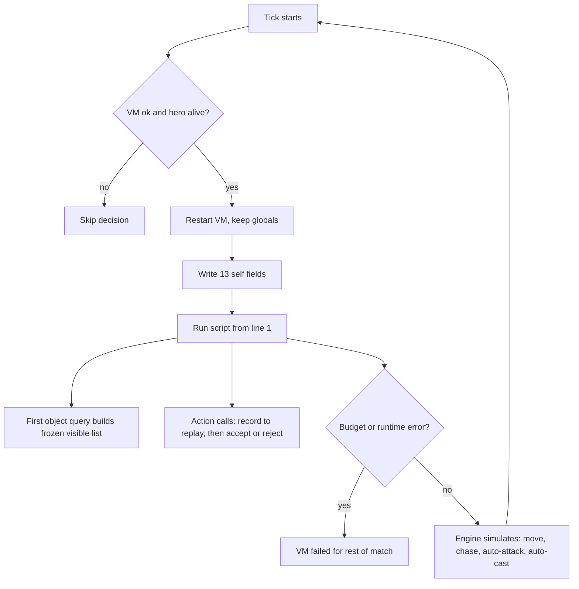
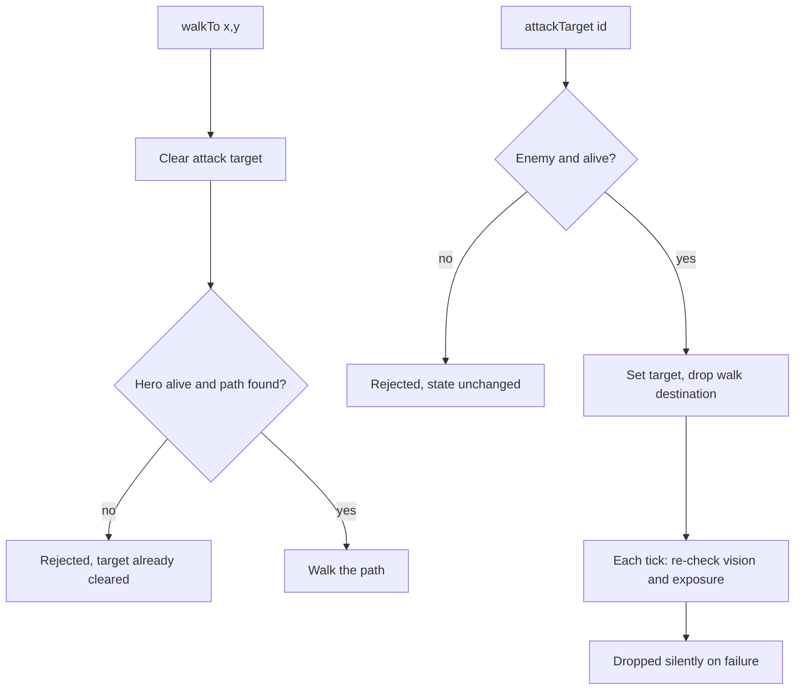

# What a Gods of the Arena policy can know and do

Research report · 2026-09-15 · for James, before writing the first James Botts policy. Researched against Metta-AI/polyworld `main` as of `1d7eb723`. The league currently runs commit `5422fb0c` (the coworld manifest's `source_url`); the only difference between the two in the files cited here is a movement and tower-collision change in `sim.nim` (`git diff 5422fb0c 1d7eb723 -- examples/gods_of_the_arena/sim.nim`), so every observation, action, and language claim below holds for the live build. Line numbers cite `1d7eb723`.

## Executive summary

A Gods of the Arena policy is one plain-text BASIC file that the game compiles and runs once per simulation tick for each of your five heroes, in five isolated virtual machines. The dialect is deliberately tiny: 32-bit integers, `IF`/`WHILE`, subroutines without return values, fixed arrays, and `PRINT`. There is no `FOR`, no `GOTO`, no functions, no random numbers, and no strings outside `PRINT`. Each decision gets 20,000 instructions and 50,000 work units; exceeding either disables that hero for the rest of the match (`examples/gods_of_the_arena/bots.nim:58-77`, `bots.nim:463-469`).

What the hero can see is a snapshot: 13 self fields, a per-tick frozen list of every allied object plus every enemy object inside your team's fog-of-war vision (id, kind, team, class, x, y, hp, alive), six inventory slots, four ability slots (charges, cooldown, recharge), and static terrain readable through fog. What it can do is six calls: `walkTo`, `attackTarget`, `buyItem`, `useItem`, `castTarget`, `castPoint`, each returning accepted or rejected. Three facts shape everything downstream. First, the engine keeps acting between decisions: an accepted attack target is chased automatically, idle heroes auto-acquire nearby enemy footmen (never heroes or structures), and abilities are auto-cast in combat with no off switch (`sim.nim:2392-2438`). Second, `walkTo` always clears the attack target, even when the request fails (`sim.nim:1434-1449`). Third, the `alive` flag on towers and forts encodes *exposure* (attackable now), not whether the structure is standing (`sim.nim:1172-1230`). Memory across ticks lives only in the globals and arrays you declare, so remembering last-seen enemies and plan state is the main lever a policy has over the starter.

## Table of contents

1. [The language, exactly](#1-the-language-exactly)
2. [Execution model](#2-execution-model)
3. [Observations](#3-observations)
4. [Actions](#4-actions)
5. [Consequences for policy design](#5-consequences-for-policy-design)
- [Appendix A: Budgets and limits](#appendix-a-budgets-and-limits)
- [Appendix B: Class, item and ability reference](#appendix-b-class-item-and-ability-reference)
- [Appendix C: Sources](#appendix-c-sources)

## 1. The language, exactly

- Signed 32-bit integers only; `true`/`false` are the constants 1 and 0.
- Statements: assignment, `DIM`, `IF … THEN … [ELSE …] END IF`, `WHILE … WEND`, `SUB … END SUB`, `CALL`, `RETURN`, `EXIT SUB`, `PRINT`, `END`, `STOP`, `REM`.
- Not present: `FOR/NEXT`, `GOTO`/`GOSUB` (reserved words, no implementation), `ELSEIF`, single-line `IF`, `SELECT CASE`, `FUNCTION`, `ABS`/`MIN`/`MAX`/`SQR`/`RND`, string variables.

Polyworld implements its own BASIC compiler and register-machine interpreter in Nim (`src/polyworld/basic.nim`). The reserved-word list is the entire grammar surface: `and call dim else end exit false gosub goto if let mod not or print rem return stop sub then true wend while xor` (`basic.nim:551-558`). The statement dispatcher has branches for `dim`, `if`, `while`, `print`, `return`, `exit`, `stop`, `end`, `rem`, `call`, `let`, assignment, and a subroutine call, and nothing else (`basic.nim:1720-1760`). `goto` and `gosub` are reserved so they cannot be used as names, but there is no code path that compiles them.

| Feature | Behavior | Source |
| --- | --- | --- |
| Values | Signed 32-bit integers, wrapping on overflow; positive literals above 2,147,483,647 are a compile error. | `basic.nim:1047-1056`, `basic.nim:946` |
| Operators | `+ - * / MOD`, unary minus, `= <> < <= > >=`, `AND OR XOR NOT`. Integer division truncates; division by zero is a runtime error. Both operands of `AND`/`OR` always evaluate (no short circuit). | `basic.nim:1118-1172` |
| Variables | Global scalars created on first use, initial value 0, names case-insensitive. Variables assigned inside a `SUB` are still global. At most 256 globals. | `bots.nim:65` |
| Arrays | `DIM name(N)` at top level only, literal bound, inclusive: `DIM a(9)` holds ten values. At most 32 arrays and 4,096 elements in total. Out-of-range index is a runtime error. | `basic.nim:1174`, `bots.nim:63-64` |
| Control flow | Multi-line `IF cond THEN` newline … `END IF`, optional `ELSE`; `WHILE cond` newline … `WEND`. Nesting depth at most 32. | `basic.nim:1635-1690`, `bots.nim:71` |
| Subroutines | `SUB name(p1, p2)` … `END SUB`, declared only at top level, called as `name(args)` or `CALL name(args)`. Parameters are call-local; at most 16 per routine, 64 routines, call depth 16. A subroutine in an expression is a compile error: "subroutines do not return expression values". | `basic.nim:1102-1107`, `basic.nim:1716-1718`, `bots.nim:67-72` |
| Termination | Falling off the end, `END`, or `STOP` ends this tick's decision. The next tick restarts at line one with globals and arrays intact. | `basic.nim:1732-1741`, `bots.nim:440` |
| Logging | `PRINT "text"; expr, expr`: a semicolon joins, a comma inserts a space, a trailing semicolon suppresses the newline. At most 1,024 bytes and 128 print events per decision. Output goes to the private player log. | `basic.nim:1604-1633`, `bots.nim:76-77` |
| Comments | `'` or `REM` to end of line. | `basic.nim:1742-1746` |
| Strings | String literals exist only inside `PRINT`. GotA registers no string host functions. | `basic.nim:1611` |

## 2. Execution model

- One file controls one hero, and every seat gets its own VM with no shared memory. Whether your file fills all five seats of a team (mono-team) or shares a team with other players' files (mixed-team) is a platform roster setting, not an engine rule.
- Each living hero's script runs once per tick, 24 ticks per simulated second, in a rotating seat order.
- Self data is snapshotted before the run; the object list is frozen on first query for that decision.
- The engine continues to act between decisions: chase and auto-attack the accepted target, auto-acquire idle enemy footmen, and auto-cast abilities in combat.

Seats 0–4 are Red and 5–9 Blue. `loadBots` takes one source file per seat and creates an independent runtime for each hero (`bots.nim:393-429`, `src/polyworld/controllers.nim:55-80`); the platform decides which player's file sits in which seat, so an ally may be another entrant's policy. Either way, the only cross-hero information a script has is what it can observe about its allies through the object list. Every tick, `runBotDecisions` walks the seats starting from a rotating offset and calls `runHeroScript` for each (`bots.nim:477-484`). That procedure skips dead heroes and heroes whose VM has failed, restarts the runtime, writes the 13 self values, runs the program, and records instruction and work usage (`bots.nim:431-475`). A `BasicError` (runtime fault or budget exhaustion) sets `vm.failed` permanently for that episode (`bots.nim:463-469`).

Figure 1 — One hero decision per tick. Notice that the object list freezes at the first query and that a runtime error is permanent.

Between decisions the simulation moves the hero along its path, attacks the accepted target, and retargets on its own. `updateHero` re-validates the current attack target every tick against team, life, vision and structure exposure and silently drops it when any check fails (`sim.nim:2500-2580`). A hero with no target and no move destination auto-acquires the nearest visible enemy **footman** inside `acquireRadius`: 2.5 tiles for melee classes, the basic attack range for ranged ones (`sim.nim:2488-2498`, `sim.nim:351-354`). The call passes `creepsOnly = true`, so idle acquisition never latches onto an enemy hero, tower or fort (`sim.nim:2568-2571`, `sim.nim:2454-2455`). In combat, `tryCombatAbilities` casts the passive, then the first ready slot among ultimate, secondary and primary, unless the hero is in human manual-spell mode, which BASIC cannot enable (`sim.nim:2392-2438`, `bots.nim:409`).

## 3. Observations

- All coordinates are map tiles in `0 … mapWidth-1`; the host converts from 60,000 world units per tile.
- The object list holds all allied objects plus enemy objects on tiles your team currently sees. Enemies out of vision are absent, not stale.
- Maximum HP of other objects, XP, enemy cooldowns, projectiles, and any last-seen memory are not exposed.

### 3.1 Self data

These 13 read-only names are written once at the start of each decision (`bots.nim:442-460`) and do not change when you buy or cast within that decision.

| Name | Type / range | What it indicates |
| --- | --- | --- |
| `selfId` | int, nonzero | Your stable object ID; the same value other heroes see through `objectId`. |
| `selfTeam` | 0 Red, 1 Blue | Your team. Compare with `objectTeam` to classify allies and enemies (`sim.nim:50`). |
| `selfClass` | 0–9 | Your hero class: 0 Vanguard Knight, 1 Ranger, 2 Arcanist, 3 Druid Warden, 4 Demon Hunter, 5 Death Knight, 6 Crossbowman, 7 Lich, 8 Warlock, 9 Berserker. Blue fields 0–4, Red fields 5–9 (`content.nim:14-24`, `content.nim:123-136`). |
| `selfX`, `selfY` | tile | Your tile position (`sim.nim:1160-1166`). |
| `selfHp`, `selfMaxHp` | int ≥ 0 | Current and maximum HP. Maximum grows with level and equipment. |
| `selfMana`, `selfMaxMana` | int | Current and maximum mana. Living heroes regenerate 1 mana every 6 ticks (`sim.nim:1879`). |
| `selfGold` | int | Gold on hand; 150 at start. Stale after `buyItem` until the next tick. |
| `selfLevel` | 1–20 | Level. XP is tracked internally but not exposed (`sim.nim:357`, `sim.nim:104-106`). |
| `worldTick` | int | Ticks since match start; divide by 24 for seconds. Default limit is 28,800 ticks, 20 minutes (`game.nim:34`); the league configuration can differ. |
| `selfLayer` | 0–3 | Navigation layer: 0 ground, 1 Red fort, 2 Blue fort, 3 water (`maps.nim:13-16`). Used implicitly by terrain queries without a layer argument. |
| `mapWidth`, `mapHeight`, `mapLayers` | int | Map dimensions in tiles and layer count (`bots.nim:102-104`). Read these rather than assuming 116. |
| `GroundLayer` … `WaterLayer`; `TerrainNone` … `TerrainWater` | constants | Named constants for layers 0–3 and terrain kinds 0–7 (`bots.nim:105-113`). |

Not exposed about yourself: XP, movement speed, basic attack range and damage, the current attack target, whether a path exists to a destination, and the death or respawn timer. Anything class-derived has to be a table in your script, taken from the hero statistics page.

### 3.2 Visible objects

`objectCount()` returns the length of this hero's visibility-filtered list; `index` runs from 0 to `objectCount()-1`. The list is rebuilt once per hero per tick on the first query and then reused (`sim.nim:1233-1252`). It is ordered forts, towers, heroes, footmen (`sim.nim:1172-1230`) and includes an object when it is on your team or when its position is on a tile your team can currently see (`sim.nim:1233-1235`, `sim.nim:578-584`). Your own hero is in the list. An invalid index returns 0 for every field except class, which returns -1 (`bots.nim:119-182`).

| Function | Returns | What it indicates |
| --- | --- | --- |
| `objectId(i)` | int | Stable ID; the handle for `attackTarget` and `castTarget`. |
| `objectKind(i)` | 1 fort, 2 hero, 3 footman, 4 tower | Object type (`sim.nim:366-369`). Two forts, 18 towers (three per lane per side: outer, inner, gate), 10 heroes, and a changing number of footmen. |
| `objectTeam(i)` | 0 Red, 1 Blue | Owner. `<> selfTeam` means enemy. |
| `objectClass(i)` | 0–9 for heroes, -1 otherwise | Enemy hero class, and therefore its kit and ranges. |
| `objectX(i)`, `objectY(i)` | tile | Position; for a fort, its center. |
| `objectHp(i)` | int ≥ 0 | Current HP. Maximum HP is not exposed; infer from kind (footman 60, towers 1,200/2,400/4,800 for outer/inner/gate, fort 400; `sim.nim:229`, `sim.nim:339`, `sim.nim:378`) or from hero class and level. |
| `objectAlive(i)` | 0 or 1 | Heroes and footmen: HP > 0 and not in the death animation. Towers: HP > 0 **and exposed** (outer before inner before gate). Fort: HP > 0 **and** at least one lane fully cleared (`sim.nim:1172-1230`). A standing but shielded structure reads 0. Dead heroes stay in the list with alive 0 until they respawn. |

Vision is shared per team and blocked by terrain and structures (`sim.nim:505-576`). Each living hero reveals a radius of 10 tiles, each footman 5, each tower its attack range plus 2, each fort 14 (`sim.nim:527-563`). Not in the object list: object level, mana, gold, inventory, cooldowns, facing, current target or movement vector; spell projectiles and area warnings; tower tier or lane label (derive from position).

### 3.3 Inventory and abilities

| Function | Argument | Returns | What it indicates |
| --- | --- | --- | --- |
| `itemId(slot)` | 0–5 | item ID 0–20 | The item in the slot, 0 when empty or invalid (`bots.nim:232-239`). IDs are listed in Appendix B. |
| `itemCount(slot)` | 0–5 | 0–8 | Stack size; consumables stack to 8, equipment is always 1 (`bots.nim:240-247`, `content.nim:120`). |
| `abilityCharges(slot)` | 0–3 | int ≥ 0 | Charges remaining. Nine classes' primary strikes have 3; every other ability has 1 (`bots.nim:340-345`, `content.nim:606-630`). |
| `abilityCooldown(slot)` | 0–3 | ticks | Ticks until the slot can cast again; 0 means ready, subject to charges and mana (`bots.nim:346-351`). |
| `abilityRecharge(slot)` | 0–3 | ticks | Ticks until the next charge returns; 0 when full (`bots.nim:352-357`). |

Ability slots are 0 passive (Q), 1 primary (W), 2 secondary (E), 3 ultimate (R) (`content.nim:29-33`). Which ability each class has in each slot is fixed (`content.nim:137-320`); cost, range, damage and cast delay per ability are in Appendix B.

### 3.4 Static terrain

Terrain queries read the map without fog filtering (`terrains.nim:97-118`), cost 32 work units each, and return 0 for tiles off the map. The plain form uses `selfLayer`; the `At` form takes an explicit layer (`bots.nim:79-95`, `bots.nim:379-391`).

| Function | Arguments | Returns |
| --- | --- | --- |
| `terrainKind(x, y)`, `terrainKindAt(x, y, layer)` | tile, optional layer | 0 none, 1 grass, 2 road, 3 rock, 4 trees, 5 marsh, 6 wall, 7 water. |
| `terrainWalkable(x, y)`, `…At` | | 1 when the tile is walkable on that layer. Describes terrain, not occupancy by units or towers, and not reachability. |
| `terrainHeight(x, y)`, `…At` | | Height in 1/8-tile units. |
| `terrainWaterDepth(x, y)`, `…At` | | Water depth in 1/8-tile units. |

The map is fixed (seed 54), so a full 116×116 sweep costs about 430,000 work units and cannot fit in one decision. Cache what you need in arrays over several ticks, or hard-code lane geometry after inspecting a replay.

## 4. Actions

- Six calls, each returning 1 accepted or 0 rejected. Acceptance checks your state, the target's identity, and for `walkTo` whether a path can be found; it does not check whether the action will reach its goal.
- Every call is written to the replay before acceptance is evaluated (`bots.nim:186-199`).
- `walkTo` clears the attack target unconditionally; `attackTarget` cancels the walk destination when the target changes.

Figure 2 — How the two movement-related calls interact. Notice that a rejected `walkTo`, whether the hero is dead or no path exists, has already cleared the attack target.

| Call | Arguments | Work | Accepted when | Effect and caveats |
| --- | --- | --- | --- | --- |
| `walkTo(x, y)` | tile, clamped to the map | 800 | Hero alive and not dying, and a path exists: the hero's own tile and the nearest walkable tile to the destination must resolve and the computed path must be non-empty (`sim.nim:1434-1449`, `sim.nim:1362-1392`). | Clears attack target, attack-move state and lane targets first, then sets a pathfinding destination. The clear happens before any failure. While walking to a destination the hero does not auto-acquire, because a set move target makes `acquireRadius` return 0 (`sim.nim:2488-2498`, `sim.nim:2568-2576`). No layer argument. |
| `attackTarget(id)` | object ID, or 0 | 20 | Target is an enemy footman or hero with HP > 0 and not dying, or an enemy tower or fort with HP > 0 (`sim.nim:1471-1510`). `id = 0` clears the target and is accepted. | Hero approaches and repeats basic attacks; the engine auto-casts abilities during combat. Vision and exposure are checked each subsequent tick, not at acceptance, so an accepted target can be dropped silently. Changing target drops the walk destination. |
| `buyItem(itemId)` | 1–20 | 20 | Alive, gold ≥ cost, and either an empty slot or a non-full stack of the same consumable. Duplicate equipment and a full stack reject even with a free slot (`sim.nim:1512-1560`). | Deducts gold and adds the item. Equipment applies immediately; raising max HP or mana raises the current value by the same amount. No shop-distance requirement, so buying works anywhere. `selfGold` stays stale until the next tick. |
| `useItem(slot)` | 0–5 | 20 | Alive; slot holds a consumable; heal only when HP < max; mana potion only when mana < max; poison only when the current attack target is within basic-attack range and hittable (`sim.nim:1959-2028`). | Ration +40 HP, elixir +90 HP, mana potion +60 mana, poison 35 damage to the current target. Equipment in the slot is rejected. |
| `castTarget(slot, id)` | ability slot 0–3, object ID | 80 | Alive; cooldown 0; charges > 0; mana ≥ cost; fewer than 512 spells in flight. Self-cast heals and restores need HP or mana below max and ignore `id`. Otherwise the target must be alive, visible, in range, and the right team: strikes on enemies, heals on allies (`sim.nim:2230-2305`). | Mana, one charge and the cooldown are spent at acceptance. Impact resolves after the cast delay or projectile travel and only hits what is eligible then. |
| `castPoint(slot, x, y)` | ability slot, tile | 80 | As above, plus `x,y` inside the map and the aim tile visible. Aim beyond range is pulled back to maximum range rather than rejected (`sim.nim:2265-2267`; map-bounds check at `sim.nim:2315-2329`). | Ground-aimed version. Area spells land at the point, or at the caster for arc, cone and line spells; projectiles fly the aimed direction and hit the first enemy on their path; melee strikes at empty ground swing into space. |

Not available from BASIC: attack-move (the engine has `applyAttackMove` at `sim.nim:1451-1468`, but `bots.nim` does not register it), selling items, toggling automatic spells, messaging between your five heroes, random numbers, and any clock other than `worldTick`.

## 5. Consequences for policy design

- Memory is the main differentiator over the starter: everything the host gives you is a snapshot.
- Budget one `walkTo` per tick and read the object list once.
- `attackTarget` is sticky and `walkTo` cancels it; do not alternate them every tick.
- Structure `alive` is a targeting hint; track tower HP to know lane state.
- Auto-cast will spend the ultimate on a footman; the only lever is to stay out of engine combat until you want it.

Arrays indexed by object ID or class are the only way to remember last-seen enemy positions, threat over time, or plan state across ticks. A hero can see its four allies' positions and HP, so formation logic has to be written as "where are my allies" rules rather than messages.

Reading all eight fields for roughly 40 visible objects costs about 1,300 work units, comfortably inside the 50,000 budget, but a nested loop over objects × objects or a terrain sweep can hit the 20,000-instruction cap and disable the hero for the rest of the match. Since one `walkTo` costs 800 units, roughly 60 walks fit in a tick, but there is no reason to issue more than one.

A retreat is one `walkTo`; re-engaging needs `attackTarget` again. The engine also re-acquires footmen on its own once the hero is idle, so "stand still and wait" is not a neutral state for a melee hero (`sim.nim:2568-2576`).

If a policy wants to hold the ultimate for a hero fight, it must avoid engine combat (no attack target, no idle footman auto-acquire, which means keep a walk destination) until the moment it wants to cast, then call `castTarget` before issuing `attackTarget`. The order matters because auto-cast runs inside the combat update, which happens after the decision.

Buying has no positioning requirement, so gold should never sit idle; the starter already buys mid-fight (`reference/base.bas:100-190`).

## Appendix A: Budgets and limits

GotA overrides the generic VM defaults (`bots.nim:58-77`).

| Limit | Value |
| --- | --- |
| Source | 64 KiB |
| Compiled code | 20,000 VM instructions |
| Executed instructions | 20,000 per hero decision |
| Work budget | 50,000 units per hero decision |
| VM memory | 2 MiB |
| Globals | 256 |
| Arrays | 32, with 4,096 total elements |
| Routines / parameters | 64 / 16 |
| Syntax nesting / call depth | 32 / 16 |
| PRINT | 1,024 bytes and 128 events per decision |

Work costs per host call (`bots.nim:358-391`): `walkTo` 800; `castTarget` and `castPoint` 80; terrain queries 32; `attackTarget`, `buyItem`, `useItem` 20; object, item and ability field reads 4; `objectCount` 2. Ordinary bytecode also consumes work.

## Appendix B: Class, item and ability reference

Item IDs (`content.nim:82-103`, `content.nim:512-592`): 1 Ironroot Ration (30 gold, +40 HP), 2 Vitality Elixir (50, +90 HP), 3 Mana Potion (45, +60 mana), 4 Poison Potion (40, 35 damage), 5 Steel Helmet (80, +50 max HP), 6 Steel Buckler (90, +60 max HP), 7 Leather Gauntlets (70, +4 damage), 8 Ranger Boots (100, +800 move/tick), 9 Ruby Amulet (120, +70 max HP), 10 Sapphire Ring (120, +40 max mana), 11 Crimson Dagger (110, +8 damage), 12 Amethyst Wand (140, +9 damage), 13 Sunsteel Longsword (150, +10 damage), 14 Ranger Bow (150, +10 damage), 15 Ironbark Pauldrons (140, +80 max HP), 16 Knight Armor (160, +120 max HP), 17 Thornwood Staff (170, +40 max HP, +6 damage), 18 Battle Axe (180, +14 damage), 19 Rune Crossbow (180, +14 damage), 20 Arcane Spellbook (190, +30 max mana, +12 damage).

Class kits by slot 0/1/2/3 (`content.nim:137-320`). Ranges are in tiles (60,000 world units per tile, `sim.nim:227`); cooldowns are base values in ticks (`content.nim:321-511`). Effective values then apply overrides (`content.nim:606-716`): the nine primary strikes (Firebrand Sword, Verdant Arrow, Frost Lance, Void Blade, Afterlight Sickle, Siege Scarab, Ice Spear, Moth Hex, Molten Fist) get 3 charges, a 48-tick cooldown and a 288-tick recharge; Molten Fist costs no mana; every other ability has 1 charge with recharge equal to cooldown.

| Class | Passive (0) | Primary (1) | Secondary (2) | Ultimate (3) |
| --- | --- | --- | --- | --- |
| 0 Vanguard Knight | Lion Guard: self heal 28, cd 192 | Firebrand Sword: melee strike 40, 20 mana, 1.5 tiles | Inferno Aegis: circle heal 50 around self, 35 mana, cd 240 | Blazing Blade: 120° arc 90 dmg, 70 mana, cd 480 |
| 1 Ranger | Dragon Sight: projectile 16, 7 tiles, cd 216 | Verdant Arrow: projectile 32, 18 mana, 6 tiles | Ricochet Disc: area 48, 32 mana, 6.5 tiles, cd 192 | Storm Eagle: line 95, 80 mana, 8 tiles, cd 576 |
| 2 Arcanist | Mana Crystal: self restore 28, cd 144 | Frost Lance: projectile 42, 28 mana, 5.5 tiles | Meteor Strike: area 70, 53 mana, 6 tiles, cd 216 | Arcane Meteor: area 120, 100 mana, 7 tiles, cd 600 |
| 3 Druid Warden | Nature Talisman: self heal 22, cd 192 | Healing Bloom: area heal 55, 30 mana, 4 tiles, cd 168 | Kindred Wisps: area heal 80, 45 mana, 4 tiles, cd 288 | Golem Seed: area 85, 75 mana, 3.3 tiles, cd 528 |
| 4 Demon Hunter | Shadow Cloak: self heal 18, cd 240 | Void Blade: melee 38, 16 mana, 1.5 tiles | Gale Slash: cone 52, 28 mana, 2 tiles, cd 168 | Shadow Comet: area 100, 65 mana, 5 tiles, cd 504 |
| 5 Death Knight | Sanguine Chalice: self heal 28, cd 192 | Afterlight Sickle: melee 42, 18 mana, 1.5 tiles | Withering Idol: area 60, 36 mana, 2.7 tiles, cd 216 | Dark Eclipse: ring 110, 80 mana, 2.3 tiles, cd 624 |
| 6 Crossbowman | Final Measure: projectile 20, 7 tiles, cd 216 | Siege Scarab: projectile 50, 22 mana, 6.7 tiles | Lodestone Surge: cone 68, 40 mana, 6 tiles, cd 240 | Clockwork Charge: line 115, 70 mana, 7.5 tiles, cd 552 |
| 7 Lich | Frost Sigil: projectile 14, 6 tiles, cd 192 | Ice Spear: projectile 44, 30 mana, 6.3 tiles | Bone Marionette: area 66, 48 mana, 5 tiles, cd 216 | Bound Void: ring 125, 110 mana, 6.5 tiles, cd 648 |
| 8 Warlock | Aether Siphon: self restore 22, cd 168 | Moth Hex: projectile 36, 24 mana, 4.7 tiles | Dread Totem: line 58, 42 mana, 4 tiles, cd 216 | Void Portal: ring 105, 90 mana, 5 tiles, cd 576 |
| 9 Berserker | Rage Crucible: self heal 20, cd 192 | Molten Fist: melee 45, 0 mana, 1.5 tiles | Winged Boot: cone 40, 12 mana, 2.5 tiles, cd 192 | Volcanic Eruption: area 100, 24 mana, 2.2 tiles, cd 480 |

Base stats per class (HP, mana, damage, range, move speed) are in the lab's hero statistics page (`gods_of_the_arena_lab/docs/wiki/hero-statistics.md`), derived from `content.nim:137-320`.

## Appendix C: Sources

All polyworld paths are relative to the repository root at commit `1d7eb723`.

- `examples/gods_of_the_arena/bots.nim` — host data, host functions, work costs, VM limits, decision loop.
- `examples/gods_of_the_arena/sim.nim` — object list and visibility, action acceptance, vision sources, auto-acquire and auto-cast, constants.
- `examples/gods_of_the_arena/content.nim` — class, ability and item enums and specs; effective ability overrides.
- `examples/gods_of_the_arena/terrains.nim` — terrain query semantics.
- `examples/gods_of_the_arena/maps.nim` — layer constants.
- `examples/gods_of_the_arena/game.nim` — match duration default.
- `src/polyworld/basic.nim` — BASIC compiler and runtime grammar.
- `src/polyworld/configs.nim` — shared tick rate (24).
- `gods_of_the_arena_lab/reference/base.bas` — official starter.
- `gods_of_the_arena_lab/docs/wiki/hero-statistics.md`, `mechanics.md`, `game-guide.md` — maintained lab wiki pages.
