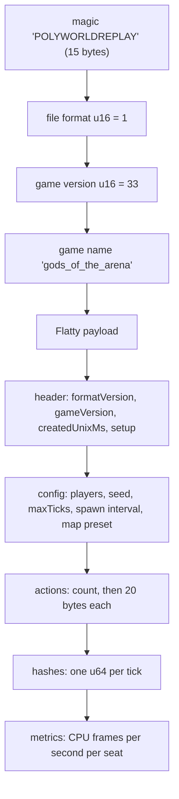
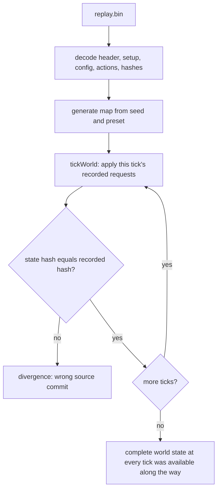
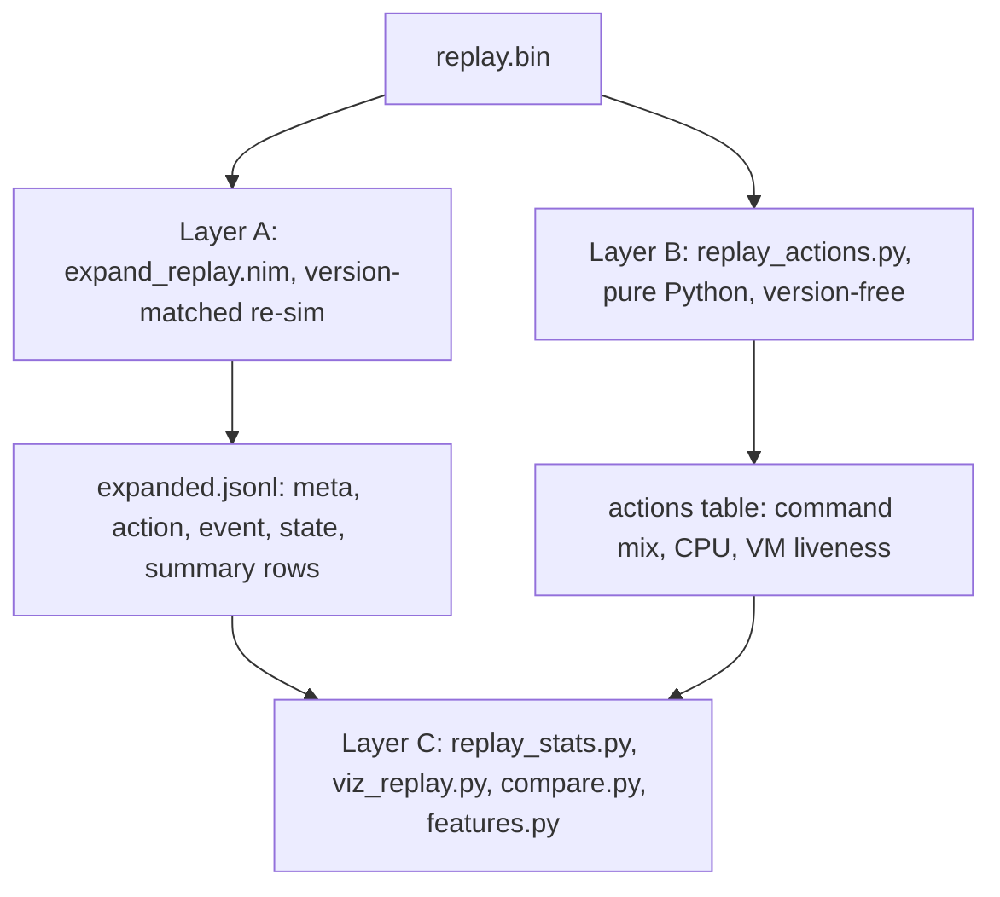

# Gods of the Arena replay format and a replay-expander design

For James, before we build the Gods of the Arena replay expander. Researched against Metta-AI/polyworld commit `5422fb0c`, the commit the live game is built from; polyworld `main` (`1d7eb723`) diverges from it and is not a valid re-simulation target (section 1.4).

## Executive summary

A hosted Gods of the Arena replay is not a recording of game state. It is a binary **action tape**: a short header, the match setup (seed, map hash, ten heroes with team, seat, lane and class), the hosted match configuration including the public player display names, every BASIC action call as a 20-byte record, one state hash per tick, and per-second CPU samples (`src/polyworld/tapes.nim`, `examples/gods_of_the_arena/replays.nim:12-46`). Nothing else is in the file: no positions, HP, gold, kills, or damage. A 60-line pure-Python decoder written during this investigation parses a real league replay to the last byte, and the final recorded hash equals the `hash:` line in that episode's game log.

Everything else is recoverable by **re-simulation**, and only that way. Playback re-runs the full engine, re-applies the recorded requests through the same validators, and checks the state hash every tick (`sim.nim:2306`, `sim.nim:2692`). That works only at the exact source commit that recorded the game: built at polyworld `main` the sample replay diverges at tick 132, while built at `5422fb0c` it re-simulates all 28,800 ticks with zero mismatches in 24 seconds on this arm64 Mac and reproduces the hosted game log exactly. The correct commit is discoverable from the coworld's manifest, not guessed. The proposed expander mirrors the Crewrift and Heartleaf tools: a small Nim program in our repo compiled against the fetched polyworld tree that emits JSONL events and sampled state, the Python tape decoder as a no-build fallback, and Python stats, `compare.py` and `features.py` adapters on top. The main design decision still open is damage attribution, which the engine never records and which needs a one-line simulator patch or a victim-side-only first version.

## Table of contents

1. [Where replays come from](#1-where-replays-come-from)
2. [The file format](#2-the-file-format)
3. [Playback and version coupling](#3-playback-and-version-coupling)
4. [The other artifacts of an episode](#4-the-other-artifacts-of-an-episode)
5. [What is recorded and what is recoverable](#5-what-is-recorded-and-what-is-recoverable)
6. [What is not recorded](#6-what-is-not-recorded)
7. [Proposed expander design](#7-proposed-expander-design)
8. [Open questions](#8-open-questions)
- [Appendix A: Decoded sample header](#appendix-a-decoded-sample-header)
- [Appendix B: Build recipe](#appendix-b-build-recipe)
- [Appendix C: Sources](#appendix-c-sources)

Everything marked **verified** was checked against the polyworld source at `5422fb0c`, against a real league replay downloaded from the Observatory, or both. **Inferred** items are reasoned from source but not exercised.

| Evidence | Value |
| --- | --- |
| Live game version | `2026.9.15.1` (`GET /v2/coworlds/cow_252fb6a6-…` → `version`) |
| Live source commit | `5422fb0c` (`manifest.game.runnable.source_url` on the same endpoint) |
| polyworld `main` at time of writing | `1d7eb723` (2026-09-15T19:23Z), diverges from the live build |
| Sample episode | `ereq_9aa9fcd9-b288-42aa-bc37-70f9b736e9d9`, Competition division, completed 2026-09-15T19:46Z, time-limit draw, 291,325 recorded actions |

## 1. Where replays come from

- The hosted game records an in-memory action tape during the match and writes it once at the end (verified).
- Every completed episode has a replay: the game refuses to publish results without one.
- The Observatory serves the raw bytes from public S3 and through the episode-artifacts route. The shared downloader saves them under a `replay.json` name, but the file is binary.

The hosted game runs the headless polyworld binary compiled with `-d:coworld`. The runner passes the output path in `COGAME_SAVE_REPLAY_URI` (`src/polyworld/coworld.nim:280`). A recorder is created per match together with the current setup, and the hosted `GotaConfig` is copied into the tape (`examples/gods_of_the_arena/game.nim:144-149`). At the end of the match `saveRecording` calls `saveReplay` (`game.nim:229`, `replays.nim:285`). `finishCoworld` refuses to publish results if the replay file does not exist (`coworld.nim:329`), so every completed episode has one.

The Observatory serves the file two ways, both verified on the sample episode. `episode.json.replay_url` points at `https://softmax-public.s3.amazonaws.com/replays/<job>.replay`, public S3, raw bytes. The manifest declares `replay_viewer.replay_compression: "gzip"`, and polyworld's own inspector tolerates a gzip prefix (`tools/herostats.nim:162`), but the bytes we received were uncompressed. The second route is `/v2/episode-requests/{id}/artifacts/replay`, which is what the shared `fetch_artifacts.py` uses. It saved 6,119,872 identical bytes as both `replay.json.z` and `replay.json` because its zlib attempt fails silently and falls back to the raw blob. The file named `replay.json` is not JSON; treat it as `replay.bin`.

## 2. The file format

- A hand-written header (magic, format version, game version, game name) followed by a Flatty serialization of one Nim object (verified).
- No compression, no per-tick state, no event log.
- Actions are 20 bytes each; there are 14 action kinds, of which BASIC policies emit at most 12.

A GotA replay is the generic polyworld tape container (`src/polyworld/tapes.nim`): a tiny header followed by a Flatty (`0.4.0`, `-d:flatty64`) serialization of `ActionTape[Setup, ReplayAction, ReplayMetrics, GotaConfig]`. Flatty writes object fields in declaration order; `int` and `seq` lengths are 8-byte little-endian; enums are 8 bytes; bool is 1 byte; and a `seq` of a plain-data object is a raw copy of the Nim struct, padding included (`flatty.nim:464-472`).


Figure 1 — The replay container from first byte to last. Notice that actions and hashes are the only per-tick content; there is no state.

```
offset  size  field                              value in sample
0       15    magic                              "POLYWORLDREPLAY"          tapes.nim:11
15      u16   file format version                1                          tapes.nim:12
17      u16   game version                       33                         replays.nim:15
19      u16   game name length                   17
21      n     game name                          "gods_of_the_arena"        replays.nim:11
21+n    …     Flatty payload: ActionTape[Setup, ReplayAction, ReplayMetrics, GotaConfig]
```

| Field | Type | Bytes / notes | Source |
| --- | --- | --- | --- |
| `header.formatVersion` | u16 | 5 | `replays.nim:12` |
| `header.gameVersion` | u16 | 33 | `replays.nim:15` |
| `header.createdUnixMs` | i64 | | `tapes.nim:187` |
| `header.setup` | `Setup` | `mapSeed i32, mapHash u64, tickRate u16, gridTiles u16, spawnIntervalTicks u32, maximumTicks u32, heroes seq[ReplayHero]` | `replays.nim:37` |
| `ReplayHero` | 8 bytes each | `id i32, team u8, slot u8, lane u8, class u8` | `replays.nim:30` |
| `config` | `GotaConfig` = `MatchConfig[MapConfig]` | `players seq[{name string}], seed i32, maxTicks i32, spawnIntervalTicks i32, playerSlot i32, dayCount i32, mapPreset` | `src/polyworld/configs.nim:16`, `presets.nim:10` |
| `MapConfig` | | `mapSize i64, seed i64, lakeCrossings i64, jungleRoads i64, 9 × f32, campsTouchRoads u8` | `generation/configs.nim:10` |
| `actions` | `seq[ReplayAction]` | count i64, then **20 bytes each**: `tick u32 @0, heroId i32 @4, kind u8 @8, 3 pad, first i32 @12, second i32 @16` | `replays.nim:46` |
| `hashes` | `seq[uint64]` | one canonical state hash per completed tick | `tapes.nim:196` |
| `metrics` | `ReplayMetrics` | `tickRate i32, interval i32, frames seq[{tick i32, rows seq[{cpu i32}]}], final seq[{cpu i32}]` | `src/polyworld/metrics.nim:27` |

Action `kind` codes (`replays.nim:16-23`):

| kind | meaning | `first`, `second` |
| --- | --- | --- |
| 1 | `walkTo` | tile x, tile y |
| 2 | `attackTarget` | object id, – |
| 3 | `buyItem` | item id (`Item` enum ordinal, `content.nim:82`), – |
| 4 | `useItem` | inventory slot 0–5, – |
| 5 | `attackMove` | tile x, tile y (human or graphical client only; never emitted by BASIC) |
| 6–9 | `castTarget` slot 0–3 | object id, – |
| 10–13 | `castPoint` slot 0–3 | tile x, tile y |
| 14 | `manualSpells` | 1 = human seat (only written when a human plays) |

A pure-Python decoder of this layout parses the sample replay and the in-repo `examples/gods_of_the_arena/replays/demo.replay` to the exact last byte, and the last entry of `hashes` (`0x320ad325`) equals the `hash:` line in the episode's `game_logs.log`. The prototype, `gota_replay_probe.py` in this session's scratchpad, is about 60 lines of `struct` calls and is worth lifting into the lab as-is. Appendix A shows the decoded header of the sample.

`config.players[].name` is the public player display name, so the replay itself tells you who sat where: hero id 100 + slot is seat 0–4 (Red) and 105 + slot is seat 5–9 (Blue); `episode.json.participants[].position` uses the same order.

## 3. Playback and version coupling

- The tape stores requests, recorded before the engine accepts or rejects them; playback re-runs the full simulation and hash-checks every tick (verified).
- The recorded game version (33) does not identify a compatible build; the source commit does, and it is discoverable from the coworld manifest.
- An arm64 host build reproduced the hosted game exactly on the one sample; keep the hash check as the guard.

Each BASIC action call is recorded before the engine evaluates it (`bots.nim:186-207`). Playback re-runs the simulation and re-applies the recorded requests at their ticks through the same validators (`applyReplayAction`, `sim.nim:2306`, called from `tickWorld`, `sim.nim:2830`), checking `stateHash` against the recorded hash every tick (`sim.nim:2692`). This is the same design as the bitworld `.bitreplay` used by Crewrift and Heartleaf, so everything the Crewrift replay notes say about version coupling (`crewrift_lab/docs/crewrift-replays.md`) applies here.


Figure 2 — Re-simulation. The hash check on every tick is what makes recovered state trustworthy, and what fails when the build does not match the recording commit.

`ReplayGameVersion` (33) is not sufficient to pick a compatible simulator. Built at polyworld `main` (`1d7eb723`, also version 33), the sample replay diverges at tick 132 with 28,669 mismatches, and even the in-repo `demo.replay` diverges at tick 135. Three simulation-affecting changes (tower collision, creep lane resume, creep upscale) merged after the live build without a version bump. Built at `5422fb0c`, both replays re-simulate with zero mismatches on this arm64 Mac, and the headless summary reproduces the hosted game log exactly:

```
result: time limit
forts: red 400 hp, blue 400 hp / towers: red 4, blue 5
hash: 00000000320AD325 map 0000000029424656
heroes: red L13 L13 L8 L3 L12, blue L10 L10 L9 L10 L9
economy: red 21200 XP / 635 gold, blue 18950 XP / 680 gold
replay: 291325/291325 actions          (24 s wall clock for 28,800 ticks)
```

Two consequences follow. First, the correct ref is discoverable, not guessed: `GET /v2/coworlds/{coworld_id}` returns `manifest.game.runnable.source_url` in the form `https://github.com/Metta-AI/polyworld/tree/<sha>/coworld/gota`. The build script should resolve `GOTA_REF` from that, with `episode.json.coworld_version` as the cache key, the way `CREWRIFT_REF` and `HEARTLEAF_REF` are pinned today but automatically. Polyworld's own policy is that older replays use their archived client and no compatibility branches are added (`replays.nim:13-14`), and `replays.nim` has 12 commits in five days, so expect frequent re-pins. Second, arm64 host builds are deterministic enough: map generation uses `float32` presets, yet the map hash and all 28,800 tick hashes matched, and `validateReplayWorld` (`sim.nim:1091`) passed. No Docker or amd64 build is needed for expansion. This is one sample; keep the hash check as the guard. The build recipe that worked is in Appendix B.

## 4. The other artifacts of an episode

- `results.json` and `game_logs.log` give outcome, levels, team XP and gold, tower counts and VM liveness without touching the replay.
- Per-seat private logs hold every `PRINT` and any BASIC error, but only for seats the current identity owns.
- GotA produces no player artifact ZIP.

| File | Content |
| --- | --- |
| `results.json` | `{"scores":[10 × 0/1],"ticks":28800,"seed":…,"outcome":…,"banked_gold":[],"returned":[],"total_xp":[10 ints]}` where `outcome` is one of `time_limit`, `RedTeam`, `BlueTeam` (`gota.nim:9-14`, `src/polyworld/coworld.nim:41`). `banked_gold` and `returned` are fields from another game and are always empty for GotA. |
| `game_logs.log` | Container stdout. The `game` section is the headless summary: `replay saved … (N actions)`, `result`, `forts`, `towers`, `hash`, `heroes` (levels), `economy` (team XP and unspent gold), `scripts: 10/10 active, N decisions` (`game.nim:243`). A cheap end-of-game signal; `scripts: 10/10 active` tells you whether any VM died. |
| Per-seat private log | Only for seats you own. Contains `Player slot N started.`, every BASIC `PRINT`, `BASIC error: …` on VM failure, `Player slot N completed.`; capped at 10 MiB (`src/polyworld/coworld.nim:141-175`). No tick stamps unless the policy prints `worldTick` itself. Fetched from `/v2/episode-requests/{id}/{policy_version_id}/policy-logs/{position}`. On the sample episode the `games-bond-gota` seat returned `403 You do not own this policy` under the login in use at the time; that policy belongs to the "Games Bond" player identity (see the `coworld-player-swap` skill). |
| Player artifact ZIP | Not produced by GotA (`integration.md`: "No player artifact ZIP is produced"). |
| `episode.json` | Discovery row: `participants[] {position, policy_name, version, policy_version_id, player_name, is_filler}`, `participant_scores`, `coworld_version`, `replay_url`, `inspect_url`. |

## 5. What is recorded and what is recoverable

- Directly from the file: every action request with tick and hero, per-second CPU per seat, and the episode setup.
- By re-simulation: complete authoritative world state at every tick, including the engine's automatic casts and team vision.
- Reward accounting is exact at the hit site, so last hits and tower kills are attributable per tick.

### 5.1 Directly in the file (no re-simulation)

Per action, for every BASIC action call whether accepted or not: tick, hero id, kind, arguments. That gives command rates, target choices (object ids only, no positions), shop requests, item-use requests, cast requests, and the last tick at which each hero's VM was still issuing calls, since a VM that died stops appearing. Per second and per seat: CPU percentage (instructions used over the 20,000 budget) in `metrics.frames`, with a lifetime average in `metrics.final`; `-1` means no VM, that is, a human seat. Per episode: seed, map preset, hero roster (id, team, slot, lane, class), player display names, recorded duration (`len(hashes)`), creation time. Not in the file: acceptance of any action, positions, HP, gold, XP, level, kills, deaths, damage, item inventories, ability charges, structure HP, fog.

### 5.2 Recoverable by re-simulation (verified reachable in `World`)

| State | Where | Notes |
| --- | --- | --- |
| Hero position (world units, `WorldScale = 60,000` per tile), facing, navigation layer | `Hero`, `sim.nim:90` | `mapCoordinate(pos.x)` is the tile x as BASIC sees it |
| HP and max HP, mana and max mana, level, xp, totalXp, gold | `Hero` | `gold` is unspent; earned gold is `stats.values[slot][GoldMetric]` |
| State (`Marching`, `Fighting`, `Dying`), current targets (`targetFootmanId`, `targetHeroId`, `targetTowerId`, `attackingFort`), `attackObjectId`, move path and target | `Hero` | What the engine is actually doing, versus what the script asked |
| Inventory (6 × item enum plus counts), ability cooldowns, charges, recharges | `Hero` | |
| Footmen (id, team, lane, position, HP, state, target) | `Footman`, `sim.nim:67`; `UnitCap = 120` | |
| Towers (id, team, lane, tier, position, HP, target), forts (HP 400 at start of siege) | `sim.nim:138-154` | |
| Live spell casts (`ability, heroId, targetId, origin, position, started, impact, ends, resolved`) | `SpellCast`, `sim.nim:171`; `world.casts` | Includes the engine's automatic casts, which are never in the tape |
| Team vision and explored tiles | `world.teamVisible`, `teamExplored`, `sim.nim:204-205`, rebuilt each tick by `rebuildVision` (`sim.nim:509`) | Answers "was the target visible when the script attacked it" |
| Combat counters per seat: gold earned, kills, deaths (`LossesMetric`), assists (10-second damage window) | `world.stats` (`CombatStats`, `src/polyworld/metrics.nim:81`, `hitHero`) | Hashed with the world, so guaranteed to match the live game |
| `teamHeroKills`, `teamHeroDeaths`, `gameOver`, `winner` | `World` | |
| Accepted commands per seat (actions per minute) | `game.metrics.command` in `tickWorld` | Acceptance is recomputed on playback |

Reward accounting is exact and event-attributable at the hit site (`applyHeroHit`, `sim.nim:1856`): a footman kill gives +25 XP and +15 gold, a hero kill +150 and +100, a tower kill +100 and +75 (`sim.nim:357-362`); fort damage awards nothing. Spell strikes go through the same procedure (`hitSpellTarget`, `sim.nim:2031`), so spell kills are credited. Tower and footman damage to heroes calls `hitHero(-1, …)` (`sim.nim:1641`, `sim.nim:1775`), which records a death with no killer seat.

### 5.3 Prior art in polyworld (verified)

Polyworld ships a minimal re-simulation extractor for its tournament tool: `inspectReplay` in `tools/herostats.nim:157` plus `tools/inspect_players.nim`. It replays the tape, refuses any hash mismatch, cross-checks `scores()` against `participant_scores`, and emits end-of-game per-seat JSON: `hero, class, team, win, draw, level, xp, xp_progress, gold (earned), banked_gold, kills, deaths, assists`. It then derives `tower_kills` and `last_hits` from the exact reward arithmetic (`objectiveCounts`, `tools/tournaments.nim:265`). It is end-state only, with no timeline, positions or events, and it imports `curly`, `zippy` and `jsony` for the tournament runner. It is the right thing to copy the loop from, not to depend on.

## 6. What is not recorded

- Nothing beyond command counts is available without a version-matched re-simulation.
- The tape holds requests, not effects; damage and healing totals exist nowhere.
- Automatic casts, visibility and policy reasoning are all derivable or private, never recorded.

1. **No per-tick state in the file.** Anything beyond command counts needs the version-matched re-simulation of section 3. If a ref cannot be built (a source commit that no longer exists, or a private dependency change), the replay is opaque apart from the action stream.
2. **Requests, not effects.** `attackTarget(id)` in the tape does not mean the hero hit, or even approached, that target. Acceptance must be recomputed (`applyReplayAction` returns the accepted flag), and effect must be read from world state afterwards.
3. **No damage or healing totals.** GotA never writes `DamageMetric`, `HealingMetric`, `ArmyMetric`, `BankedMetric` or `StructuresMetric` (grep of `examples/gods_of_the_arena/*.nim`; polyworld's own report says "Damage and healing totals are not tracked … and are not reported as zero"). They are trivially recoverable by hooking `applyHeroHit` in the expander, but nothing in the file or the stock tools has them.
4. **No per-hit attribution for tower or creep damage.** `hitHero(-1, …)` records a hero death by a non-hero source without saying tower versus footman; the expander sees the call site, so it can tag it.
5. **Automatic ability casts are invisible in the tape.** They happen inside `updateHero` → `tryCastAbility` and are recoverable only from `world.casts` during re-simulation.
6. **No policy-side reasoning.** `PRINT` output is private to the seat owner and only for seats you own; other entrants' logic is opaque. For our own seats, the private log is the only "why" channel and it has no tick stamps unless the policy prints `worldTick`.
7. **No wall-clock or scheduling data** beyond `createdUnixMs`.
8. **Visibility is derivable but not recorded.** Whether an enemy was visible to a hero at a tick has to be recomputed from `teamVisible`; nothing in the tape says what the script saw.
9. **Tooling mismatch in the shared downloader.** `fetch_artifacts.py` labels the binary tape `replay.json`; anything that assumes JSON breaks. A sniff for the `POLYWORLDREPLAY` magic or a game adapter hook is needed.

## 7. Proposed expander design

- Three layers, the same pattern as Crewrift and Heartleaf: a Nim re-simulation expander, a pure-Python tape decoder, and Python analysis on top.
- The expander is our file, compiled against whichever polyworld ref the build script fetched, so a renamed field is a compile error rather than silent wrong data.
- Events come from diffing world state between ticks; damage attribution is stubbed until the engine records it (change request 6).

### 7.1 Shape


Figure 3 — The three layers. Layer B needs no build and is the fallback when a ref will not compile; layer A is where the value is.

Layer B exists in prototype form (the 60-line `struct` decoder) and never needs rebuilding. It is the fallback when a ref will not build, and it is enough for command-rate, shop and targeting-policy questions. Layer A is where the value is. Layer C is plain Python over JSONL or Parquet, matching how the `crewrift-event-warehouse` pattern and Heartleaf's replay visualizer (`heartleaf_lab/tools/viz_replay.py`) work.

Module layout, mirroring `heartleaf_lab/tools/`:

```
gods_of_the_arena_lab/
  tools/
    build_expand_replay.sh      # resolves GOTA_REF from /v2/coworlds/{id} (cache by coworld_version),
                                #   tarball fetch, nimby sync, host-native nim c; caches bin/expand_replay-<ref>
    expand_replay.nim           # OUR file, compiled against the fetched polyworld tree (see 7.2)
    bin/expand_replay-<ref>     # gitignored
    replay_actions.py           # layer B: pure-Python tape decoder (lifted from the prototype)
    replay_stats.py             # layer C: expanded.jsonl -> per-hero / per-team tables (markdown + JSON)
    viz_replay.py               # layer C: paths / heatmaps on the tile grid (Pillow, like heartleaf's)
  .claude/skills/gota-ab/scripts/compare.py                # coworld-ab adapter
  .claude/skills/gota-hypothesis-miner/scripts/features.py # miner adapter
  docs/replay-format.md         # the reference once the tools exist
```

`expand_replay.nim` lives in our repo (polyworld has no such tool) and is compiled with the polyworld source on the `--path`; it imports `polyworld/[tapes, metrics]` and `examples/gods_of_the_arena/[content, maps, replays, sim]` exactly as `herostats.nim` does. It stays a file of roughly 300 lines: the `herostats.nim` loop plus per-tick emission plus a few diff-based event detectors. Because it compiles against whichever ref the build script fetched, it inherits polyworld's one-client-per-gameplay-version rule automatically; if a future polyworld commit renames a field, we get a compile error, not silent wrong data.

### 7.2 Expander core loop (inferred from `herostats.nim`, not yet written)

```nim
let data = decodeReplay(bytes)                       # gzip sniff like herostats
let game = newGame(generateMap(data.config.seed, data.config.mapPreset),
                   data.config.spawnIntervalTicks, 0, true, data)
game.replayPlayer = initReplayPlayer(data); game.historyPlayback = true
emit meta row
while game.world.tick < data.hashes.len:
  snapshot previous world (clone or copy the fields we diff)
  game.tickWorld(nil)                                 # applies tape actions, checks hash
  diff previous vs current -> events; every N ticks -> state rows
require game.hashCheck.mismatches == 0 (else summary.hash_failed = true, exit non-zero)
emit summary row
```

Events derived by diffing state between ticks, with no engine changes needed:

| Event | Detection | Fields |
| --- | --- | --- |
| `action` | Each tape action consumed this tick, with the `applyReplayAction` result | `slot, kind, args, accepted`. Requires calling the validators ourselves or reading the `game.metrics` command delta; simplest is to consume actions in our loop and call `applyReplayAction` directly, mirroring the branch in `tickWorld` |
| `hero_death`, `hero_respawn` | `hp > 0 → ≤ 0` (state `Dying`), then `hp` back above 0 at spawn | `slot, tick, pos, killer_slot` (from the `stats.values[KillsMetric]` delta that tick; `-1` if tower or creep) |
| `hero_kill`, `assist` | Per-seat `KillsMetric` and `AssistsMetric` delta | |
| `last_hit` (footman), `tower_kill` | XP and gold delta decomposed by the exact reward table (25/15, 150/100, 100/75), the same arithmetic `objectiveCounts` uses but per tick, so it is unambiguous | `slot, kind, tick` |
| `tower_destroyed`, `fort_damaged`, `fort_destroyed` | Tower and fort HP transitions | `team, lane, tier, tick` |
| `level_up` | `level` delta | |
| `gold_spent`, `item_bought`, `item_used` | Inventory diff plus gold drop on the tick a `buyItem` or `useItem` was accepted | `slot, item, cost` |
| `cast` | New entry in `world.casts` | `slot, ability, slot_index, target or point, auto (not in tape at that tick) versus explicit` |
| `damage` | **Stub until change request 6 lands.** The engine keeps no per-hit record, so per-attacker damage is not diff-derivable and the expander must not patch the simulator to get it. Emit `damage` as a placeholder event type with no rows, documented as blocked on [requested game change 6](../../gods_of_the_arena_lab/docs/requested-game-changes.md) (damage/heal events in the recording). The victim-side `hp` delta per tick is still available through `objective_state`. Fill this row in as soon as the change ships. | `tick, source, target, amount, cause` (reserved) |
| `objective_state` (sampled) | Every `--snapshot-every N` ticks: all hero rows (pos, hp, mana, gold, level, state, target ids, inventory, cooldowns), tower and fort HP, footman counts per lane per team | The positions and heatmap feed |
| `visibility` (sampled) | For each hero: count of enemy heroes visible, enemy structures exposed | Answers "did it attack something it could see" |

Output contract: one JSON object per line, `type` in `meta | action | event | state | summary`, all with `tick`; seat-tagged rows carry `slot` (platform seat 0–9, equal to hero index) and `hero_id`. Positions in tile units (`mapCoordinate`) plus raw world units, so they line up with what BASIC sees and with the `terrain*` grid. These are the same conventions as Heartleaf's rows (`meta`, `tick`, `event`, `summary`), so `viz_replay.py` is a near copy.

### 7.3 Stats tables (layer C)

Per hero, one row per seat per episode: the columns polyworld's tournament already defines, plus the timeline-only ones:

`slot, team, class, policy_name, version, player, win, draw, level, total_xp, gold_earned, gold_unspent, kills, deaths, assists, last_hits, tower_kills, damage_taken, first_death_tick, time_dead_ticks, first_tower_kill_tick, first_fort_hit_tick, apm, cpu_pct, vm_failed_tick, actions_by_kind{…}, casts_explicit, casts_auto, items_bought{…}, ticks_in_enemy_half, mean_distance_to_nearest_ally, …`

Per team: `towers_lost_by_lane, fort_hp_min, first_tower_kill_tick, first_fort_hit_tick, hero_kills, hero_deaths, xp, gold, outcome`.

Per episode: `outcome, ticks, minutes, coworld_version, replay_ref, hash_verified, seed, map_seed`.

### 7.4 Slotting into the shared adapters

The `coworld-ab` adapter (`compare.py`) needs only `results.json` and `episode.json` for the headline metrics: `win` from `participant_scores`, `total_xp[position]`, and `outcome == time_limit` as the draw rate. `by_group` should be `{red, blue}` at minimum and probably `{class}`: GotA fixes the class per seat (seat 0 is always Death Knight, and so on), so a policy's numbers are confounded by which seats it drew, and grouping by class is the honest split (`RedHeroClasses`, `content.nim:123`; `BlueHeroClasses`, `content.nim:130`). Timeline metrics (`first_tower_kill_tick`, `deaths`, `last_hits`) come from `replay_stats.py` output joined on `(episode_id, position)`; the adapter should accept an optional `--expanded DIR` and fall back to results-only metrics.

The `coworld-hypothesis-miner` adapter (`features.py`) emits one row per (episode, own seat), with features straight from the per-hero table: the "never happened = LAST_TICK+1" rule for timings (`first_death_tick`, `first_tower_kill_tick`, `first_fort_hit_tick`), presence flags (`bought_X`, `cast_ultimate`), and counts (`last_hits`, `deaths_to_towers`). Score is the seat's `total_xp` minus the time penalty the ladder uses (100 XP per simulated minute, per polyworld `USAGE.md`), or plain win, chosen per question.

If we accumulate many episodes, the Crewrift event-warehouse pattern (Parquet plus DuckDB) applies unchanged; the expander's JSONL is its input.

### 7.5 Cost

Expansion takes about 24 seconds per 20-minute episode on this machine, single-threaded; the simulation runs at 49 times real time. A 20-episode experience request expands in under a minute with four workers. The simulator has module-level globals, which is why `herostats.nim` runs one process per replay; do the same.

## 8. Open questions

1. **Ref resolution for old episodes.** `/v2/coworlds/{id}` gives the current version's source commit. For an episode with an earlier `coworld_version` we need a version-to-commit map; polyworld keeps receipts in `coworld/releases/*.json` (`source_commit`), but only for some releases and not for `2026.9.15.1` yet. Cache `(coworld_version → sha)` locally as we observe them and fail loudly otherwise.
2. **Damage attribution** is blocked on [requested game change 6](../../gods_of_the_arena_lab/docs/requested-game-changes.md): damage and heal events recorded by the engine. Until then `damage` is a stub and `features.py` must not build on "damage dealt".
3. **The Nim expander is required for the first iteration** (decided 2026-09-15). Layer B alone gives aggregates and unaccepted action requests, which is not enough. The expander must also emit, per tick and per bot, what that bot could observe under fog of war (the team visibility map and the visibility-filtered object list) so we can tell what each policy knew when it acted.
4. **Own-seat private logs.** The `games-bond-gota` seat is owned by the "Games Bond" player identity, and the login in use during the investigation was not that identity (403 "You do not own this policy"). The James Botts player session activated later in this session is a different identity again. Confirm which identity owns the policy we will iterate on before relying on `PRINT` traces.
5. **Downloader naming.** Fix `fetch_artifacts.py` to sniff the `POLYWORLDREPLAY` magic and save as `replay.bin`, or leave `replay.json` and document it. A small shared-skill change that needs a go-ahead because it touches root tooling.
6. **arm64 determinism** is verified on one episode. Keep the hash check mandatory; if a mismatch ever appears with the correct ref, that is the signal to fall back to a `linux/amd64` container build.

## Appendix A: Decoded sample header

```
setup:   map_seed 223226943, map_hash 0x29424656, tick_rate 24, grid 116, spawn 240, max 28800
heroes:  id 100-104 team 0 (Red) classes DeathKnight, Crossbowman, Lich, Warlock, Berserker (lanes 0,0,1,2,2)
         id 105-109 team 1 (Blue) classes VanguardKnight, Ranger, Arcanist, DruidWarden, DemonHunter
players: ['Andrew Brower', 'richard', 'Games Bond', 'daveey-2', 'docxology', 'Andrew Brower B', 'relh', 'Andre von Auto', 'daveey', 'Andre von Houck']
actions: 291,325  (attackTarget 180,166 · walkTo 85,632 · useItem 15,371 · buyItem 10,156 · 0 casts)
hashes:  28,800   metrics: 1,201 CPU frames at 24-tick interval + 10 finals
```

## Appendix B: Build recipe

No credentials needed; `nim` 2.2.6 and `nimby` are already in `~/.local/bin`.

```sh
curl -fsSL https://github.com/Metta-AI/polyworld/archive/$REF.tar.gz | tar xz -C src --strip-components=1
cd src && nimby --global sync nimby.lock          # writes nim.cfg with dependency paths
nim c -d:headless -d:release --out:../gota_headless examples/gods_of_the_arena/gota.nim
../gota_headless --replay replay.bin              # hash-checked; non-zero exit on divergence
```

## Appendix C: Sources

Polyworld paths are relative to the repository root at commit `5422fb0c`; `examples/gods_of_the_arena/` is abbreviated to the file name where unambiguous.

- `src/polyworld/tapes.nim` — tape container: magic, header, `ActionTape`, per-tick hashes.
- `src/polyworld/coworld.nim` — hosted replay path, private logs, result publishing.
- `src/polyworld/metrics.nim` — `ReplayMetrics`, `CombatStats`, `hitHero`.
- `src/polyworld/configs.nim` — `MatchConfig`.
- `examples/gods_of_the_arena/replays.nim` — GotA replay header, action kinds, `saveReplay`, version policy.
- `examples/gods_of_the_arena/game.nim` — recorder lifecycle, headless summary.
- `examples/gods_of_the_arena/gota.nim` — `results.json`.
- `examples/gods_of_the_arena/sim.nim` — playback, hash check, world records, reward arithmetic, vision.
- `examples/gods_of_the_arena/bots.nim` — actions recorded before acceptance.
- `examples/gods_of_the_arena/content.nim` — `Item` enum, class lineups.
- `examples/gods_of_the_arena/presets.nim`, `generation/configs.nim` — `GotaConfig`, `MapConfig`.
- `examples/gods_of_the_arena/tools/herostats.nim` — polyworld's re-simulation extractor (`inspectReplay`), the loop to copy.
- `examples/gods_of_the_arena/tools/inspect_players.nim` — tournament-side driver of that extractor.
- `examples/gods_of_the_arena/tools/tournaments.nim` — `objectiveCounts`, the reward decomposition into tower kills and last hits.
- `flatty.nim` — the Flatty 0.4.0 serializer (external dependency, pinned by `nimby.lock`): field order and raw struct copy rules.
- `examples/gods_of_the_arena/replays/demo.replay` — in-repo sample tape.
- `crewrift_lab/docs/crewrift-replays.md`, `heartleaf_lab/tools/viz_replay.py` — the bitworld expander shape this mirrors.
- `.claude/skills/coworld-episode-artifacts/scripts/fetch_artifacts.py` — shared downloader.
- Sample episode `ereq_9aa9fcd9-b288-42aa-bc37-70f9b736e9d9`: `episode.json`, `results.json`, `game_logs.log`, replay bytes.
