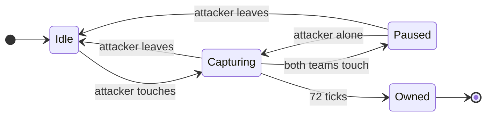
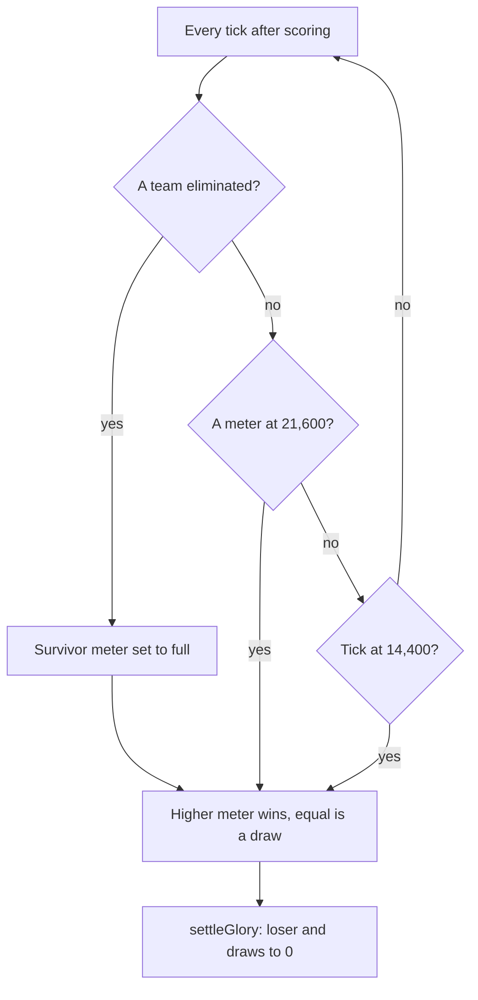
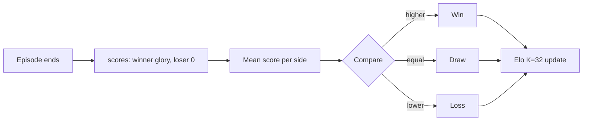
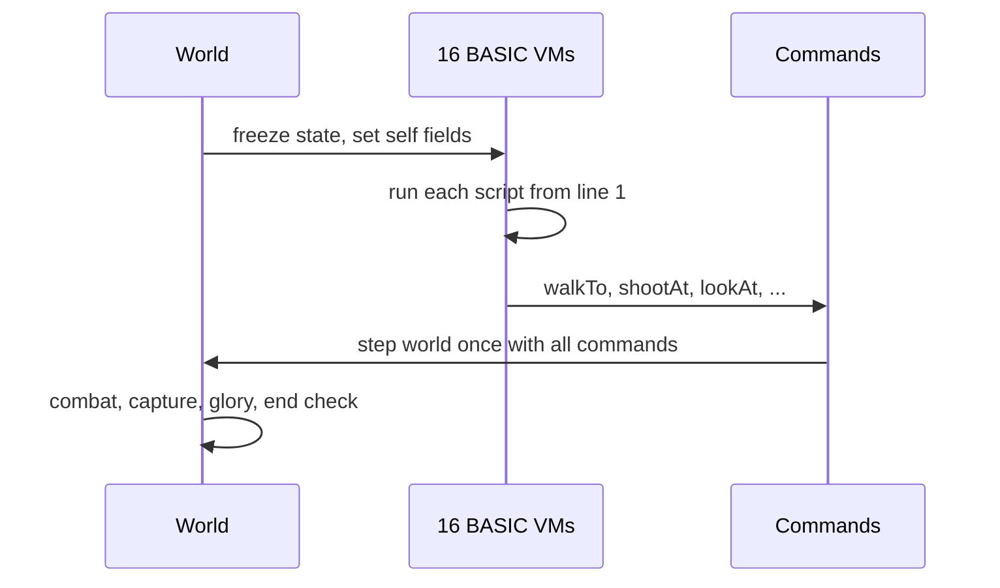
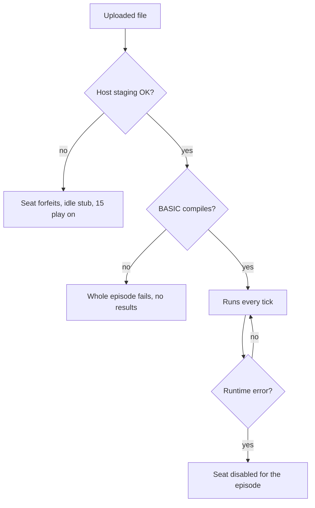

# Paintbot PW: an onboarding guide

Research report · 2026-09-28 · for James, before choosing the first Paintbot PW policy. Researched against Metta-AI/paintbot-pw `ab597b35` (tag `coworld-v0.3.67`), the release both leagues ran at the time of writing.

## Executive summary

Paintbot PW is Paintbot rebuilt inside Polyworld, a deterministic Nim game engine. Sixteen cogs (the game's name for its small wheeled robots, one per seat) in two teams of eight (Red on even seats, Blue on odd) fight over ten heart towers on an island called Heartwick. Every seat is a small BASIC program that the game itself runs once per tick, so a "player" is a text file, not a container or a network client. Standing next to a heart for three seconds captures it, owned hearts fill the team's meter, and the first team to 900 meter points wins, or the higher meter at ten minutes. Combat is short and lethal: three hit points, four lives, a one-shot-per-second paint gun, friendly fire on, and a vision cone that only sees forward.

The most important fact for strategy is that the winner and the score are different things. The heart meter decides who wins, but the number the platform receives is **glory**: 600 minus one per elapsed second, plus a few odd awards, and set to zero for the loser and for both sides of a draw. The league then feeds these scores into Elo as a plain win, draw or loss, ignoring the margin. So only winning moves rank, a slow win whose glory has run out counts as a draw, and a BASIC compile error fails the whole episode. The policy language is a tiny integer-only BASIC with a generous per-tick budget (50,000 instructions, not the 20,000 the guide still says), fog-gated observations, and a handful of actions. The engine changes several times a day, but its replays re-simulate across versions, which makes hash-checked analysis cheap.

## Contents

1. [What Paintbot PW is, and what it is not](#1-what-paintbot-pw-is-and-what-it-is-not)
2. [A match from start to finish](#2-a-match-from-start-to-finish)
3. [Winning versus scoring: glory](#3-winning-versus-scoring-glory)
4. [Combat and the battlefield](#4-combat-and-the-battlefield)
5. [How a policy runs](#5-how-a-policy-runs)
6. [The BASIC dialect](#6-the-basic-dialect)
7. [What a policy can see and do](#7-what-a-policy-can-see-and-do)
8. [How policies fail](#8-how-policies-fail)
9. [The starter policies](#9-the-starter-policies)
10. [The other two lanes: advisor oracle and neural BASIC](#10-the-other-two-lanes-advisor-oracle-and-neural-basic)
11. [Engine nuances and traps](#11-engine-nuances-and-traps)
12. [The field today](#12-the-field-today)
- [Appendix A: Heartland (FFA-kin mode)](#appendix-a-heartland-ffa-kin-mode)
- [Appendix B: Host API reference](#appendix-b-host-api-reference)
- [Appendix C: Evidence and analysis commands](#appendix-c-evidence-and-analysis-commands)
- [Appendix D: Sources](#appendix-d-sources)

## 1. What Paintbot PW is, and what it is not

- A separate coworld, `paintbot-pw`, with its own source repo (`Metta-AI/paintbot-pw`), leagues, forum and wiki.
- Built on Polyworld, the same Nim engine family as Gods of the Arena. It is not the Season 1 capture-the-heart shooter or the Season 2 battle royale that `paintbot_lab` covers.
- `player_runtime: game-hosted`: you upload one BASIC file (or a neural-BASIC ZIP), and the game runs it. There is no player container and no network protocol to speak.
- Two leagues: the main teams ladder `paintbot-pw`, and Heartland, a free-for-all "kin" variant opened on 2026-09-28.

The Paintbot name covers three different games on the platform, and it is easy to carry assumptions across them. The older `paintbot` coworlds are the Season 1 capture-the-heart shooter and the Season 2 battle royale with WASM "plays"; the lab's Stencil player targets those (`paintbot_lab/README.md`). Paintbot PW keeps the look (paintball, cogs, hearts) but reimplements the game in Polyworld with different rules, a different player format and a different replay format, so nothing from `paintbot_lab` carries over without re-checking (`paintbot_pw_lab/docs/mechanics.md:10-12`).

The source repo is a standalone copy of Polyworld whose history starts at "initial import of polyworld code" (2026-08-25); the game itself lives in `examples/paintbot/` (about 11,700 lines of Nim) with the hosting glue in `coworld/paintbot/`. The deployed manifest points at the bare repo URL with no commit, so the only link from a release to its source is the release tag `coworld-v<version>` (`paintbot_pw_lab/tools/deployed_ref.py`).

**How to upload.** The manifest's player protocol accepts "one raw UTF-8 BASIC source file or a neural BASIC ZIP containing manifest.json, policy.bas, and model.bin" (`reference/manifest-0.3.65.json`, `protocols.player`). WASM was accepted until version 0.3.33 and now forfeits the seat (`coworld/paintbot/runtime/host.py:43-53`).

## 2. A match from start to finish

- 16 seats; team = seat mod 2. Even seats are Red ("Ember"), odd seats are Blue ("Azure").
- 24 ticks per second; a teams match is at most 14,400 ticks (10:00).
- Ten equal hearts. Each team starts owning one; eight start neutral.
- Capture takes 72 ticks (3 s) of uncontested presence within 140 units; more cogs do not speed it up.
- A team's meter gains one tick-point per owned heart per tick. 21,600 tick-points wins; the viewer shows this as 900 points (tick-points ÷ 24), which is five hearts held for three minutes.
- A team with no cog alive and no lives left is eliminated, and the other team's meter fills at once.

### Seats and teams

There are 16 seats (`examples/paintbot/sim.nim:9`), and team membership is simply `slot mod 2` (`examples/paintbot/sim.nim:223`). The manifest lets a config label seats with teams, but the engine never reads those labels (`examples/paintbot/game.nim:321-332`). In the main league each episode pairs two policies, one filling all eight even seats and the other all eight odd seats, so a team is eight copies of one file (`paintbot_pw_lab/docs/field.md`, league roster). Seats decide in slot order, but each even/odd pair swaps order on odd ticks so neither team always moves first (`examples/paintbot/mechanics.nim:518-524`).

### Hearts and capture

A cog "touches" a heart when it is alive, within 140 units (1.4 m, since one unit is one centimetre), and has a walkable line to it with no height step over 25 units per 20-unit sample (`examples/paintbot/mechanics.nim:327`, `examples/paintbot/sim.nim:327-337`). Capture progress follows a small state machine.


Figure 1 — Heart capture in the teams game. Progress rises by one per tick while capturing. "Attacker leaves" also covers the case where only the owner remains. Ownership flips straight to the attacker; there is no neutral step, and a different attacking team starts again from zero.

Source for Figure 1: `examples/paintbot/mechanics.nim:329-348`. Territory, the coloured nearest-heart region on screen, has no mechanical effect in the teams game; its speed and accuracy boost only exists in Heartland (`examples/paintbot/sim.nim:1314-1322`, `1329`). Heart positions, owners and capture progress are public to every script (section 7).

### Lives and spawning

Each cog has 3 base hit points and 4 lives: the first life plus three respawns (`examples/paintbot/sim.nim:61`, `examples/paintbot/mechanics.nim:138`, `436`). A dead cog respawns after 72 ticks with 36 ticks of spawn protection, and death wipes its grenade, spray can, armor and disguise (`examples/paintbot/sim.nim:23`, `754`, `examples/paintbot/mechanics.nim:437-439`). A team that owns hearts respawns within 350 units of one of them, chosen by a softmax that favours hearts far from living teammates; a team that owns none respawns in its end zone (`examples/paintbot/sim.nim:718-761`).

### How a match ends


Figure 2 — The three ways a teams match ends. All three pass through the same comparison and the same glory settlement.

Every ending runs through one line that sets the winner from the meters and then calls `settleGlory` (`examples/paintbot/mechanics.nim:775-786`). Elimination is decisive because the survivor's meter is raised to full first. Mutual elimination on the same tick compares the meters as they stand (`examples/paintbot/mechanics.nim:780-783`).

## 3. Winning versus scoring: glory

- The meter picks the winner. The **score** is glory, and only the winning team keeps it.
- Glory starts at 600 (the match length in seconds) and falls by 1 per second, floored at 0.
- Three awards add to it: +10 per 30 s with no team pickup, +20 per glory heart (a temporary bonus pickup, not a control heart), and +5 per life behind per 5 s in the league config.
- League Elo reduces each episode to win, draw or loss by comparing the two sides' mean scores. Margin is ignored.
- Consequence: a win at 10:00 with no awards scores 0, ties the loser's 0, and rates as a **draw**.

### The two numbers

| | Heart meter | Glory |
| --- | --- | --- |
| Starts at | 0 | 600 for a 14,400-tick match (`examples/paintbot/sim.nim:824-826`) |
| Changes | +1 per owned heart per tick (`examples/paintbot/mechanics.nim:768-769`) | −1 per second, floor 0, plus awards (`examples/paintbot/sim.nim:891-903`) |
| Role | Decides the winner and ends the match at 21,600 | Reported as every seat's score |
| At the end | Higher wins, equal draws | Loser set to 0; a draw sets both to 0 (`examples/paintbot/sim.nim:953-957`) |

Glory is what `scores[i]` reports: the glory of seat *i*'s team (`examples/paintbot/sim.nim:967-968`). The maintainer calls glory "a self-imposed handicap" in the guide, and the awards read that way: none of them pays for doing the things that win.

### The awards

| Award | Rule | League value | Source |
| --- | --- | --- | --- |
| Countdown | −1 every 24 ticks | — | `examples/paintbot/sim.nim:891-892` |
| Quiet supplies | +`quiet_supplies` when no teammate has taken a pickup for `quiet_supplies_seconds` | +10 per 30 s | `examples/paintbot/sim.nim:894-897` |
| Behind in lives | every `behind_lives_seconds`, the team with fewer total lives earns `behind_lives` per life of difference | +5 per life per 5 s (engine default 1) | `examples/paintbot/sim.nim:898-903` |
| Glory heart | first living cog within 120 units of a glory heart earns `heart` for its team | +20 | `examples/paintbot/sim.nim:918-951` |

A **glory heart** is a temporary bonus pickup, not one of the ten control hearts that decide the match. The shared word is the game's naming, and the two have nothing else in common.

Two details matter for any policy that wants glory. The quiet-supplies clock resets only when a teammate actually *takes* a pickup, and pickups are only taken when useful (a medkit only when hurt), so walking over a medkit at full health does not reset it (`examples/paintbot/mechanics.nim:534-549`). Glory hearts spawn in mirrored pairs from 0:20, every 10–20 s, live 30 s, and are hidden by fog like other pickups (`examples/paintbot/sim.nim:36-43`, `905-951`). Every teams variant in the manifest sets `glory.behind_lives` to 5; the engine default is 1, and local runs through `local.py` cannot change it (`paintbot_pw_lab/docs/evidence-pipeline.md`, section 6).

### From episode score to league rank


Figure 3 — How the league turns an episode into a rating change. The size of the glory lead never reaches the rating.

The ladder's Elo code compares the two sides' mean scores and records 1, 0.5 or 0 (`packages/observatory-competitions/src/observatory_competitions/v2/ladders/rankings/elo.py:178-180`, in metta). It uses K = 32 and an initial rating of 1,500 (`paintbot_pw_lab/docs/field.md`, match configuration). If an episode fails and the failure is attributed to one policy, that side takes a forfeit loss instead (`elo.py:171-176`). The practical reading:

- **Win, and win before glory hits zero.** A win at time *t* seconds is worth about 600 − *t* plus awards. Live league winners scored 428–577 in all 12 episodes of one round, so today's wins are fast (`paintbot_pw_lab/docs/field.md`).
- **Glory size is not rank.** Chasing awards only matters near the zero line, where a 0-glory win becomes a draw.
- **Being behind in lives pays, but only if you still win.** Trailing by 8 lives for a minute pays 12 × 40 = 480 glory, which is worth nothing to a loser.

## 4. Combat and the battlefield

- One unit is one centimetre. Bodies have a 55-unit radius and move 28 units per tick.
- The gun: 5-tick windup, then a hitscan ray to 5,250 units; one shot per second; **friendly fire on**.
- Spray cans replace the gun and are never used up. Grenades fly over walls and hurt everyone in the blast, the thrower included.
- Armor or standing in a trench **triples** gun cooldown.
- Vision is a 120° forward cone with unlimited range, blocked by terrain. Sound gives only a direction and a distance band.

### Movement and terrain

A cog moves 28 units per tick; sneaking halves that, water quarters it, and leaving a trench is five times slower per axis (`examples/paintbot/sim.nim:18`, `examples/paintbot/mechanics.nim:618-630`). Bodies block everyone, and a blocked cog sidesteps (`examples/paintbot/sim.nim:709-717`, `examples/paintbot/mechanics.nim:636-649`). The engine pathfinds for you on a one-metre grid in which lake cells cost four times as much; since rules 45 it also routes into water when the goal itself is wet, which is what makes the lake heart reachable (`examples/paintbot/sim.nim:1163-1313`). Heartwick's playable area is 160 × 96 m, symmetric under a half turn about (3200, 2000), with an inland lake (`examples/paintbot/sim.nim:312-319`).

### Weapons

| Weapon | How it fires | Damage | Notes |
| --- | --- | --- | --- |
| Paint gun (default) | `shootAt` starts a 5-tick windup with the aim locked relative to the shooter; then a ray samples every 20 units to 5,250 | 1 to the first body within 55 units of the ray | Cooldown 24 ticks, 72 with armor or in a trench (`examples/paintbot/mechanics.nim:674-727`). The code also checks a heart-carrying flag, but nothing sets it under rules 45 |
| Spray can | `shootAt` starts a 5-tick burst; next burst 13 ticks later | 3 per victim per burst, in a cone to 850 units with half-width 4/5 of the distance | Replaces the gun until death; never used up (`examples/paintbot/mechanics.nim:665-673`, `498-508`, `734-741`) |
| Grenade | `chargeGrenade(1)` each tick adds charge up to 24; stop to throw. Range 197–1,280 units (charge is clamped to at least 1); lands 10 ticks later | 3 in the open, 6 in the landing trench, 2 in another trench, radius 360 + 55 | Hurts allies and the thrower (`examples/paintbot/mechanics.nim:472-496`, `655-664`) |

All gun targets in one tick are chosen before any damage, so two cogs can kill each other on the same tick (`examples/paintbot/mechanics.nim:728-730`). Spread from the gun is small: at 20 m the random error is at most about 24 units, less than a body radius, so most misses come from the target moving during the windup (inferred from the jitter bound, `examples/paintbot/mechanics.nim:60-63`, `682-692`). This is why the baseline policy leads its target and dodges in short legs (section 9).

### Pickups, trenches and disguises

| Pickup (`pickupKind`) | Taken when | Effect | Respawn |
| --- | --- | --- | --- |
| 0 grenade | not holding one | carry one grenade | 5 s |
| 1 spray | not holding one | replaces the gun until death | 30 s |
| 2 medkit | hurt | full HP | 30 s |
| 3 armor | armor < 3 | 3 armor HP absorbed first; triples gun cooldown | 30 s |
| 4 uniform | not disguised, not attacking | disguise | 30 s |

Source: `examples/paintbot/mechanics.nim:526-552`. There is no pickup action: a cog takes a ready pickup automatically when it comes within 120 units and the "taken when" condition holds, so a policy collects items by walking to them and avoids them by walking around them. Trenches are walkable pits that are slow to leave, give 70% protection from gunfire fired from outside the trench, and make grenades deadly inside them (`examples/paintbot/mechanics.nim:710-712`). A uniform makes a cog appear to every other script as the seat `slot xor 1` on the other team, until it fires, sprays, releases a grenade or dies; scoring and heart ownership always use the true team (`examples/paintbot/sim.nim:282-292`).

### Vision and hearing

Each cog sees a 120° cone centred on its current aim point, with unlimited range, blocked by cover and terrain from an eye height of 120 units (`examples/paintbot/sim.nim:682-708`). The aim point persists between ticks and is set by `lookAt`, `shootAt`, or by `walkTo` when no aim call is made that tick (`examples/paintbot/mechanics.nim:608-612`). A cog therefore sees only where it faces, and walking somewhere turns it to face the way it walks. Team-wide shared vision exists as an opt-in rule, but no deployed variant enables it.

Sound cues come from footsteps (1,000 units, not while sneaking), gunfire (3,500), explosions (5,000) and spray (1,800). A cue carries only its kind, one of eight compass sectors, a distance band and its age, never who made it (`examples/paintbot/mechanics.nim:29-58`). Speech is different: a `shout` reaches every living cog within 12.8 m on **both** teams, and the listener gets the speaker's exact position (`examples/paintbot/bots.nim:156-158`, `467-476`).

## 5. How a policy runs

- One file per seat, one virtual machine (VM) per seat, no shared memory. Eight copies of your file play one team.
- Every tick, each living seat runs its script **from the top**. Dead cogs do not run.
- Global variables and arrays persist across ticks; the string pool and the per-tick command do not.
- All 16 scripts read the same frozen world, then the world steps once with all their commands.
- The engine carries some intent between ticks: the walk goal and the aim point persist, the trigger does not.


Figure 4 — One tick. Scripts never see another seat's action from the same tick, because every read comes from the frozen state.

Sources: `examples/paintbot/bots.nim:426-465`, `examples/paintbot/game.nim:399-418`. The VM's `restart()` clears registers and budgets but keeps globals and arrays (`src/polyworld/basic.nim:2267-2279`). That makes one-time setup a flag check at the top of the file, as in `base.bas`:

```basic
if started = 0 then
  started = 1
  rngState = selfId * 4099 + 977
  lastX = selfX
  lastY = selfY
end if
myVX = selfX - lastX
myVY = selfY - lastY
```

### What persists between ticks

Commands are cleared every tick (`examples/paintbot/bots.nim:428`), but the cog itself remembers some state (`examples/paintbot/mechanics.nim:608-612`):

| Call | Persists? |
| --- | --- |
| `walkTo(x, y)` | Yes. The cog keeps walking to the goal until a new `walkTo` or a respawn. |
| `lookAt(x, y)` / `shootAt(x, y)` aim | Yes. The aim point, which is also the centre of the vision cone. |
| `shootAt` trigger | No. Call it on the tick you want to fire. |
| `chargeGrenade(1)` | No. The charge is kept, but a tick without the call **throws** the grenade. |
| `sneak(1)` | No. Call it every tick. |

The grenade row is a trap worth remembering. A script that charges a grenade and then takes a branch that skips the `chargeGrenade(1)` call on the next tick throws it in whatever direction it happens to be aiming.

## 6. The BASIC dialect

- Polyworld's own BASIC: signed 32-bit integers only, `IF`/`WHILE`/`SUB`, fixed arrays, `PRINT`.
- No `FOR`, no user-defined functions with return values (only `SUB`; the host's own calls such as `controlX(i)` do return values), no built-in math (`ABS`, `SQR`, `RND`), no floating point, no strings except as handles.
- Integer overflow wraps silently. Division by zero and an array index out of range are runtime errors that disable the seat.
- Per-decision budget: 50,000 instructions and 125,000 work units. The guide and the starter headers still say 20,000.
- Hard caps: 128 KiB source, 512 globals, 4,096 array elements in total, call depth 16.

The dialect is small enough to list whole. The reserved words are `and call dim else end exit false gosub goto if let mod not or print rem return stop sub then true wend while xor`; `goto` and `gosub` are reserved but compile to nothing (`src/polyworld/basic.nim:551-559`, `1706-1774`).

| Feature | Behavior |
| --- | --- |
| Values | Signed int32. `+ - *` wrap on overflow; `/` and `MOD` truncate toward zero (`src/polyworld/basic.nim:946-986`). |
| Precedence, low to high | `OR XOR`, `AND`, comparisons, `+ -`, `* / MOD`, unary `- + NOT`. **`NOT` binds tighter than `=`**, so write `NOT (a = b)` (`src/polyworld/basic.nim:1015-1035`). |
| Variables | Global, created on first use, start at 0. Sub parameters are local; anything else assigned in a `SUB` is global (`src/polyworld/basic.nim:917-936`). |
| Arrays | `DIM name(N)` at top level with a literal bound, inclusive: `DIM a(15)` has 16 cells (`src/polyworld/basic.nim:677-706`). |
| Control flow | `IF cond THEN` … `[ELSE]` … `END IF`; `WHILE cond` … `WEND` (`src/polyworld/basic.nim:1635-1687`). |
| Subroutines | `SUB name(a, b)` … `END SUB`, no return values: return results through globals (`src/polyworld/basic.nim:713-779`). |
| Printing | `PRINT "a"; x` to the seat's private log; 1,024 bytes and 128 print events per decision, or the seat is disabled (`src/polyworld/basic.nim:1604-1631`, `examples/paintbot/bots.nim:150`). |

Because there is no square root, `base.bas` carries its own integer Newton's-method `isqrt`, which "returns" its result in the global `root`. The same pattern (a `SUB` that writes a global) is how every helper returns a value.

### A complete minimal policy

The smallest useful policy fits on one screen. It sends every cog to the nearest heart its team does not own and shoots the nearest visible enemy:

```basic
' Minimal Paintbot PW policy: go to the nearest heart we do not own,
' and shoot the nearest enemy we can see.
target = -1
best = 2147483647
i = 0
while i < heartCount()
  if controlOwner(i) <> selfTeam then
    dx = (controlX(i) - selfX) / 10
    dy = (controlY(i) - selfY) / 10
    if dx * dx + dy * dy < best then
      best = dx * dx + dy * dy
      target = i
    end if
  end if
  i = i + 1
wend
if target >= 0 then
  walkTo(controlX(target), controlY(target))
end if

foe = -1
best = 2147483647
i = 0
while i < 16
  if i mod 2 <> selfTeam and visible(i) then
    dx = (playerX(i) - selfX) / 10
    dy = (playerY(i) - selfY) / 10
    if dx * dx + dy * dy < best then
      best = dx * dx + dy * dy
      foe = i
    end if
  end if
  i = i + 1
wend
if foe >= 0 then
  shootAt(playerX(foe), playerY(foe))
end if
```

Three habits of the dialect show up even here. Distances are divided by 10 before squaring, which keeps the arithmetic safe on the big generated maps, where a difference of 50,000 units squared overflows int32 (on Heartwick it cannot). Team membership is read from the seat number (`i mod 2`); like `playerTeam`, this is fooled by a uniform, because a disguised enemy answers to a teammate's seat number. The script reruns from the top every tick, so it never needs a main loop. This policy compiles and runs. In two local matches run for this report against `base.bas`, one on each side (seeds 2026 and 2027, engine build 0.3.65, `paintbot-headless --bot`), both games ended by tick 1,379, under a minute. The meter cannot fill that fast, so both ended by elimination, with `base.bas` holding more hearts at the end (4 to 1 and 5 to 1). That gap is the reason to start from `base.bas` rather than from scratch.

### Budgets

| Limit | Value |
| --- | --- |
| Source | 128 KiB |
| VM instructions per decision | 50,000 |
| Work units per decision | 125,000 |
| Memory | 2 MiB |
| Array elements in total | 4,096 |
| Globals | 512 |
| String pool | 1,024 handles, 64 KiB |

Source: `examples/paintbot/bots.nim:145-150`. Work units are a second meter: most VM operations cost 1–9 and each host call costs a fixed amount, usually 4, with speech and string operations at 68 (section 7). The check happens at the start of each basic block, so a block that would overrun fails before it runs (`src/polyworld/basic.nim:2447-2458`). The maintainer measured `base.bas` at a peak of 5,670 instructions and 8,722 work units, about a tenth of the budget (guide, "Baseline squads"; not re-measured). Setting `PW_BASIC_PEAKS=1` on a local run prints each seat's peaks (`examples/paintbot/game.nim:431-436`).

## 7. What a policy can see and do

- **Always public**: heart positions, owners, capture state, both teams' glory, map geometry (bounds, height, water, trenches), pickup station count.
- **Fog-gated**: other cogs, ready pickups and glory hearts, visible only inside your cone.
- **Actions**: `walkTo`, `lookAt`, `shootAt`, `chargeGrenade`, `sneak`, and `shout`.
- A disguised enemy answers to the seat number it impersonates. `heardX/Y` give a speaker's exact position.
- Every query returns −1 (or 0 for HP) when hidden or invalid, so a hidden cog and a missing one look alike.

The host API is a set of named read-only values and functions, all returning int32 (`examples/paintbot/bots.nim:151-344`). Coordinates are world units, and "Y" is the second horizontal axis, which the engine internally calls `z`. The full list is in Appendix B; the shape of it is:

| Group | Examples | Visibility |
| --- | --- | --- |
| Self | `selfId`, `selfTeam`, `selfX/Y`, `selfHp`, `armorHp`, `livesLeft`, `hasGrenade`, `hasSpray`, `grenadeCharge`, `trenchId`, `worldTick`, `homeX/Y` | Own state |
| Other cogs | `visible(slot)`, `playerX/Y/Hp/Team(slot)`, `nearAgents(radius)` and `nearAgentId/X/Y/Hp/Team(k)` | Cone only |
| Hearts | `heartCount()`, `controlX/Y/Owner(i)`, `controlCaptureTeam/Ticks(i)`, `controlContested(i)`, `glory(team)` | Public |
| Pickups | `pickupCount()`, `pickupVisible/X/Y/Kind(id)`, `gloryHeartCount()`, `gloryHeartX/Y/TicksLeft(id)` | Cone only (counts public) |
| Map | `mapMinX/Y()`, `mapMaxX/Y()`, `terrainHeight`, `waterAt`, `trenchAt`, `trenchCount/X/Y/W/H` | Public |
| Actions | `walkTo`, `lookAt`, `shootAt`, `chargeGrenade`, `sneak` | — |
| Speech and sound | `shout(handle)`, `heardCount/Slot/X/Y/Text`, `soundCount/Kind/Direction/Distance/Age` | Speech within 12.8 m, both teams |

Several details shape how scripts are written:

- **You cannot read your own gun cooldown.** `base.bas` keeps its own countdown (`gunWait`) and resets it on respawn.
- **A respawning pickup looks the same as one out of view.** Both return −1, so policies remember sightings with a timestamp.
- **`nearAgents` is cheaper than looping `visible(i)`** in large games; the repo's `players/nearby.bas` is `base.bas` rewritten that way (guide line 124).
- **Six fields are dead.** `carrying`, `heartX/Y`, `ownHeartX/Y`, `ownHeartStolen` and `playerCarrying` belong to the capture-the-flag rules before rules 13 and never change under rules 45 (`examples/paintbot/mechanics.nim:813`). `base.bas` still reads `playerCarrying`, which is harmless but misleading.

## 8. How policies fail

- A **file the host rejects** (WASM, over 128 KiB, not UTF-8, bad ZIP) forfeits only that seat; the other 15 play on.
- A **BASIC compile error** fails the **whole episode**: no results for anyone.
- A **runtime error** (budget overrun, divide by zero, bad index, print limit) disables that seat for the rest of the episode. The match continues.
- A disabled cog keeps walking to its last goal but never shoots again, and still counts toward team lives.


Figure 5 — Where a policy can fail and how far the damage spreads.

| Failure | Consequence | Evidence |
| --- | --- | --- |
| Host rejects the file | Seat forfeits; idle stub; episode scores normally | `coworld/paintbot/runtime/host.py:95-123` |
| Compile error (syntax, unknown name, FFA-only call in the teams game) | Engine writes `failure.json` naming the slot and stops without results | `examples/paintbot/bots.nim:379`, `src/polyworld/coworld.nim:215-233` |
| Neural model rejected at load | Seat never runs, not even its BASIC | `examples/paintbot/bots.nim:366-377` |
| Runtime error | Seat disabled; "BASIC error: …" in its log; status "BASIC VM disabled" | `examples/paintbot/bots.nim:461-463` |

The compile-error row is the one to respect. Locally, a seat with a syntax error produced `{"message":"BASIC compilation failed for player slot 1","failed_policy_index":1}` and no results, and `local.py` then waited out its ten-minute deadline (`paintbot_pw_lab/docs/evidence-pipeline.md`, section 2.4). The failure names a policy index, so the league can plausibly attribute it to the uploading side, which the Elo code scores as a forfeit loss; this attribution has not been observed live. The guide's statement that "the episode still starts" when a seat fails is true only for host-side rejections. Calling a Heartland-only function such as `kin()` in the teams game is also a compile error, so one file cannot serve both modes if it calls those names.

What a disabled cog does next is inferred from the movement code: it issues no new commands, so it keeps walking toward its last goal with its last aim, never fires, and after its next death stands still at its spawn point. It still counts toward its team's lives, so it can be farmed for kills (`examples/paintbot/mechanics.nim:607-614`).

## 9. The starter policies

- `base.bas` (677 lines) is the league baseline and the maintainer's reference design. Start here.
- It is built from habits the maintainer measured one by one: lead the target, never walk straight while seen, move in squads of four, refuse losing fights, route around water.
- `jev.bas` is `base.bas` plus an LLM advisor layer; without an advisor it plays like `base.bas`.
- `ffa.bas` and `ffa_blind.bas` are Heartland-only and fail to compile in the teams game.
- `base.bas` ignores glory entirely: it takes supplies and never seeks glory hearts.

### `base.bas`

Every cog runs the same file and, every tick, works through ten steps (`reference/base.bas`, summarized in `paintbot_pw_lab/docs/policy-surface.md`, section 6):

1. **Scan** all 16 seats for the best visible enemy within 52.5 m, favouring wounded ones, and count foes within 26 m and friends within 12 m (`base.bas:142-180`).
2. **Squads.** Seats split into two squads of four by `(selfId / 2) mod 8`. Each squad picks the cheapest heart it does not own, measured from a point above or below home, and mirrored for Blue. Two members stand in the ring and two cover from outside. There is no communication: every member computes the same choice from public heart ownership (`base.bas:204-298`).
3. **Supplies.** Remember seen pickups for 10 s and detour for a grenade if unarmed, a medkit if hurt, or armor at full HP, when no enemy is close (`base.bas:300-344`).
4. **Refuse bad fights.** With more foes than friends nearby, head for the heart far from them (`base.bas:346-370`).
5. **Look.** With no target, sweep in a four-way cycle, face the latest speaker, or the last gunfire sector (`base.bas:372-434`).
6. **Footwork.** In contact, walk random 3–9 tick legs across the line of fire, and only fire at the start of a leg long enough to cover the windup (`base.bas:448-493`).
7. **Dry route.** If the line to a target crosses water, detour through the best of six side points (`base.bas:494-564`).
8. **Aim.** Lead the target by six ticks of its last motion, subtract its own drift, and hold fire if a teammate is within 95 units of the line (`base.bas:566-622`).
9. **Grenade.** Charge to match distance (4–12.5 m) unless a teammate is near the target. It does not check its own distance to the blast (`base.bas:634-665`).
10. **Sneak** near the objective when something is heard but nothing seen (`base.bas:667-674`).

The maintainer's own measurements explain why these habits are there. The rebuilt `base.bas` beat the previous baseline 100–0, and removing any single habit lost: aim 3–37, footwork 12–28, refusing fights 12–28, squads 16–24 (guide, "Baseline squads"; not reproduced by us). The dry-route habit was worth 89 of 120 wins against 12 of 60 without it under rules 37, but its edge shrank to 59–41 once rules 38 made the engine's own routing avoid slow water (guide, "Routes that measure time").

### `jev.bas` and the Heartland starters

`jev.bas` (2,644 lines) splices an advisor layer into `base.bas`: one cog per squad asks the oracle (section 10) to choose the squad's heart from three candidates, relays the pick by shout ("Alpha, push Forge."), and squadmates adopt it (`reference/jev.bas:1-8`). Because shouts are public within 12.8 m, any enemy in earshot can read the plan. Its header still claims a 20,000-instruction budget. `ffa.bas` is the Heartland baseline and calls FFA-only functions such as `kin()`; `ffa_blind.bas` is a generated control that treats everyone as a stranger (Appendix A).

## 10. The other two lanes: advisor oracle and neural BASIC

- **Advisor oracle**: a script can ask an LLM, through the host, to answer yes/no, score or choice questions. Asking never blocks; answers arrive ticks later.
- It costs the seat's per-episode LLM budget. Whether the paintbot-pw leagues grant any budget is unknown; with none, every ask is refused and `jev.bas` plays as `base.bas`.
- **Neural BASIC**: a ZIP of `manifest.json`, `policy.bas` and `model.bin` (up to 16 MiB). The script calls native FP32 inference each tick and hands the output to the engine as its command.
- The current #2 on the ladder is named `daveey-pw-neural`, which suggests this lane is competitive (inferred from the name).

### Advisor oracle

A seat builds a request during one decision (state fields, notes, questions and criteria), sends it with `oracleAsk()`, stores the returned id in a global, and polls `oraclePoll(id)` on later ticks (`examples/paintbot/oracle.nim:247-340`). One request can be in flight per seat, asks must be at least 24 ticks apart, and the request draft is cleared at the start of every tick (`examples/paintbot/oracle.nim:18`, `100-103`, `297-298`). On hosted leagues the host posts to the platform's LLM sidecar with a two-second deadline, and the cost counts against the seat's per-episode LLM spend limit; a seat without budget gets no answers (`coworld/paintbot/runtime/oracle.py:52`, `105`). Every ask and answer is written to the seat's private log. The maintainer measured the Jev advisor winning 20 of 24 full matches against `base.bas` through the hosted route, with about 100 asks per game (guide, "The oracle API").

### Neural BASIC

A neural upload is a ZIP whose `policy.bas` typically makes three calls each tick:

```basic
paintbot_observe(neuralObservation())
run_neural_net(neuralModel(), neuralObservation(), neuralLogits(), neuralState())
paintbot_act(neuralLogits())
```

These cost 512, 16 and 128 work units, must each run at most once per tick in that order, and a misuse disables the seat (`examples/paintbot/neural_host.nim:659-661`, `800-834`). `paintbot_act` **replaces the whole command** for the tick, so action calls made before it are lost and calls after it amend it. The model takes 448 inputs (506 in observation contract v2, which adds terrain) and emits 82 logits in heads of 51, 25, 2, 2 and 2; it may cost at most 4,000,000 counted operations, checked once at load, and its recurrent state resets at match start and on death (`examples/paintbot/neural_host.nim:571-575`, `616-620`). The full contract is in the repo's `examples/paintbot/neural_basic.md` and `neural_actor.md`, and the repo ships a training bridge (`coworld/paintbot/tools/training_bridge.py`).

## 11. Engine nuances and traps

- The game changes several times a day, and league episodes switch to a new release immediately.
- Replays are complete action tapes with a per-tick state hash, and the newest build re-simulates older rules versions exactly.
- The guide disagrees with the code in several places; the code wins.
- `outcome: "time_limit"` means a **draw**, not "the clock ran out".
- Squared distances overflow int32 on the big generated maps.
- League episodes all used seed 2026 in every episode inspected.

### A moving target

The repo shipped 40 versions in the ten days from 0.3.25 to 0.3.65, and rules 34 through 45 each changed gameplay: elimination losses, the mirrored fair map, glory, glory hearts, stronger grenades, generated maps, team vision, configurable glory, and lake-heart wading (`paintbot_pw_lab/docs/community.md`, rules cadence table). Deploys are automatic: 0.3.65 became 0.3.67 on the day this report was written, and 0.3.68 (`ef82196`) went live the same evening. 0.3.68 changes no rules. It moves config parsing into a new `examples/paintbot/match_config.nim` and adds a `LiveRules = 45` constant, which shifts some `game.nim` and `sim.nim` line numbers; the citations here stay exact at `ab597b35`. The same evening a third league, Heartland Big, appeared, and `main` gained a commit that publishes Heartland as its own coworld. The lab's `tools/deployed_ref.py` maps each league's release to its source commit; run it before trusting any rule, including the ones in this report.

### Replays re-simulate across versions

A hosted replay is a `POLYWORLDREPLAY` tape: the seed, every seat's executed command for every tick, a state hash per tick, player names, the full text of every shout, and the match config (`src/polyworld/tapes.nim:8-9`, `examples/paintbot/game.nim:64-72`). The header records the rules number, and the simulator keeps every old rules path, so one current build replays older games hash-exactly. The lab's 0.3.65 build replayed three rules-44 league games with zero hash mismatches, and forcing rules 45 on the same tapes diverged within 26–269 ticks (`paintbot_pw_lab/docs/evidence-pipeline.md`, section 3). This differs from Gods of the Arena, whose replays re-simulate only at the exact recording commit. The repo's own `replay_stats` tool does not check hashes, so it can report plausible wrong numbers for a replay that did not reproduce.

### Guide versus code

| The guide says | The code says |
| --- | --- |
| 20,000-instruction budget (guide lines 678, 758; `base.bas` and `jev.bas` headers) | 50,000 instructions and 125,000 work units (`examples/paintbot/bots.nim:147-148`) |
| A seat that fails to load forfeits and the episode continues | True only for host-side rejections; a compile error fails the episode |
| `jev.bas` keeps `useRetreat`/`useDial` off | Both are on in the shipped file |
| Spray is roughly a 62° cone | Half-width 4/5 of distance, about 77° (`examples/paintbot/mechanics.nim:23-27`) |
| A "6400 × 4000 arena" | That is the nominal frame; playable Heartwick is 16,000 × 9,600 units |

Source: `paintbot_pw_lab/docs/mechanics.md`, section 8. The public wiki is older still: a single copy of the 0.3.25 readme that still offers WASM uploads and pre-rules-40 weapon numbers (`paintbot_pw_lab/docs/community.md`).

### Smaller traps

- **`time_limit` means draw.** `matchOutcome` returns `"time_limit"` whenever there is no winner, and a match decided on the meter at 10:00 reports `"0"` or `"1"` (`examples/paintbot/game.nim:420-422`).
- **int32 on big maps.** `base.bas` claims "23170² exceeds any squared map distance", which is false on `big-twin-mesas` and `big-deep-forest` (about ten times Heartwick's area), where squared distances wrap (inferred from map size). The leagues play Heartwick today.
- **Fixed seed.** League episodes carried seed 2026 in every episode inspected (3 teams, 2 Heartland), so the map, item layout and glory-heart timing may be close to identical across league games. Whether engine seeds differ per job is not yet confirmed.
- **Own-grenade damage.** The grenade blast includes the thrower, and `base.bas` does not check its own distance.
- **Armor slows your gun.** Armor triples gun cooldown while it lasts, so picking it up trades damage output for survival.

## 12. The field today

- The main ladder is small and active: seven champions from three human owners plus a system filler, about 1,700 episodes a day.
- Leaders on 2026-09-28: Aaron L (#1 and #3) and David B, the game's maintainer (#2 neural, #4 Jev advisor).
- Nobody has posted strategy: the forum has zero posts.
- We have no policy in this game yet. Credits are not a constraint (about 0.3 per episode).

| # | Player (owner) | MMR | Episode win rate |
| --- | --- | ---: | ---: |
| 1 | Aaron's Co-play Coach (Aaron L) | 2,373 | 70.0% |
| 2 | Alpha (David B), `daveey-pw-neural` | 2,317 | 68.4% |
| 3 | a-aron (Aaron L) | 2,305 | 83.1% |
| 4 | Beta (David B), `daveey1-jevbot-v2` | 1,858 | 63.3% |
| 5 | richard (Richard H) | 1,228 | 32.5% |
| 6 | relh (Richard H) | 1,219 | 31.5% |
| 7 | paintbot-pw-basic-r22 (system filler) | 559 | 42.2% |

Snapshot at 2026-09-28 22:00 UTC (`paintbot_pw_lab/docs/field.md`); MMR is the league's Elo rating, starting at 1,500. The filler, a system basic policy, sits far below the 1,500 starting point, so the four leaders are well clear of the baseline. When evaluating, pin all eight opponent seats to one explicit policy: the experience-request roster options `top_n` and `random` draw per seat and would mix opponents on one team, unlike the league.

## Appendix A: Heartland (FFA-kin mode)

Heartland is the second league (`mode: ffa_kin`, `kin_layout: cousins`, 8,640 ticks). It shares the map and engine but changes almost every rule (`examples/paintbot/mechanics.nim:266-318`, `examples/paintbot/sim.nim:959-966`):

| Topic | Teams game | Heartland |
| --- | --- | --- |
| Sides | 2 teams of 8 | 16 separate players in hidden families; `selfTeam` is the seat |
| HP and lives | 3 HP, 4 lives | 10 HP, 1 life; a dead cog's hearts go neutral |
| Gun range | 5,250 | 2,000 |
| Hearts | 2 owned, 8 neutral; team capture | All neutral; exactly one cog captures, any second cog pauses |
| Scoring | Winner's glory | Kin-weighted: sum over j of r(i, j) × s_j, where r is 1 self, ½ sibling, ¼ cousin, 0 stranger (`examples/paintbot/kinship.nim:43-49`) |
| Territory | Display only | Speed and accuracy boost on kin-owned ground (+30% own, +15% sibling, +7% cousin) |
| Extra objectives | Glory hearts | Two great hearts that need three cogs and split 60 points |
| Glory config | Allowed | Rejected |
| Ending | Meter, elimination, or 10:00 | 6:00 or at most one cog left; `outcome: "ended"` |

Heartland scripts gain `gameMode()`, `kin(slot)`, `gene(slot, i)`, `seatScore`, `seatAlive`, `heartOwner`, `territoryBoost()` and the `greatHeart*` family (`examples/paintbot/bots.nim:277-308`). In the teams game those names do not exist, and calling one is a compile error. On 2026-09-28 the league was hours old, had three entrants, and filled 14 of 16 seats with one filler policy (`paintbot_pw_lab/docs/field.md`).

## Appendix B: Host API reference

Costs are in work units; 4 unless noted. Source: `examples/paintbot/bots.nim:151-344`, `src/polyworld/basic.nim:3003-3093`.

| Name | Returns or does |
| --- | --- |
| `selfId`, `selfTeam` | Seat 0–15; `selfId mod 2` |
| `selfX`, `selfY`, `selfHp`, `armorHp`, `livesLeft` | Position; base HP 0–3; armor 0–3; lives including the current one |
| `hasGrenade`, `hasSpray`, `grenadeCharge`, `trenchId`, `worldTick`, `homeX`, `homeY` | 0/1; 0/1; 0–24; trench index or −1; tick; home point |
| `visible(slot)`, `playerX/Y(slot)`, `playerHp(slot)`, `playerTeam(slot)` | 1 if seen; position (−1 hidden); HP (0 hidden); observed team (−1 hidden) |
| `nearAgents(radius)` (16) and `nearAgentId/X/Y/Hp/Team(k)` | Count of seen agents within radius, nearest first, max 64; entry k |
| `hasUniform()` | 1 if you are disguised |
| `heartCount()`, `controlX/Y(i)`, `controlOwner(i)` | 10; position; −1 neutral, 0 Red, 1 Blue |
| `controlCaptureTeam(i)`, `controlCaptureTicks(i)`, `controlContested(i)`, `controlPoints(i)` | Capturing team or −1; 0–71; 0/1; always 1 |
| `glory(team)` | Current glory of team 0 or 1 |
| `pickupCount()`, `pickupVisible(id)`, `pickupX/Y(id)`, `pickupKind(id)` | Stations; 1 if ready and seen; position; kind 0–4 (−1 hidden) |
| `gloryHeartCount()`, `gloryHeartX/Y(id)`, `gloryHeartTicksLeft(id)` | Count (public); position and time left (−1 hidden) |
| `mapMinX/Y()`, `mapMaxX/Y()`, `terrainHeight(x, y)`, `waterAt(x, y)` (8), `trenchAt(x, y)` (8) | Bounds; height; 1 if water; trench index |
| `trenchCount()`, `trenchX/Y(i)`, `trenchW/H(i)` | Trench geometry |
| `walkTo(x, y)`, `lookAt(x, y)`, `shootAt(x, y)`, `chargeGrenade(held)`, `sneak(on)` | Actions (section 5) |
| `shout(handle)` (68) | Queue a message; max 4 per tick; 256 bytes |
| `heardCount()`, `heardSlot(i)`, `heardX/Y(i)`, `heardText(i)` | Messages heard this tick; observed speaker seat; exact position; text handle |
| `soundCount()`, `soundKind/Direction/Distance/Age(i)` | Sound cues from the last 24 ticks |
| `strNew("lit")` (68), `strCat`, `strFromInt` (8), `strEq`, `strFind` (1,028), … | String handles, valid for one decision only |

## Appendix C: Evidence and analysis commands

Run from the `personal_labs_paintbot_pw` checkout (`paintbot_pw_lab/README.md`, `paintbot_pw_lab/docs/evidence-pipeline.md`):

```sh
uv run python paintbot_pw_lab/tools/deployed_ref.py        # league release vs the docs' commit
paintbot_pw_lab/tools/build_tools.sh coworld-v0.3.67        # engine binaries at a release tag
B=paintbot_pw_lab/tools/bin/coworld-v0.3.67
$B/paintbot-headless --replay <replay file>                 # hash-checked re-simulation
$B/replay_stats <replay file>                               # per-team summary, NOT hash-checked
$B/paintbot-headless --bot paintbot_pw_lab/reference/base.bas:16 --seed 2026 --ticks 2400
```

`--bot FILE:N` fills seats in order, so `a.bas:8 b.bas:8` puts both files on mixed teams; alternate the flags, or run `coworld/paintbot/local.py` from the build worktree, which also writes per-seat logs. Hosted per-seat logs are only readable for episodes that include one of our policies. Per-seat statistics (kills, deaths, pickups, captures, glory hearts) exist as a verified probe in the evidence-pipeline appendix but are not yet a lab tool.

## Appendix D: Sources

Paintbot PW source, at `ab597b35` (`~/coding/coworlds/paintbot-pw`):

- `examples/paintbot/sim.nim` — world state, glory, spawning, vision, pathfinding, scores.
- `examples/paintbot/mechanics.nim` — capture, combat, pickups, match end.
- `examples/paintbot/bots.nim` — BASIC host API, limits, per-tick execution.
- `examples/paintbot/game.nim` — config, recording format, outcome.
- `examples/paintbot/oracle.nim`, `coworld/paintbot/runtime/oracle.py` — advisor oracle.
- `examples/paintbot/neural_host.nim` — neural BASIC calls and limits.
- `examples/paintbot/kinship.nim` — Heartland kinship.
- `src/polyworld/basic.nim` — BASIC compiler and VM.
- `src/polyworld/coworld.nim`, `src/polyworld/tapes.nim` — hosting, failure records, replay container.
- `coworld/paintbot/runtime/host.py` — upload staging.
- `coworld/paintbot/guide.md` — the maintainer's guide and measurements.

Metta, `packages/observatory-competitions/src/observatory_competitions/v2/ladders/rankings/elo.py` — league Elo.

Lab (`~/coding/personal_labs/personal_labs_paintbot_pw`): `paintbot_pw_lab/docs/{mechanics,policy-surface,field,community,evidence-pipeline}.md`, `paintbot_pw_lab/reference/{base,jev,ffa}.bas`, `paintbot_pw_lab/reference/manifest-0.3.65.json`, `paintbot_pw_lab/tools/deployed_ref.py`, `paintbot_lab/README.md`.
