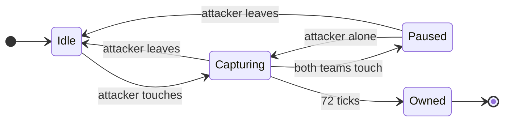
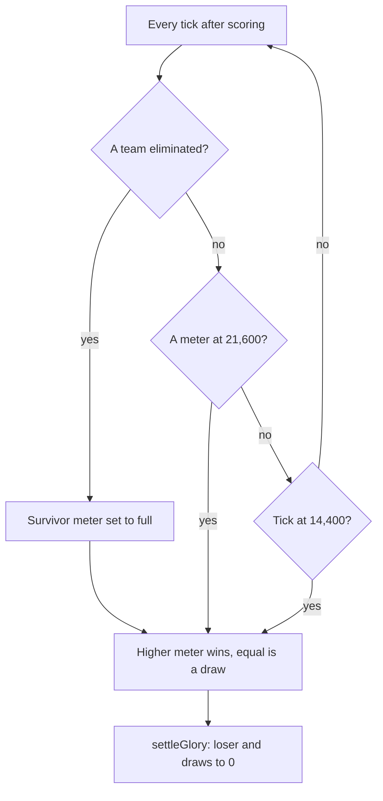
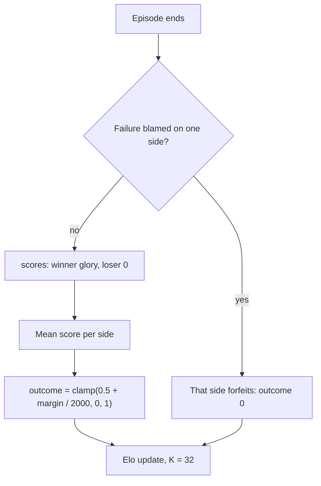
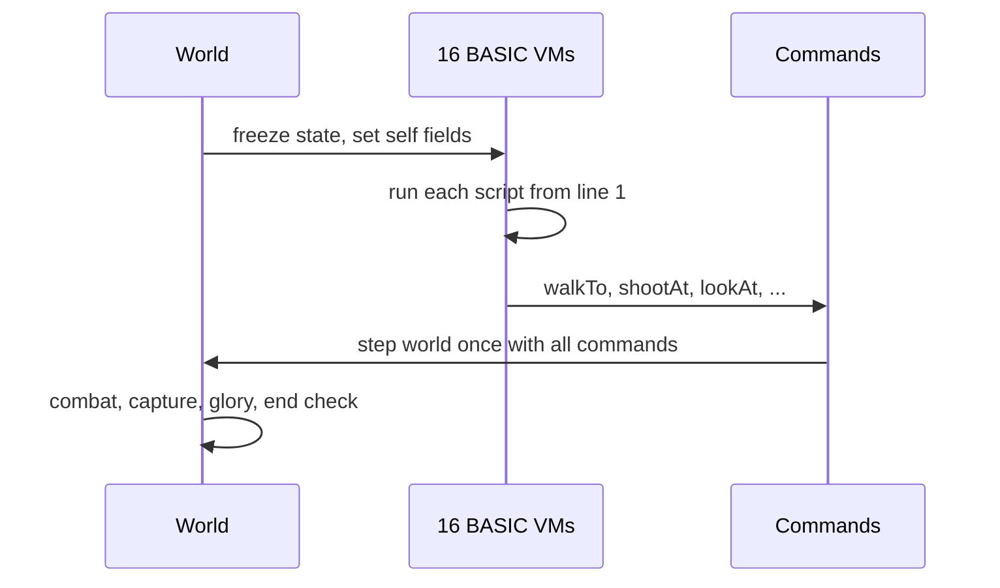
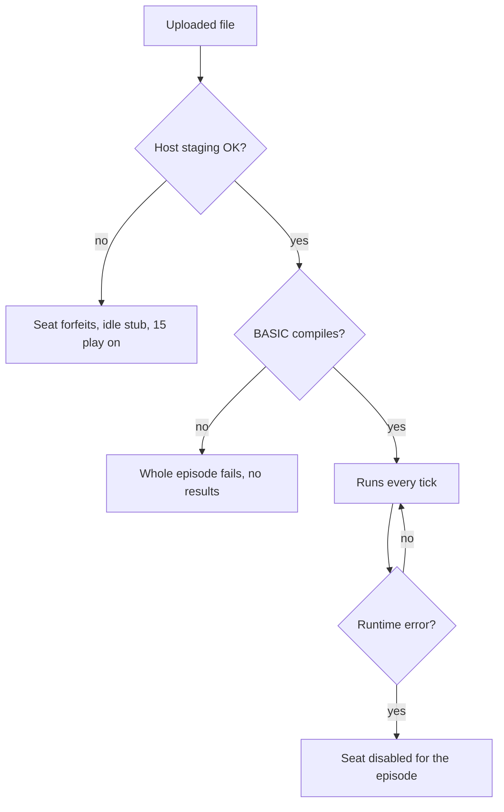

# Paintbot PW: an onboarding guide

Research report · Revised 2026-09-29 · for James, before choosing the first Paintbot PW policy. Researched against paintbot-pw `d0728ab1` (`coworld-v0.3.79`, repo Metta-AI/paintbot-pw), the build the league runs on 2026-09-29. Live recordings are stamped rules 48, whose only change is FFA-kin fog, so the teams game plays rules 47.

## Executive summary

Paintbot PW is Paintbot rebuilt inside Polyworld, a deterministic Nim game engine. Sixteen cogs (the game's name for its small wheeled robots, one per seat) in two teams of eight (Red on even seats, Blue on odd) fight over ten heart towers on an island called Heartwick. Every seat is a small BASIC program that the game itself runs once per tick, so a "player" is a text file, not a container or a network client. Standing next to a heart for three seconds captures it, owned hearts fill the team's meter, and the first team to 900 meter points wins, or the higher meter at ten minutes; a team with every cog out of lives loses at once. Combat is short and lethal: three hit points, four lives, a one-shot-per-second paint gun, friendly fire on, and a vision cone that only sees forward. In the league, 78 of 80 recent matches ended by elimination, with a median length of 82 seconds.

The most important fact for strategy is that the winner and the score are different things. The heart meter decides who wins, but the number the platform receives is **glory**: 600 minus one per elapsed second, plus four small awards, and set to zero for the loser and for both sides of a draw. Since 2026-09-28 evening the league's Elo counts the **glory margin**, not just the result: each episode scores `clamp(0.5 + (our glory − their glory) / 2000, 0, 1)`, so a 500-glory win is worth 0.75, a 0-glory win is a draw, and losing fast costs more than losing slow. Speed is therefore rank. The policy language is a tiny integer-only BASIC with a generous per-tick budget (50,000 instructions; `base.bas` peaks at 9,116), fog-gated observations, and a handful of actions. The engine changes several times a day, but its replays re-simulate across versions, and the lab has a hash-checked tool chain (`pw.py`) that turns any episode into tables, metrics and reports.

## Contents

1. [What Paintbot PW is, and what it is not](#1-what-paintbot-pw-is-and-what-it-is-not)
2. [A match from start to finish](#2-a-match-from-start-to-finish)
3. [Winning versus scoring: glory](#3-winning-versus-scoring-glory)
4. [Combat and the battlefield](#4-combat-and-the-battlefield)
5. [How a policy runs](#5-how-a-policy-runs)
6. [The BASIC dialect](#6-the-basic-dialect)
7. [What a policy can see and do](#7-what-a-policy-can-see-and-do)
8. [How policies fail](#8-how-policies-fail)
9. [The starter policies](#9-the-starter-policies)
10. [The other two lanes: advisor oracle and neural BASIC](#10-the-other-two-lanes-advisor-oracle-and-neural-basic)
11. [Engine nuances and traps](#11-engine-nuances-and-traps)
12. [The field today](#12-the-field-today)
13. [Investigating the game: the lab's tools](#13-investigating-the-game-the-labs-tools)
- [Appendix A: Heartland (FFA-kin mode)](#appendix-a-heartland-ffa-kin-mode)
- [Appendix B: Host API reference](#appendix-b-host-api-reference)
- [Appendix C: Evidence and analysis commands](#appendix-c-evidence-and-analysis-commands)
- [Appendix D: Sources](#appendix-d-sources)

## 1. What Paintbot PW is, and what it is not

- A separate coworld, `paintbot-pw`, with its own source repo (`Metta-AI/paintbot-pw`), league, forum and wiki.
- Built on Polyworld, the same Nim engine family as Gods of the Arena. It is not the Season 1 capture-the-heart shooter or the Season 2 battle royale that `paintbot_lab` covers.
- `player_runtime: game-hosted`: you upload one BASIC file (or a neural-BASIC ZIP), and the game runs it. There is no player container and no network protocol to speak.
- One league on this coworld, the teams ladder `paintbot-pw`. Heartland, the free-for-all "kin" mode, became its own coworld on 2026-09-28 (Appendix A).

The Paintbot name covers three different games on the platform, and it is easy to carry assumptions across them. The older `paintbot` coworlds are the Season 1 capture-the-heart shooter and the Season 2 battle royale with WASM "plays"; the lab's Stencil player targets those (`paintbot_lab/README.md`). Paintbot PW keeps the look (paintball, cogs, hearts) but reimplements the game in Polyworld with different rules, a different player format and a different replay format, so nothing from `paintbot_lab` carries over without re-checking (`paintbot_pw_lab/AGENTS.md`).

The source repo is a standalone copy of Polyworld whose history starts at "initial import of polyworld code" (2026-08-25); the game itself lives in `examples/paintbot/` (about 14,400 lines of Nim at `d0728ab1`) with the hosting glue in `coworld/paintbot/`. The deployed manifest points at the bare repo URL with no commit, so the only link from a release to its source is the release tag `coworld-v<version>`, which the lab's `pw.py deployed-ref` resolves (`paintbot_pw_lab/tools/deployed_ref.py`).

**How to upload.** The manifest's player protocol accepts "one raw UTF-8 BASIC source file or a neural BASIC ZIP containing manifest.json, policy.bas, and model.bin" (`reference/manifest-0.3.80.json`, `game.protocols.player`). WASM was accepted until version 0.3.33 and now forfeits the seat (`coworld/paintbot/runtime/host.py:43-53`).

## 2. A match from start to finish

- 16 seats in every paintbot-pw match; team = seat mod 2. Even seats are Red ("Ember"), odd seats are Blue ("Azure").
- 24 ticks per second; a teams match is at most 14,400 ticks (10:00).
- Ten equal hearts. Each team starts owning one; eight start neutral.
- Capture takes 72 ticks (3 s) of uncontested presence within 140 units; more cogs do not speed it up.
- A team's meter gains one tick-point per owned heart per tick. 21,600 tick-points wins; the viewer shows this as 900 points (tick-points ÷ 24), which is five hearts held for three minutes.
- A team with no cog alive and no lives left is eliminated, and the other team's meter fills at once. This is how almost every league match ends.

### Seats and teams

Team membership is simply `slot mod 2` (`examples/paintbot/sim.nim:230`). Since rules 46 (0.3.75) the seat count is set per match from the game config's roster, one seat per player token, and the engine accepts 2 to 256 (`examples/paintbot/game.nim:445-447`, `examples/paintbot/kinship.nim:12-30`). The paintbot-pw config schema still requires exactly 16 tokens, so every paintbot-pw match has 16 seats; other sizes exist only in local runs and in Heartland (`paintbot_pw_lab/docs/mechanics.md`, section 2). The manifest lets a config label seats with teams, but the engine never reads those labels (`examples/paintbot/game.nim:425-436`). In the league each episode pairs two policies, one filling all eight even seats and the other all eight odd seats, so a team is eight copies of one file (`paintbot_pw_lab/docs/field.md`, match configuration). Seats decide in slot order, but each even/odd pair swaps order on odd ticks so neither team always moves first (`examples/paintbot/mechanics.nim:526-533`).

### Hearts and capture

A cog "touches" a heart when it is alive, within 140 units (1.4 m, since one unit is one centimetre), and has a walkable line to it with no height step over 25 units per 20-unit sample (`examples/paintbot/mechanics.nim:335`, `examples/paintbot/sim.nim:346-356`). Capture progress follows a small state machine.


Figure 1 — Heart capture in the teams game. Progress rises by one per tick while capturing. "Attacker leaves" also covers the case where only the owner remains. Ownership flips straight to the attacker; there is no neutral step, and a different attacking team starts again from zero.

Source for Figure 1: `examples/paintbot/mechanics.nim:337-356`. The paused state is rare in practice: 12 contests in 80 league episodes, since both teams must stand within 140 units of the heart at once while guns reach 5,250 (`paintbot_pw_lab/docs/reports/2026-09-29-league-field-analysis.md`, section 4). Territory, the coloured nearest-heart region on screen, has no mechanical effect in the teams game; its speed and accuracy boost only exists in Heartland (`examples/paintbot/sim.nim:1370-1378`, `1385`). Heart positions, owners and capture progress are public to every script (section 7).

### Lives and spawning

Each cog has 3 base hit points and 4 lives: the first life plus three respawns (`examples/paintbot/sim.nim:72`, `examples/paintbot/mechanics.nim:146`, `444`). A dead cog respawns after 72 ticks with 36 ticks of spawn protection, and death wipes its grenade, spray can, armor and disguise (`examples/paintbot/sim.nim:23`, `782`, `examples/paintbot/mechanics.nim:445-447`). A team that owns hearts respawns within 350 units of one of them, chosen by a softmax that favours hearts far from living teammates; a team that owns none respawns in its end zone (`examples/paintbot/sim.nim:740-812`).

### How a match ends


Figure 2 — The three ways a teams match ends. All three pass through the same comparison and the same glory settlement.

Every ending runs through one line that sets the winner from the meters and then calls `settleGlory` (`examples/paintbot/mechanics.nim:782-795`). Elimination is decisive because the survivor's meter is raised to full first. Mutual elimination on the same tick compares the meters as they stand (`examples/paintbot/mechanics.nim:789-794`). In 80 league episodes of 0.3.79, 78 ended by elimination, 2 by a full meter and none at the time limit or in a draw (`paintbot_pw_lab/docs/reports/2026-09-29-league-field-analysis.md`, section 3).

## 3. Winning versus scoring: glory

- The meter picks the winner. The **score** is glory, and only the winning team keeps it.
- Glory starts at 600 (the match length in seconds) and falls by 1 per second, floored at 0.
- Four awards add to it in the league config: +10 per 30 s with no team pickup, +20 per glory heart (a temporary bonus pickup, not a control heart), +5 per life behind per 5 s, and +10 per extra cog out of the match per 5 s.
- League Elo counts the glory margin: each episode scores `clamp(0.5 + (our glory − their glory) / 2000, 0, 1)`, so every point of winning glory moves rank.
- Consequences: a fast win is worth more than a slow one, a loss to a fast winner costs more than a loss to a slow one, and a win whose glory has run out to 0 counts as a draw.

### The two numbers

| | Heart meter | Glory |
| --- | --- | --- |
| Starts at | 0 | 600 for a 14,400-tick match (`examples/paintbot/sim.nim:863-865`) |
| Changes | +1 per owned heart per tick (`examples/paintbot/mechanics.nim:777-778`) | −1 per second, floor 0, plus awards (`examples/paintbot/sim.nim:934-959`) |
| Role | Decides the winner and ends the match at 21,600 | Reported as every seat's score |
| At the end | Higher wins, equal draws | Loser set to 0; a draw sets both to 0 (`examples/paintbot/sim.nim:1009-1013`) |

Glory is what `scores[i]` reports: the glory of seat *i*'s team (`examples/paintbot/sim.nim:1023-1024`). The engine comment states the design intent: glory is "a self-imposed handicap: nothing that makes a team more likely to win pays it" (`examples/paintbot/sim.nim:28-30`), and the awards read that way.

### The awards

| Award | Rule | League value | Source |
| --- | --- | --- | --- |
| Countdown | −1 every 24 ticks | — | `examples/paintbot/sim.nim:943-944` |
| Quiet supplies | +`quiet_supplies` when no teammate has taken a pickup for `quiet_supplies_seconds` | +10 per 30 s | `examples/paintbot/sim.nim:946-949` |
| Behind in lives (rules 39+) | every `behind_lives_seconds`, the team with fewer total lives earns `behind_lives` per life of difference | +5 per life per 5 s (engine default 1) | `examples/paintbot/sim.nim:922-926`, `950-954` |
| Behind in cogs (rules 47+) | every `behind_cogs_seconds`, the team with more cogs out of the match (dead, no lives left) earns `behind_cogs` per extra cog out | +10 per cog per 5 s (engine default 1) | `examples/paintbot/sim.nim:928-932`, `955-959` |
| Glory heart | first living cog within 120 units of a glory heart earns `heart` for its team | +20 | `examples/paintbot/sim.nim:974-1007` |

A **glory heart** is a temporary bonus pickup, not one of the ten control hearts that decide the match. The shared word is the game's naming, and the two have nothing else in common.

Three details matter for any policy that wants glory. The quiet-supplies clock resets only when a teammate actually *takes* a pickup, and pickups are only taken when useful (a medkit only when hurt), so walking over a medkit at full health does not reset it (`examples/paintbot/mechanics.nim:542-558`). Glory hearts spawn in mirrored pairs from 0:20, every 10–20 s, live 30 s, and are hidden by fog like other pickups (`examples/paintbot/sim.nim:36-43`, `974-1007`). Every teams variant sets `"glory": {"behind_lives": 5, "behind_cogs": 10}` (the raise from 5 to 10 is commit `0ff41d2`, shipped in 0.3.77), and all 80 league tapes of rounds 2382–2388 carry exactly this config (`paintbot_pw_lab/docs/mechanics.md`, section 1.2). The repo's `local.py` cannot set glory and plays the engine defaults (1 and 1); the lab's `pw.py local` and `paintbot-headless --glory:<json>` play the league values (`paintbot_pw_lab/docs/evidence-pipeline.md`, section 6). A script can read the scoreboard: `glory(team)`, `teamLives(team)`, `teamCogsOut(team)` and the configured award values `awardBehind()`, `awardBehindSeconds()`, `awardBehindCogs()` and `awardBehindCogsSeconds()` (`examples/paintbot/bots.nim:254-273`).

### From episode score to league rank


Figure 3 — How the league turns an episode into a rating change. The glory margin reaches the rating: a 500-glory win counts 0.75, a 0-glory win or a draw counts 0.5.

The ladder's Elo code compares the two sides' mean scores and, because the league sets `margin_scale: 1000`, credits the score margin rather than a plain win, draw or loss (`packages/observatory-competitions/src/observatory_competitions/v2/ladders/rankings/elo.py:181-187`, in metta). The live league settings are `k_factor 32`, `initial_rating 1500`, `round_scoring_rule mean`, `margin_scale 1000` (`paintbot_pw_lab/docs/field.md`, ranking). The ladder used plain win/draw/loss until `margin_scale` was set on 2026-09-28 evening (metta commit `6304974ffa`). If an episode fails and the failure is attributed to one policy, that side takes an outcome of 0 regardless of margin (`elo.py:174-179`). Since the loser's glory is always 0, the outcome is `0.5 + winning glory / 2000` for a win and `0.5 − their winning glory / 2000` for a loss:

| Episode result | Outcome for us |
| --- | --- |
| Win with 950 glory | 0.975 |
| Win with 500 glory | 0.75 |
| Win with 300 glory (a 5:00 win, no awards) | 0.65 |
| Win with 0 glory (a slow win whose glory ran out) | 0.5, a draw |
| Draw (both sides 0) | 0.5 |
| Loss to a 500-glory winner | 0.25 |
| Our policy's failure attributed to us | 0 (forfeit) |

Source: `paintbot_pw_lab/docs/mechanics.md`, section 1.3. The practical reading:

- **Speed is rank.** Each second of match time costs 1 glory, which is 0.0005 of Elo outcome. In 80 league episodes of 0.3.79, winners scored 458–996 glory, median 544, a mean outcome of about 0.78; the winning glory was start 600, countdown −88, and all awards together +42 (glory hearts +15.5, behind in lives +16, behind in cogs +7.9, quiet supplies +3) (`paintbot_pw_lab/docs/mechanics.md`, section 1.4; `paintbot_pw_lab/docs/reports/2026-09-29-league-field-analysis.md`, section 3).
- **Losing fast costs more than losing slow.** Delaying an opponent's win reduces the rating loss even when the loss is certain.
- **The two "behind" awards pay the team that is losing the fight, and only count if it still wins.** A team 3 cogs down for a minute earns 12 × 30 = 360 glory from cogs alone. In the league sample the losers' pre-settle glory averaged 518 from lives and 294 from cogs, all zeroed at the end; the one 996-glory win was a team that trailed and then won on the meter (`paintbot_pw_lab/docs/mechanics.md`, section 1.4).
- **Supplies cost glory.** Every pickup a teammate takes forfeits the running quiet stretch (+10 per 30 s).
- **Win rate and glory are different questions.** A policy that wins 60% slowly can rank below one that wins 50% fast, which is why the lab's A/B metric is the per-episode outcome above.

## 4. Combat and the battlefield

- One unit is one centimetre. Bodies have a 55-unit radius and move 28 units per tick.
- The gun: 5-tick windup, then a hitscan ray to 5,250 units; one shot per second; **friendly fire on**. It makes 95% of enemy kills in the league.
- Spray cans replace the gun and are never used up. Grenades fly over walls and hurt everyone in the blast, the thrower included.
- Armor or standing in a trench **triples** gun cooldown.
- Vision is a 120° forward cone with unlimited range, blocked by terrain. Sound gives only a direction and a distance band.

### Movement and terrain

A cog moves 28 units per tick; sneaking halves that, water quarters it, and leaving a trench is five times slower per axis (`examples/paintbot/sim.nim:18`, `examples/paintbot/mechanics.nim:627-639`). Bodies block everyone, and a blocked cog sidesteps (`examples/paintbot/sim.nim:731-739`, `examples/paintbot/mechanics.nim:645-658`). The engine pathfinds for you on a one-metre grid in which lake cells cost four times as much; since rules 45 it also routes into water when the goal itself is wet, which is what makes the lake heart reachable (`examples/paintbot/sim.nim:1219-1369`). Heartwick's playable area is 160 × 96 m, symmetric under a half turn about (3200, 2000), with an inland lake (`examples/paintbot/sim.nim:331-338`).

### Weapons

| Weapon | How it fires | Damage | Notes |
| --- | --- | --- | --- |
| Paint gun (default) | `shootAt` starts a 5-tick windup with the aim locked relative to the shooter; then a ray samples every 20 units to 5,250 | 1 to the first body within 55 units of the ray | Cooldown 24 ticks, 72 with armor or in a trench (`examples/paintbot/mechanics.nim:683-736`). The code also checks a heart-carrying flag, but nothing sets it under rules 47 |
| Spray can | `shootAt` starts a 5-tick burst; next burst 13 ticks later | 3 per victim per burst, in a cone to 850 units with half-width 4/5 of the distance | Replaces the gun until death; never used up (`examples/paintbot/mechanics.nim:674-682`, `506-516`, `743-750`) |
| Grenade | `chargeGrenade(1)` each tick adds charge up to 24; stop to throw. Range 197–1,280 units (charge is clamped to at least 1); lands 10 ticks later | 3 in the open, 6 in the landing trench, 2 in another trench, radius 360 + 55 | Hurts allies and the thrower (`examples/paintbot/mechanics.nim:480-504`, `664-673`) |

All gun targets in one tick are chosen before any damage, so two cogs can kill each other on the same tick (`examples/paintbot/mechanics.nim:737-739`). Spread from the gun is small: at 20 m the random error is at most about 24 units on level ground, less than a body radius, so most misses come from the target moving during the windup (inferred from the jitter bound, `examples/paintbot/mechanics.nim:60-63`, `691-701`). This is why the baseline policy leads its target and dodges in short legs (section 9). The league plays mostly with the gun: of 3,828 enemy kills in 80 episodes, 3,621 (95%) were gun kills, 164 grenade and 43 spray, and grenades also caused 100 self-kills (`paintbot_pw_lab/docs/evidence-pipeline.md`, section 5).

### Pickups, trenches and disguises

| Pickup (`pickupKind`) | Taken when | Effect | Respawn |
| --- | --- | --- | --- |
| 0 grenade | not holding one | carry one grenade | 5 s |
| 1 spray | not holding one | replaces the gun until death | 30 s |
| 2 medkit | hurt | full HP | 30 s |
| 3 armor | armor < 3 | 3 armor HP absorbed first; triples gun cooldown | 30 s |
| 4 uniform | not disguised, not attacking | disguise | 30 s |

Source: `examples/paintbot/mechanics.nim:535-561`. There is no pickup action: a cog takes a ready pickup automatically when it comes within 120 units and the "taken when" condition holds, so a policy collects items by walking to them and avoids them by walking around them. Heartwick has 16 pickups (2 uniforms, 4 grenades, 2 sprays, 2 armors, 6 medkits) and 6 trenches, verified from the engine's map export and from every take in 80 league episodes (`paintbot_pw_lab/docs/reports/2026-09-29-league-field-analysis.md`, section 7). Trenches are walkable pits that are slow to leave, give 70% protection from gunfire fired from outside the trench, and make grenades deadly inside them (`examples/paintbot/mechanics.nim:719-721`). A uniform makes a cog appear to every other script as the seat `slot xor 1` on the other team, until it fires, sprays, releases a grenade or dies; scoring and heart ownership always use the true team (`examples/paintbot/sim.nim:301-311`).

### Vision and hearing

Each cog sees a 120° cone centred on its current aim point, with unlimited range, blocked by cover and terrain from an eye height of 120 units (`examples/paintbot/sim.nim:704-730`). The aim point persists between ticks and is set by `lookAt`, `shootAt`, or by `walkTo` when no aim call is made that tick (`examples/paintbot/mechanics.nim:617-621`). A cog therefore sees only where it faces, and walking somewhere turns it to face the way it walks. Team-wide shared vision exists as an opt-in rule, but no deployed variant enables it.

Sound cues come from footsteps (1,000 units, not while sneaking), gunfire (3,500), explosions (5,000) and spray (1,800). A cue carries only its kind, one of eight compass sectors, a distance band and its age, never who made it (`examples/paintbot/mechanics.nim:29-58`). Speech is different: a `shout` reaches every living cog within 12.8 m on **both** teams, and the listener gets the speaker's exact position (`examples/paintbot/bots.nim:166-168`, `508-517`).

## 5. How a policy runs

- One file per seat, one virtual machine (VM) per seat, no shared memory. Eight copies of your file play one team.
- Every tick, each living seat runs its script **from the top**. Dead cogs do not run.
- Global variables and arrays persist across ticks; the string pool and the per-tick command do not.
- All 16 scripts read the same frozen world, then the world steps once with all their commands.
- The engine carries some intent between ticks: the walk goal and the aim point persist, the trigger does not.


Figure 4 — One tick. Scripts never see another seat's action from the same tick, because every read comes from the frozen state.

Sources: `examples/paintbot/bots.nim:464-506`, `examples/paintbot/game.nim:520-539`. The VM's `restart()` clears registers and budgets but keeps globals and arrays (`src/polyworld/basic.nim:2267-2279`). That makes one-time setup a flag check at the top of the file, as in `base.bas`:

```basic
if started = 0 then
  started = 1
  rngState = selfId * 4099 + 977
  lastX = selfX
  lastY = selfY
end if
myVX = selfX - lastX
myVY = selfY - lastY
```

### What persists between ticks

Commands are cleared every tick (`examples/paintbot/bots.nim:468`), but the cog itself remembers some state (`examples/paintbot/mechanics.nim:617-621`):

| Call | Persists? |
| --- | --- |
| `walkTo(x, y)` | Yes. The cog keeps walking to the goal until a new `walkTo` or a respawn. |
| `lookAt(x, y)` / `shootAt(x, y)` aim | Yes. The aim point, which is also the centre of the vision cone. |
| `shootAt` trigger | No. Call it on the tick you want to fire. |
| `chargeGrenade(1)` | No. The charge is kept, but a tick without the call **throws** the grenade. |
| `sneak(1)` | No. Call it every tick. |

The grenade row is a trap worth remembering. A script that charges a grenade and then takes a branch that skips the `chargeGrenade(1)` call on the next tick throws it in whatever direction it happens to be aiming.

## 6. The BASIC dialect

- Polyworld's own BASIC: signed 32-bit integers only, `IF`/`WHILE`/`SUB`, fixed arrays, `PRINT`.
- No `FOR`, no user-defined functions with return values (only `SUB`; the host's own calls such as `controlX(i)` do return values), no built-in math (`ABS`, `SQR`, `RND`), no floating point, no strings except as handles.
- Integer overflow wraps silently. Division by zero and an array index out of range are runtime errors that disable the seat.
- Per-decision budget: 50,000 instructions and 125,000 work units. `base.bas` peaks at 9,116 instructions (18%). The guide and the starter headers still say 20,000.
- Hard caps: 128 KiB source, 512 globals, 4,096 array elements in total, call depth 16.

The dialect is small enough to list whole. The reserved words are `and call dim else end exit false gosub goto if let mod not or print rem return stop sub then true wend while xor`; `goto` and `gosub` are reserved but compile to nothing (`src/polyworld/basic.nim:551-559`, `1706-1774`).

| Feature | Behavior |
| --- | --- |
| Values | Signed int32. `+ - *` wrap on overflow; `/` and `MOD` truncate toward zero (`src/polyworld/basic.nim:946-986`). |
| Precedence, low to high | `OR XOR`, `AND`, comparisons, `+ -`, `* / MOD`, unary `- + NOT`. **`NOT` binds tighter than `=`**, so write `NOT (a = b)` (`src/polyworld/basic.nim:1015-1035`). |
| Variables | Global, created on first use, start at 0. Sub parameters are local; anything else assigned in a `SUB` is global (`src/polyworld/basic.nim:917-936`). |
| Arrays | `DIM name(N)` at top level with a literal bound, inclusive: `DIM a(15)` has 16 cells (`src/polyworld/basic.nim:677-706`). |
| Control flow | `IF cond THEN` … `[ELSE]` … `END IF`; `WHILE cond` … `WEND` (`src/polyworld/basic.nim:1635-1687`). |
| Subroutines | `SUB name(a, b)` … `END SUB`, no return values: return results through globals (`src/polyworld/basic.nim:713-779`). |
| Printing | `PRINT "a"; x` to the seat's private log; 1,024 bytes and 128 print events per decision, or the seat is disabled (`src/polyworld/basic.nim:1604-1631`, `examples/paintbot/bots.nim:160`). |

Because there is no square root, `base.bas` carries its own integer Newton's-method `isqrt`, which "returns" its result in the global `root`. The same pattern (a `SUB` that writes a global) is how every helper returns a value.

### A complete minimal policy

The smallest useful policy fits on one screen. It sends every cog to the nearest heart its team does not own and shoots the nearest visible enemy:

```basic
' Minimal Paintbot PW policy: go to the nearest heart we do not own,
' and shoot the nearest enemy we can see.
target = -1
best = 2147483647
i = 0
while i < heartCount()
  if controlOwner(i) <> selfTeam then
    dx = (controlX(i) - selfX) / 10
    dy = (controlY(i) - selfY) / 10
    if dx * dx + dy * dy < best then
      best = dx * dx + dy * dy
      target = i
    end if
  end if
  i = i + 1
wend
if target >= 0 then
  walkTo(controlX(target), controlY(target))
end if

foe = -1
best = 2147483647
i = 0
while i < 16
  if i mod 2 <> selfTeam and visible(i) then
    dx = (playerX(i) - selfX) / 10
    dy = (playerY(i) - selfY) / 10
    if dx * dx + dy * dy < best then
      best = dx * dx + dy * dy
      foe = i
    end if
  end if
  i = i + 1
wend
if foe >= 0 then
  shootAt(playerX(foe), playerY(foe))
end if
```

Three habits of the dialect show up even here. Distances are divided by 10 before squaring, which keeps the arithmetic safe on the big generated maps, where a difference of 50,000 units squared overflows int32 (on Heartwick it cannot). Team membership is read from the seat number (`i mod 2`); like `playerTeam`, this is fooled by a uniform, because a disguised enemy answers to a teammate's seat number. The script reruns from the top every tick, so it never needs a main loop.

This policy compiles and runs. In four local matches run for this report against `base.bas` at 0.3.79 with the league glory config (seeds 2026 and 2027, each policy once on each side, alternating `--bot` seats, hash-checked with `pw_trace`), `base.bas` won all four by eliminating the minimal team between ticks 1,245 and 1,418, under a minute, and held 4 or 5 hearts to 1 at the end. The winners kept 541–569 glory; the minimal team had earned 860–1,160 glory from the behind awards, all of it zeroed by the loss, which is section 3's point in miniature. That gap is the reason to start from `base.bas` rather than from scratch.

### Budgets

| Limit | Value |
| --- | --- |
| Source | 128 KiB |
| VM instructions per decision | 50,000 |
| Work units per decision | 125,000 |
| Memory | 2 MiB |
| Array elements in total | 4,096 |
| Globals | 512 |
| Call depth | 16 |
| String pool | 1,024 handles, 64 KiB |

Source: `examples/paintbot/bots.nim:147-160`. The instruction and work budgets scale with the seat count only above 16 seats (`50,000 × seats / 16`, `examples/paintbot/bots.nim:156-158`), so every paintbot-pw match uses the numbers above. Work units are a second meter: most VM operations cost 1–9 and each host call costs a fixed amount, usually 4, with speech and string operations at 68 (section 7). The check happens at the start of each basic block, so a block that would overrun fails before it runs (`src/polyworld/basic.nim:2447-2458`). Measured at `d0728ab1` over 11 local seeds, `base.bas` peaks at 9,116 instructions (18% of the budget) and 15,538 work units (12%), and `jev.bas` without an oracle at 13,909 and 21,140; the guide's older "5,670 / 8,722" is out of date (`paintbot_pw_lab/docs/reports/2026-09-29-league-field-analysis.md`, section 8). Setting `PW_BASIC_PEAKS=1` on a local run prints each seat's peaks (`examples/paintbot/game.nim:552-557`).

## 7. What a policy can see and do

- **Always public**: heart positions, owners, capture state, both teams' glory, lives and cogs out, the match's award settings, map geometry (bounds, height, water, trenches), pickup station count.
- **Fog-gated**: other cogs, ready pickups and glory hearts, visible only inside your cone.
- **Actions**: `walkTo`, `lookAt`, `shootAt`, `chargeGrenade`, `sneak`, and `shout`.
- A disguised enemy answers to the seat number it impersonates. `heardX/Y` give a speaker's exact position.
- Every query returns −1 (or 0 for HP) when hidden or invalid, so a hidden cog and a missing one look alike.

The host API is a set of named read-only values and functions, all returning int32 (`examples/paintbot/bots.nim:161-381`). Coordinates are world units, and "Y" is the second horizontal axis, which the engine internally calls `z`. The full list is in Appendix B; the shape of it is:

| Group | Examples | Visibility |
| --- | --- | --- |
| Self | `selfId`, `selfTeam`, `selfX/Y`, `selfHp`, `armorHp`, `livesLeft`, `hasGrenade`, `hasSpray`, `grenadeCharge`, `trenchId`, `worldTick`, `homeX/Y` | Own state |
| Other cogs | `visible(slot)`, `playerX/Y/Hp/Team(slot)`, `nearAgents(radius)` and `nearAgentId/X/Y/Hp/Team(k)` | Cone only |
| Hearts | `heartCount()`, `controlX/Y/Owner(i)`, `controlCaptureTeam/Ticks(i)`, `controlContested(i)` | Public |
| Scoreboard | `glory(team)`, `teamLives(team)`, `teamCogsOut(team)`, `awardBehind()`, `awardBehindSeconds()`, `awardBehindCogs()`, `awardBehindCogsSeconds()` | Public |
| Pickups | `pickupCount()`, `pickupVisible/X/Y/Kind(id)`, `gloryHeartCount()`, `gloryHeartX/Y/TicksLeft(id)` | Cone only (counts public) |
| Map | `mapMinX/Y()`, `mapMaxX/Y()`, `terrainHeight`, `waterAt`, `trenchAt`, `trenchCount/X/Y/W/H` | Public |
| Actions | `walkTo`, `lookAt`, `shootAt`, `chargeGrenade`, `sneak` | — |
| Speech and sound | `shout(handle)`, `heardCount/Slot/X/Y/Text`, `soundCount/Kind/Direction/Distance/Age` | Speech within 12.8 m, both teams |

Several details shape how scripts are written:

- **You cannot read your own gun cooldown.** `base.bas` keeps its own countdown (`gunWait`) and resets it on respawn.
- **A respawning pickup looks the same as one out of view.** Both return −1, so policies remember sightings with a timestamp.
- **`nearAgents` is cheaper than looping `visible(i)`** in large games; the repo's `players/nearby.bas` is `base.bas` rewritten that way (guide line 129).
- **The scoreboard calls are recent.** `teamLives` arrived in 0.3.72 and `teamCogsOut` with the award getters in 0.3.75 (rules 47); all read −1 in FFA-kin (`paintbot_pw_lab/docs/policy-surface.md`, section 5.3). `base.bas` reads none of them.
- **Six fields are dead.** `carrying`, `heartX/Y`, `ownHeartX/Y`, `ownHeartStolen` and `playerCarrying` belong to the capture-the-flag rules before rules 13; under rules 47 nothing sets `carrying`, so they read fixed values (`examples/paintbot/mechanics.nim:822`). `base.bas` still reads `playerCarrying`, which is harmless but misleading.

## 8. How policies fail

- A **file the host rejects** (WASM, over 128 KiB, not UTF-8, a neural ZIP that fails its checks) forfeits only that seat; the other 15 play on.
- A **BASIC compile error** fails the **whole episode**: no results for anyone.
- A **runtime error** (budget overrun, divide by zero, bad index, print limit) disables that seat for the rest of the episode. The match continues.
- A disabled cog keeps walking to its last goal but never shoots again, and still counts toward team lives.
- In the league, **3 consecutive failures disqualify** an entry, and a failure attributed to one policy is an Elo forfeit (outcome 0).


Figure 5 — Where a policy can fail and how far the damage spreads.

| Failure | Consequence | Evidence |
| --- | --- | --- |
| Host rejects the file | Seat forfeits; idle stub; episode scores normally | `coworld/paintbot/runtime/host.py:96-124` |
| Compile error (syntax, unknown name, FFA-only call in the teams game) | Engine writes `failure.json` naming the slot and stops without results | `examples/paintbot/bots.nim:417`, `src/polyworld/coworld.nim:215-233` |
| Neural model rejected at load (wrong dimensions or contract, over the operation budget) | Seat never runs, not even its BASIC | `examples/paintbot/bots.nim:404-415`, `420` |
| Runtime error | Seat disabled; "BASIC error: …" in its log; status "BASIC VM disabled" | `examples/paintbot/bots.nim:502-504` |

The compile-error row is the one to respect. Locally, a seat with a syntax error produced `{"message":"BASIC compilation failed for player slot 1","failed_policy_index":1}` and no results, and `local.py` then waited out its ten-minute deadline (`paintbot_pw_lab/docs/evidence-pipeline.md`, section 2.4). The failure names a policy index, so the league can plausibly attribute it to the uploading side, which the Elo code scores as a forfeit (`elo.py:174-179`); this attribution has not been observed live. The league also disqualifies an entry after 3 consecutive failures (`paintbot_pw_lab/docs/field.md`, match configuration), so only submit a version that has completed hosted episodes. The guide's statement that "the episode still starts" when a seat fails is true only for host-side rejections. Calling a Heartland-only function such as `kin()` in the teams game is also a compile error, so one file cannot serve both modes if it calls those names. The lab's `pw.py local compile` checks a file in all 16 seats before upload.

What a disabled cog does next is inferred from the movement code: it issues no new commands, so it keeps walking toward its last goal with its last aim, never fires, and after its next death stands still at its spawn point. It still counts toward its team's lives, so it can be farmed for kills (`examples/paintbot/mechanics.nim:616-623`).

## 9. The starter policies

- `base.bas` (677 lines) is the league baseline and the maintainer's reference design. Start here.
- It is built from habits the maintainer measured one by one: lead the target, never walk straight while seen, move in squads of four, refuse losing fights, route around water.
- Three league champions (zhar, richard, relh) are `base.bas` derivatives, and one (Beta) derives from `jev.bas`.
- `jev.bas` is `base.bas` plus an LLM advisor layer; without an advisor it plays exactly like `base.bas`.
- `base.bas` ignores glory entirely: it takes supplies, never seeks glory hearts, and never reads `teamLives` or `teamCogsOut`.

### `base.bas`

Every cog runs the same file and, every tick, works through ten steps (`reference/base.bas`, summarized in `paintbot_pw_lab/docs/policy-surface.md`, section 6). The copy in `reference/` is the file the league runs at `d0728ab1`; against 0.3.65 it differs only in array sizes and loop caps raised to 64 for the big maps, on the same lines:

1. **Scan** all 16 seats for the best visible enemy within 52.5 m, favouring wounded ones, and count foes within 26 m and friends within 12 m (`base.bas:142-180`).
2. **Squads.** Seats split into two squads of four by `(selfId / 2) mod 8`. Each squad picks the cheapest heart it does not own, measured from a point above or below home, and mirrored for Blue. Two members stand in the ring and two cover from outside. There is no communication: every member computes the same choice from public heart ownership (`base.bas:204-298`).
3. **Supplies.** Remember seen pickups for 10 s and detour for a grenade if unarmed, a medkit if hurt, or armor at full HP, when no enemy is close (`base.bas:300-344`).
4. **Refuse bad fights.** With more foes than friends nearby, head for the heart far from them (`base.bas:346-370`).
5. **Look.** With no target, sweep in a four-way cycle, face the latest speaker, or the last gunfire sector (`base.bas:372-434`).
6. **Footwork.** In contact, walk random 3–9 tick legs across the line of fire, and only fire at the start of a leg long enough to cover the windup (`base.bas:448-493`).
7. **Dry route.** If the line to a target crosses water, detour through the best of six side points (`base.bas:494-564`).
8. **Aim.** Lead the target by six ticks of its last motion, subtract its own drift, and hold fire if a teammate is within 95 units of the line (`base.bas:566-622`).
9. **Grenade.** Charge to match distance (4–12.5 m) unless a teammate is near the target. It does not check its own distance to the blast (`base.bas:634-665`).
10. **Sneak** near the objective when something is heard but nothing seen (`base.bas:667-674`).

The maintainer's own measurements explain why these habits are there. The rebuilt `base.bas` beat the previous baseline 100–0, and removing any single habit lost: aim 3–37, footwork 12–28, refusing fights 12–28, squads 16–24 (guide, "Baseline squads"; not reproduced by us). The dry-route habit was worth 89 of 120 wins against 12 of 60 without it under rules 37, but its edge shrank to 59–41 once rules 38 made the engine's own routing avoid slow water (guide, "Routes that measure time"). In today's league, though, plain `base.bas` play is the bottom tier: its three derivatives score a mean Elo outcome of 0.31–0.61, below the top three champions (section 12).

### `jev.bas` and the Heartland starters

`jev.bas` (2,644 lines) splices an advisor layer into `base.bas`: one cog per squad asks the oracle (section 10) to choose the squad's heart from three candidates, relays the pick by shout ("Alpha, push Forge."), and squadmates adopt it (`reference/jev.bas:1-8`). Because shouts are public within 12.8 m, any enemy in earshot can read the plan. Without an oracle it plays the identical match to `base.bas` (same ticks and final hash in local runs) while spending about 50% more instructions. Its header still claims a 20,000-instruction budget. The Heartland starters `ffa.bas` and `ffa_blind.bas` now live with the separate Heartland coworld (`reference/heartland/` in the lab) and fail to compile in the teams game (Appendix A).

## 10. The other two lanes: advisor oracle and neural BASIC

- **Advisor oracle**: a script can ask an LLM, through the host, to answer yes/no, score or choice questions. Asking never blocks; answers arrive ticks later.
- It is billed to the seat's per-episode LLM spend limit. The paintbot-pw league sets **no cap**; an experience request can set one, and a limit of 0 makes every ask fail.
- **Neural BASIC**: a ZIP of `manifest.json`, `policy.bas` and `model.bin` (up to 16 MiB). The script calls native FP32 inference each tick and hands the output to the engine as its command. 0.3.79 rewrote this lane.
- The #2 champion, `daveey-pw-neural`, plays like no BASIC policy in the field: silent, gun only, almost no pickups, and the best kill/death ratio (1.53).

### Advisor oracle

A seat builds a request during one decision (state fields, notes, questions and criteria), sends it with `oracleAsk()`, stores the returned id in a global, and polls `oraclePoll(id)` on later ticks (`examples/paintbot/oracle.nim:247-340`). One request can be in flight per seat, asks must be at least 24 ticks apart, and the request draft is cleared at the start of every tick (`examples/paintbot/oracle.nim:18`, `100-103`, `297-298`). On hosted leagues the host posts to the platform's LLM sidecar with a two-second deadline, and the cost counts against the seat's per-episode LLM spend limit (`coworld/paintbot/runtime/oracle.py:52`, `105`). The league sets no `episode_player_pod_llm_spend_limit_usd`, which defaults to no cap; an experience request's `episode_player_llm_spend_limit_usd` is split across seats, the stricter limit wins, and a limit of 0 makes the sidecar refuse every call so the oracle answers −1. Whether the platform's default model allowlist admits the oracle's `typesafe/jev-1.13` route, and whether Beta's asks succeed in league play, were not checked (`paintbot_pw_lab/docs/field.md`, LLM budget for the Jev oracle). Every ask and answer is written to the seat's private log. The maintainer measured the Jev advisor winning 20 of 24 full matches against `base.bas` through the hosted route, with about 100 asks per game (guide, "The oracle API").

### Neural BASIC

A neural upload is a ZIP whose `policy.bas` typically makes three calls each tick:

```basic
paintbot_observe(neuralObservation())
run_neural_net(neuralModel(), neuralObservation(), neuralLogits(), neuralState())
paintbot_act(neuralLogits())
```

These cost 512, 16 and 128 work units, must each run at most once per tick in that order, and a misuse disables the seat (`examples/paintbot/neural_host.nim:787-789`, `997-1031`). `paintbot_act` **replaces the whole command** for the tick, so action calls made before it are lost and calls after it amend it. The model's inference may cost at most 4,000,000 counted operations per tick at 16 seats, checked once at load, and its recurrent state resets at match start, on death and on respawn (`examples/paintbot/neural_host.nim:7-12`, `730-735`). The teams game has three observation contracts: v1 with 448 floats, v2 with 506 (adds terrain) and v3 with 514 (adds an 8-float scoreboard: team lives, glory, the behind-in-lives award, quiet supplies and the clock, but not the rules-47 cogs award), plus user-input forms that take up to 128 extra values set from BASIC with `neuralInput` (`examples/paintbot/neural_contract.nim:12-15`, `32-33`, `104-105`). The action contracts emit 82 logits in heads of 51, 25, 2, 2 and 2 (movement, aim, fire, grenade, sneak); contract v2 aims at a lead-compensated point, following `base.bas`'s rule (`examples/paintbot/neural_contract.nim:10-25`). Models come in two formats, a fixed MinGRU (`PWNET001`) and a stack of up to 64 layers from a fixed menu (`PWNET002`), and a schema-2 manifest may add decoder options such as sampling, fire holds for nearby teammates and strafing legs on top of the default argmax (`paintbot_pw_lab/docs/policy-surface.md`, section 5.10). The full contract is in the repo's `examples/paintbot/neural_basic.md` and `neural_actor.md`, and the repo ships a training bridge (`coworld/paintbot/tools/training_bridge.py`).

## 11. Engine nuances and traps

- The game changes several times a day, and league episodes switch to a new release immediately.
- Replays are complete action tapes with a per-tick state hash, and the newest build re-simulates older rules versions exactly.
- The guide disagrees with the code in several places; the code wins.
- `outcome: "time_limit"` means a **draw**, not "the clock ran out".
- Every league episode plays a different seed; the `seed: 2026` in its config is a placeholder.
- Squared distances overflow int32 on the big generated maps.

### A moving target

The repo shipped 54 releases in the eleven days from 0.3.25 (2026-09-18) to 0.3.79 (2026-09-29), 26 of them on 2026-09-28 alone, and rules 34 through 48 each changed something: elimination losses, the mirrored fair map, glory, glory hearts, behind-in-lives glory, stronger grenades, generated maps, team vision, configurable glory, lake-heart wading, per-match seat counts (46), behind-in-cogs glory (47) and FFA-kin fog of war (48) (`paintbot_pw_lab/docs/community.md`, rules cadence table). Deploys are automatic, and some changes are config only: the behind-in-cogs award went from 5 to 10 in 0.3.77 with no rules bump. 0.3.79 changed no teams rule; its engine diff is the neural lane and training-only telemetry, and it added a `controlHeartCount` helper that moved later `mechanics.nim` lines by 8 (`paintbot_pw_lab/docs/mechanics.md`, currency note). The lab pins the engine tag in `tools/release.env`, and `pw.py deployed-ref` compares it with the league's build and lists the rule-bearing files that changed; run it before trusting any rule, including the ones in this report.

### Replays re-simulate across versions

A hosted replay is a `POLYWORLDREPLAY` tape: the seed, every seat's executed command for every tick, a state hash per tick, player names, the full text of every shout, the match config and, from rules 46, the seat count (`src/polyworld/tapes.nim:8-9`, `examples/paintbot/game.nim:94-105`). The header records the rules number, and the simulator keeps every old rules path, so one current build replays older games hash-exactly. The lab's 0.3.79 build re-simulated all 80 hosted rules-48 league tapes and three rules-44 samples with no hash mismatch; in a negative control at 0.3.65, forcing rules 45 on the rules-44 tapes diverged within 26–269 ticks. Hosted images build with Nim 2.2.10 and the lab builds locally with Nim 2.2.6, and all 83 hosted tapes checked so far reproduce (`paintbot_pw_lab/docs/evidence-pipeline.md`, section 3). This differs from Gods of the Arena, whose replays re-simulate only at the exact recording commit. The repo's own `replay_stats` tool does not check hashes, counts hearts held at the end as "captures", and lumps every award except friendly fire into "quiet-supplies", so use the lab's `pw_trace`-based tools instead (`paintbot_pw_lab/docs/evidence-pipeline.md`, section 4).

### Guide versus code

| The guide says | The code says |
| --- | --- |
| 20,000-instruction budget (guide lines 720, 800; `base.bas` and `jev.bas` headers) | 50,000 instructions and 125,000 work units (`examples/paintbot/bots.nim:154-155`) |
| A seat that fails to load forfeits and the episode continues | True only for host-side rejections; a compile error fails the episode |
| `jev.bas` keeps `useRetreat`/`useDial` off (guide line 814) | Both are on in the shipped file (`jev.bas:580-581`) |
| Spray is roughly a 62° cone (guide line 317) | Half-width 4/5 of distance, about 77° (`examples/paintbot/mechanics.nim:23-27`) |
| A "6400 × 4000 arena" (guide line 100) | That is the nominal frame; playable Heartwick is 16,000 × 9,600 units (`examples/paintbot/sim.nim:331-338`) |
| The neural decoder "deterministically selects the largest logit" (guide line 855) | True by default; schema-2 bundles may enable sampling and other decoder options |

Source: `paintbot_pw_lab/docs/mechanics.md`, section 8. The maintainer's `DEPLOYMENT.md` still says every teams variant sets `behind_cogs: 5`, but the manifest and live league episodes say 10. The public wiki is older still: a single copy of the 0.3.25 readme, now 54 releases stale, that still offers WASM uploads and pre-rules-40 weapon numbers (`paintbot_pw_lab/docs/community.md`).

### Smaller traps

- **`time_limit` means draw.** `matchOutcome` returns `"time_limit"` whenever there is no winner, and a match decided on the meter at 10:00 reports `"0"` or `"1"` (`examples/paintbot/game.nim:541-543`).
- **Seeds are per episode.** An episode's `game_config` shows `seed: 2026`, but the platform replaces it before dispatch: each league episode's engine seed is `crc32("<division_id>:<round_index>") mod (2^31 − MAX_PLANNED_EPISODES) + job_index`, so all 80 sampled episodes were different worlds from tick 0. In an experience request an explicit `game_config_overrides.seed` pins every episode to that one world, which for deterministic policies replays the same match; omit it, or use `num_episodes: 1` per seed (`paintbot_pw_lab/docs/field.md`, seeds; `paintbot_pw_lab/docs/reports/2026-09-29-league-field-analysis.md`, section 1).
- **No side advantage in the league.** Odd seats won 43 of 80 (54%, 51% after adjusting for policy strength). Local `base.bas` mirror matches show 71% odd wins, which is a mirror-match effect, so balance sides in local screens but do not model a side effect in league analysis (`paintbot_pw_lab/docs/reports/2026-09-29-league-field-analysis.md`, section 2).
- **int32 on big maps.** `base.bas` claims "23170² exceeds any squared map distance", which is false on `big-twin-mesas` and `big-deep-forest` (about ten times Heartwick's area, with 100 and 126 hearts), where squared distances wrap (inferred from map size). The league plays Heartwick only.
- **Own-grenade damage.** The grenade blast includes the thrower, and `base.bas` does not check its own distance; the league sample had 100 grenade self-kills against 164 grenade enemy kills.
- **Armor slows your gun.** Armor triples gun cooldown while it lasts, so picking it up trades damage output for survival.

## 12. The field today

- One league, eight champions from four human owners plus a system filler, 12 episodes every 10 minutes (about 1,700 a day).
- Leaders on 2026-09-29: Aaron L (#1 and #3), David B, the game's maintainer (#2 neural, #4 Jev advisor), and a new entrant, Andre H (#5). The top three are within 24 MMR.
- Matches end by elimination, fast: median 82 s, winning glory median 544. Speed is what separates the top.
- Nobody has posted strategy: the forum has zero posts, and the wiki is a stale copy of the 0.3.25 readme.
- We have no policy in this game yet. Credits are not a constraint (about 0.2 credits of compute per episode).

| # | Player (owner) | Champion | MMR | Mean Elo outcome (20 episodes) |
| --- | --- | --- | ---: | ---: |
| 1 | Aaron's Co-play Coach (Aaron L) | `aaron-coplay-coach:v8` | 1,820 | 0.68 ± 0.10 |
| 2 | Alpha (David B) | `daveey-pw-neural:v26` | 1,799 | 0.66 ± 0.10 |
| 3 | a-aron (Aaron L) | `aaron-paintbot-pw:v42` | 1,796 | 0.64 ± 0.12 |
| 4 | Beta (David B) | `daveey1-jevbot-v2:v14` | 1,676 | 0.50 ± 0.12 |
| 5 | Andre von Auto (Andre H) | `zhar:v1` | 1,640 | 0.61 ± 0.11 |
| 6 | relh (Richard H) | `relh-paintbot-pw:v1` | 1,573 | 0.31 ± 0.09 |
| 7 | richard (Richard H) | `richard-paintbot-pw:v1` | 1,571 | 0.37 ± 0.11 |
| 8 | paintbot-pw-basic-r22 (system filler) | `paintbot-pw-basic-v22:v1` | 1,485 | 0.23 |

Leaderboard at 2026-09-29 22:58 UTC (round 2388) and mean Elo outcome over 80 episodes of rounds 2382–2388, each champion in 20, ± a 95% half-width (`paintbot_pw_lab/docs/field.md`; `paintbot_pw_lab/docs/reports/2026-09-29-league-field-analysis.md`, section 3). MMR is the league's Elo rating, starting at 1,500, and it belongs to the player, not the policy version: a new version inherits its player's rating. Values from before 2026-09-29 are not comparable (the filler rose from 559 to 1,485 and the top fell from 2,373 to 1,820), which suggests a re-rating after the `margin_scale` change (inference). The live source is `pw.py leaders`.

### How the field plays

Measured on 80 hash-verified league episodes at 0.3.79 (`paintbot_pw_lab/docs/field.md`, how the field plays; method and tables in `paintbot_pw_lab/docs/reports/2026-09-29-league-field-analysis.md`, section 5):

| Lineage | Policies | Style |
| --- | --- | --- |
| Aaron custom | aaron-coplay-coach, aaron-paintbot-pw | h6 > h4 > h2 flank opening, about 15 grenade pickups per episode, a team fire-call protocol; win 76–77% of opening duels |
| Neural | daveey-pw-neural | silent, gun only, almost no pickups, barely captures (first capture at 51 s, 1.3 hearts held), yet the best kill/death ratio (1.53) and the fastest wins (74 s median): it wins by killing |
| `jev.bas` derivative | daveey1-jevbot-v2 | `base.bas` play plus squad relay shouts |
| `base.bas` derivatives | zhar, richard, relh | `base.bas` shouts and an armor-first opening |
| Older system starter | paintbot-pw-basic-v22 (league filler) | a different shout set; last place |

- **Shout protocols are readable.** Shout text is stored in every tape. The Aaron policies shout `FIRE22 <x> <z>`, an enemy-position call at the shooter's aim point (a living enemy within 150 units in 96% of cases), about 170 times per episode, and `ITEM23 <k>`, "I just took pickup k" (845 of 845 checked). More than 95% are out of enemy earshot. `base.bas`'s "Grenade out!" is heard by enemies 93–100% of the time.
- **Friendly fire and disguises cost real damage.** 7.1% of all hits land on teammates (about 3% of damage for the Aaron policies, up to 15.5% for the filler). A disguised cog is hit about 31 times as often per tick by its own team as an undisguised one (74 teammate hits against 15 enemy hits while disguised), so uniforms cost more than they save in this field (`paintbot_pw_lab/docs/reports/2026-09-29-league-field-analysis.md`, section 6).

**Evaluating against this field.** When building an experience request, pin all eight opponent seats to one explicit `policy_ref`: the roster options `top_n` and `random` draw per seat and would mix opponents on one team, unlike the league. Swap sides between halves, and never put our policy on both teams in a hosted request. Credits (live, 2026-09-29): a balance of 20,000 at the cap, refilling 1,428.57 a day, against about 20 credits of compute for a 100-episode BASIC request before any LLM spend (`paintbot_pw_lab/docs/field.md`, experience requests). Our two players, James Botts and Games Bond, have never entered; the James Botts session expired on 2026-09-16, so confirm the active player with `uv run coworld player list` before any upload.

## 13. Investigating the game: the lab's tools

- Everything runs through one dispatcher, `pw.py`, from the repo root. Start with `pw.py doctor --json`, then `pw.py tools --json`.
- Every tool takes `--json` and returns one object (`ok`, `outputs`, `counts`, `failures`, `result`, `next`); exit codes are 0 ok, 1 some inputs failed, 2 usage, 3 build or environment missing (the fix command is in `next`).
- The tool index is `paintbot_pw_lab/docs/tools/README.md`, generated from the catalog in `pw.py`; each tool has its own reference page beside it.
- Seven lab skills wrap the common workflows: replay, A/B, diagnose, scout, local, tune and the unattended loop.
- All replay analysis is hash-checked: if a tape does not reproduce on the pinned build, the tools refuse it.

The lab's `paintbot_pw_lab/AGENTS.md` ("Agents: start here") is the entry point. `pw.py doctor` checks the release pin in `tools/release.env` against the league's build, the built binaries and native library, the Python dependencies, the engine source clone and the active player session, and prints the exact fix command for each problem. `pw.py tools` prints the catalog: what each tool answers, its inputs and outputs (`paintbot_pw_lab/docs/tools/README.md`).

| Question | Subcommand | Skill |
| --- | --- | --- |
| Which build does the league run? Are our tools and docs current? | `deployed-ref` | `paintbot-pw-replay` |
| What happened in this match, or at tick X? Does this batch verify? | `episodes` | `paintbot-pw-replay` |
| Why did we lose this one? What are our accuracy, K/D and heart time? | `metrics` | `paintbot-pw-replay` |
| Show me seat N's movement; give me a one-page match report. | `viz`, `report` | `paintbot-pw-replay` |
| Do we win the fights we take? What went wrong in our worst losses? | `fights`, `flags` | `paintbot-pw-diagnose` |
| What should we improve next? When did we lose this match? | `miner`, `winprob` | `paintbot-pw-diagnose` |
| What was our policy trying to do at tick X? | `intent` | `paintbot-pw-diagnose` |
| Who is strong in the league, how do they play, and what do they shout? | `scout`, `leaders` | `paintbot-pw-scout` |
| Did my change help? Can we stop the A/B yet? | `ab-requests`, `compare` | `paintbot-pw-ab` |
| Does this `.bas` compile in all 16 seats? Is it clearly worse than base locally? | `local` | `paintbot-pw-local` |
| What values of these constants play best locally? | `tune` | `paintbot-pw-tune` |
| Where are the hearts, water, trenches and cover? | `map` | — |

Source: `paintbot_pw_lab/docs/tools/README.md`. The skills live in `paintbot_pw_lab/.claude/skills/`; from the repo root, read their `SKILL.md` files directly, because lab skills only auto-load for files under the lab directory (`paintbot_pw_lab/AGENTS.md`).

**How a newcomer starts.** A reasonable first hour, all read-only or local:

1. `uv run python paintbot_pw_lab/tools/pw.py doctor --json`, and run each fix it prints (usually `pw.py build` and `pw.py build-native`).
2. Read `paintbot_pw_lab/docs/mechanics.md` section 1 (scoring and rank), then `paintbot_pw_lab/docs/policy-surface.md` before writing any BASIC.
3. `pw.py scout fetch` and `pw.py scout report` to pull recent public league episodes and profile the champions; `pw.py episodes <dir>` and `pw.py metrics` to query them.
4. Write a candidate, then `pw.py local compile` and `pw.py local screen` against `base.bas`. Local results screen out clearly worse candidates; they are never field evidence.
5. Upload and measure with a paired hosted A/B (`pw.py ab-requests`, then `pw.py compare`, whose primary metric is the per-episode Elo outcome). League submission needs James's explicit go-ahead.

## Appendix A: Heartland (FFA-kin mode)

Heartland is no longer part of this coworld. The `paintbot-pw` manifest dropped its Heartland variants in 0.3.71, and FFA-kin became its own coworld, `heartland` (0.1.10 at the same commit `d0728ab1`), with two leagues, Heartland and Heartland Big (50 seats in 10 tribes of 5), both ranked by an EWMA score with 30-minute rounds, and its own forum and wiki (`paintbot_pw_lab/docs/field.md`, game identity). It shares the engine but changes almost every rule, so this table stays as a reference (`examples/paintbot/mechanics.nim:274-326`, `examples/paintbot/sim.nim:1015-1022`):

| Topic | Teams game | Heartland |
| --- | --- | --- |
| Sides | 2 teams of 8 | 16 separate players (50 in Heartland Big) in hidden families; `selfTeam` is the seat |
| HP and lives | 3 HP, 4 lives | 10 HP, 1 life; a dead cog's hearts go neutral |
| Gun range | 5,250 | 2,000 |
| Hearts | 2 owned, 8 neutral; team capture | All neutral; exactly one cog captures, any second cog pauses |
| Scoring | Winner's glory | Kin-weighted: sum over j of r(i, j) × s_j, where r is 1 self or clone, ½ sibling, ¼ cousin, 0 stranger (`examples/paintbot/kinship.nim:67-73`) |
| Territory | Display only | Speed and accuracy boost on kin-owned ground (+30% own, +15% sibling, +7% cousin) |
| Extra objectives | Glory hearts | Two great hearts that need three cogs and split 60 points |
| Glory config | Allowed | Rejected |
| Fog (rules 48) | Other cogs fog-gated | Also `kin`, `gene`, `seatScore` and `seatAlive` read −1 for any seat you cannot see |
| Ending | Meter, elimination, or 10:00 | 6:00 or at most one cog left; `outcome: "ended"` |

Heartland scripts gain `gameMode()`, `seatCount()`, `kin(slot)`, `gene(slot, i)`, `seatScore`, `seatAlive`, `heartOwner`, `territoryBoost()` and the `greatHeart*` family (`examples/paintbot/bots.nim:310-345`). In the teams game those names do not exist, and calling one is a compile error. The lab keeps the Heartland starters `ffa.bas` and `ffa_blind.bas` in `reference/heartland/` for reference only; Heartland is out of scope for this lab.

## Appendix B: Host API reference

Costs are in work units; 4 unless noted. Source: `examples/paintbot/bots.nim:161-381`, `src/polyworld/basic.nim:3003-3093`.

| Name | Returns or does |
| --- | --- |
| `selfId`, `selfTeam` | Seat 0–15; `selfId mod 2` |
| `selfX`, `selfY`, `selfHp`, `armorHp`, `livesLeft` | Position; base HP 0–3; armor 0–3; lives including the current one |
| `hasGrenade`, `hasSpray`, `grenadeCharge`, `trenchId`, `worldTick`, `homeX`, `homeY` | 0/1; 0/1; 0–24; trench index or −1; tick; home point |
| `visible(slot)`, `playerX/Y(slot)`, `playerHp(slot)`, `playerTeam(slot)` | 1 if seen; position (−1 hidden); HP (0 hidden); observed team (−1 hidden) |
| `nearAgents(radius)` (16) and `nearAgentId/X/Y/Hp/Team(k)` | Count of seen agents within radius, nearest first, max 64; entry k |
| `hasUniform()` | 1 if you are disguised |
| `heartCount()`, `controlX/Y(i)`, `controlOwner(i)` | 10 on Heartwick (100 and 126 on the big maps); position; −1 neutral, 0 Red, 1 Blue |
| `controlCaptureTeam(i)`, `controlCaptureTicks(i)`, `controlContested(i)`, `controlPoints(i)` | Capturing team or −1; 0–71; 0/1; always 1 |
| `glory(team)` | Current glory of team 0 or 1 |
| `teamLives(team)`, `teamCogsOut(team)` | Lives left summed over the team; cogs out of the match (dead, no lives left) |
| `awardBehind()`, `awardBehindSeconds()`, `awardBehindCogs()`, `awardBehindCogsSeconds()` | The match's behind-in-lives and behind-in-cogs awards and periods (league: 5, 5, 10, 5) |
| `pickupCount()`, `pickupVisible(id)`, `pickupX/Y(id)`, `pickupKind(id)` | Stations; 1 if ready and seen; position; kind 0–4 (−1 hidden) |
| `gloryHeartCount()`, `gloryHeartX/Y(id)`, `gloryHeartTicksLeft(id)` | Count (public); position and time left (−1 hidden) |
| `mapMinX/Y()`, `mapMaxX/Y()`, `terrainHeight(x, y)`, `waterAt(x, y)` (8), `trenchAt(x, y)` (8) | Bounds; height; 1 if water; trench index |
| `trenchCount()`, `trenchX/Y(i)`, `trenchW/H(i)` | Trench geometry |
| `walkTo(x, y)`, `lookAt(x, y)`, `shootAt(x, y)`, `chargeGrenade(held)`, `sneak(on)` | Actions (section 5) |
| `shout(handle)` (68) | Queue a message; max 4 per tick; 256 bytes |
| `heardCount()`, `heardSlot(i)`, `heardX/Y(i)`, `heardText(i)` | Messages heard this tick; observed speaker seat; exact position; text handle |
| `soundCount()`, `soundKind/Direction/Distance/Age(i)` | Sound cues from the last 24 ticks |
| `strNew("lit")`, `strCat`, `strEq` (68), `strFromInt` (8), `strFind` (1,028), … | String handles, valid for one decision only |

## Appendix C: Evidence and analysis commands

Run from the `personal_labs_paintbot_pw` checkout (`paintbot_pw_lab/docs/tools/README.md`, `paintbot_pw_lab/docs/evidence-pipeline.md`):

```sh
uv run python paintbot_pw_lab/tools/pw.py doctor --json          # readiness, with fix commands
uv run python paintbot_pw_lab/tools/pw.py deployed-ref --json    # league build vs the pinned tag
uv run python paintbot_pw_lab/tools/pw.py build                  # engine binaries at the pinned tag
uv run python paintbot_pw_lab/tools/pw.py episodes <dir> --json  # hash-checked trace + tables for every tape
uv run python paintbot_pw_lab/tools/pw.py metrics <dir>          # per-seat, per-policy, per-team metrics
source paintbot_pw_lab/tools/release.env; B=paintbot_pw_lab/tools/bin/$PW_RELEASE_TAG
$B/paintbot-headless --replay <replay file>                      # engine-only hash check
$B/paintbot-headless --bot paintbot_pw_lab/reference/base.bas:16 --seed 2026 --ticks 2400 \
    '--glory:{"behind_lives":5,"behind_cogs":10}'               # a local match with the league glory config
```

`--bot FILE:N` fills seats in order, so `a.bas:8 b.bas:8` puts both files on mixed teams; alternate sixteen `--bot FILE:1` flags, or use `pw.py local`, which also plays the league glory config. The repo's `coworld/paintbot/local.py` is the exact hosted handoff and writes per-seat logs, but it cannot set glory. Hosted per-seat logs are only readable for episodes that include one of our policies; everything else about a match (kills, deaths, pickups, captures, glory by kind, shout text) comes from the tape through `pw.py episodes` and `pw.py metrics`.

## Appendix D: Sources

Paintbot PW source, at `d0728ab1` (tag `coworld-v0.3.79`, `~/coding/coworlds/paintbot-pw`):

- `examples/paintbot/sim.nim` — world state, glory, spawning, vision, pathfinding, scores.
- `examples/paintbot/mechanics.nim` — capture, combat, pickups, match end.
- `examples/paintbot/bots.nim` — BASIC host API, limits, per-tick execution.
- `examples/paintbot/game.nim` — config, recording format, outcome.
- `examples/paintbot/kinship.nim` — seat count, Heartland kinship.
- `examples/paintbot/oracle.nim`, `coworld/paintbot/runtime/oracle.py` — advisor oracle.
- `examples/paintbot/neural_host.nim`, `examples/paintbot/neural_contract.nim` — neural BASIC calls, limits and contracts.
- `src/polyworld/basic.nim` — BASIC compiler and VM.
- `src/polyworld/coworld.nim`, `src/polyworld/tapes.nim` — hosting, failure records, replay container.
- `coworld/paintbot/runtime/host.py` — upload staging.
- `coworld/paintbot/guide.md` — the maintainer's guide and measurements.

Metta at `690fd6811a` (`elo.py` unchanged since `29b22cc4d9`), `packages/observatory-competitions/src/observatory_competitions/v2/ladders/rankings/elo.py` — league Elo.

Lab (`~/coding/personal_labs/personal_labs_paintbot_pw`): `paintbot_pw_lab/docs/{mechanics,policy-surface,field,community,evidence-pipeline}.md`, `paintbot_pw_lab/docs/reports/2026-09-29-league-field-analysis.md`, `paintbot_pw_lab/docs/tools/README.md`, `paintbot_pw_lab/AGENTS.md`, `paintbot_pw_lab/reference/{base,jev}.bas`, `paintbot_pw_lab/reference/manifest-0.3.80.json`, `paintbot_pw_lab/tools/deployed_ref.py`, `paintbot_lab/README.md`.
