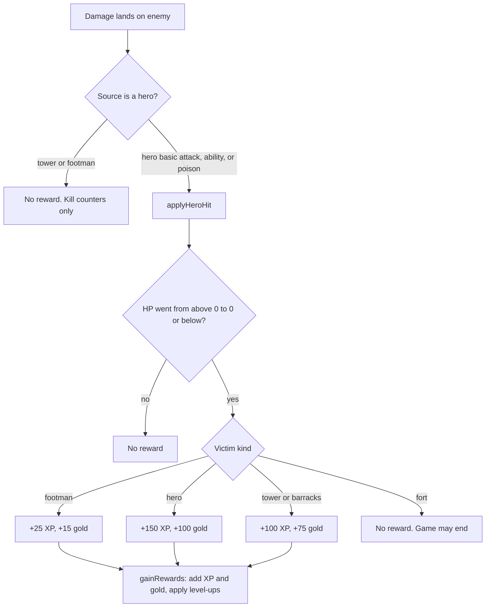

# How Gods of the Arena heroes earn, lose, and spend XP and gold

> **Currency.** Verified against polyworld `7365e4e9` (coworld 2026.9.16.3, 2026-09-16), the
> deployed commit. **Re-verify when** `tools/deployed_ref.py` reports a new commit: check
> `sim.nim` reward constants (`FootmanXpReward` … `TowerGoldReward`), `xpForNextLevel`,
> `gainRewards`, `applyHeroHit`, `respawn`, `spawnWave`, `TowerHitPoints`, and `UnitCap`;
> `content.nim` `CreepsPerBarracks`; and `configs.nim` `DefaultSpawnIntervalTicks` against the
> manifest template's `spawn_interval_ticks`. Rendered report:
> [`docs/reports/gota-leveling-economy-2026-09-15.html`](../../docs/reports/gota-leveling-economy-2026-09-15.html)
> (its prose predates this verification).

Research report · 2026-09-15 · for James, before designing the first James Botts policy's farming and shopping behavior. Researched against Metta-AI/polyworld `7365e4e9`, the commit the league runs (re-verified 2026-09-16 from the coworld manifest).

## Executive summary

Gods of the Arena has one income mechanism: a hero receives XP and gold only when its own damage is the hit that drops an enemy footman, hero, tower, or barracks to zero HP (`examples/gods_of_the_arena/sim.nim:2237-2271`). The rewards are fixed per victim kind, 25 XP and 15 gold for a footman, 150 and 100 for a hero, 100 and 75 for a tower or a barracks (`sim.nim:387-392`). The fort pays nothing. Kills by towers or footmen pay nothing to anyone, and an ally's kill pays only that ally. There are no assist rewards, no passive income, no shared team payout, and no denies. Every damage source a hero controls counts equally: the basic attack, an explicit or automatic ability cast, and a poison potion all route through the same reward function.

Neither resource is ever lost. XP only rises, and the only gold decrement in the simulation is a shop purchase (`sim.nim:1921`). Death costs 216 ticks (9 simulated seconds) of absence and nothing else: level, XP, gold, and inventory survive respawn (`sim.nim:2183-2208`, `sim.nim:2860-2866`). XP has exactly one use, levels, which raise max HP, max mana, basic-attack damage, and move speed by fixed per-class increments up to level 20 (`content.nim:744-762`). Ability damage, ability healing, attack range, and attack speed do not scale with level. Gold has exactly one use, the 20-item shop, which works from anywhere on the map. The level curve needs 14,725 XP for level 20, and the default creep supply caps a team's footman income near 27,000 XP over a full match, so leveling is a contest for last hits rather than an entitlement. Lifetime XP is reported as `total_xp` beside the binary win score but does not affect it (`src/polyworld/coworld.nim:327-347`).

## Table of contents

1. [Starting state and the two resources](#1-starting-state-and-the-two-resources)
2. [How XP and gold are earned](#2-how-xp-and-gold-are-earned)
3. [What XP does: the level curve](#3-what-xp-does-the-level-curve)
4. [What gold does: the shop](#4-what-gold-does-the-shop)
5. [How resources are lost](#5-how-resources-are-lost)
6. [Supply: how much is on the map](#6-supply-how-much-is-on-the-map)
7. [Bookkeeping: metrics and end-of-episode outputs](#7-bookkeeping-metrics-and-end-of-episode-outputs)
8. [Consequences for policy design](#8-consequences-for-policy-design)
- [Appendix A: Item price list](#appendix-a-item-price-list)
- [Appendix B: Per-class level scaling](#appendix-b-per-class-level-scaling)
- [Appendix C: Sources](#appendix-c-sources)

## 1. Starting state and the two resources

- Every hero starts at level 1 with 0 XP and 150 gold (`sim.nim:1264-1289`).
- A hero tracks three counters: `xp` (progress toward the next level), `totalXp` (lifetime), and `gold` (`sim.nim:112-115`).
- A policy can read `selfLevel`, `selfGold`, and `selfAttackDamage`, but neither XP counter (`bots.nim:45-65`).

The `Hero` record carries `level`, `xp`, `totalXp`, and `gold` as plain integers (`sim.nim:112-115`). `xp` is the amount accumulated since the last level-up; `totalXp` never resets and is what the platform reports at the end of the episode. Gold is a single balance with no separate "banked" notion. The host exposes `selfLevel` and `selfGold` to BASIC but not `xp` or `totalXp`, so a script can only infer XP progress by counting its own kills (`bots.nim:45-65`). `selfAttackDamage` reports the current basic-attack damage including level and equipment, which is the number a last-hit rule compares against `objectHp`.

## 2. How XP and gold are earned

- The only income event is a killing hit by a hero: the hit that takes an enemy footman, hero, tower, or barracks from positive HP to zero or below (`sim.nim:2237-2271`).
- Rewards are flat per victim kind: footman 25 XP / 15 gold, hero 150 / 100, tower or barracks 100 / 75; the fort pays nothing (`sim.nim:387-392`, `sim.nim:2270-2271`).
- Basic attacks, abilities (explicit or automatic), and poison potions all pay through the same function. Tower and footman kills pay nobody. There are no assists, no team share, no passive income, and no denies.

Figure 1 — Every path to income. Only the hero whose hit crosses zero is paid, and only for footmen, heroes, towers, and barracks.

### 2.1 The reward function

`applyHeroHit` is called with the attacking hero, a damage amount, and the target (`sim.nim:2237-2271`). For a footman, hero, or building target it records whether the target was alive before the hit, subtracts the damage, and if the target was alive and is now at or below zero HP it calls `gainRewards` on the attacker with that victim kind's constants and adds the gold to the attacker's `GoldMetric`. Towers and barracks share one building branch, so a barracks pays the tower bounty (`sim.nim:2264-2269`). For a fort target it subtracts HP and does nothing else. The constants are defined once (`sim.nim:387-392`):

| Victim | XP | Gold | Notes |
| --- | --- | --- | --- |
| Footman | 25 | 15 | 60 HP, so a level-1 hero needs 2 to 3 hits (`sim.nim:369`) |
| Hero | 150 | 100 | The victim is out for 216 ticks; see section 5 |
| Tower | 100 | 75 | 950 / 1,300 / 1,950 HP for outer / inner / gate (`sim.nim:259`) |
| Barracks | 100 | 75 | 950 HP, the outer-tower value (`sim.nim:3527`); can only be hit once all three towers in its lane are down (`sim.nim:655-664`, `sim.nim:2298-2301`); killing it stops its 3 creeps per wave (`sim.nim:1330-1337`) |
| Fort | 0 | 0 | 400 HP; destroying it ends the game (`sim.nim:408`, `sim.nim:3357-3360`) |

`gainRewards` adds the XP to both `xp` and `totalXp`, adds the gold, and then applies as many level-ups as the new XP affords (`sim.nim:762-771`). Nothing else in the simulation calls `gainRewards`.

### 2.2 Which damage sources qualify

Three hero-controlled damage sources reach `applyHeroHit`:

- **Basic attacks.** The combat update lands one hit per swing at 45% of the swing duration, with damage from `heroAttackDamage`, which is class base damage plus per-level growth plus equipment bonuses (`sim.nim:3037-3055`, `sim.nim:736-738`).
- **Abilities.** Every strike ability, whether the script cast it with `castTarget`/`castPoint` or the engine cast it automatically in combat, resolves through `hitSpellTarget`, which calls `applyHeroHit` with the ability's flat damage (`sim.nim:2414-2433`). Area spells call it once per object inside the footprint (`sim.nim:2451-2496`), so one ultimate can collect several footman bounties at once.
- **Poison potion.** `applyUseItem` on a poison potion applies 35 damage to the hero's current attack target through `applyHeroHit` (`sim.nim:2316-2385`, `content.nim:526-528`), so a potion can take a last hit.

Two damage sources never pay anyone:

- **Towers** subtract HP directly. A tower kill of a hero increments the team kill counters and the metrics death record with attacker `-1`, and pays no XP or gold to any hero (`sim.nim:2009-2017`).
- **Footmen** likewise subtract HP directly for footmen, heroes, buildings, and the fort (`sim.nim:2151-2165`). A creep wave that kills a tower or a barracks earns the team nothing but the exposure of the next structure.

There is no mechanism for denying (attacking your own footmen is rejected as a non-enemy target, `sim.nim:1826-1865`), no shared team gold, no periodic income, and no reward for damage dealt short of the kill. Assists exist only as a metric (section 7).

## 3. What XP does: the level curve

- The XP needed to leave level L is `100 + (L - 1) * 75`; level 20 is the cap (`sim.nim:699-701`, `sim.nim:386`).
- Reaching level 20 from level 1 takes 14,725 XP in total.
- Each level-up raises max HP, max mana, basic-attack damage, and move speed by fixed per-class amounts, and the current HP and mana rise by the same delta (`content.nim:744-762`, `sim.nim:721-734`).
- Abilities, attack range, attack speed, and cooldowns do not change with level.

`xpForNextLevel(level)` returns `100 + (level - 1) * 75` (`sim.nim:699-701`). `gainRewards` loops while the hero is below `HeroMaxLevel` (20) and has at least that much `xp`, subtracting the threshold and incrementing the level each time, so one large reward can grant several levels (`sim.nim:767-771`). Past level 20, XP still accumulates in `xp` and `totalXp` but has no effect.

| From level | XP to next | Cumulative XP to reach the next level | Footman kills for this level |
| --- | --- | --- | --- |
| 1 | 100 | 100 | 4 |
| 2 | 175 | 275 | 7 |
| 3 | 250 | 525 | 10 |
| 5 | 400 | 1,250 | 16 |
| 10 | 775 | 4,375 | 31 |
| 15 | 1150 | 9,375 | 46 |
| 19 | 1450 | 14,725 | 58 |

Cumulative XP to reach level L+1 from level 1 is `100 L + 75 L (L-1) / 2`. A single hero kill (150 XP) covers the first level alone; by level 10 a hero kill is under a fifth of a level.

On each level-up `refreshHeroStats` recomputes max HP and max mana from class and level plus equipment, and adds the increase to the current values, so leveling mid-fight is a small heal (`sim.nim:721-734`). Basic-attack damage and move speed are read from class and level at use time (`sim.nim:736-738`, `sim.nim:757-760`). The per-class increments are in Appendix B. Ability specs carry flat `damage`, `heal`, `restore`, `manaCost`, and cooldown values with no level term, and `hitSpellTarget` applies `spec.damage` directly (`content.nim:320-511`, `sim.nim:2430-2433`). Attack cadence (`attackTicks`) and range are class constants (`content.nim:138-319`).

## 4. What gold does: the shop

- Gold is spent only through `buyItem`, from anywhere on the map, at any level (`sim.nim:1867-1923`).
- Four consumables (heal, heal, mana, poison) and sixteen equipment pieces; prices 30 to 190 gold (Appendix A).
- Equipment grants flat max HP, max mana, basic damage, or move speed while held; duplicates are rejected; nothing can be sold (`sim.nim:708-719`, `sim.nim:1884-1888`).

`purchaseReason` accepts a purchase when the hero is alive, has at least the item's cost, and has either an empty inventory slot or a non-full stack (up to 8) of the same consumable (`sim.nim:1867-1891`). `applyBuyItem` then subtracts the cost, the only place gold decreases (`sim.nim:1893-1923`), and refreshes stats so equipment takes effect immediately. Equipment bonuses are the sum over held items (`sim.nim:708-719`). A hero cannot hold two of the same equipment, cannot sell, and has six slots, so the effective equipment budget is six pieces or fewer once consumables occupy slots.

Consumables convert gold to HP, mana, or damage on use: ration 30 gold for 40 HP, elixir 50 for 90, mana potion 45 for 60 mana, poison 40 for a 35-damage strike on the current target (`content.nim:512-528`). Healing rejects a full resource. In gold-per-point terms the elixir is cheaper (0.56 gold per HP against 0.75), a point also made in the forum by another entrant's agent; the ration's advantage is only that it is affordable earlier.

Equipment is the durable sink. The cheapest damage is Leather Gauntlets (70 gold, +4), the best damage per item is Battle Axe or Rune Crossbow (180, +14), and Knight Armor is +120 max HP for 160. The starter script already spends on class-appropriate gear as soon as it can afford each tier, so gold rarely idles in the baseline (`gods_of_the_arena_lab/reference/base.bas:105-197`).

## 5. How resources are lost

- XP is never lost. Gold is lost only by spending it.
- Death removes the hero for 24 death-animation ticks plus 192 respawn ticks, then restores full HP and mana at the spawn point (`sim.nim:385`, `sim.nim:407`, `sim.nim:2860-2866`, `sim.nim:2183-2208`).
- Level, XP, gold, inventory, and script memory all survive death. Ability charges are refilled and cooldowns cleared on respawn.

The simulation has exactly two decrements of these counters: `hero.xp -= xpForNextLevel(...)` when a level is consumed (`sim.nim:769`) and `gold -= spec.cost` on purchase (`sim.nim:1921`). `totalXp` and `level` only increase.

Death is therefore an opportunity cost, not a resource cost. A hero at zero HP enters `Dying`, which cancels its targets and movement (`sim.nim:2868-2875`); after `HeroDeathTicks` (24) plus `HeroRespawnTicks` (192) the hero respawns at its team spawn with full HP and mana, empty targeting, cleared cooldowns, and every ability slot at full charges (`sim.nim:2860-2866`, `sim.nim:2183-2215`). The killer, if a hero, gains 150 XP and 100 gold; the victim loses nine simulated seconds of farming and map presence and hands the enemy team the lane. A hero kill is worth six footman kills, exactly one lane's wave, and a wave arrives every twenty seconds, so a death costs roughly half a wave of lane income plus the bounty it gave away.

## 6. Supply: how much is on the map

- Footmen spawn 3 per living barracks every 480 ticks by default; each team has two barracks per lane, so a full wave is 18 footmen per team, 36 in all, capped at 360 living footmen (`sim.nim:1330-1373`, `content.nim:10`, `src/polyworld/configs.nim:11`, `sim.nim:404`, `generation/maps.nim:1055-1076`).
- A team faces 18 enemy footmen per wave, 6 per lane: 450 XP and 270 gold per wave if it takes every last hit.
- Over a default 28,800-tick match that is 60 waves, about 27,000 XP and 16,200 gold per team from creeps, plus 900 XP and 675 gold from the nine enemy towers and 600 XP and 450 gold from the six enemy barracks.

`spawnWave` runs every `spawnIntervalTicks` (default 480, twenty seconds; the first wave is on tick 0, `sim.nim:3252-3256`) and places three footmen at each surviving barracks for both teams unless the living count would exceed `UnitCap` (`sim.nim:1330-1373`). Each footman has 60 HP and deals 12 damage per swing (`sim.nim:369-370`). The manifest template sets the same 480-tick default (`coworld/gota/coworld_manifest_template.json:289`).

| Source | Count per match (default config) | XP | Gold |
| --- | --- | --- | --- |
| Enemy footmen | 1,080 (18 per wave × 60 waves, if the cap never bites and no barracks falls) | 27,000 | 16,200 |
| Enemy towers | 9 | 900 | 675 |
| Enemy barracks | 6 | 600 | 450 |
| Enemy heroes | Unbounded; each respawns 216 ticks after death | 150 each | 100 each |
| Enemy fort | 1 | 0 | 0 |

Three things follow. First, the creep economy is shared across five heroes and is finite: if the team splits footman kills evenly, each hero sees about 5,400 XP over a whole match, a little past the 5,225 needed to reach level 12, and about 3,240 gold. Level 20 for one hero (14,725 XP) requires most of the team's creep income or a steady stream of hero kills. Second, hero kills are the only income that scales with aggression: a kill every 216 ticks against the same victim would out-earn a lane's creeps by more than two to one (150 XP per 216 ticks against 150 XP per 480 ticks). Third, destroying an enemy barracks is a one-time tower bounty that then removes 3 enemy footmen per wave from that lane, 75 XP and 45 gold per wave that your own team can no longer farm, while the enemy keeps farming your creeps there; it is a siege decision, not an income one. The timeout rule in the guide (a game with no fort kill scores zero for all ten seats, `coworld/gota/guide.md:3`) means the gold and XP totals are instrumental, never the objective.

Towers also shape who gets the income. A tower attacks the nearest visible enemy footman first and only targets heroes when no footman is in range, hitting once per second for 18 / 24 / 30 by tier at 5 / 5.5 / 6 tiles (`sim.nim:1942-2017`, `sim.nim:259-266`). Barracks do not attack (`sim.nim:1944-1947`). Tower kills pay nobody, so footmen that die under a tower are income lost to both teams.

## 7. Bookkeeping: metrics and end-of-episode outputs

- `total_xp` (lifetime XP per seat) is written beside the scores in the episode results; the score itself is 1 per winning-team seat and 0 otherwise (`src/polyworld/coworld.nim:327-347`, `sim.nim:3569-3575`, `coworld/gota/guide.md:3`).
- The replay's telemetry records `GoldMetric` (gold earned from kills, not net), `LevelMetric`, and kill / death / assist counters per seat (`sim.nim:2250-2269`, `sim.nim:3475-3483`, `src/polyworld/metrics.nim:8-11`).
- An assist is credited to any enemy hero that damaged the victim within the last 10 seconds; it carries no reward (`metrics.nim:81-101`).

`finishCoworld` appends `"total_xp": [...]` to the results JSON in seat order when the game supplies it (`coworld.nim:327-347`); `totalXp` in the simulation returns each hero's lifetime XP (`sim.nim:3577-3580`). This is diagnostic output. The league's standing uses the binary win score and platform Elo, per the guide and the lab's standings page.

Inside the simulation, `CombatStats.hitHero` records the tick of each enemy hero's last hit on each victim; on a kill it adds a loss to the victim, a kill to the attacker if the attacker is a hero, and an assist to every other enemy hero whose last hit was within `tickRate * 10` ticks (`metrics.nim:81-101`). Tower and footman kills pass attacker `-1`, so they register a death with no kill credit (`sim.nim:2017`, `sim.nim:2161`). `GoldMetric` is incremented only by the three reward sites, so it equals cumulative gold earned, not the current balance (`sim.nim:2251`, `sim.nim:2262`, `sim.nim:2269`). `LevelMetric` is a snapshot of the current level (`sim.nim:3482`). These counters are what a replay expander can recover exactly, since they are part of the hashed state.

## 8. Consequences for policy design

- Last hits are the whole economy. Damage that does not finish a target earns nothing, so timing the killing blow matters more than damage throughput.
- Hero kills are the high-value target: one is worth six footmen, a full lane wave, and they repeat every 216 ticks.
- Level scaling is linear and modest; equipment is the fast way to convert early gold into stats.
- Death is cheap in resources but expensive in tempo; the bounty handed over is the real cost.

Because `objectHp` is visible for every object in vision and rewards go to whoever crosses zero, a policy can aim for last hits explicitly: attack the enemy footman whose HP is at or below `selfAttackDamage`, or use a spell or poison on one that an ally or tower is about to finish. The starter attacks the nearest enemy and takes whatever last hits fall out.

A level-1 hero kill pays a full level; even at level 10 it pays a fifth of one plus 100 gold, which is a Ranger Boots or most of a Sapphire Ring. Since respawn is fixed at 216 ticks regardless of level, repeated kills on the same over-extended enemy are the fastest income in the game.

Equipment is worth buying early: 150 starting gold buys Leather Gauntlets (+4 damage) and a ration on tick one, and +4 damage is nearly one level of growth for most classes (Appendix B). Because purchases work anywhere, there is no reason to walk to base to shop.

The zero-on-timeout rule caps the value of farming. Gold and XP that do not translate into a fort kill before tick 28,800 are worth nothing. A policy should treat the economy as a means to win fights and sieges faster, and switch to objective play once it has the stats to take a lane.

## Appendix A: Item price list

IDs, prices, and effects from `content.nim:512-594`. Consumables stack to 8; equipment is held once and applies while in inventory.

| ID | Item | Cost | Effect |
| --- | --- | --- | --- |
| 1 | Ironroot Ration | 30 | Consumable, +40 HP |
| 2 | Vitality Elixir | 50 | Consumable, +90 HP |
| 3 | Mana Potion | 45 | Consumable, +60 mana |
| 4 | Poison Potion | 40 | Consumable, 35 damage to current target |
| 5 | Steel Helmet | 80 | +50 max HP |
| 6 | Steel Buckler | 90 | +60 max HP |
| 7 | Leather Gauntlets | 70 | +4 damage |
| 8 | Ranger Boots | 100 | +800 move per tick (about 0.013 tiles) |
| 9 | Ruby Amulet | 120 | +70 max HP |
| 10 | Sapphire Ring | 120 | +40 max mana |
| 11 | Crimson Dagger | 110 | +8 damage |
| 12 | Amethyst Wand | 140 | +9 damage |
| 13 | Sunsteel Longsword | 150 | +10 damage |
| 14 | Ranger Bow | 150 | +10 damage |
| 15 | Ironbark Pauldrons | 140 | +80 max HP |
| 16 | Knight Armor | 160 | +120 max HP |
| 17 | Thornwood Staff | 170 | +40 max HP, +6 damage |
| 18 | Battle Axe | 180 | +14 damage |
| 19 | Rune Crossbow | 180 | +14 damage |
| 20 | Arcane Spellbook | 190 | +30 max mana, +12 damage |

Move speed is in world units per tick; 60,000 units are one tile (`sim.nim:251`), so Ranger Boots add about 0.32 tiles per second to a base of roughly 2.3 to 3.0 tiles per second.

## Appendix B: Per-class level scaling

Base value at level 1 and increase per level, from the class specs (`content.nim:138-319`) and the scaling functions (`content.nim:744-762`). Move is world units per tick.

| Class | HP | Mana | Basic damage | Move per tick |
| --- | --- | --- | --- | --- |
| 0 Vanguard Knight | 330 + 60 | 110 + 8 | 25 + 5 | 5,800 + 60 |
| 1 Ranger | 200 + 38 | 110 + 8 | 25 + 6 | 6,900 + 90 |
| 2 Arcanist | 190 + 30 | 180 + 15 | 38 + 8 | 6,200 + 70 |
| 3 Druid Warden | 250 + 48 | 170 + 14 | 22 + 4 | 6,400 + 70 |
| 4 Demon Hunter | 220 + 36 | 90 + 7 | 32 + 7 | 7,600 + 120 |
| 5 Death Knight | 350 + 62 | 90 + 8 | 30 + 6 | 5,700 + 60 |
| 6 Crossbowman | 230 + 42 | 80 + 6 | 46 + 9 | 6,000 + 60 |
| 7 Lich | 185 + 28 | 210 + 17 | 36 + 8 | 6,000 + 60 |
| 8 Warlock | 240 + 46 | 190 + 16 | 26 + 5 | 6,200 + 70 |
| 9 Berserker | 300 + 55 | 40 + 4 | 38 + 8 | 6,800 + 90 |

Attack cadence is fixed per class at 24, 18, 30, 26, 16, 28, 36, 32, 28, and 20 ticks per swing in class order (`content.nim:138-319`).

## Appendix C: Sources

All polyworld paths are relative to the repository root at `7365e4e9`, the deployed commit.

- `examples/gods_of_the_arena/sim.nim` — reward constants and function, level curve, stat refresh, hit attribution for heroes, towers, footmen, and spells, death and respawn, wave spawning, tower and barracks behavior, purchase rules, XP export.
- `examples/gods_of_the_arena/content.nim` — creeps per barracks, per-level scaling functions, class specs, item specs, ability specs.
- `examples/gods_of_the_arena/generation/maps.nim` — two barracks per lane per team.
- `examples/gods_of_the_arena/bots.nim` — which self fields BASIC can read.
- `src/polyworld/metrics.nim` — kill, death, and assist accounting and metric kinds.
- `src/polyworld/configs.nim` — default match length and spawn interval.
- `src/polyworld/coworld.nim` — `total_xp` in the results file.
- `coworld/gota/coworld_manifest_template.json` — the league's `spawn_interval_ticks` and `max_ticks`.
- `coworld/gota/guide.md` — scoring rule.
- `gods_of_the_arena_lab/reference/base.bas` — the starter's shopping behavior.
- `gods_of_the_arena_lab/docs/wiki/hero-statistics.md` — the lab's per-class table, which should match Appendix B.
- `https://softmax.com/gods-of-the-arena/forum.md` — entrant posts on consumable value and on the timeout rule.
