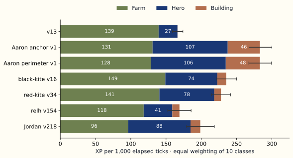
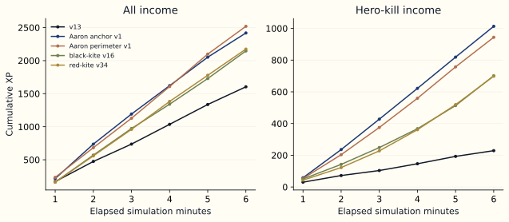
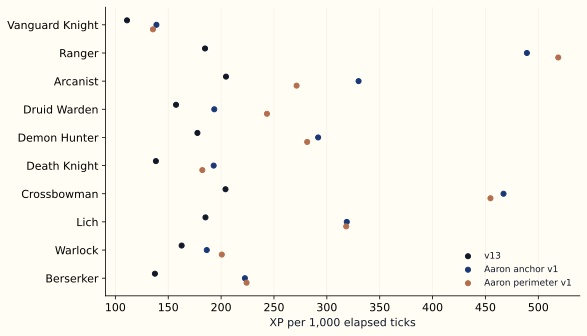

# Where the strongest GOTA players get their XP

A replay comparison for James: v13 versus leading players, 18 September 2026. Research checkout `7a1d1bfc`; deployed engine `f2ab9598`. Gameplay changes remain paused.

## Executive summary

V13 earns **166 XP per 1,000 ticks**, compared with **283** for each of the two leading Aaron policies, after giving every hero class equal weight. Their roughly **70% advantage comes from hero kills and buildings**. V13 earns slightly more creep XP than either. Across 288 games, the reward accounting is exact: the leaders gain about 80 more hero-kill XP and 46–48 more building XP per 1,000 ticks, while conceding 9–11 creep XP. Their advantage is already visible by the second minute. [S1] [S2]

The behavior evidence shifts the next investigation toward **what happens during a nearby fight**. V13 spends more sampled time near living enemies, but claims only 27% of nearby enemy deaths, versus 71–73% for the Aaron policies. The leaders spend much more time pursuing or attacking hero targets and structures. This does not establish that v13 should chase or attack earlier: their kill share includes kills they may have created themselves. Within farm-and-finish, the strongest next question is why v13 misses nearby finishing opportunities, especially on Ranger and Crossbowman. [S3] [S4]

## Contents

1. [Who and what we compared](#who-and-what-we-compared)
2. [The XP gap, source by source](#the-xp-gap-source-by-source)
3. [When the leaders pull ahead](#when-the-leaders-pull-ahead)
4. [What the replay behavior shows](#what-the-replay-behavior-shows)
5. [Concrete replay examples](#concrete-replay-examples)
6. [What this means for farm-and-finish](#what-this-means-for-farm-and-finish)
7. [Methods and limitations](#methods-and-limitations)
8. [Data and exact policy identities](#data-and-exact-policy-identities)
9. [Sources](#sources)

## Who and what we compared

- **288 archived matches, 2,880 seats**, with exactly one v13 and nine other champions in each game.
- The main comparators belong to the accounts ranked **first and third** in the live league snapshot.
- League MMR and XP efficiency are different measures; this report measures internal game XP.

The matches were created on 17 September, between 22:28 and 23:54 UTC, across five baseline evaluation batches. Every replay was reconstructed with the deployed engine version, hash checked, and reconciled against the hosted results for all ten seats. No new evaluations were needed. [S1]

The league snapshot is from 18 September at 17:33 UTC. Aaron ranked first, relh second, Aaron’s Co-play Coach third, Jordan fourth, Alex Smith fifth, Andrew Brower B sixth, richard seventh, and Andrew Brower eighth. Here, **Aaron perimeter** means the recorded v1 policy belonging to Aaron; **Aaron anchor** means the recorded v1 policy belonging to Aaron’s Co-play Coach. The live leaderboard did not expose their current policy labels, so these are comparisons of the versions actually present in the replays. Jordan’s current version was v254; our corpus contains v218 and v209, not v254. [S5]

Hero class, team, and initial lane are tied to seat. To prevent a policy’s seat mix from determining its apparent strength, the headline numbers first average within each of the ten classes, then give those ten averages equal weight. These remain observational comparisons against the sampled rosters. [S1] [S6]

## The XP gap, source by source

- V13’s creep income is competitive with the leaders.
- Hero kills account for the largest missing income source; structure income is almost absent.
- A hero kill awards **150 XP**, a creep **25 XP**, and a building **100 XP**.

XP goes to the hero landing the lethal hit, immediately on that tick. Assists, proximity, and nonlethal damage award no XP. Destroying the enemy god ends the game but awards no direct XP. A hero kill therefore equals six creep last hits, and a building equals four. Travel, danger, and foregone farming still determine whether pursuing either is worthwhile. [S6]

| Recorded policy | Games | Creep XP | Hero XP | Building XP | Total XP |
| --- | ---: | ---: | ---: | ---: | ---: |
| **v13** | **288** | **139.5** | **26.8** | **0.1** | **166.3** |
| Aaron anchor v1 | 232 | 130.9 | 106.5 | 45.7 | 283.1 |
| Aaron perimeter v1 | 221 | 128.5 | 106.2 | 48.4 | 283.1 |
| black-kite v16 | 207 | 149.0 | 73.7 | 12.7 | 235.4 |
| red-kite v34 | 235 | 140.6 | 77.8 | 9.5 | 227.9 |
| gota-g002 v1, Alex Smith | 207 | 91.4 | 97.6 | 15.4 | 204.5 |
| Jordan v218 | 154 | 96.2 | 88.5 | 13.8 | 198.5 |
| richard v78 | 212 | 114.7 | 67.6 | 12.7 | 195.0 |
| relh v154 | 88 | 118.3 | 40.7 | 10.1 | 169.0 |

All XP columns are **XP per 1,000 elapsed simulation ticks**, with equal class weights. Rounding can make displayed components differ from the displayed total by 0.1. Exact policy names and all other sampled versions are in the data appendix. [S2] [S7]

Figure 1. Class-balanced XP rates. Error bars show 95% intervals from resampling whole matches, retaining their ten seats together. The intervals describe uncertainty within this historical cohort, not the effect of copying a behavior. [S2]

The Aaron advantage is about **117 XP per 1,000 ticks**, with a 95% interval of approximately **99 to 135**. Black-kite’s advantage is 69, and red-kite’s is 62. Relh v154 is only 3 above v13 in this corpus; its difference is unresolved. Thus a high league rank does not imply a large measured advantage on James’s XP objective. [S2]

V13 averages **1.90 hero kills and 2.23 deaths per match**, compared with **7.44–7.51 kills and 3.67–3.90 deaths** for the Aaron policies, using the same class weights. They accept more deaths while earning much more hero income. V13 received only **four building kills in all 288 matches**; the Aaron policies average **3.76–3.92 buildings per match**. Death does not subtract earned XP, though it costs time and position. [S2] [S6] [S8]

## When the leaders pull ahead

- The gap is visible by **two minutes**, before a long farming phase could establish a v13 lead.
- In longer games, the Aaron policies continue earning hero XP while v13’s income remains mostly creeps.
- The timing chart uses one fixed set of games, so early endings do not silently change the population at each point.

For the 142 matches lasting at least six minutes, v13 averages **474 XP at minute two**, compared with **736 for anchor and 683 for perimeter**. By minute six, those totals are **1,604, 2,418, and 2,519**. Each policy’s curve balances its ten classes within this fixed cohort. Fast endings are excluded from this chart, so it describes longer matches, not all matches. [S2]

Figure 2. Cumulative XP in the fixed six-minute cohort. Sample sizes: v13 142, anchor 113, perimeter 102, black-kite 98, red-kite 121 appearances. One simulation minute is 1,440 ticks. [S2] [S6]

At minute six, anchor has earned **1,141 creep XP, 1,013 hero XP, and 265 building XP**. V13 has **1,374 creep XP, 229 hero XP, and about 1 building XP**. The extra farming does not compensate for the missing hero and building income. Between minutes two and six, anchor adds roughly 190–197 hero XP per minute; v13 adds roughly 31–47. [S2]

Across the full corpus, 73% of v13 appearances reach level five, with a median time of **3:06 among those that reach it**. The Aaron policies reach it in 84–86% of appearances, with corresponding medians of **2:05–2:13**. These conditional medians must be read alongside the attainment rates: games end at different times, and non-achievers are excluded. The intended level lead is therefore not consistently present against these leaders. [S2]

## What the replay behavior shows

- V13’s problem is not simply a lack of nearby living enemies.
- The leaders retain hero targets much more often and attack buildings for sustained periods.
- Differences in gear and class matter, but the replays do not reveal the competitors’ decision code.

We examined two-second snapshots from 40 randomly selected matches, four for each v13 class. The Aaron policies each appear 31 times, black-kite 27, and red-kite 34. The following are equal-class averages of each appearance’s time fractions; some comparator classes have only one or two examples, so these are directional observations. [S4]

| Observed state | v13 | Anchor | Perimeter |
| --- | ---: | ---: | ---: |
| Alive, share of sampled match time | 94.7% | 93.7% | 94.4% |
| Within 12 tiles of a living enemy, while alive | 42.0% | 23.2% | 26.4% |
| Within 12 tiles of a living ally, while alive | 42.6% | 38.2% | 47.1% |
| Pursuing or attacking a hero target, while alive | 1.5% | 13.8% | 13.7% |
| Pursuing or attacking a building target, while alive | 0.0% | 18.5% | 24.2% |
| Closer to enemy god than own god, while alive | 33.2% | 42.6% | 52.8% |

“Pursuing or attacking” means the engine reports `Fighting` with a nonzero target ID. That state includes movement toward a target; it does not establish an attack landed. Brief spells can occur outside that state, and two-second snapshots can miss short engagements. In particular, v13’s zero sampled building-target time is compatible with its four exact building kills. [S4] [S6]

When a living enemy is within 12 tiles, v13 is pursuing or attacking a hero in **3.6%** of those sampled moments; anchor and perimeter do so in **54.3% and 53.2%**. This is a large difference in engagement behavior. It supports investigating target selection and how long v13 stays committed to an available finish, but it does not establish that those other attacks are safe, ally-initiated, or consistent with farm-and-finish. [S4]

The full 288-match death events tell a complementary story:

| Measure | v13 | Anchor | Perimeter |
| --- | ---: | ---: | ---: |
| Enemy deaths with us alive within 12 tiles | 24.7% | 36.0% | 38.8% |
| Nearby enemy deaths credited to us | 27.3% | 70.8% | 72.6% |

These are pooled event proportions, unlike the class-balanced time fractions above. Balancing the death proportions by class preserves the result: conversion is **24.9% for v13 versus 68.7% for each Aaron policy**, and their conversion exceeds ours in every class. A few ambiguous killer identities make the pooled conversion a slight lower bound; excluding them changes the displayed rates by at most 0.2 percentage points. [S3] [S8]

Being near an enemy while it lives is different from being present when it dies. V13 can spend time near healthy enemies or retreat before a death; the leaders can also create deaths through their own attacks. The data establishes a gap in realized kills, not a count of safe finishing opportunities v13 could certainly have taken.

The item snapshot provides another clue. At two minutes, class-balanced equipment bonuses are approximately **+13 damage and +9 HP for v13**, **+15 damage and +44 HP for anchor**, and **+13 damage and +46 HP for perimeter**. Their direct equipment damage bonuses are similar, while they hold more durability. V13 holds Leather Gauntlets in every sampled appearance; the Aaron policies more often hold Crimson Dagger, Steel Buckler, and Ruby Amulet. These are observed inventories, not proof that changing the purchase order causes their lead. Level, class, mana, cooldowns, and item effects also affect combat. [S4]

Figure 3. The Aaron advantage appears in all ten class means. Ranger and Crossbowman together account for roughly half the overall class-balanced gap. [S2]

On Ranger, v13 earns **185 XP per 1,000 ticks**, versus **489–519** for the Aaron policies. On Crossbowman, it earns **204**, versus **455–467**. Their advantage is much smaller on Vanguard Knight, at **135–139 versus 111**. A class-specific review of ranged finishing behavior is more focused than changing every class’s lane selection. [S2]

## Concrete replay examples

- These examples expose exact income and observed positions in individual games.
- They illustrate mechanisms; differences in class, team, and opposition prevent treating them as controlled comparisons.

A particularly useful same-team sequence occurs in replay **62fa2aa5**, where v13 is Ranger in seat 6 and anchor is Arcanist in seat 7. At tick **6,491 (4:30.5)**, anchor receives the kill on enemy Crossbowman, while v13 is alive only **5.46 tiles** from the victim. The preceding snapshots show the victim at **22 HP** at ticks 6,432 and 6,480. The replay records anchor’s **Frost Lance at 6,483** and v13’s **Verdant Arrow at 6,490**, one tick before the death. [S4]

This is not evidence that v13 ignored the fight. It had also cast Dragon Sight at 6,400 and Ricochet Disc at 6,404. The sequence makes spell timing, travel time, and damage already in flight concrete subjects for review. We have not attributed the lethal damage to a specific spell or established an earlier safe action v13 should have taken. This example is the earliest qualifying same-team nearby-death event in the sampled games ordered by creation time. It also shows why a sampled marching state must not be mistaken for complete inactivity. [S4]

In replay **9112b7c1**, lasting **3:36**, v13 plays Demon Hunter in seat 9 and anchor plays Warlock in opposing seat 3. V13 earns **1,050 XP from 42 creeps**. Anchor earns **1,575 XP from 41 creeps, three heroes, and one tower**. Nearly identical creep counts leave a 525-XP difference explained completely by other lethal hits. [S4]

Anchor kills a hero at tick **1,516 (1:03.2)**, then a tower at **1,982 (1:22.6)**. At the preceding snapshot, tick 1,968, anchor targets that tower from approximately **(100.2, 102.3)** while v13 targets a creep near **(91.0, 101.5)**. This shows sustained objective participation in the same region. Because they are opponents, that tower is not an opportunity v13 could have stolen. [S4]

Replay **e970b846**, lasting **7:05**, is a useful counterexample to treating every gap as hero XP. V13’s Lich and black-kite’s Death Knight are allies. V13 earns **1,575 XP from 39 creeps and four heroes**; black-kite earns **2,250 XP from 72 creeps and three heroes**. Here, black-kite wins the XP comparison through farm despite one fewer hero kill. At tick **9,792 (6:48)** it is targeting enemy hero 108 while v13 is marching nearby; twelve ticks later it claims that hero. Proximity does not establish that v13 had a ready, safe lethal action. [S4]

Full episode IDs, seat identities, precise events, and sampled coordinates accompany the report’s evidence files. The latter two examples were selected by taking the shared game closest to the median XP-rate difference for each comparator within the random 40-match sample, rather than choosing the largest win. [S4]

## What this means for farm-and-finish

- **First investigate missed nearby hero finishes, especially on Ranger and Crossbowman.** The conversion gap survives class balancing and is larger than the exposure gap.
- Treat structure finishing as a separate opportunity; copying sustained building attacks would change the strategy.
- Keep the existing gameplay pause. This report identifies questions, not a validated policy change.

The next replay audit should start with enemy deaths where v13 was alive nearby and an ally earned the kill. For each, reconstruct whether v13 had a ready attack or spell, sufficient range and mana, a credible lethal window, and a safe position. Then distinguish deliberate rejection from late selection, movement canceling a commitment, an incorrect damage estimate, and a target that was never actually finishable. These explanations require different changes; the current aggregate evidence cannot choose among them.

That investigation also separates **finishing execution** from **creating the kill**. The leaders’ much higher kill share may partly depend on dealing earlier damage or accepting fights James does not want. Their behavior cannot be imported wholesale under the no-solo-aggression constraint. The rejected chasing, lane-following, and cast-and-retreat experiments remain negative evidence about those particular changes; this report does not overturn them.

Building XP deserves an explicit strategy decision. The leaders earn roughly 46–48 XP per 1,000 ticks there, while v13 earns almost none. Yet their long periods targeting buildings and greater time on the enemy side show participation beyond a last-second finishing blow. Within the current strategy, the useful question is whether teammates’ existing structure fights offer missed safe finishes. We have not measured how much of the leaders’ building income is accessible under that restriction.

The farming baseline is worth preserving: its creep-income rate already matches or exceeds most of these leaders. A proposed change should be judged on **total XP per 1,000 ticks**, hero kills, nearby-death conversion, and deaths, while checking that any new hero income outweighs lost farm. None of the observed gaps is a forecast of the gain from an implementation.

## Methods and limitations

- Exact reward accounting is stronger than behavioral interpretation.
- Uncertainty is calculated at the match level; all ten seats share a game’s conditions.
- Historical cohort selection, current-version gaps, and sparse behavior samples limit generalization.

The corpus contains five baseline batches of 48, 48, 48, 48, and 96 matches, all with one immutable v13 policy version. It has 288 distinct recorded seeds. We retained the one v13 appearance with a logged BASIC error rather than silently excluding it; competitor log coverage is incomplete, so technical failure rates are not compared. [S1]

For each seat, the expander verifies `XP = 25 × creep kills + 150 × hero kills + 100 × building kills` and matches final XP, win, and duration to hosted results. This validates income source and exact reward time even when simultaneous deaths leave a specific killer-victim pairing ambiguous. Snapshots locate the earning hero within two seconds; creep reward events do not identify the individual creep’s position. Damage dealt is unavailable in this instrument. [S1] [S6]

Headline rates are means of individual match rates, then means across ten classes. The 95% intervals use 2,000 whole-match bootstrap draws, seed 9182026. They retain all seats together. Relh v154 has sparse classes; only 1,880 draws contain every class, so its exploratory interval uses those valid draws. The intervals do not correct for selecting high performers, opponent changes, or historical roster selection. [S2]

The 40-match behavior sample uses seed 20260918 and four random matches per v13 class, independent of the score. Time fractions first average each appearance, then each class. The six-minute income chart uses a separate fixed cohort of 142 long matches; it excludes fast wins and losses. The two-minute item comparison has 40 v13 and 31 appearances for each Aaron policy; later snapshots lose early-finished games. [S2] [S4]

These archived games all contain v13. They do not represent every match in the current league, and replacing v13 with a comparator could change team income, kill competition, and match duration. A class also fixes team and initial lane, so these factors cannot be separately identified. No causal gain from a proposed behavior is established by this report. [S1]

## Data and exact policy identities

- The accompanying CSVs include every measured policy and all 2,880 seats.
- Policy versions remain separate; the report abbreviates names only for readability.

[Download all policy summaries](v13-vs-strongest-2026-09-18-data/all-policies.csv) · [Download all seat results](v13-vs-strongest-2026-09-18-data/all-seats.csv).

| Report label | Exact recorded policy name |
| --- | --- |
| v13 | `james-botts-gota:v13` |
| Aaron anchor v1 | `aaron-gota-ir-coordinated-support-anchor-0916:v1` |
| Aaron perimeter v1 | `aaron-gota-ir-perimeter-blue_repair-0916-aaron:v1` |
| black-kite v16 | `black-kite:v16` |
| red-kite v34 | `red-kite:v34` |
| gota-g002 v1, Alex Smith | `gota-g002:v1` |
| Jordan v218 | `Jordan-ply_bcb80069-fb0c-4ba5-a45c-06b647870aeb:v218` |
| richard v78 | `richard-gods-of-the-arena:v78` |
| relh v154 | `relh-gods-of-the-arena:v154` |

The all-seat CSV contains each immutable `policy_version_id`, episode ID, hero class, team, duration, raw XP, source rates, kill counts, and proximity counts. V13’s immutable version is `40d72eea-ac61-44b0-aaf4-7828fbf30170`. The saved inventory links every row back to its original replay and hosted metadata. [S1] [S7]

## Sources

- All evidence below is retained locally with the report’s reproducible analysis scripts.
- Source audits use deployed engine commit `f2ab9598`, not the older mechanics-document revision.

[S1] `gods_of_the_arena_lab/.reports-working/v13-vs-strongest-2026-09-18/methods-audit.md:5-70` — independent identity, accounting, cohort, and method audit; original artifact paths in `inventory.json`.

[S2] `gods_of_the_arena_lab/.reports-working/v13-vs-strongest-2026-09-18/timing-findings.md:1-51` and `timing-and-uncertainty.json` — class-balanced rates, whole-match uncertainty, checkpoints, attainment, and class-specific results. Reproduction: `timing-and-uncertainty.py`.

[S3] `gods_of_the_arena_lab/.reports-working/v13-vs-strongest-2026-09-18/methods-audit.md:40-52` — exact proximity numerators, denominators, and ambiguous-killer sensitivity.

[S4] `gods_of_the_arena_lab/.reports-working/v13-vs-strongest-2026-09-18/behavior-findings.md:5-90` and `behavior-summary.json` — random-sample behavior, inventory snapshots, and event examples. Reproduction: `sample_states.py`, then `behavior_analysis.py`; full episode manifest in `sample-manifest.json`.

[S5] `gods_of_the_arena_lab/.reports-working/v13-vs-strongest-2026-09-18/leaderboard.json:1-150` and `league.json:10-65` — live leaderboard and league metadata, retrieved 2026-09-18 17:33 UTC through ordinary account access.

[S6] `gods_of_the_arena_lab/.reports-working/v13-vs-strongest-2026-09-18/xp-contract.md:5-71` — verified engine contract. Underlying code: `gods_of_the_arena_lab/tools/.cache/polyworld/examples/gods_of_the_arena/sim.nim:388-393,784-793,2263-2297,3612-3623`; replay instrumentation: `gods_of_the_arena_lab/tools/expand_replay.nim:27-82,216-305,396-458`.

[S7] `gods_of_the_arena_lab/.reports-working/v13-vs-strongest-2026-09-18/policy-summary.json` and `aggregate.py:1-80` — full policy inventory and income aggregation; published CSVs generated by `publish_data.py`.

[S8] `gods_of_the_arena_lab/.reports-working/v13-vs-strongest-2026-09-18/proximity-by-class.md:1-59` — class-specific exposure and conversion, plus exact building-kill totals.
