# How Gods of the Arena numbers scale from level 1 to level 20

> **Currency.** Every number here is generated from an engine dump of polyworld `1d7eb723`
> (`content.nim` identical at the deployed `5422fb0c`). **Re-verify when** `tools/deployed_ref.py`
> reports a new commit: follow [`tools/scaling/README.md`](../tools/scaling/README.md) to re-dump
> `specs.json`, check the simulation constants at the top of `model.py`, and re-render the
> figures, then re-read the prose against the printed numbers. Rendered report:
> [`docs/reports/gota-scaling-2026-09-15.html`](../../docs/reports/gota-scaling-2026-09-15.html).
> Polyworld `main` after `a6112c5` raises Sanguine Chalice to 30 heal and Aether Siphon to 24
> mana (from 28 and 22); nothing else in `content.nim` differs. Those values apply only once the
> deployed commit includes them.
> This finding is lab-internal; do not post it publicly (see `user_preferences.md`).

Research report · 2026-09-15 · for James, before designing the first James Botts policy's fight, farm, and shop logic. Every number comes from the engine's own content tables, extracted by a program compiled against polyworld `1d7eb723` (`examples/gods_of_the_arena/content.nim` is byte-identical at the deployed `5422fb0c`) and modeled in `model.py`; the figures are generated by `charts.py` from that dump. This report stays in the lab: the spell-scaling finding is not to be posted publicly.

## Executive summary

Only four hero numbers change with level: max HP, max mana, basic-attack damage, and move speed, each by a fixed per-class step (`content.nim:743-761`). Everything else is a constant for the whole match: attack speed, attack range, every ability's damage, heal, mana cost, cooldown, and range, every item bonus, every consumable, footman and tower stats, and every reward. Over 19 levels HP grows 3.9 to 4.6 times and basic damage 4.5 to 5.6 times while mana grows 2.4 to 2.9 times and move speed only 1.2 to 1.3 times, so the game's balance changes shape as heroes level. A basic-attack duel between two level-1 heroes takes 4 to 17 seconds and the same duel at level 20 takes about the same, because attacker damage and defender HP grow in step. Spells do not: a level-1 ultimate removes a third to a half of an enemy hero's HP, and the same ultimate at level 20 removes 7 to 12 percent (figure 9). By level 5 to 13 every class's full ten-second ability burst has fallen below half an enemy's HP, and by then basic attacks already deliver several times the sustained damage of the whole kit (figures 11 and 12).

The same fixed numbers cut both ways. Footmen, whose 60 HP and 12 damage never change, go from a two- or three-hit kill and a real threat at level 1 to a one-hit kill and background noise by level 4 to 11 (figure 15). Towers stay dangerous longer: a gate tower kills a level-1 hero in 2 to 4 seconds and a level-20 hero in 7 to 14 seconds (figure 16), and a lone hero needs about 170 seconds of basic attacks to take a gate at level 1 against 35 at level 20 (figure 17). A +14 damage weapon is a third to two thirds of a hero's damage at level 1 and 7 to 14 percent at level 20; an elixir heals a quarter to a half of a level-1 hero and 6 to 13 percent of a level-20 one (figures 18 to 20). Rewards are flat too, so a hero kill is worth 1.5 levels at level 1 and a tenth of a level at level 19 (figure 3). The practical shape is a three-phase game: early, where spells, potions, and cheap weapons decide fights and creeps hurt; middle, where levels and equipment take over; and late, where the only things that still scale are basic attacks and HP, and every fight is a long basic-attack race that towers and heals dominate.

## Table of contents

1. [What scales and what does not](#1-what-scales-and-what-does-not)
2. [The level curve against the clock](#2-the-level-curve-against-the-clock)
3. [Hero stats by level](#3-hero-stats-by-level)
4. [Hero against hero: time to kill](#4-hero-against-hero-time-to-kill)
5. [Abilities against level](#5-abilities-against-level)
6. [Footmen and towers against level](#6-footmen-and-towers-against-level)
7. [Items and consumables against level](#7-items-and-consumables-against-level)
8. [Consequences for policy design](#8-consequences-for-policy-design)
- [Appendix A: Per-hero numbers](#appendix-a-per-hero-numbers)
- [Appendix B: Method and assumptions](#appendix-b-method-and-assumptions)
- [Appendix C: Sources](#appendix-c-sources)

## 1. What scales and what does not

- Four per-hero numbers grow linearly with level: HP, mana, basic damage, move speed (`content.nim:743-761`).
- Nothing else in the game has a level term: abilities, attack cadence, range, items, consumables, footmen, towers, rewards.
- Growth multiples at level 20 are 3.9 to 4.6× for HP, 2.4 to 2.9× for mana, 4.5 to 5.6× for basic damage, and 1.2 to 1.3× for move.

The scaling functions are four one-liners: `base + (level - 1) * perLevel` for HP, mana, damage, and move (`content.nim:743-761`). `refreshHeroStats` applies the HP and mana growth at each level-up, and `heroAttackDamage` and `heroMoveSpeed` read the damage and move values at use time with equipment added (`sim.nim:676-702`). Attack cadence and range are per-class constants with no level parameter (`content.nim:148-313`, `heroAttackTicks` and `heroAttackRange`). Ability specs carry fixed `damage`, `heal`, `restore`, `manaCost`, `cooldownTicks`, `range`, and area values; the effective-spec function adds charges and recharge rules but no level term, and `hitSpellTarget` applies `spec.damage` unchanged (`content.nim:606-716`, `sim.nim:2073`). Item bonuses are constants (`content.nim:511-593`); footman HP and damage, tower HP, damage, and range, and the three reward pairs are constants in the simulation (`sim.nim:229-236`, `sim.nim:339-340`, `sim.nim:358-363`).

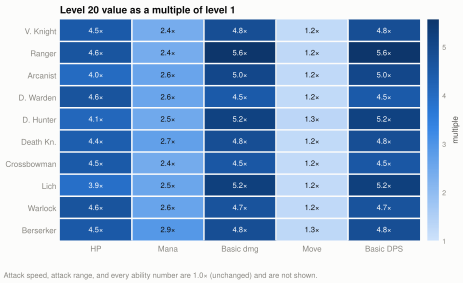
Figure 1 — Level 20 value divided by level 1 value for the four stats that scale, plus basic DPS which follows damage. Notice that mana grows at half the rate of HP and damage, and move speed barely moves.

Basic DPS equals damage times attacks per second, and attacks per second is fixed, so DPS carries the damage multiple exactly. The consequence that drives the rest of this report: everything a hero does with its basic attack keeps pace with enemy HP, and everything a hero does with a spell, a potion, or a footman-sized threat does not.

## 2. The level curve against the clock

- XP to leave level L is `100 + (L - 1) × 75`; level 20 needs 14,725 XP (`sim.nim:654-656`).
- With one fifth of the team's creeps a hero ends a 20-minute match at level 10; with a whole lane, level 12; a lane plus a hero kill every two minutes, level 14.
- Only a hero taking every creep on the map reaches level 20, at about minute 16.

Figure 2 shows the curve and four income scenarios from the economy report (footman 25 XP, 6 enemy footmen per 240-tick wave per team, `sim.nim:1123-1160`, `src/polyworld/configs.nim:20`). The scenarios are rates, not plans: 3 XP/s is an even five-way split of the team's creeps, 5 XP/s is every last hit in one lane, 6.25 XP/s adds one hero kill (150 XP) every 120 seconds, and 15 XP/s is the theoretical ceiling of all three lanes. The realistic band for a policy that farms well but shares is level 10 to 14 by the time limit. Levels 15 to 20 exist in the tables but a match rarely reaches them, so the "late" phase in this report is roughly levels 10 to 14, not 20.

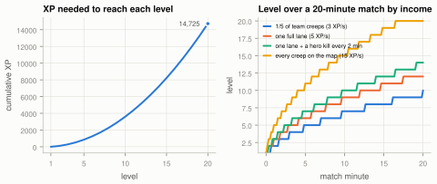
Figure 2 — Left: cumulative XP needed for each level. Right: level reached over a default 28,800-tick match at four steady income rates. Notice that even a full lane's income stalls in the low teens.

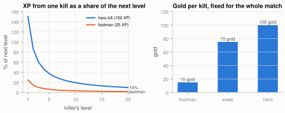
Figure 3 — Left: one kill's XP as a share of the killer's next level. Right: gold per kill, which never changes. Notice that a hero kill pays 1.5 levels at level 1 and a tenth of a level at level 19.

Rewards are constants, so their value in levels falls as `1 / (100 + (L - 1) × 75)`. A hero kill at level 1 is 150 percent of the next level; at level 5 it is 38 percent, at level 10 19 percent, at level 19 10 percent. Gold does not devalue the same way, because item prices are also flat: 100 gold is always most of a Battle Axe. What devalues is the item itself (section 7).

## 3. Hero stats by level

- Melee classes have the most HP (Death Knight 350 to 1,528, Vanguard Knight 330 to 1,470); mages the least (Lich 185 to 717, Arcanist 190 to 760).
- Basic DPS at level 20 ranges from 90 (Druid Warden) to 248 (Demon Hunter); the ordering barely changes across levels because growth is proportional.
- Move speed is 2.3 to 3.0 tiles per second at level 1 and 2.7 to 4.0 at level 20; Ranger Boots (+0.32 tiles/s) are worth about ten levels of movement.

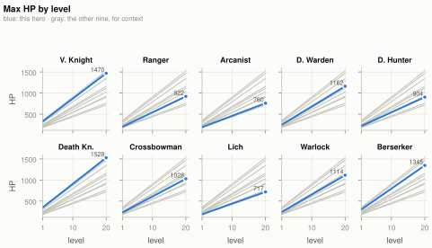
Figure 4 — Max HP by level, one panel per hero, with the other nine in gray for context. Notice the three tiers: melee tanks, the middle (Warden, Warlock, Crossbowman, Ranger, Demon Hunter), and the two mages.

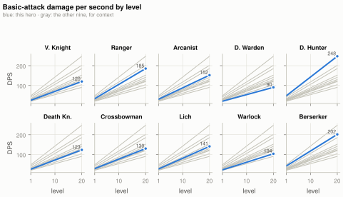
Figure 5 — Basic-attack damage per second by level. Demon Hunter (16-tick swing) and Berserker lead throughout; Druid Warden trails at every level.

The full per-level table is Appendix A. Two things to read off the panels. First, the spread between the best and worst basic DPS grows only from 2.4× at level 1 to 2.7× at level 20 (Demon Hunter against Druid Warden) and the ordering changes only once (Lich passes Crossbowman at level 4), so class matchups do not flip with level. Second, because HP and damage both grow, the ratio of a hero's own DPS to its own HP is nearly flat: a hero can always kill a copy of itself in roughly the same number of seconds (section 4).

## 4. Hero against hero: time to kill

- A pure basic-attack duel takes 4 to 17 seconds at level 1 and 3 to 17 seconds at level 20: the matrix is almost level-invariant.
- The fastest killers are Demon Hunter and Berserker (3 to 7 seconds against anything); the slowest are Druid Warden and Warlock (9 to 17 seconds).
- Because duels do not shorten with level while spells shrink, fights get longer relative to burst as the game goes on.

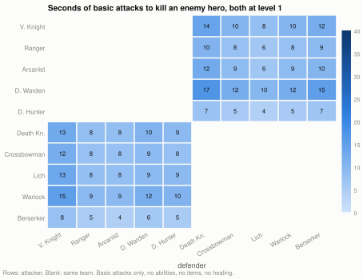
Figure 6 — Seconds of uninterrupted basic attacks for the row hero to kill the column hero, both at level 1. Same-team cells are blank.

Figure 7 — The same matrix at level 10.

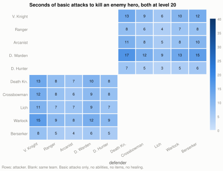
Figure 8 — The same matrix at level 20. Compare any cell with figure 6: most change by at most a second or two.

Time to kill is `ceil(defender HP / attacker damage) × attacker swing ticks / 24`, with no abilities, items, healing, or movement (Appendix B). The near-invariance is arithmetic: HP and damage each grow about 4.5× and the ratio moves only with the difference in per-class growth rates. The practical reading is that a level-20 fight between two heroes with full HP lasts as long as a level-1 fight, but the level-20 fight has no burst in it. That is the mechanism behind the phase change: early fights are decided by who lands an ultimate, late fights by who has more HP, more allies, or a tower.

## 5. Abilities against level

- One cast of an ultimate is 33 to 53 percent of an enemy's HP at level 1 and 7 to 12 percent at level 20 (figure 9).
- A full ten-second burst with every charge drops below half an enemy's HP at level 5 (Vanguard Knight) to level 13 (Crossbowman), and Druid Warden's single strike is never above a third (figure 12).
- Sustained ability DPS is 4 to 18 per second and flat; basic DPS starts at 20 to 48 and reaches 90 to 248, so basic attacks out-damage the whole kit from level 1 and by 7 to 23× at level 20 (figure 11).
- Mana grows slower than HP, and most kits cannot be cast on cooldown from regeneration alone (figures 13 and 14).

### 5.1 Strikes as a share of enemy HP

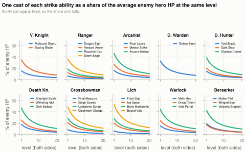
Figure 9 — Damage of one cast of each strike ability as a percentage of the average enemy hero's HP when both sides are the same level. Every curve is `constant / (a + b × L)`.

The average enemy HP is the mean over the five opposing classes (Appendix B). At level 1 the Red team's ultimates are the largest single hits in the game: Lich's Bound Void (125) is 53 percent of an average Blue hero, Crossbowman's Clockwork Charge (115) 48 percent, Death Knight's Dark Eclipse (110) 46 percent. Blue's best is Arcanist's Arcane Meteor (120) at 46 percent of an average Red hero. The primary strikes (40 to 50 damage, three charges) are 15 to 27 percent each at level 1, so three charges in a row is a kill on a squishy target. By level 10 the ultimates are 15 to 19 percent and the primaries 5 to 8 percent, and by level 20 every ability is single digits except the five biggest ultimates at 10 to 12 percent.

The heal side (figure 10) has the same shape. Druid Warden's Kindred Wisps (80) heals a third of its own level-1 HP and 7 percent at level 20; the self-heal passives (18 to 28) are 5 to 9 percent of own HP at level 1 and 1 to 2 percent at level 20. Since these fire automatically whenever the hero is below max, their late-game effect is a trickle.

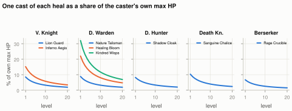
Figure 10 — One cast of each heal as a share of the caster's own max HP. Only the five classes with a heal ability are shown.

### 5.2 Sustained and burst damage

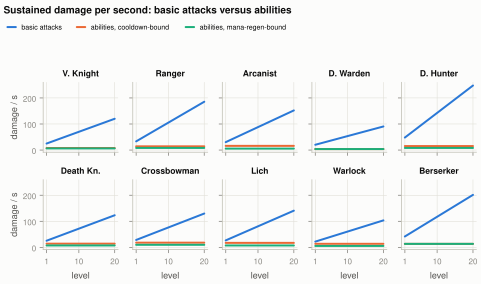
Figure 11 — Sustained damage per second from basic attacks (rising) against abilities cast on every recharge (flat, orange) and abilities limited to what 4 mana per second of regeneration pays for (flat, green).

The orange line is the kit cast at its charge-limited rate forever: one cast per `rechargeTicks` per ability, 4 to 18 damage per second (Appendix A). It never crosses the blue line; basic attacks win at level 1 for every class and the gap only widens. The green line is lower still for eight classes, because casting on cooldown costs 5 to 12 mana per second and regeneration is 4 (`sim.nim:1877-1880`). Only Druid Warden (3.4/s) and Berserker (2.7/s, Molten Fist is free) can sustain their kits on regeneration alone (figure 14).

Burst is where abilities matter, and only early. Figure 12 counts the damage available in the first ten seconds of a fight with every charge full and mana ignored: three primary casts plus one each of the others.

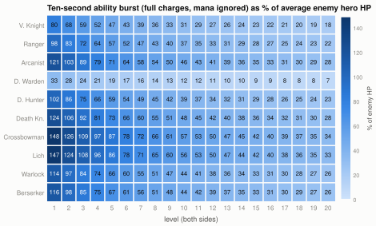
Figure 12 — Ten-second ability burst as a percentage of the average enemy hero's HP at the same level. Above 100 (dark cells) the kit alone can kill an average enemy without a basic attack.

Seven classes can kill an average enemy from full with abilities alone at level 1; Crossbowman and Lich can do it through level 3, Death Knight through level 2. The 50 percent line, where a burst still decides a fight if the target is already hurt, falls at level 5 for Vanguard Knight, 7 for Ranger and Demon Hunter, 9 for Arcanist, Warlock, and Berserker, 10 for Death Knight, 12 for Lich, and 13 for Crossbowman. By the realistic end of a match (level 10 to 14, section 2) every kit's burst is 25 to 50 percent of an enemy, with Druid Warden's lone strike under 10 percent from level 3 on.

### 5.3 Mana

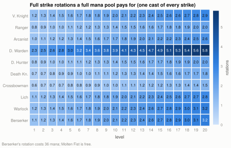
Figure 13 — How many full strike rotations (one cast of every strike ability) a full mana pool pays for. Notice Death Knight and Crossbowman never reach two.

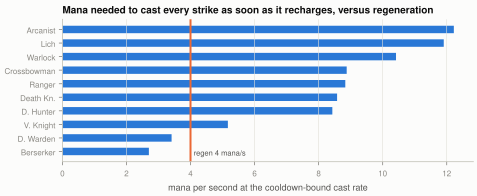
Figure 14 — Mana per second needed to cast every strike as soon as it recharges, against the fixed 4 mana per second of regeneration.

Mana grows 2.4 to 2.9× while costs are fixed, so the pool does get roomier: Lich goes from 1.1 rotations at level 1 to 2.8 at level 20, Arcanist from 1.0 to 2.6. But the rate story does not change with level at all, because regeneration is a constant 1 mana per 6 ticks. A mage that opens with a full rotation at level 1 is then limited to what regeneration buys, which is a third to a half of its cooldown-bound output. Mana potions (60 mana for 45 gold) buy about one extra primary cast pair or half an ultimate, and that does not change with level either.

## 6. Footmen and towers against level

- A footman (60 HP) takes 2 or 3 basic hits at level 1 and 1 hit from level 4 (Crossbowman) to level 11 (Druid Warden) on (figure 15).
- A gate tower kills a hero in 2 to 4 seconds at level 1 and 7 to 14 seconds at level 20 (figure 16); footman damage is 4.8 percent of average hero HP at level 1 and 1.1 percent at level 20.
- A lone hero needs 42 / 85 / 169 seconds of basic attacks for an outer / inner / gate tower at level 1, 15 / 30 / 60 at level 10, and 9 / 17 / 35 at level 20 (figure 17).

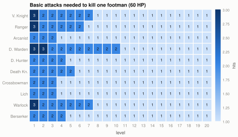
Figure 15 — Basic attacks needed to kill one footman. The step to one hit is the level at which a hero's damage reaches 60.

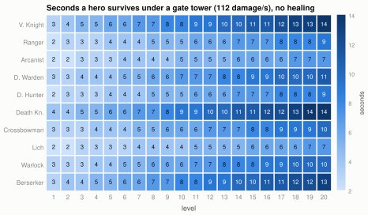
Figure 16 — Seconds a hero survives standing under a gate tower (112 damage per second) with no healing.

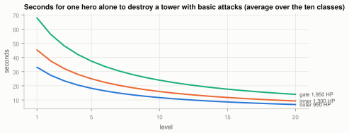
Figure 17 — Seconds for one hero alone to destroy each tower tier with basic attacks, averaged over the ten classes.

Footmen stop mattering as a threat around level 5 (their 12 damage is under 3 percent of any hero's HP) and stop costing time between level 4 and level 11 (one hit each), but they never stop being the economy: 25 XP and 15 gold each, unchanged. Towers are the opposite. Their HP is fixed, so a hero's time to take one falls with level, but their damage is also fixed and it stays lethal: at level 10 an average hero survives a gate tower for six seconds, which is less than the 60 seconds it needs to kill it. Sieging a gate solo is impossible at any level without creeps to absorb tower fire (towers target footmen before heroes, `sim.nim:1587-1663`); with a wave in front, the hero's time to kill the tower is the binding number, and that is what levels buy.

## 7. Items and consumables against level

- +14 damage (Battle Axe or Rune Crossbow, 180 gold) is 33 to 64 percent of basic damage at level 1 and 7 to 14 percent at level 20 (figure 18).
- +120 max HP (Knight Armor, 160 gold) is 34 to 65 percent of HP at level 1 and 8 to 17 percent at level 20 (figure 19).
- A Vitality Elixir (+90 HP, 50 gold) is 26 to 49 percent of HP at level 1 and 6 to 13 percent at level 20; a Poison Potion (35 damage) is 58 percent of a footman forever and 14 to 3 percent of a hero (figures 20 and 21).

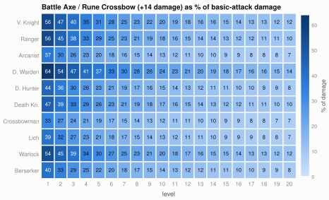
Figure 18 — The best damage item as a share of basic-attack damage.

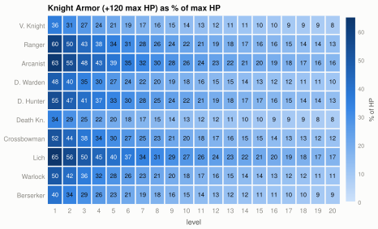
Figure 19 — Knight Armor as a share of max HP.

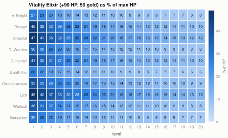
Figure 20 — One Vitality Elixir as a share of max HP.

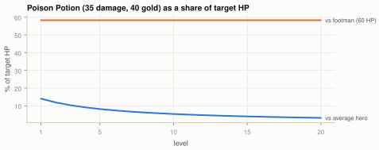
Figure 21 — Poison Potion damage as a share of a footman's HP (fixed) and of the average hero's HP.

Items are one-time purchases with no upgrade paths (`sim.nim:1512-1567` rejects a duplicate and has no recipe logic), so their value is set at purchase and then eroded by every level. The 150 starting gold, spent on Leather Gauntlets (+4) at tick one, is +16 percent damage for a Vanguard Knight at level 1 and +3 percent at level 20; the same 70 gold is a rounding error later. The ordering of purchases therefore matters more than the total: damage items first while they are a large share, HP items when fights become long basic-attack races, and consumables early, when 90 HP is a third of the bar and a poison is more than half a footman.

Poison deserves its own note: at 35 damage against a footman that never has more than 60 HP, it is a guaranteed last-hit tool for the whole match, and a last hit is 25 XP and 15 gold. At 40 gold it does not pay for itself in gold, but in XP it is the cheapest level progress in the shop.

## 8. Consequences for policy design

- The game has three phases keyed to level, not clock: burst (levels 1 to about 5), transition (about 5 to 10), and attrition (10 and up).
- Cast everything early, when a rotation is a kill; late, treat abilities as a small bonus on top of basic attacks and stop planning around them.
- Fight early when your burst is above the enemy's HP share and theirs is not; fight late only with an HP, numbers, or tower advantage, because there is no burst to swing it.
- Buy damage first, HP later, potions early; farm creeps with the poison from level 1.

**Burst phase (levels 1 to 5).** Every ultimate is a third to a half of an enemy, every kit can kill from full, footmen deal 5 percent of a hero per hit and take three hits to kill, and a hero kill is worth a level or more. This is the phase where ability timing and target selection decide the game, and where the auto-cast rule (passive, then ultimate, secondary, primary, whenever there is a combat target) is most harmful, because it spends the ultimate on the first footman. A policy that holds its ultimate for a hero and opens with it has a large, measurable edge here and only here.

**Transition (levels 5 to 10).** Burst falls through 50 percent, footmen become one-hit kills for most classes, and the +14 weapon is still 15 to 30 percent of damage. Fights start to depend on who has more HP and allies. This is where equipment matters most and where a policy should be converting gold as fast as it comes in.

**Attrition (level 10 and up).** Ultimates are 10 to 19 percent of an enemy, sustained kit damage is a tenth of basic DPS, and time to kill in a duel is unchanged from level 1 while there is nothing to shortcut it. Towers are still lethal in six to ten seconds and take a minute to kill solo. This is a game of HP pools, creep waves to tank towers, and picking fights at numbers advantage. Heals are a trickle, so retreating to recover is about respawn timers and potions, not abilities.

Two class notes. Druid Warden is a healer whose heals stop mattering after level 5 and whose single strike is the weakest kit in the game; its value is basic-attack DPS and 1,162 HP at level 20, not its abilities. Crossbowman and Lich have the largest bursts and hold them longest (above 50 percent until level 12 to 13), so they are the classes whose ability usage a policy should get right.

## Appendix A: Per-hero numbers

Level 1 and level 20 values from the engine dump (`specs.json`). DPS is damage × 24 / attack ticks. Rotation mana is one cast of every strike; sustained spell DPS is one cast per recharge per ability; spell mana/s is what that costs.

| Class | HP L1 → L20 | Damage L1 → L20 | DPS L1 → L20 | Move tiles/s L1 → L20 | Range (tiles) | Attacks/s | Rotation mana | Spell DPS | Spell mana/s |
| --- | --- | --- | --- | --- | --- | --- | --- | --- | --- |
| 0 Vanguard Knight | 330 → 1,470 | 25 → 120 | 25 → 120 | 2.32 → 2.78 | 1.17 | 1.00 | 90 | 7.8 | 5.2 |
| 1 Ranger | 200 → 922 | 25 → 139 | 33 → 185 | 2.76 → 3.44 | 5.50 | 1.33 | 130 | 14.4 | 8.8 |
| 2 Arcanist | 190 → 760 | 38 → 190 | 30 → 152 | 2.48 → 3.01 | 5.00 | 0.80 | 181 | 16.1 | 12.2 |
| 3 Druid Warden | 250 → 1,162 | 22 → 98 | 20 → 91 | 2.56 → 3.09 | 4.00 | 0.92 | 75 | 3.9 | 3.4 |
| 4 Demon Hunter | 220 → 904 | 32 → 165 | 48 → 248 | 3.04 → 3.95 | 1.25 | 1.50 | 109 | 15.4 | 8.4 |
| 5 Death Knight | 350 → 1,528 | 30 → 144 | 26 → 123 | 2.28 → 2.74 | 1.27 | 0.86 | 134 | 14.4 | 8.6 |
| 6 Crossbowman | 230 → 1,028 | 43 → 195 | 29 → 130 | 2.40 → 2.86 | 6.50 | 0.67 | 132 | 18.2 | 8.9 |
| 7 Lich | 185 → 717 | 36 → 188 | 27 → 141 | 2.40 → 2.86 | 5.50 | 0.75 | 188 | 17.4 | 11.9 |
| 8 Warlock | 240 → 1,114 | 26 → 121 | 22 → 104 | 2.48 → 3.01 | 4.50 | 0.86 | 156 | 13.8 | 10.4 |
| 9 Berserker | 300 → 1,345 | 35 → 168 | 42 → 202 | 2.72 → 3.40 | 1.33 | 1.20 | 36 | 13.8 | 2.7 |

Ability kits with effective values (`content.nim:606-716` applied to `content.nim:319-511`): the nine primary strikes (slot 1, except Druid Warden) have 3 charges, a 48-tick cooldown, and a 288-tick recharge per charge; every other ability has 1 charge with recharge equal to cooldown. Cast delays are 0 ticks for melee and projectile casts, 6 to 72 ticks for area casts. Per-ability damage, heal, mana, cooldown, and range are in the economy report's Appendix B and in `specs.json`.

## Appendix B: Method and assumptions

- **Source of numbers.** `dump_specs.nim` imports the game's `content.nim` and prints `HeroSpecs`, the effective `abilitySpec` for every class slot, and `ItemSpecs` as JSON. No number was transcribed by hand.
- **Average enemy HP** for a hero at level L is the mean of `hp(L)` over the five classes of the opposing team, both sides at the same level.
- **Time to kill** uses `ceil(HP / damage)` hits at one hit per `attackTicks` ticks, with no abilities, items, healing, movement, or the 45 percent swing offset. It measures relative scaling, not fight outcomes.
- **Sustained spell DPS** is `Σ damage × 24 / rechargeTicks` over strike abilities: the long-run rate once charges are spent. **Mana-limited** spell DPS spends 4 mana per second on the best damage-per-mana strikes first and ignores the pool. **Ten-second burst** counts all charges plus recharges within 240 ticks, mana ignored.
- **Level over time** applies a constant XP rate and the exact level thresholds; it ignores death time and the unit cap.
- **Items** are evaluated as a share of the level-scaled base stat without other items.
- Everything is deterministic from the dump; `charts.py` regenerates every figure.

## Appendix C: Sources

- `examples/gods_of_the_arena/content.nim` — class specs and per-level scaling, base and effective ability specs, item specs.
- `examples/gods_of_the_arena/sim.nim` — level curve, stat refresh, attack cadence, cast and charge mechanics, mana regeneration, tower and footman constants, rewards, purchase rules.
- `src/polyworld/configs.nim` — default match length and spawn interval.
- `.reports-working/gota-scaling-2026-09-15/dump_specs.nim`, `specs.json`, `model.py`, `charts.py` — the extraction, model, and figure code for this report.
- `gods_of_the_arena_lab/docs/leveling-economy.md` — income rates and reward rules used in section 2.
