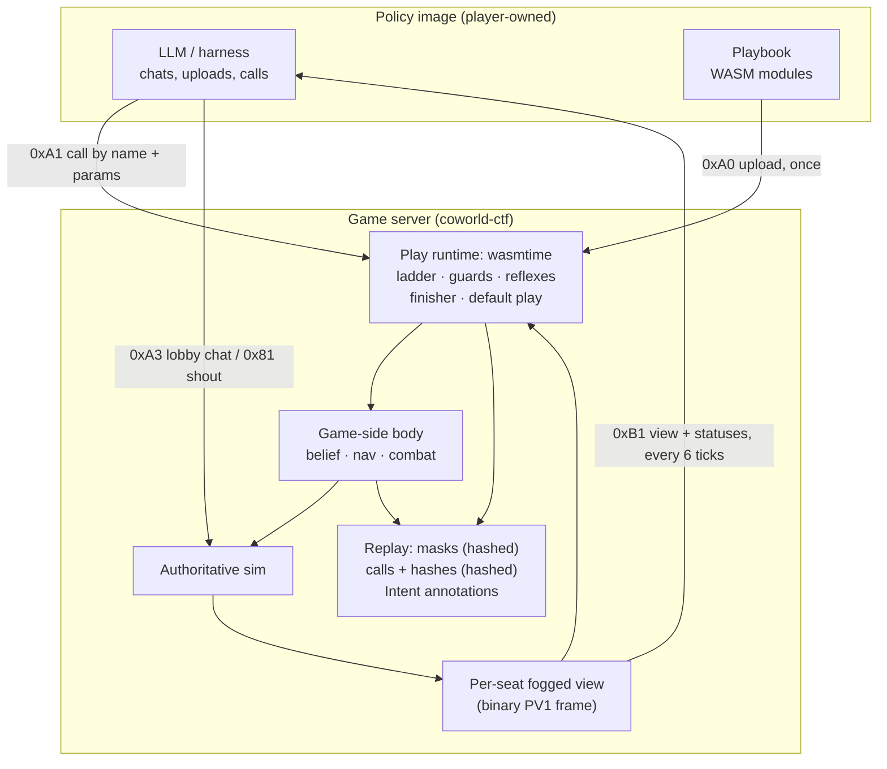
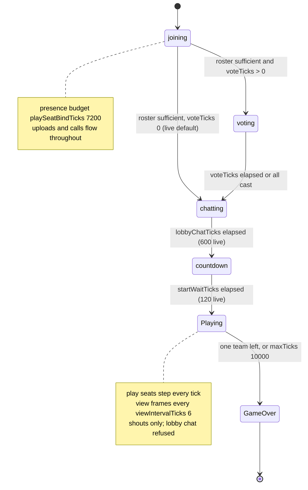
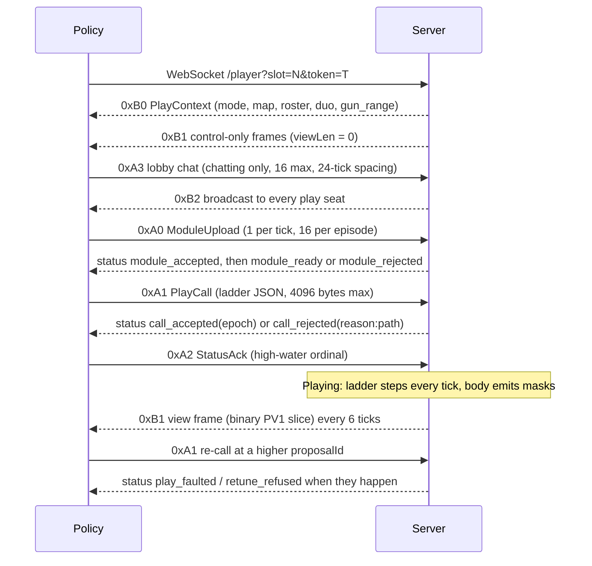
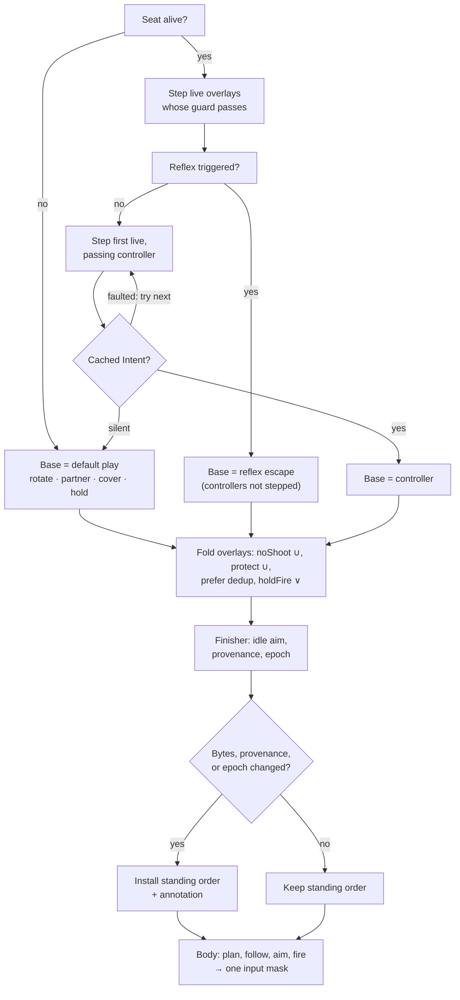
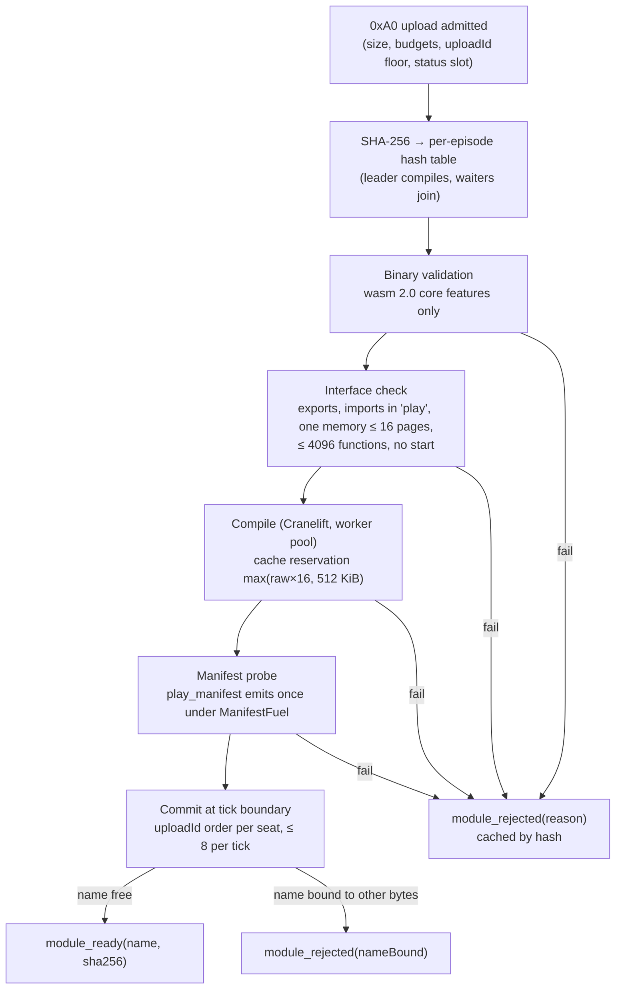

# Coworld CTF Season Two: The State of the Game

Research report for James, 2026-09-01, ahead of the Paintbot Lab overhaul: what the Season Two framework is, how the game now runs, and what the policy/play contract actually looks like in code. Researched against `Metta-AI/coworld-ctf` `main` at **`e9bc0bee`** (2026-09-01 16:33 PDT), covering the 442 commits landed since 2026-08-30 04:00 PDT. All file paths are relative to the coworld-ctf root; the play-calling design document, `docs/designs/strategy-play-calling-shell-2026-08-29.md`, is cited below as `design:<line>` because it is referenced on nearly every page.

## Executive summary

In the last thirty-six hours Paintbot flipped to Season Two. The game engine now hosts the whole execution layer that used to live in the player's process: per-seat belief, navigation, the planner, and combat, ported from Stencil into `src/shell/`. A policy no longer sends button masks. It uploads a playbook of WebAssembly modules ("plays"), then sends an ordered ladder of play names with typed parameters ("a call"), and the engine runs the plays inside an embedded wasmtime every tick, folds what they emit into one standing order (an `Intent` plus a combat policy), and drives the cog with its own body. The only live mode is `battle-royale-s2`: sixteen duos, thirty-two play seats, a giant flagless map, a six-phase closing zone that shuts completely by tick 5,000, no respawns, and a league score that is the winning team's Glory ledger and zero for everyone else. GameVersion is 50, every classic membership (583) was retired, the Elite league was retired, the three new starter policies are the league's fillers, and at HEAD the league's Season Two configuration has just been restored after a silent rollback with no round yet confirmed settled on it. A deterministic one-seat-in-thirty-two lobby-join failure is still open.

Reading the code rather than the documents surfaced seven facts that change what the lab should build (Appendix A rows 1 through 6 and 19). The socket's view payload is the fixed-layout binary frame, not the JSON the design and the packet golden describe, and the Python wire reference decodes it as UTF-8, so the shipped starters (and any Python policy built on them) will crash on their first live gameplay frame and silently keep executing their opening call (row 1). Ladder guards (`when` clauses) are validated at call time but evaluated in production against a null context, so a guard cannot gate a play on live facts; the policy must re-call instead (row 2). The three engine reflexes are hardwired always-on above every ladder and cannot be named in a call (row 3). A cog whose standing order carries a neutral combat policy never selects a target or fires, so a controller-only ladder, the engine's default play, and a reflex all leave the gun silent; a `target_law` or `pact` overlay is what arms it (row 4). The published variant pins `gunRange: 1300`, overriding the map-derived 331 px that the design, the danger-field cap, and the Glory pricing assume (row 5). The reconnect context never carries the accepted call or the playbook inventory (row 6). And the document the README calls the "authoritative Season 2 rules surface" (`BR_PLAYS.md`) is explicitly disowned by the starters' own play table on two parameters (row 19). The report states each of these with the code that proves it, and closes with what they imply for the lab.

## Table of contents

1. [Thirty-six hours, in one page](#1-thirty-six-hours-in-one-page)
2. [Vocabulary and the division of labor](#2-vocabulary-and-the-division-of-labor)
3. [How a Season Two match runs](#3-how-a-season-two-match-runs)
4. [The wire contract between policy and game](#4-the-wire-contract-between-policy-and-game)
5. [What the policy observes](#5-what-the-policy-observes)
6. [What the policy does](#6-what-the-policy-does)
7. [The ladder: how the standing order is decided each tick](#7-the-ladder-how-the-standing-order-is-decided-each-tick)
8. [The plays: the WASM ABI, the Intent, the runtime, and the SDK](#8-the-plays-the-wasm-abi-the-intent-the-runtime-and-the-sdk)
9. [The default starting plays](#9-the-default-starting-plays)
10. [The default starting players](#10-the-default-starting-players)
11. [The live league at HEAD](#11-the-live-league-at-head)
12. [What this means for the Paintbot Lab](#12-what-this-means-for-the-paintbot-lab)
- [Appendix A: the design-versus-code conflict register](#appendix-a-the-design-versus-code-conflict-register)
- [Appendix B: constants](#appendix-b-constants)
- [Appendix C: rejection vocabularies](#appendix-c-rejection-vocabularies)
- [Appendix D: the reference play manifests](#appendix-d-the-reference-play-manifests)
- [Appendix E: commit timeline of the window](#appendix-e-commit-timeline-of-the-window)
- [Appendix F: sources](#appendix-f-sources)

## 1. Thirty-six hours, in one page

- The design was re-architected twice on 2026-08-30 and ratified as "WASM over the wire, body in the game" that evening (`design:3239-3393`, `design:3395-3428`).
- The engine landed the shell dark on 2026-08-31, then flipped it live on 2026-09-01 at 09:48 PDT as GameVersion 50 (`bc2f8add`, `5912ec18`).
- The same day: the manifest was slimmed to one variant, then re-widened to ten for league compatibility; classic modes were gated behind `allowDeprecatedModes`; the seven reference plays were completed; three starter policies were written, deployed as fillers, crashed, and were fixed; 583 classic memberships and the Elite league were retired; the league's Season Two scheduler settings were flipped, silently rolled back, and restored.

The arc matters because the documents were written at different points along it and disagree with each other and with the code. The design's own decision record explains the two earlier architectures it replaced: a client-side shell with pages delivered by environment variable (revisions 1 through 10, 2026-08-29), then a "socket-Intent boundary" that kept the body game-side but ran plays in the policy image and shipped typed Intents over the websocket (2026-08-30 morning). James scrapped the second the same evening, unbuilt, and the present design is "a rewrite, not a staging of that one" (`design:3408-3428`). Everything below describes the third architecture, as implemented.

| When (PDT, 2026-09-01 unless noted) | What | Evidence |
|---|---|---|
| 08-30 evening | Ratification: plays are WASM modules run in an engine-embedded runtime; playbook upload once, call by reference; game owns ladder, reflexes, finisher, default play | `design:3239-3260` |
| 08-31 14:16 | The episode runs the ladder: WASM plays drive real cogs | `af8158f5` |
| 08-31 17:36 | Plays read binary view frames; the guest JSON reader retires (and, as it turns out, the socket copy went binary too) | `88aaddad`; §5.1 |
| 01:09 to 02:10 | Reference plays 3 through 7 land (`supply_run`, `bodyguard`, `crossfire`, `jackal`, `target_law`); the seven-play menu is complete | `4b5b324e` … `9945bceb` |
| 02:06 | Three starter policies (aggressive, cautious, collaborative) on the PoC machinery | `8f44e394` … `6b24ca09` |
| 09:48 | **The flip**: `battle-royale-s2` variant + GameVersion 50, fixtures recut | `ee0f40b2`, `bc2f8add`, `5912ec18` |
| 11:13 to 11:53 | Squad-mode de-arm (`cogsPerTeam` back to 1) and `season2Shell` defaults true with boot refusal of deprecated modes | `3de6e794`, `2653b7cc`, merged `8dfb1e60` |
| 13:20 | Manifest slimmed to `battle-royale-s2` only; nine variants archived | `e41e8922` |
| 14:07 | "Temporary union": the nine re-published behind `battle-royale-s2` because the platform refuses a manifest that strands a league (HTTP 409) | `4c8df343`; still in force at HEAD |
| 14:33 | Image 0.7.269 canonical; league fillers swapped to the three starters | `4b1cf10f` |
| 15:01 to 15:31 | First Season Two round (3589) fails 12/12 at lobby join; the deterministic 1-of-32 failure is characterized | `139c3bad`, `33c71400` |
| 15:03 | James's orders: classic memberships retired, starters enrolled, Elite retirement ordered | `757e8cbe` |
| 16:26 | Starter v1 pods crashed on connect (ignored `COWORLD_PLAYER_WS_URL`); v2 images fix it | `94c96dbc`, `6c6a85c5` |
| 16:33 | HEAD: league settings had rolled back to pre-flip; Season Two scheduler restored; pool ~4,180 credits; "schedule kick may be needed" | `e9bc0bee` |

## 2. Vocabulary and the division of labor

- The **game owns the body and the play runtime**; the **player owns the plays and the playbook**; the **policy's LLM calls plays and never writes code at runtime** (`design:35-59`).
- One policy is one seat is one cog. A duo is a Battle Royale team of two seats. There is no cross-seat call channel; the only cross-seat surfaces are the combat policy's never-shoot and protect sets, lobby chat, and in-match shouts (`design:1347-1373`; `src/shell/ladder.nim:297-300`).
- The shell is reachable only when `season2Shell` is true **and** at least one slot has `control: "play"`. The published variant marks all thirty-two slots `play` (`src/shell/seats.nim:79-88`; `coworld_manifest_paintbot.json:1179-1295`).


Figure 1 — The runtime shape as implemented. Nothing that runs at tick rate crosses the socket; the policy sees a slower stream of the same view the plays read, and the replay records masks (hashed), calls with module hashes (hashed), and Intent annotations (not hashed).

The terms below are used throughout, with the code that defines each.

**Policy.** The player-submitted container image with an LLM (or any decision logic) inside, connected to one seat's websocket. It is not in this repository; the four things it may send are a module upload, a play call, a status acknowledgment, and a lobby chat line, plus the legacy Sprite chat packet for shouts (`src/shell/dispatch.nim:49`; `design:23-27, 52-59`). Direct input masks (`0x84`) and ready packets (`0x85`) from a play seat are classified as ignored (`src/shell/dispatch.nim:66-74`).

**Seat and play seat.** A configured slot in the trusted match configuration. `PlayerSlotConfig.control` is a closed enum, `scInput` or `scPlay`; a `play` slot with explicit `season2Shell: false` is a validation error (`src/ctf/sim_types.nim:1803-1811`; `src/ctf/sim_config.nim:1010-1021`). `isPlaySeatEpisode` is conjunctive: `season2Shell` alone arms nothing (`src/shell/seats.nim:79-88`; `src/shell/types.nim:9-13`).

**Cog.** The in-sim robot, one per seat, `MaxPlayers = 32` (`src/ctf/sim_types.nim:620`). The engine drives it; the policy never does.

**Body.** Stencil's execution machinery ported into `src/shell/`: `SeatBody` (`body.nim`), the navigation coordinator, resumable planner, immutable episode map with the goal validator, bounded per-seat caches, the cover scorer, and the reflex escape planner (`design:152-193`; `src/shell/body.nim`, `body_nav.nim`, `body_planner.nim`, `body_map.nim`, `body_cache.nim`, `cover_scorer.nim`, `plan_escape.nim`). It executes a *standing order* every tick until a play replaces it; a play that emits nothing for a thousand ticks has a cog that keeps doing the last thing it was told (`design:189-193`).

**Shell.** `src/shell/` as a whole: the body plus the play runtime and everything around the player's WASM: the ladder driver, guard evaluator, reflexes, finisher, default play, the view builders, the wire codecs, and the seat state machines (`design:42-50`). Three hard rules separate it from the sim: the sim calls into the shell only at the one seam where masks are collected; the shell reads sim state only through the fog-filtered accessors that build the view; and the shell sits outside the determinism hash boundary because it is never re-run during playback (`design:197-227`).

**Play, controller, overlay.** A play is a core wasm32 module implementing the play ABI. Its manifest declares a class: a **controller** emits an `Intent` (where to go and how); an **overlay** emits only a `CombatPolicy` (whom never to shoot, whom to protect, whom to prefer, whether to hold fire) (`src/shell/manifest.nim:12-13, 330-334`; `src/shell/emit_validator.nim:12-14`).

**Playbook, call, ladder, epoch.** The playbook is the set of modules a seat has uploaded and bound by name for the episode. A call is a JSON document, an ordered ladder of up to sixteen entries naming plays with parameters and optional guards. Each accepted call increments the seat's **call epoch**; epoch zero means "no declaration" (`design:2001-2005, 599-617`; `src/shell/ladder.nim:319-365`).

**Instance and standing order.** Each ladder entry owns at most one WASM instance, created lazily with one wasmtime `Store` (`src/shell/instance.nim:54-67`; `src/shell/types.nim:106-114`). The standing order is the `Intent` the body executes, recomputed every tick from the selected base plus the folded overlay policies, and installed only when its bytes, provenance, or effective epoch change (`src/shell/standing_order.nim:123-145`).

**Control generation.** A per-seat counter assigned 1 at registration and bumped on activation, death, respawn, reconnect, replacement, and kick, stamped on every status so a replaced process can tell which era an outcome belongs to (`design:813-817`; `src/shell/seats.nim:37-55`).

**Game mode.** Derived, never declared: `brMode` true means `gmBr`; `hill` means `gmKoth`; otherwise `gmCtf` (`design:1299-1302`; `src/shell/types.nim:26-30`). The episode owner collapses this to `gmBr` or `gmCtf` because king-of-the-hill is not wired (`src/shell/episode.nim:461`).

**Brain.** In this report the word means the policy-side decision logic only: the LLM or rules inside the policy image that chat, upload, and call. The engine's orchestration around the plays (ladder, guards, reflexes, finisher, default play) is the shell, not a brain; it decides which play's order stands, never what to call.

### 2.1 What changed from Stencil in the port

- The strategy layer, the role concept, and the habit of mutating shared belief during a decision were discarded, not ported; the body keeps only execution: movement, aiming, fighting, validated navigation (`design:120-127, 3268-3275`).
- Nine "ported-with-improvement" rulings change behavior on purpose, each allow-listed in the differential test against Stencil on CTF; Battle Royale has no Stencil oracle at all (`design:229-353`).

The rulings, in the design's order (`design:231-333`):

1. **One target-acquisition route.** The nearest-enemy fallback and the spray selector's independent scan both collapse into the scored selector; the never-shoot filter applies there and is vetoed again before each weapon fires.
2. **Type-enforced goal validation.** The engine's `makeIntent` accepts only a `ValidatedGoal`, whose sole constructor is the reachability validator; plays reach the same validator by host function.
3. **No pursuit override.** The spray-pursuit override is deleted, not made optional.
4. **Bounded route-field cache.** Four fields per seat, with the standing goal's field pinned so eviction can weaken the heuristic only for a different goal.
5. **Staggered danger-field rebuilds.** Round-robin across seats, because thirty-two simultaneous rebuilds measured about 109 ms.
6. **Bounded cold planning per tick.** A search-expansion budget with resumable state, because one cold plan on the giant field measured about 65 ms.
7. **Capped danger-rebuild sources.** The eight nearest live threats.
8. **Danger rays capped at the live weapon range.**
9. **Atlas candidate thinning.** Cover posts minted only on a 16-px candidate grid.

The body also runs thirty-two seats in one process with per-seat bounded caches (four route fields, 256 duck entries) over one immutable shared episode map, which Stencil never had to do (`design:162-180`). What is unchanged is the executor itself: action resolution, the corridor-bounded follower, the weighted A* planner, and the combat layer, verified by a temporary side-by-side adapter that the design requires be deleted once the gate passes (`design:181-193, 335-353`). That differential test is CTF-only because Stencil cannot run Battle Royale; Battle Royale behavior is validated by body invariants, golden scenarios, and full-episode runs, never against Stencil (`design:335-353`). Section 12 says what that means for the lab.

## 3. How a Season Two match runs

- One ruleset is live: battle royale with `brMode: true`, no respawns, last team standing, timeout resolved by tiebreak (`docs/RULES.md:770-800`).
- Thirty-two seats in sixteen duos on one pinned 3211 by 1713 px map; both members of a duo spawn on the same pixel (`coworld_manifest_paintbot.json` s2 `game_config`; `docs/designs/BR_LADDER.md:166-170`).
- The zone shuts completely by tick 5,000 of a 10,000-tick cap; from phase 2 on, one second outside kills a bare 3-hp cog (`coworld_manifest_paintbot.json` s2 `zonePhases`; `docs/RULES.md:802-844`).
- The live gun range is **1300 px**, set explicitly in the variant; the map-derived 331 px the design reasons about is not what runs (§3.5).
- The league score is the winning team's Glory and zero for everyone else; placement rides a separate reward channel and never reaches the standings (§3.6).
- GameVersion is 50; only GV50 replays load; playback never re-runs WASM (§3.7).

### 3.1 The ruleset

The published variant sets `brMode: true`. A death is permanent for the round; `lives` and `respawnTicks` are never consulted for re-entry. The round ends the instant at most one team has a living player; a simultaneous final wipe is a draw. Flags and hearts are inert (the map is flagless). If the clock runs out with more than one team standing, the team with the most living players wins, then total damage dealt, then a draw. Environmental deaths (zone, barrage) go through the same no-respawn path (`docs/RULES.md:770-800`; `coworld_manifest_paintbot.json:353-357`).

Combat itself is unchanged from classic. Across all `brMode` references in `src`, none gates combat damage: gun 1 hp per hit, grenade 2, spray 3, shield layer 3, hit points 3 (`docs/designs/BR_LADDER.md:143-153`, a historical document whose numbers still match `src/ctf/sim_types.nim:510-864`). Friendly fire is on and split-accounted (`docs/RULES.md:339-346`). Dead players drop nothing (`docs/designs/BR_LADDER.md:143-153`).

### 3.2 Roster and map

The engine's `Team` enum is sixteen wide and its order is locked to the tint art pipeline: red, blue, green, yellow, black, silver, ivory, pink, umber, rust, orange, plum, lime, navy, azure, peach (`src/ctf/sim_types.nim:1299-1325`; `src/shell/schemas/README.md:46-51`). The variant seats `num_agents: 32`, `minPlayers: 32`, `teams: 16`, and thirty-two slots, every one `{"team": <color>, "control": "play"}`; slot k and slot k+16 carry the same color, which is the duo pairing (`coworld_manifest_paintbot.json:1179-1295`). A duo is *defined* as a Battle Royale team; there is no per-slot duo field, and play-seat validation in `gmBr` requires the launch shape exactly: thirty-two slots, all sixteen teams present, two slots each (`design:1347-1364`).

The map is one fully expanded, pinned spec, `br-gen-1339`: 3211 by 1713 px (about 6.9 times the classic area), `flagless: true`, sixteen spawn points, 33 medkit spawns, 37 spray cans, 20 grenades, 13 shields, zero trenches, 130 obstacle shapes (`coworld_manifest_paintbot.json` s2 `mapSpec`; `docs/designs/BR_LADDER.md:162-164`). It was drawn by `tools/brmapkit.nim` at `GiantScale = 2.6` over the classic 1235-px width; the generator derives `gunRange = sqrt(W·H/(16π)) ≈ 331` and writes it into the spec (`tools/brmapkit.nim:345, 395-413`). A certified pool of eleven expanded specs exists in `data/br_map_pool.json` but is explicitly not wired into the live variant or the (dark) vote path (`src/ctf/br_map_pool.nim:1-33`). Map-relative ranges move with the map: `ShoutRange` and `GrenadeMaxRange` are `MapWidth div 5`, which is **642 px** on this board, not the ~247 px the classic rules text quotes (`src/ctf/arena.nim:4041-4053`; `docs/RULES.md:492`).

### 3.3 The clock and the phases

The engine ticks at 24 per second (`src/ctf/sim_types.nim:440, 499`). The coarse phase enum is `Lobby`, `Playing`, `GameOver` (`src/ctf/sim_types.nim:1412-1415`), and with any play seat the lobby runs as guarded substates inside `stepLobby`: joining, then voting (only if `voteTicks > 0`; it defaults to 0 and the vote packets are not admitted by the classifier, so it is dark), then chatting, then countdown (`src/ctf/sim.nim:6259-6326`). Both held substates are checked before roster sufficiency, so an input seat leaving does not end them.


Figure 2 — The episode's phases with the live variant's timings. Voting is present in the sim but dark in production; lobby chat is the only pre-match channel; uploads and calls are accepted in every lobby substate.

The live timings: `lobbyChatTicks: 600` (25 s; the engine default is 720), `startWaitTicks: 120`, `playSeatBindTicks: 7200` (a five-minute cumulative absence budget for the whole pre-activation period, not a first-bind timer), `viewIntervalTicks: 6`, `maxTicks: 10000`, `gameOverTicks: 360` (`coworld_manifest_paintbot.json` s2 `game_config`; `design:2486`; `src/ctf/sim_types.nim:952-958`). During `chatting` the server's early frame advance is suspended even in fast mode, so 600 ticks is 25 wall-clock seconds for an all-play roster (`design:2490-2497`). Shouts are refused outside `Playing` and lobby chat is refused outside `chatting` (`docs/designs/BR_SEASON2_LANDING_PLAN.md:118-119`; `src/ctf/sim.nim:6395-6396`).

### 3.4 The zone

The zone is a rectangle of the map's own aspect ratio scaled about a center drawn once per game from the sim RNG; each phase is `{z, waitTicks, shrinkTicks, dps}`; standing outside for a full continuous second deals `dps` hit points through the shield layer; a lethal tick is an environmental death with no kill credit (`docs/RULES.md:802-844`; `src/ctf/sim_types.nim:926, 936`). The live schedule was retimed on 2026-08-31 after a 144-episode calibration showed most games hitting the 10,000-tick cap; the new table drops median length to 4,540 ticks and raises mean teams eliminated from 13.9 to 15.2 of 16, at the known cost of a 20.8% draw rate (`4f5fefa4`, PR #341).

| Phase | z | wait | shrink | dps | tick window | wall clock |
|---|---|---|---|---|---|---|
| 1 | 0.75 | 345 | 213 | 0 | 0 to 558 | 0 to 23 s |
| 2 | 0.55 | 0 | 244 | 3 | 558 to 802 | 23 to 33 s |
| 3 | 0.35 | 0 | 348 | 6 | 802 to 1150 | 33 to 48 s |
| 4 | 0.20 | 0 | 600 | 10 | 1150 to 1750 | 48 to 73 s |
| 5 | 0.08 | 0 | 1550 | 15 | 1750 to 3300 | 73 to 138 s |
| 6 | 0.001 | 0 | 1700 | 20 | 3300 to 5000 | 138 to 208 s |

Source: `coworld_manifest_paintbot.json` s2 `zonePhases`; windows derived. A bare 3-hp cog outside in phase 2 dies in one second; phases 3 through 6 one-shot it per roll. The lookahead is exactly one phase: `zonenext` is the rectangle the current one is interpolating toward (`docs/designs/BR_LADDER.md:108-114`). The play view exposes `phase`, `current`, `next`, `ticks_to_shrink`, and `dps`, saturating the sim's "no more phases" sentinel to `high(int32)` so `ticks_to_shrink <= enterLead` never fires at the final phase (`src/shell/episode.nim:191-229`).

### 3.5 Combat in force, and the gun-range discrepancy

| Mechanic | Live value | Source |
|---|---|---|
| Hit points | 3 (pinned; proven a live lever under `brMode` by `tests/test_loot_rework.nim`) | `coworld_manifest_paintbot.json`; `7a33d582` |
| Gun range | **1300 px** (variant `gunRange`); vision cone reaches 1.5× = 1950 px | see below |
| Fire windup / cooldown | 5 / 12 ticks; aim locks at the pull; hitscan at release | `src/ctf/sim_types.nim:541-542`; `docs/RULES.md:352-386` |
| Vision | ±60° cone around aim plus a 90-px bubble; stone blocks sight; bullets invisible; only the impact ring is audible | `src/ctf/sim_types.nim:588-589`; `docs/RULES.md:256-305` |
| Aim | 256 brads per turn, 5 brads per tick | `src/ctf/sim_types.nim:585-587` |
| Grenade | 2 hp, blast radius 52, range 642 px on this map, hurts everyone including the thrower | `src/ctf/sim_types.nim:764-787`; `docs/RULES.md:407-415` |
| Spray can | 3 hp per touch, reach 170, one burst per 25 ticks, needs line of sight | `src/ctf/sim_types.nim:810-856`; `docs/RULES.md:465-468` |
| Shield | 3-hp layer, 3× fire cooldown while carried | `src/ctf/sim_types.nim:859-864` |
| Medkit | heals to full; 720-tick respawn; 33 on the map | `docs/designs/BR_LADDER.md:143-153` |
| Shout | 10 chars, one per second, 3-s bubble, audible within 642 px through walls and fog; anonymous slot letter | `src/ctf/sim_types.nim:944-946, 1296`; `docs/RULES.md:487-512` |
| Movement | continuous, max 704/256 ≈ 2.75 px per tick per axis; solid bodies with 40% bounce | `src/ctf/sim_types.nim:487-496` |
| Off in this variant | barrage (`barrageMaxPerSec: 0`), barriers, puddles, trenches, all five loot-rework mechanisms | `coworld_manifest_paintbot.json`; `src/ctf/sim_config.nim:101-112` |

The gun range deserves its own paragraph because three sources disagree and the code decides it. The design's doctrine, repeated in the danger-field ruling and the ward-threat test, is that Battle Royale's giant field derives 331 px from the equal-share territory formula (`design:311-322, 447-451, 3457-3459`); the pinned map spec carries `gunRange: 331`; and the Glory pricing comments price BR deeds against "BR's 331px gunRange" (`src/ctf/glory.nim:283-288`). But the variant's `game_config` sets a top-level `gunRange: 1300`, and the loader applies the map's value only when the key is absent: `if not node.hasKey("gunRange"): config.gunRange = mapMeta.gunRange` (`src/ctf/sim_config.nim:1178-1179`). Everything downstream reads `sim.config.gunRange`, including aim jitter and the vision range (`src/ctf/sim.nim:2574-2580, 4191-4195`), and the body's live weapon range comes from the same config (`src/shell/episode.nim:241`). So the live sim runs a 1300-px hitscan on a 3211-px board, roughly four times the range the design reasons about, and sight reaches 1950 px. The manifest's schema default for `gunRange` is also 1300 while the engine constant is 1050 (`coworld_manifest_paintbot.json:177-182`; `src/ctf/sim_types.nim:514`). Whether 1300 is deliberate or inherited from the archived first-generation `battle-royale` variant (which carries the same pair) is not recorded anywhere in the tree.

The five loot-rework mechanisms (`medKitCount`, `bandagePickups`, `lootStart` with unarmed spawn and crates, `downedMode` with ghost/tag-back revive/bleed-out, and the map-scale generator knob) are all landed dark: their engine defaults are off, `lootStart` and `downedMode` require `brMode`, and none of the seven keys appears in the variant or in the manifest's 74-key `config_schema`, so they are not even expressible through the published manifest today (`src/ctf/sim_config.nim:101-112, 1067-1070`; `ca72c9c5`, `c3a75a7d`, `2e99d5da`, `464c4c85`, `be1ea421`; `docs/RULES.md:846-909`).

### 3.6 Scoring: Glory is the score, and placement is not

Glory (`GloryVersion = 12`) is minted per act through a deed table, multiplied by a heat streak ladder and a site gradient, and banked to `sim.teamGlory[team]` (`src/ctf/glory.nim:214-216, 603-640, 718-743, 767-839`). The combat deeds that can fire in BR: first blood 12, honorable kill 10, spray kill 12, grenade kill 12, point-blank 12, longshot 30, splash multi-kill 35, revenge 18, run-down 16, ace tag 40, team kill **−60**, shield soak 4 per hp. Flag deeds are inert (flagless map), `dWipe` is disabled in `brMode`, and the v12 alliance deeds `dAssist`/`dRescue` are gated off in BR (`src/ctf/glory.nim:266-275, 305-306`). Per-life XP is damage-only in BR (`XpPerDamage = 3`), level thresholds are doubled there (`BrLevelThresholdMultPct = 200`, so 18/30/48/66/96 XP), and a cog at level 3 or above wears the visible ember plume that the view exposes as the `bounty` track flag and that `target_law` can prefer (`src/ctf/glory.nim:852-909, 976-1061`; `src/ctf/server.nim:3488-3489`; `src/shell/view.nim:951`).

The league score is literal. `playerResultsJson` writes `scores[slot] = sim.teamGlory[team]` only when the game reached `GameOver`, the seat has a team, and that team won; every other seat, and every seat in a draw or an aborted episode, reports 0 (`src/ctf/roster.nim:898-928, 1000-1022`). The BR placement bonus table (`BrPlacementBonus`, 5/4/4/3/3/2/2/2/1/1/1/0/0/0/0 for ranks 2 through 16, gated on at least one attack or point of damage) modifies the per-tick RL `reward` account, a different channel delivered over a different packet, and never reaches `scores` (`src/ctf/sim_types.nim:633-652`; `src/ctf/sim.nim:4578-4599`). The variant description's "classic scoring with placement bonuses" describes that reward channel, not the standings (`coworld_manifest_paintbot.json:1076`; `docs/RULES.md:911-915`). For a policy author: only winning banks anything, a draw banks nothing, and a team kill costs sixty.

### 3.7 GameVersion 50 and replays

`GameVersion = "50"` and the replay-load allowlist is `["50"]` only, because GV50 is the first version whose replays carry the shell's `0x10` through `0x16` records and the fixtures were recut rather than header-upgraded (`src/ctf/sim_types.nim:30-54`; `bc2f8add`). Replay format 2 adds the hash-coupled play-call record (`0x10`), the non-hashed behavior annotation array (`0x11`), the end-of-episode manifest (`0x12`), lobby chat (`0x13`), disconnect/kick/rebind lifecycle records (`0x14` to `0x16`), and reserves `0x17` for the vote (`src/shell/types.nim:265-292`). The codec accepts format 1 and 2 (`src/ctf/replay_codec.nim:441-448`). Playback never re-executes plays: both replay paths consume only the recorded input masks, which is why the design keeps the body and the runtime outside the hash boundary (`design:2353-2383`; `edbdf2f9`). The served static viewer had to be rebuilt because it still pinned GV48 and rejected every GV50 replay at load (`edbdf2f9`), and a CI drift guard was added (`76a8b3e3`).

### 3.8 What is deprecated, and what is still published

Since image 0.7.253 live boot refuses classic CTF, an explicit `season2Shell: false`, paintball, and squad mode unless `allowDeprecatedModes: true` is set; the refusal names its triggers (`src/ctf/sim_config.nim:121-148`; `design:3223-3235`). A binary built without the wasmtime toolchain refuses any play-seat config at boot (`src/shell/runtime_boot.nim:12-23`). The squad-mode de-arm matters historically: from 0.7.243 `cogsPerTeam` defaulted to 4, which armed paintball's squad path on every classic variant, discarded every real seat input, and froze every live classic episode; round 3543's "618-0" standings were artifacts, not play (`docs/coordination/agents-notes.md:486`; `3de6e794`; `src/ctf/sim_config.nim:65-69`).

The README says the sole published variant is `battle-royale-s2` (`README.md:24-27`), and the design's H.0 ruling says the same (`design:3223-3235`), but the manifest at HEAD carries ten variants: `battle-royale-s2` first, then `2v2`, `4ffa`, `4ffa8`, `default`, `1v1`, `ctf-default`, `ctf-1v1`, `paintball`, `battle-royale`. The slim (`e41e8922`) was reverted the same afternoon by the "temporary union" (`4c8df343`) because canonicalization returns HTTP 409 for a manifest that strands a league's variant reference, and Elite Paintbot still pointed at `2v2`. Elite was retired later that evening, but no manifest commit follows `4c8df343`, so the union is what is published (`git log 4c8df343..e9bc0bee -- coworld_manifest_paintbot.json` is empty; `docs/coordination/agents-notes.md:572-586, 687-690`). The boot refusal still governs live play, so nothing deprecated is runnable.

## 4. The wire contract between policy and game

- Same `/player?slot=N&token=T` route as a legacy seat, authenticated before the websocket upgrade; the platform hands the full URL to the pod in `COWORLD_PLAYER_WS_URL` (`src/ctf/server.nim:2548-2564`; `policies/starters/common/starter_harness.py:560-581`).
- Nine packet types, binary, little-endian, one packet per message, every one `u8 op, u8 ver=1`, exact length equations, no trailing bytes (`src/shell/types.nim:219-254`; `src/shell/packets.nim`).
- A play seat's socket also carries the legacy Sprite broadcast stream; a client must ignore leading bytes it does not own (`policies/poc_llm_policy/wire.py:239-251`).
- Statuses are durable, ordinal-stamped, and ride every view frame until acknowledged; over-budget uploads and calls are dropped silently into counters (`src/shell/outbound.nim:109-175`; `src/shell/ingress.nim:132-164`).
- The recovery context a reconnecting process receives is incomplete today: no accepted call, no playbook inventory, epoch hardcoded to 0 (§4.3).

### 4.1 Transport and connection

The Season Two seat uses the same websocket route as a Sprite input seat, `WebSocketPath = "/player"`; `slot` and `token` come off the query string, and a mismatch is an HTTP 403 before upgrade, with four named texts (`src/ctf/sim_types.nim:1277`; `src/ctf/server.nim:1936-1950, 2128-2146, 2548-2564`). What differs for a configured play seat is only the transport caps selected at upgrade: a 262,158-byte receive limit (exactly `14 + MaxModuleBytes`), 128 pending events, 1 MiB pending bytes, and a bounded outbound queue of 256 events / 2 MiB (`src/ctf/server.nim:1952-1955, 2565-2574`; `src/shell/transport.nim:14-24`; `src/shell/types.nim:314-319`).

The platform starts every policy pod with `COWORLD_PLAYER_WS_URL` (`ws://host:port/player?slot=N&token=T`). The starter harness parses it and prefers it over the local `POC_*` variables; that fix (`94c96dbc`) is what turned the v1 filler crash into working v2 images. The PoC harness itself still builds its URL from `POC_*` alone (`policies/poc_llm_policy/poc_policy.py:412-413`), and the starter re-composes the URL as `ws://`, so a `wss://` hosted URL would be downgraded (`policies/starters/common/starter_harness.py:470-471`). `docs/PROTOCOL.md` is the deprecated Sprite v1 protocol and documents none of Season Two (`docs/PROTOCOL.md:1-6`).

### 4.2 The packets

| Op | Direction | Layout | Total | Cap |
|---|---|---|---|---|
| `0xA0` ModuleUpload | client → server | `u8 op, u8 ver, u64 uploadId, u32 len, u8[len] wasm` | 14 + len | len ≤ 262,144 |
| `0xA1` PlayCall | client → server | `u8 op, u8 ver, u64 proposalId, u32 len, u8[len] canonical ladder JSON` | 14 + len | len ≤ 4,096 |
| `0xA2` StatusAck | client → server | `u8 op, u8 ver, u8[6] reserved=0, u64 mark` | 16 fixed | — |
| `0xA3` LobbyChatSend | client → server | `u8 op, u8 ver, u32 len, u8[len] UTF-8` | 6 + len | len ≤ 512 |
| `0xA4` BallotCast | client → server | 16 fixed; codec exists, **not admitted by the classifier** | 16 | dark |
| `0x81` Sprite chat | client → server | Sprite codec framing; the in-match shout, 10 chars | — | — |
| `0xB0` PlayContext | server → client | `u8 op, u8 ver, u32 controlLen, control JSON, u32 ctxLen, context` | 10 + both | 20,480 + 65,536 |
| `0xB1` PlayView | server → client | `u8 op, u8 ver, u32 tick, u32 controlLen, control JSON, u32 viewLen, view` | 14 + both | 20,480 + 32,768; `viewLen = 0` is control-only |
| `0xB2` LobbyChatBroadcast | server → client | `u8 op, u8 ver, u64 ordinal, u32 tick, u8 seat, u8 team, u32 len, u8[len]` | 20 + len | len ≤ 512 |
| `0xB3` VoteState | server → client | 18 fixed, two kinds; dark | 18 | dark |

Sources: `src/shell/types.nim:229-254, 262`; `src/shell/packets.nim:161-262, 289-356`; `src/shell/vote_packets.nim:120-186`; `src/shell/dispatch.nim:49`. Every packet's size is an exact equation of its length fields; the decoder rejects a wrong version, a nonzero reserved byte, a short header, a length mismatch, trailing bytes, and a limit breach (`src/shell/packets.nim:10-25`). Nine byte goldens under `tests/fixtures/shell/packets/` pin them, including a maximum-size upload and a control-only view.

### 4.3 The lifecycle on the wire


Figure 3 — One seat's episode on the wire, in the order the starter harness performs it. Statuses arrive only inside the view packet's control envelope, never in the context packet.

**Pre-activation.** The protocol begins at socket registration, which can be well before the seat activates. The server assigns control generation 1, sends the context (whose gameplay payload depends only on mode, map, and the closed roster), and from then on sends control-only view frames (`viewLen = 0`) at view cadence and whenever a status is minted. Uploads, calls, acknowledgments, and budgets behave exactly as after activation; an accepted call becomes the current declaration and its entries activate lazily once the seat does (`design:529-542`; `src/ctf/server.nim:1683-1690`; `src/shell/outbound.nim:228-232`).

**Activation.** When the seat activates the server bumps the generation, installs a safe standing order (hold at spawn, empty combat policy) at epoch zero, and the engine's default play is the active controller. A policy that never sends anything plays the default; there is no undefined window (`design:543-548`; `src/shell/episode.nim:834-862`; `src/shell/body.nim:475-478`).

**Death, respawn, disconnect.** On death the standing order is cleared and the ladder parks: no play steps, instances keep their memory. In BR the seat is marked eliminated and never reactivates (`src/shell/episode.nim:822-832, 926-929`). On disconnect nothing changes at all: the ladder keeps running and the body keeps executing; "an absent policy is an AFK strategist, not an AFK cog" (`design:818-827`). A rebind from the same slot and token wins over any older socket, bumps the generation before admitting a message, and discards the old socket's queued messages (`src/shell/seats.nim:37-77`; `src/ctf/server.nim:2586-2587`).

**Recovery on reconnect.** The design's normative inventory says the fresh context carries the current generation, the current epoch, the accepted call itself, the playbook inventory with ready states, the id floors, and the status high-water mark, "enough to resume without guessing and without re-uploading" (`design:828-836`); the schema and the golden agree (`src/shell/schemas/control_context.schema.json:31-78`; `tests/fixtures/shell/control_context.golden.json`). The encoder never emits `call` or `playbook`, and its own comment says those "attach here once lane A exposes its episode seam"; the server hardcodes `epoch: 0` on every context send (`src/shell/outbound.nim:214-226`; `src/ctf/server.nim:1615-1616`). A reconnecting process today gets generation, budgets, floors, ack mark, and transcript mark, and must remember its own call and playbook.

**Seats never compact.** In a play-seat episode no seat row is removed before teardown: an input seat that leaves keeps its row with zero masks, a play seat's transport loss changes nothing in the sim, and a kick is a terminal tombstone that disables the seat's play step and body for the rest of the episode (`design:855-1006`; `src/shell/seats.nim:20-32, 107-119`; `src/ctf/server.nim:4798-4800`).

### 4.4 The status stream

Every outcome is an entry in one per-seat list with a server-assigned monotonic ordinal and an immutable origin generation: `module_accepted`, `module_ready` (name, sha256), `module_rejected` (reason), `call_accepted` (proposal_id, epoch, tick), `call_rejected` (proposal_id, reason with parameter path), `retune_refused` (epoch, entry_id, reason), `play_faulted` (epoch, entry_id, reason) (`src/shell/types.nim:117-124`; `src/shell/schemas/status_entry.schema.json:12-22, 65-355`). Entries ride every view frame until acknowledged with a `StatusAck` high-water mark; a mark below the current floor or above the highest issued is refused and mints a synthetic `call_rejected` with `proposal_id: "0"` and reason `status_ack_out_of_range` (`src/shell/outbound.nim:158-175`; `src/ctf/server.nim:926-930`). The list holds 64 entries, 16 reserved for faults, each capped at 256 serialized bytes with the reason trimmed to fit (`src/shell/types.nim:306-309`; `src/shell/outbound.nim:92-129`). Every 64-bit identity is a decimal string; `tick` is a plain number (`src/shell/module_cache.nim:136-186`).

Two behaviors bite a naive client. Capacity is reserved at admission: an upload reserves 2 slots and a call reserves 17 (one plus one per possible retune, regardless of how many entries carry `retune: true`), out of 48 regular slots (`src/shell/ingress.nim:96-99, 309`). And the per-tick admission budgets, one upload and two calls per seat per tick, are enforced by dropping the excess into `control_view.counters.dropped_uploads` / `dropped_calls` with no status entry; "a client that uploads its whole playbook back to back loses everything after the first module and is told nothing" (`src/shell/ingress.nim:132-164`; `policies/poc_llm_policy/README.md:374-378`). Sixty-four messages or 524,288 bytes classified in one tick disconnects the seat (`src/shell/ingress.nim:111-130`).

### 4.5 Lobby chat

A `0xA3` line is admitted by one ordered algorithm: at most 512 raw bytes, valid UTF-8 with no overlong or surrogate encodings, no C0/C1 control scalars except a line feed, not blank by an ASCII-only predicate; then at most 16 messages per seat per phase and no two closer than 24 ticks; outside `chatting` it is refused (`design:2500-2516`; `src/ctf/sim.nim:6387-6412`). The code's reason enum spells these `lcrClosed`, `lcrBadSeat`, `lcrTooLong`, `lcrInvalidUtf8`, `lcrControlChar`, `lcrEmpty`, `lcrRateLimited`, `lcrTooSoon`; the design's `lobbyText` / `lobbyClosed` names are not what the wire says (`src/ctf/sim_types.nim:3175-3186`). An accepted line is stamped with an episode-wide ordinal, the tick, the sender's seat and team, and broadcast to every play seat including the sender; on every bind the server replays the whole transcript from ordinal 1 before opening the live stream, 64 packets per tick (`design:2522-2546, 2571-2581`; `src/ctf/server.nim:1635-1660`). Identity is open on purpose: a policy hears `seat:N` and can write `duo:navy` or `seat:N` into its next call with no translation. After the phase, in-match communication is the shout.

The spacing trap is real and documented: a second line from the same seat within 24 ticks is refused `lobby_chat:lcrTooSoon` and dropped; the collaborative starter's model line plus coordination line would lose the second unless spaced, so the harness holds ~1.5 s and confirms the echo (`policies/starters/README.md:75-86`; `policies/starters/common/starter_harness.py:418-442`).

### 4.6 The vote (designed, dark)

A `voting` substate, a 16-byte `0xA4` ballot (options A/B/C/D), and an 18-byte `0xB3` state packet are designed and their codecs landed (`docs/designs/prematch-vote-wire-2026-08-31.md`; `src/shell/vote_packets.nim`), but `voteTicks` defaults to 0 regardless of play seats, the classifier does not admit `0xA4`, and the ballot's declared variant pool still lists only legacy variants, so it is doubly dark (`src/ctf/sim_config.nim:98-100`; `src/shell/dispatch.nim:49`; `docs/coordination/agents-notes.md:431-442`). The `types.nim` comment saying the layouts are undefined is stale (`src/shell/types.nim:256-263`).

## 5. What the policy observes

- Two readers, one selected model: the play instance in-process every tick, and the policy over the socket every `viewIntervalTicks`; the design says the socket copy is JSON, and today it is the binary frame (§5.1).
- The context is episode-static: mode, map, roster, own seat and duo partner, live gun range, view interval (§5.2).
- The view is the seat's fogged belief: self, alive teams, zone, tracks, items, aggressors, kill feed, heard shouts, hazards, and the seat's own standing order and epoch (§5.3).
- Nothing about hidden enemies, other seats' orders, or match scoring ever crosses into the view; the only glory-adjacent signal is the per-track `bounty` flag (`design:1212-1214`).

### 5.1 Two encodings, and which one the socket carries

The design specifies two encodings of one selected gameplay model: a fixed-layout binary copy for `play_init`/`play_step`, and canonical JSON for the socket and replay copy, with the control envelope existing only on the socket (`design:1174-1183, 1228-1235`). `src/shell/binary_view.nim:1-6` and `src/shell/schemas/play_view.schema.json:2` say the same. The production path does something else. The server fills the `0xB1` view slice from `episode.firstLightViewBytes(seat, tick)` once the match is `Playing` and the seat's player is alive (`src/ctf/server.nim:1683-1687`), and that procedure returns `buildBinaryPlayView(source)`, the `PV1\0`-magic binary frame (`src/shell/episode.nim:205-236`). The JSON producer `buildPlayView` has no caller anywhere in `src/` outside its own module (`src/shell/view.nim:982-992`). This dates from the commit that made plays read binary frames (`88aaddad`, 2026-08-31 17:36). The packet golden still pins a JSON view slice (`tests/fixtures/shell/packets/play_view.bin` begins `{"self`), so the goldens and the server disagree with each other.

The consequence for a client is concrete. The Python wire reference decodes the slice as text, `"view": cursor.payload().decode("utf-8")` (`policies/poc_llm_policy/wire.py:262-268`), and the starter harness then `json.loads` it (`policies/starters/common/starter_harness.py:156`). Decoding the three checked-in binary view fixtures (`tests/fixtures/shell/binary-view/{context,thin,real-max}.hex`) with Python's UTF-8 decoder raises `UnicodeDecodeError` at byte 24, 8, and 40 respectively; a real frame is not UTF-8. `UnicodeDecodeError` is a `ValueError`, which neither harness catches (they catch `WebSocketException`, `OSError`, `WireError`, `BrainError`; `policies/poc_llm_policy/poc_policy.py:245-261, 516-522`). So a Python policy built on this codec survives the lobby (control-only frames), uploads its playbook, sends its opening call, and dies with a traceback on the first gameplay frame. The server treats that as an AFK strategist: the seat keeps executing the opening call under the ladder and never re-calls. Nothing in the coordination log reports a filler crash after the v2 fix, which is consistent with a failure that leaves the seat playing. Section 12 returns to what the lab should do about this.

### 5.2 The context (`0xB0`, once per bind)

| Field | Type | Meaning |
|---|---|---|
| `mode` | `ctf` / `koth` / `br` | derived server-side; also exposed to guards as `mode.is_br` etc. |
| `map.name`, `map.width`, `map.height` | string, int px | resolved map identity and dimensions |
| `roster[]` | ≤ 32 rows `{seat, team, control}` | the complete configured closed roster; `control` omitted when `input` |
| `self.seat`, `self.team` | int, string | own identity |
| `self.duo_partner` | int | present exactly in `br`: the other configured seat on my team |
| `gun_range` | int px | the live `config.gunRange`, never a constant |
| `view_interval` | 1..48 | the socket frame cadence |

Source: `src/shell/schemas/play_context.schema.json:5-113`; encoder `src/shell/view.nim:612-647`; production assembly `src/ctf/server.nim:1556-1569`. The encoder refuses a roster outside 2..32 rows and refuses `duo_partner` present in any mode but `br` or absent in `br`. One hotfix degrades a sub-2-row harness episode, or a BR seat whose body has not yet observed a real partner, to the empty context `{}`; production matches always carry 32 seats (`f85ad377`; `src/shell/episode.nim:446-459`). The design deliberately keeps the navigation raster and the cover atlas out of the context: plays validate goals and find cover through host queries instead (`design:1196-1200, 1261-1270`).

### 5.3 The view (`0xB1`, every six ticks to the policy; every tick to the play)

The gameplay payload, with fog provenance from the design's observation matrix (`design:1402-1418`) and the schema (`src/shell/schemas/play_view.schema.json`):

| Section | Fields | Cap | Provenance |
|---|---|---|---|
| `tick`, `epoch` | int; uint64 decimal string, `"0"` = no declaration | — | — |
| `self` | `pos [x,y]`, `hp` (absolute, small), `hp_frac`, `aim_brads` 0..255, `alive`; `lives` omitted in BR; `carrying` CTF only | — | own |
| `world` | `alive_teams`; `zone {phase, current [x,y,w,h], next?, ticks_to_shrink, dps}` in BR; `objectives` in CTF; `hill {}` in KOTH | — | public by design |
| `tracks[]` | `seat, team, pos` (last known), `fresh_tick`, `aim_brads?`, `hp?`, `bounty?` | 32 | own fog; **the duo partner's row is a deliberate grant**: live position and aim while both live, ending at the partner's death |
| `items[]` | `kind` ∈ grenade/medkit/shield/spray/barrier, `pos`, `fresh_tick`, `present?` | 32, freshest then nearest | own memory |
| `aggressors[]` | `tick`, `dir_brads`, `seat?` (only if the shooter was visible) | 16, 120-tick window | victim-private hit feedback |
| `kill_feed[]` | `tick`, `killer_team`, `victim_seat` | 32, 240-tick window | **public grant**; no killer seat, no location |
| `shouts[]` | `team`, `slot_letter`, `text` ≤ 10, jittered `pos`, `tick` | 32, one per live shouter | same audibility as the Sprite bubble |
| `hazards` | `grenades[]` (predicted blast, ticks to blast) ≤ 8; `blast_cues[]` ≤ 4, 24-tick life; `own_throw?`; `sprays[]` ≤ 8 as `visible_cone` or `anonymous_impact` | per Appendix R | fog-visible object, or the audible cue everyone gets |
| `intent` | the seat's own standing order, canonical intent encoding; omitted before the first | — | seat-private |

Row selection is deterministic and happens before encoding, and residual bytes are spent in a fixed order (standing intent, hazards, aggressors, tracks, items, kill feed, shouts) so immediate safety facts survive a small cap (`src/shell/view.nim:15-21, 213-221, 745-897`). The `bounty` flag is exactly `track.freshTick == tick and track.veteranMarker`, the visible ember plume, never the hidden level (`src/shell/view.nim:951`; `design:1415`). The adversarial fog rules the design promises are stated as tests: an unseen shooter yields an anonymous aggressor, an attack on an unseen ward yields nothing, an off-screen kill appears only as the public tuple with no location, and a play never learns another seat's orders (`design:1443-1450`).

### 5.4 The control envelope

The view packet's control JSON carries `gen` (current control generation), `statuses[]` (unacknowledged, ordinal order, ≤ 64), and five saturating counters: `dropped_uploads`, `dropped_calls`, `dropped_chat`, `faults_dropped`, `backpressure` (`src/shell/schemas/control_view.schema.json`; `src/shell/outbound.nim:190-212`). The context packet's control JSON is the recovery state: `gen`, `epoch`, `budgets {modules_left, upload_bytes_left}`, `floors {upload_id, proposal_id}`, `ack_mark`, `lobby_transcript_mark`, and (per schema, absent in code) `call` and `playbook` (`src/shell/schemas/control_context.schema.json`; `src/shell/outbound.nim:214-226`).

### 5.5 The binary frame the play reads

The play-facing frame is `PV1\0`, format version 1, a 32-byte header (mode byte, section count, tick, epoch u64 at byte 16, frame bytes), then 12-byte section-table entries (`kind u16, record_count u16, record_stride u16, pad, offset u32`), then fixed-stride records with presence-bit flag words and shout text in a tail blob (`src/shell/binary_view.nim:28-87, 417-432`; `docs/designs/play-view-binary-frame-2026-08-31.md:46-56`). Section kinds: self (stride 32), world (272), zone (48), tracks (32), aggressors (20), kill feed (12), items (24), shouts (28), hazard grenades (20), blast cues (12), sprays (48), own throw (16), standing intent (200), and three context sections (roster 12, self 16, mode/map 24) (`src/shell/binary_view.nim:34-66`). The frame is capped at 8,192 bytes because JSON parsing measured 28 to 57 fuel per byte against a 50,000-fuel step (fuel is wasmtime's deterministic per-instruction budget; a play that exhausts it traps, §8.2); a full typed decode still costs roughly 17 to 22 fuel per byte, so the SDK's guidance is to read only the sections a play needs (`design:3351-3366`; `play_sdk/README.md:17-26`). Readers index records by the stride the frame declares, which is the compatibility mechanism for grown records (`88aaddad`).

## 6. What the policy does

- Upload modules one per packet; the module's own manifest names it; a name binds to one hash per seat per episode and is never replaced (§6.1).
- Call plays with a canonical-JSON ladder of up to sixteen entries, validated totally and atomically against each play's manifest schema; a rejection leaves the standing ladder untouched (§6.2).
- Guards exist in the grammar and are validated, but production evaluates them against a null context (§6.3).
- Re-call to replace the ladder; mark entries `retune: true` to keep an instance's memory across a parameter change (§6.4).

### 6.1 Uploading a playbook

A `ModuleUpload` carries a client-chosen monotonic `uploadId` and the raw bytes of one module. Admission checks size, the per-tick budget (one per seat per tick), the per-episode budgets (16 modules, 2 MiB), the id floor, and a reserved status slot; hashing, validation, compile, and the manifest probe then run on the compile workers, and outcomes commit at a tick boundary in `uploadId` order (`design:549-598`; `src/shell/ingress.nim:259-292`). The name comes from the module's `play_manifest` export, never from the message; names bind per seat, so every seat may upload its own `pact`; a second module claiming a bound name with different bytes is rejected `nameBound`, and byte-identical re-uploads are refunded and re-acknowledged (`design:556-598`). Uploads are allowed at any time in the episode, and the reference clients upload during the pre-game wait, controllers first, pumping between modules so the one-per-tick budget is never exceeded (`policies/starters/common/starter_harness.py:445-453, 504-508`).

### 6.2 Calling plays

A call is `{"plays": [entry, ...]}`, one to sixteen entries, each with `play` (a bound name), optional `entry_id` (defaulted to `<play>#<index>`), optional `when` (a guard), `params` (validated against the play's manifest `ParamSpec`), and optional `retune` (`src/shell/schemas/ladder_call.schema.json`; `src/shell/call_validation.nim:370-467`). The design's worked example, which is also the checked-in golden:

```json
{ "plays": [
    {"play": "target_law",  "params": {"never": ["duo:navy"], "holdTrigger": ["<", ["get", "world.alive_teams"], 9]}},
    {"play": "pact",        "params": {"partners": ["duo:navy"], "holdFire": {"aliveTeams": 2}, "protect": true}},
    {"play": "supply_run",  "when": ["<", ["get", "self.hp_frac"], 0.4], "params": {"detourMax": 500}},
    {"play": "edge_ride",   "params": {"margin": 220, "coverBias": 0.8}}
] }
```
(`design:2081-2088`; `tests/fixtures/shell/ladder_call.golden.json`.) Two cautions on that example. The `holdTrigger` shown is a guard-language `ConditionSpec`, but the shipped `target_law` manifest declares `holdTrigger` as a tagged union of `{aliveTeams}`, `{zonePhase}`, or `{tick}` (`play_sdk/reference/target_law.nim:16`), so the example as written would be rejected `wrongKind`. And `duo:navy` requires a server-configured duo for that team; the PoC found the documented example can come back `unknownReference`, and both reference clients rewrite `duo:` references to `seat:N` for that reason (`policies/poc_llm_policy/README.md:398-405`; `policies/starters/common/plays.py:30-32`).

The bytes must be canonical JSON: keys byte-sorted, no whitespace, set kinds sorted and deduplicated by their *encoded* form (so `["seat:10","seat:2"]`), integer-typed numbers as JSON integers (an integral float fails with a `range` message), 64-bit identities as decimal strings (`src/shell/canonical.nim:1-20`; `src/shell/schemas/README.md:10-39`; `policies/poc_llm_policy/README.md:407-417`). Validation is total and atomic; the wire reason is `reason:path`, for example `playUnknown:call.plays[0].play` (`src/shell/call_validation.nim:1-5`; `src/shell/ladder.nim:227-230`). The eleven `ParamSpec` kinds are listed in §8.6 and every rejection reason in Appendix C. At most two overlay entries whose guards pass may be in one call (`MaxActiveOverlays = 2`; the ladder-call schema's `≤ 4` and the design's "four-overlay golden" are stale) (`src/shell/types.nim:303-305`; `src/shell/schemas/ladder_call.schema.json:2`; `design:2113`).

On acceptance the seat's epoch increments, the outgoing ladder's instances are dropped except retune adoptions, and `call_accepted(proposal_id, epoch, tick)` is minted; entries then activate individually and lazily, so a fresh four-entry call reaches its full shape over a few ticks with the default play covering the gap (`design:599-617, 2144-2162`; `src/shell/ladder.nim:319-365`). A byte-identical resend of an unacknowledged proposal is an idempotent no-op; the same id with different bytes is `proposal_id_conflict`; an id at or below the floor is `proposal_id_stale` (`src/shell/ingress.nim:294-316`).

### 6.3 Guards: designed live, evaluated blind

The design makes guards a first-class part of the call: the closed operator set of the engine's page-expression language in JSON s-expression form, over the same view paths plays read, depth ≤ 4 and ≤ 64 nodes, with `mode.is_br` and friends as boolean paths (`design:2116-2126, 1374-1380`). The code compiles and validates every guard against the path registry at call time and rejects malformed or unknown-path guards (`src/shell/guards.nim:56-74`; `src/shell/call_validation.nim:316-319, 440-452`). But the live episode builds every seat's ladder input with `guardContext: noGuardContext()`, whose resolvers return `0.0` for every numeric path and `false` for every boolean path (`src/shell/episode.nim:437-444, 958, 990`). So `["<", ["get","self.hp_frac"], 0.4]` is always `0.0 < 0.4`, true; `mode.is_br` is always false; a guarded `supply_run` placed above `edge_ride` always wins; a guard on `world.alive_teams` never sees the count. This was introduced with the commit that first had the episode run the ladder (`af8158f5`) and carries no comment marking it as interim. Neither reference client emits `when` at all (`policies/starters/common/starter_harness.py:375-382`). Until this changes, the only way to react to state is to re-call from the policy.

### 6.4 Re-calling and retuning

Replacing the ladder is governed by one table, matched by `entry_id` and play name (and therefore module hash): a live or parked entry with `retune: true` and identical params is adopted silently with its cached output; with different params it becomes `pendingRetune`, its cached output is cleared, and at its quota turn `play_retune` runs under `InitFuel`, where 0 adopts the new params with state intact and nonzero, a trap, or a missing export drops the instance and mints `retune_refused`; anything else starts absent (`design:2184-2202`; `src/shell/replacement.nim:19-63`; `src/shell/ladder.nim:331-352, 432-455`). Initialization and retune share quotas: one per seat per tick, two server-wide per tick, round-robin by seat (`src/shell/types.nim:354-356`; `src/shell/ladder.nim:457-496`).

Two reference plays latch state that a re-call cannot undo except by changing the entry so it starts fresh: `pact`'s dissolve and `target_law`'s hold release both survive retune (both call `loadParams(..., clearCache = false)`), so "a released hold never re-arms" (`play_sdk/reference/pact.nim:182-183, 207-212`; `play_sdk/reference/target_law.nim:95-97, 109-114`).

### 6.5 What the policy cannot do

It cannot send inputs (`0x84`) or ready packets (`0x85`); they are classified and ignored (`src/shell/dispatch.nim:66-74`). It cannot call plays for its partner: a call is attributed to the socket's bound seat and reaches `acceptCall(driver, seatIndex, ...)` for that seat only (`src/shell/ladder.nim:297-300`). It cannot name a reflex in a call: the manifest validator rejects the `reflex_` prefix and `default` as module names, and the call validator rejects any unbound name (`src/shell/manifest.nim:327-329`; `src/shell/call_validation.nim:411-413`). It cannot upload more than 16 modules or 2 MiB per episode, and cannot replace a bound name.

## 7. The ladder: how the standing order is decided each tick

- The per-tick order is: drain ingress at the tick boundary; ingest frames and progress the compile plane; per seat, death reset, activation, belief fold; compute the default play and run the reflex observers; run the ladder; install the resolved order on change; execute the body to one input mask; then the deferred nav work (`src/shell/episode.nim:892-1041`; `src/ctf/server.nim:4783-4846`).
- The ladder of authority as implemented: dead seat → default; triggered reflex → overrides everything and no controller is stepped; else the first live guard-passing controller with a cached Intent; a fault falls through, silence does not; overlays fold on top; the finisher stamps idle aim and provenance (`src/shell/ladder.nim:571-645`).
- The three reflexes are always subscribed, in a fixed order, from a constant; the design's opt-in-by-position rule is not implemented (§7.3).
- A neutral combat policy means no target selection and no fire (§7.7).

### 7.1 The per-tick pipeline

The sim's tick loop drains play ingress and lobby chats at the boundary, assembles one seat frame per configured play seat, calls `firstLightEpisode.step(frames, tick)`, and writes each returned mask into `stepInputs[playerIndex]`, the same array a human's mask lands in, recording it as an ordinary input-mask change; annotations go out separately (`src/ctf/server.nim:4783-4846`). Inside `step`, the stages are: the disabled short-circuit; frame ingest plus `progressCompilePlane`; per-seat death reset and activation (safe hold at epoch 0), each written to the replay as an annotation record, `akClearOnDeath` and `akInstallSafeIntent` (the annotation kinds are listed in §7.6), and `updateBelief`; building each alive seat's ladder input with the default play computed, the reflex selected, the context and view bytes, and the null guard context; `ladder.tick`; `stepResolvedOrder` install-on-change; `seatTick` to a mask; and finally the staggered danger rebuild and the bounded planning tick (`src/shell/episode.nim:897-1041`). The production episode owner is named `FirstLightEpisode` throughout; the design never uses that name, so a reader grepping for "shell episode" will not find it (`src/shell/episode.nim:1-5, 148-166`).

### 7.2 The ladder of authority


Figure 4 — How one seat's standing order is resolved on one tick, as `stepSeat` implements it. Note the two asymmetries: a triggered reflex suppresses controller stepping entirely, and a silent controller keeps its selection while the default supplies the base.

Reading `stepSeat` top-down (`src/shell/ladder.nim:571-645`): if the seat is dead, every live entry parks and the default is the order. On revive, parked entries clear their caches and go live. Overlays are stepped first (live, guard passes). The base starts as the default play's Intent; if a reflex produced a native base it replaces the default and the whole controller branch is skipped; otherwise the first live passing controller is stepped, and if it ends with a cached Intent that becomes the base, a faulted controller falls through to the next, and a silent one leaves the default as the base while keeping its selection. Then every live, passing overlay with a cached policy folds into the base's combat policy: never-shoot and protect sets union, preference tags concatenate in ladder order deduplicated keeping the first, `holdFire` is the disjunction (`src/shell/ladder.nim:498-514`; `design:2100-2107`). The finisher stamps the idle-aim center when the source did not supply one and carries the provenance (`src/shell/standing_order.nim:147-155`; `src/shell/finisher.nim:14-21`). The order is installed only when its canonical bytes, its provenance, or its effective epoch change, writing an `akAcceptedIntentChange` annotation; the effective epoch advances only when a call entry actually contributes, so a call whose entries never activate leaves the seat at its prior epoch (`src/shell/standing_order.nim:123-177`; `design:1081-1094`). The design's "the default is computed only on ticks it is the actual fallback" is not what the code does: the default is computed for every alive play seat every tick before the ladder runs, which is more work with the same result (`src/shell/episode.nim:971-976`; `design:2256-2262`).

### 7.3 Reflexes: always-on, not opt-in

Three engine-native reflexes exist: `reflex_clear_grenade` (any visible grenade's blast box plus a 24-px margin covers the seat), `reflex_clear_spray` (a visible cone covers self, or two or more impacts inside a 48-tick window), and `reflex_zone_escape` (BR only, arms at ≤ 72 ticks to being outside, releases only above 96) (`src/shell/reflexes.nim:16-38, 144-152, 549-610`). Their observers run every tick regardless of subscription; selection returns the first subscribed active reflex, plans a bounded escape over a 1,089-candidate cog-relative lattice, and emits a navigate Intent at 8-px arrival with an empty combat policy (`src/shell/reflexes.nim:625-694, 128-136`; `src/shell/plan_escape.nim`). The design says a call opts into reflexes by listing them as ordinary ladder entries in the order it wants, so their priority is the player's choice by position (`design:2211-2217`). In code the subscription is a compile-time constant, all three, always, above every guest controller, with `contributingEpoch: 0` so a reflex never advances the effective epoch (`src/shell/episode.nim:431-435, 983-986`; `src/shell/ladder.nim:600-607`), and a call cannot name one (§6.5). A policy therefore cannot turn zone escape off, reorder it below a play, or make grenade evasion yield to a pact.

### 7.4 The default play

The engine's fallback controller is four rules in priority order under a block that reads "PROPOSED BR BEHAVIOR — James ratification pending": `brRotate` when `ticksToNextShrink <= 120` (navigate to the rotate target, 48-px arrival); `brPartnerLeash` when the partner is more than 256 px away (moving goal, 64-px arrival); `brCoverHold` when threats are visible and a cover goal exists (24-px arrival); else `brHold` (`src/shell/default_play.nim:10-15, 38-47, 77-112`). Each navigation rule is eligible only if its target validates as reachable; otherwise it falls through rather than installing a raw point. It runs whenever no controller passes, every controller faulted, the call was rejected, no call was ever accepted, or the policy process died (`design:2230-2237`). Its Intent carries a neutral combat policy, so a seat on the default never fires (§7.7).

### 7.5 Instances, quotas, and faults

```mermaid
stateDiagram-v2
  [*] --> absent: call accepted
  absent --> live: first tick active, init under quota
  live --> parked: seat dies (memory kept)
  parked --> live: respawn (CTF only; BR never respawns)
  live --> pendingRetune: new call with retune true and new params
  pendingRetune --> live: play_retune returns 0
  pendingRetune --> absent: refused, trap, or missing export
  live --> faulted: trap, fuel, deadline, nonzero return, emit overrun
  faulted --> [*]: dropped at next call
  live --> [*]: unmatched by next call
```


Figure 5 — The five instance states and their transitions. A faulted entry's guard is permanently false for the life of the ladder; its memory is gone; recovery is a new call.

An instance is created the first tick its entry is active: the first passing controller, or any passing overlay; initialization runs `play_init` with the entry's canonical params and the context under `InitFuel`, then its first `play_step` in the same tick (`src/shell/ladder.nim:386-430`). There is no degrade-and-continue for a faulted play: trap, fuel exhaustion, the epoch deadline, a nonzero return, `play_alloc` returning 0, an emit overrun, or a bad pointer sets `pisFaulted`, clears both caches, closes the `Store`, mints `play_faulted`, and the ladder falls through (`src/shell/ladder.nim:530-560`; `src/shell/types.nim:106-114`).

### 7.6 Attribution

The replay's call record carries the canonical ladder bytes and, per entry, a code identity: the seat-bound module hash for a player play, or the reserved name plus GameVersion for a native entry; its hash and the seat's epoch are mixed into the game hash, so a dropped or shifted call diverges the chain (`design:1032-1057`; `src/shell/replay_records.nim:37-51`). Every accepted standing-order change is an annotation naming the base (entry id, module hash, emit tick, or `default`, or `reflex:<name>`) and the ordered overlay contributors; the annotation kinds are `akAcceptedIntentChange`, `akClearOnDeath`, `akInstallSafeIntent` (reason activation/respawn/kicked), and `akPlayFault` (`src/shell/types.nim:157-217`). "The call record proves what a seat declared; each accepted change proves which plays executed the order that stood" (`design:1007-1023`). Module bytes are not in the replay; they are archived beside it in a content-addressed `<replay>.playbook/<sha256>.wasm` store with a one-key manifest listing the distinct hashes the call records name, so a viewer or analysis tool can resolve a hash to code and verify it (`src/shell/playbook_archive.nim:1-109`). That replay-side archive is a different thing from the policy-side playbook directory a policy uploads from.

### 7.7 What the body does with an Intent

| Intent field | Consumed at | Effect |
|---|---|---|
| `kind` | `src/shell/body.nim:1227-1230` | `hold` → idle aim only; `navigate_to` → routing |
| `point` | via the `ValidatedGoal` proof (`body.nim:1236-1238`) | the validated point, not the raw one, is navigated to |
| `arrive_radius` | `body.nim:1238-1239` | arrival test, then progress reset and idle aim |
| `moving_goal`, `profile` | `body.nim:1245` | passed to `navigationWaypoint`; `carrier` weights danger 2.5×, `hunter` 0.25× (`src/shell/body_planner.nim:131-132`) |
| `idle_aim_center_brads` | `body.nim:1075-1077` | the sweep center; stamped by the finisher if absent |
| `suppress_fire_freeze` | `body.nim:1223-1224, 1266` | disables the post-fire movement freeze |
| `combat` | `body.nim:1252-1268` | gates the entire combat block |
| `micro`, `clamp_to_endzone` | **not read anywhere in `body.nim`** | accepted, validated, encoded, ignored |
| `reason` | telemetry only | carried into the annotation and the binary standing-intent record |

`setStandingIntent` enforces the type law: a `navigate_to` order requires a `ValidatedGoal` belonging to this map and a `hold` must not carry one; the standing goal's route field is pinned in the seat cache so it is never evicted (`src/shell/body.nim:509-534`; `design:240-269`).

The combat block is the fact with the largest consequence for a playbook. The body enters target selection, engageability, preference scoring, and weapon actuation only `if combatPolicyActive(body.standingIntent.combat)`, and `combatPolicyActive` is true only when the policy has `holdFire`, a non-empty `prefer`, or a non-empty never-shoot or protect set; otherwise the weapon state is reset (`src/shell/body.nim:719-722, 1252-1270`). The five reference controllers emit no `combat` key, the default play and the reflexes emit a neutral policy, and only the overlay fold populates it. So a controller-only ladder never shoots, a dead-policy seat never shoots, and the aggressive starter's canned opening (`edge_ride` alone) does not shoot until its second turn adds `target_law`. The retained demo says the same in its own words: with no combat-policy overlay "its seats do not choose weapon targets and eliminations normally come from zone damage" (`docs/designs/FIRST_LIGHT_DEMO.md:7-8`). The design reads differently: `target_law` without a `holdTrigger` "imposes no hold and the body may initiate freely" (`design:2977-2978`), and nothing in it says a neutral policy disarms the gun. When the policy is active, the order is structural exclusion of never-shoot and protect, then `holdFire` engageability (fire only at identified aggressors within the 120-tick window), then the preference tuple weakened → isolated → revenge → bounty, then the ported scorer's tie chain; a grenade charge in flight is cancelled rather than force-released when a policy change makes its splash illegal (`src/shell/body.nim:939-941, 1017-1029`; `design:1452-1472`).

## 8. The plays: the WASM ABI, the Intent, the runtime, and the SDK

- A play is a core wasm32 module with exactly these exports, `memory`, `play_alloc`, `play_manifest`, `play_init`, `play_step`, and optional `play_retune`, and imports only from the `play` namespace: `emit`, `log`, `nearest_reachable`, `nearest_cover` (`src/shell/module_interface.nim:86-93, 211-248`).
- The engine allocates through `play_alloc`, writes bytes in, and reads bytes back through `emit`; the fuel and epoch deadline for one invocation are installed before the first allocation (`src/shell/instance.nim:439-445`).
- A controller emits an `Intent`; an overlay emits a `CombatPolicy`; both in canonical JSON, validated synchronously, with eight fixed return codes (`src/shell/abi.nim:42-50`).
- Budgets: 1 MiB memory, 50,000 fuel per step, 500,000 per init/retune, two emits and two spatial calls per step, a 5-ms epoch ticker with a four-epoch deadline (`src/shell/types.nim:332-448`).
- Uploads pass a seven-stage pipeline; the manifest a module emits declares its name, class, modes, retune support, and parameter schema (§8.6).

### 8.1 The module shape

The interface inspector runs before compilation and is strict: the export allowlist is closed (any extra export rejects), `memory` must be export kind 2 at index 0 with a declared maximum ≤ 16 pages, at most one table, no start function, function types only, imports only from `play` with exact signatures, no duplicates, and at most 4,096 defined functions (checked first so a reservation-safety rejection is never obscured) (`src/shell/module_interface.nim:3-5, 97-248`). The SDK's linker flags export exactly that set and cap memory at 1,048,576 bytes (`play_sdk/play.nims:27-33`).

| Export | Signature | Contract |
|---|---|---|
| `memory` | linear memory | exactly one, exported, maximum ≤ `MaxInstancePages` (16) |
| `play_alloc` | `(len: i32) -> i32` | a pointer to `len` writable bytes; batch rule: every buffer in one invocation is disjoint and valid until the consumer returns; 0, out-of-range, or overlap faults |
| `play_manifest` | `() -> ()` | called once on a probe instance at upload; must `emit` the manifest exactly once |
| `play_init` | `(paramsPtr, paramsLen, ctxPtr, ctxLen: i32) -> i32` | canonical params JSON and the context frame; 0 succeeds, nonzero faults |
| `play_step` | `(viewPtr, viewLen: i32) -> i32` | the binary view frame; may `emit` up to 2 times; 0 succeeds, nonzero faults |
| `play_retune` (optional) | `(oldPtr, oldLen, newPtr, newLen: i32) -> i32` | 0 adopts new params with state intact; nonzero refuses |

| Import (`play.`) | Signature | Legal in | Contract |
|---|---|---|---|
| `emit` | `(ptr, len: i32) -> i32` | manifest (once), step (≤ 2) | hands bytes to the engine; returns an ABI code; the last accepted emission in a step stands |
| `log` | `(level, ptr, len: i32) -> ()` | manifest, init, step, retune | ≤ 4 calls per invocation, ≤ 256 bytes each; extra calls silently dropped |
| `nearest_reachable` | `(x, y: i32) -> i64` | step only | packed `(x<<32)\|y` of the nearest standable same-component pixel within 256 px; −1 none, −2 quota, −3 bad argument |
| `nearest_cover` | `(x, y, radius, bearingBrads, threatsPtr, threatsLen: i32) -> i64` | step only | best retained atlas post within `radius` (clamped to 331), ranked by the ported scorer; same sentinels; ≤ 8 threat points as pairs of LE i32 |

Sources: `design:1499-1540`; `src/shell/module_interface.nim:86-93, 237-248`; `src/shell/abi.nim:70-82`; `src/shell/instance.nim:204-275`; `play_sdk/play_imports.h:6-18`. Both spatial imports share one two-call quota per step (`MaxSpatialCallsPerStep = 2`, frozen from 8 after the real scorer measured ~20 µs per call; the design's prose about "the ninth call" is stale) (`src/shell/types.nim:363-370`; `design:1571, 1672`). The SDK's `nearestCover` wrapper always passes zero threats, so the threat-list half of the ABI is reachable only from a non-SDK module (`play_sdk/play.nim:1747-1751`).

### 8.2 One invocation

A guest invocation is one metered operation: the preparation batch (its `play_alloc` calls, at most two) and the consumer call they prepare. `prepareInvocation` resets the counters, clears the pending emission, and installs the phase's fuel and the epoch deadline before the first allocation (`src/shell/instance.nim:439-445`). Every import called from inside `play_alloc` faults; `emit` outside its window faults; `log` past its cap is dropped; a spatial call past its quota returns −2 (`src/shell/abi.nim:70-115`). Fuel per phase: `ManifestFuel` 1,000,000; `InitFuel` 500,000 for init and retune; `StepFuel` 50,000 (`src/shell/instance.nim:470, 481, 504, 531`; `src/shell/types.nim:345-352`). A faulted step is atomic: its emissions are discarded and the previous accepted emission stands (`src/shell/instance.nim:499-522`).

### 8.3 `emit` and normalization

| Code | Meaning |
|---|---|
| 0 | accepted as emitted |
| 1 | accepted, navigation goal normalized to the validator's nearest reachable point |
| −1 | schema violation (unknown field, wrong type, missing or forbidden point, non-canonical bytes) |
| −2 | range violation |
| −3 | unreachable goal |
| −4 | unknown seat or team reference |
| −5 | class mismatch (a controller emitting a policy, or the reverse) |
| −6 | larger than `MaxEmitBytes` (4,096) |

(`src/shell/abi.nim:42-50`; `design:1686-1695`.) For a `navigate_to` emission the engine runs the same validator a play reaches through `nearest_reachable`, with the seat's current position: no result rejects (−3); an equal point accepts (0); a different point is *normalized*, so the accepted bytes, the cache, the standing order, and the annotation all carry the returned point and the play learns it from code 1 (`src/shell/emit_validator.nim:321-340`; `design:1657-1681`). This lookup is charged to the tick, never to the guest's spatial quota. A byte-identical re-emission returns success without touching the cache or its accepted tick, so emitting every step costs fuel and nothing else (`src/shell/ladder.nim:527-528, 562-567`; `design:415-420`). One divergence from the design: an emit-budget overrun or a bad pointer does return to the guest (−1) before the invocation is reported faulted and the instance closed, whereas the design says such conditions "never return" (`src/shell/abi.nim:95-97`; `src/shell/instance.nim:149-153, 181-184`; `design:1699-1702`).

### 8.4 The Intent and the combat policy

The `Intent` is Stencil's ten-field contract plus a combat policy, minus the pursuit flag (`src/shell/types.nim:80-95`; `design:368-386`):

| Wire key | Type / range | Validation | Notes |
|---|---|---|---|
| `schema`, `v` | `"intent"`, `1` | wrong value → −1 | |
| `kind` | `navigate_to` \| `hold` | unknown → −1 | `point` required iff `navigate_to` |
| `point` | `[x, y]` ints, in-map, < 2³¹ | outside map or int32 → −2 | normalized at emit |
| `arrive_radius` | number, `[0, map diagonal]`, finite | → −2 | |
| `moving_goal`, `suppress_fire_freeze`, `clamp_to_endzone` | bool, omit when false | | `clamp_to_endzone` unread by the body |
| `profile` | `default` \| `carrier` \| `hunter` | | planner danger weight |
| `micro` | set of `formation_bias`, `peek_duck`, `separation`, `steal_rush_exempt` | unknown → −1 | unread by the body |
| `idle_aim_center_brads` | 0..255 | → −2 | stamped by the finisher if absent |
| `reason` | ≤ 64 UTF-8 bytes | → −2 | telemetry |
| `combat` | `combat_policy` object | | see below |

(`src/shell/emit_validator.nim:116-127, 198-270`; `src/shell/finisher.nim:72-116`; `src/shell/schemas/intent.schema.json`.) The canonical encoding omits neutral values and sorts keys, so `{"arrive_radius":24.0,"kind":"navigate_to","point":[30,30],"reason":"hello","schema":"intent","v":1}` is a complete accepted controller emission (`tests/fixtures/shell/play_harness/hello_success.golden.json`).

A `CombatPolicy` is `no_shoot {teams[], seats[]}`, `protect {teams[], seats[]}`, `prefer[]` (ordered, from `weakened`, `isolated`, `revenge`, `bounty`, duplicates rejected), and `hold_fire` (`src/shell/types.nim:65-78`; `src/shell/emit_validator.nim:162-196`). A `duo:<team>` reference is expanded to that team's two configured seats at emit time and rejected outside `br` (`noDuosInMode`), so accepted canonical bytes never contain a `duo:` spelling; protected sets are sorted and deduplicated by wire text (`src/shell/emit_validator.nim:98-114`; `src/shell/policy_encoding.nim:10-34`). Caps are the roster's own sizes (16 teams, 32 seats, 4 tags) so any fold fits by construction.

### 8.5 The runtime

Wasmtime 48.0.1 through its C API, Cranelift, fuel on, epoch interruption on with a 5-ms ticker thread and a four-epoch deadline per guest call, NaN canonicalization on, memory fixed at 1 MiB with a 64-KiB guard, guest stack 256 KiB, a pooling allocator sized for 514 slots, one `Store` per instance dropped on fault or replacement, and a frozen WebAssembly 2.0 feature set (threads, shared memory, tail calls, GC, memory64, exceptions, custom page sizes all off) (`src/shell/runtime.nim:18-32, 99-160, 367-368`; `design:2007-2074`). Per-platform release digests are pinned for four targets, and a `runtimeManifest()` one-liner prints the whole configuration (`src/shell/runtime.nim:8-32, 522-528`). Building the shell requires `--threads:on` and `-d:noSignalHandler`, and the production image must be compiled with `WASMTIME_C_API` set; a runtime-stub build refuses play-seat configs at boot (`src/shell/runtime.nim:12-16`; `AGENTS.md:185-220`). Any trap, fuel exhaustion, or deadline becomes a fault with a reason string trimmed to 256 bytes; the checked-in fault golden shows a real `wasm 'unreachable' instruction executed` backtrace (`src/shell/instance.nim:386-408, 564-589`; `tests/fixtures/shell/play_harness/fault.golden.json`).

### 8.6 The upload pipeline and the manifest


Figure 6 — The seven stages an upload passes, as the design specifies them. Content outcomes are global per hash for the episode (a bad module is never compiled twice); name binding is per seat and decided at commit in `uploadId` order.

The stages, in order (`design:1799-1926`; `src/shell/module_validation.nim:26-72`; `src/shell/compile_plane.nim:202-205, 265-292, 603-623`): admission on the tick thread (reasons `badSeat`, `tooLarge`, `tickUploadLimit`, `uploadId`, `statusBackpressure`, `tooManyModules`, `seatByteBudget`, `pendingBytes`, `cacheFull`, `seatQueueFull`); SHA-256 into a global per-episode hash table where the first upload of a hash leads and identical uploads wait; binary validation with the frozen feature set (`binaryInvalid`); the interface check of §8.1 (`badInterface`, `tooManyFunctions`); compile on exactly two worker threads (`compileFailed`) with the cache accounted by reservation, `max(raw × 16, 512 KiB)`, and no wall-clock cap (the bound is algorithmic and measured, with "no valid module compiles in more than two seconds" as the acceptance); the manifest probe in its own `Store` under `ManifestFuel` (`manifestProbe`, `manifestInvalid`); and commit at a tick boundary, at most eight per tick, strictly in `uploadId` order per seat, where the seat-local name table decides `module_ready` or `nameBound`.

The manifest is JSON the module emits once during the probe: `abi` (must be 1), `name` (`[a-z][a-z0-9_]{0,31}`, not `default`, not `reflex_*`), `class` (`controller` or `overlay`), `doc` (≤ 256 bytes), `modes` (non-empty subset of `ctf`, `koth`, `br`), `retune` (must equal whether `play_retune` is exported), and `params`, a schema in the `ParamSpec` language: at most 16 parameters, nesting ≤ 4, lists ≤ 32, strings ≤ 64 bytes (`src/shell/manifest.nim:36-43, 325-334`; `src/shell/schemas/manifest.schema.json`; `design:1869-1876, 2898-2930`). The eleven kinds the call validator accepts are `number` (with `min`/`max`/`integer`), `bool`, `enum`, `point`, `team_list`, `set`, `list`, `seat_or_duo_ref`, `tuple`, `union` (exactly one arm), and `condition` (a guard expression) (`src/shell/call_validation.nim:224-321`; `src/shell/schemas/manifest.schema.json:72-86`). Seven golden manifests, one per reference play, pin the shipped contracts (`tests/fixtures/shell/manifest_*.golden.json`).

### 8.7 The toolchain, the SDK, and the harness

Nim is the blessed toolchain, not a rule: any language targeting wasm32 works if the module implements the ABI (`design:1928-1941, 3239-3242`). Policies upload compiled bytes, never source; the Nim-to-wasm32 build happens offline in the policy image build (`src/shell/compile_plane.nim:4-6`; `policies/starters/common/starter_harness.py:445-453`). The SDK build is the arena recipe minus WASI: Nim 2.2.6 and wasi-sdk 33's clang, `--cpu:wasm32 --mm:arc --exceptions:goto -d:useMalloc --noMain -nostdlib --no-entry`, with the Nim runtime's I/O and exit paths replaced by stubs that route panics to `log` and then trap (`play_sdk/README.md:7-15`; `play_sdk/play.nims:1-33`; `play_sdk/examples/panicoverride.nim:4-12`).

What `play_sdk/play.nim` (2,012 lines) actually supplies is narrower than the design's SDK charter. It supplies: `play_alloc` as a 32-KiB bump arena the play resets after each consumer; the binary frame parser and typed readers (`readBinaryViewInto`, `readBinaryContextInto`, and lean per-play readers that decode only the sections a play needs); a bounded hand-rolled JSON scanner for the params `play_init` and `play_retune` still receive ("the last JSON in the guest"); the `nearestReachable` and `nearestCover` wrappers and the `ValidatedGoal` type whose only constructor is the host query; emit builders that write canonical bytes directly (`emitHoldController`, `emitNavigateController`, `emitHoldFireOverlay`, `emitCombatPolicySeats`, `emitCombatPolicyRefs`, `emitTargetLawPolicy`); and `log` (`play_sdk/play.nim:7-9, 339-395, 808-1106, 1122-1373, 1737-1757, 1885-2012`). It does not supply the init/step trampolines, the manifest emitter, or the `newController`/`newOverlay` constructors the design describes, and there is no `play_queries` vocabulary and no guard or condition evaluator in the guest: every play hand-writes its four `{.exportc, cdecl.}` exports and a literal manifest string, and `target_law`'s `holdTrigger` is a three-arm union rather than the design's `ConditionSpec` because nothing in the guest could evaluate one (`design:1943-1956, 2930`; `play_sdk/examples/hello_play.nim:1-35`; `play_sdk/reference/pact.nim:10-11, 34, 166, 177, 207`). Two smaller SDK gaps: the frame parser never reads the mode byte at offset 6, and `parseDuoRef` recognizes only four team names while the encoder can write seventeen (`play_sdk/play.nim:467-479, 808-839, 1804-1822`). The minimum viable play is the 35-line `hello_play.nim`: a manifest constant, `play_manifest` emitting it, `play_init` resetting the arena, `play_step` calling `nearestReachable` and `emitNavigateController`, and `play_retune` (`play_sdk/examples/hello_play.nim`).

The SDK is a convenience layer, not a security boundary; the server validates everything (`play_sdk/README.md:1-5`). Its own guidance on cost: a full typed decode of every section runs 17 to 22 fuel per byte and exhausts `StepFuel` near a 4.5-KiB frame, so read only the sections a play needs and compare at most two cover candidates per step (`play_sdk/README.md:17-42`).

The reference plays' build recipes are byte-identical modulo the output name and compile with `-d:danger` (bounds checks off, because the host sandbox is the boundary), except `pact.nims`, which omits the flag with no comment (`play_sdk/reference/edge_ride.nims:1-14`; `play_sdk/reference/pact.nims:1-10`). The starters' `build_playbook.sh` discovers and compiles every `play_sdk/reference/*.nims` inside a pinned `nimlang/nim:2.2.6` amd64 image with wasi-sdk 33.0 (`policies/starters/common/build_playbook.sh`; `policies/starters/aggressive/Dockerfile:16-42`).

The play harness loads a module through the same runtime and validation pipeline the server uses, feeds it frames, and records emissions, fuel, and codes; its goldens under `tests/fixtures/shell/play_harness/` pin a successful hello, the pact overlay, a normalization (code 1 with the rewritten point), a rejection (`badInterface` for a bad memory declaration), and a fault (`src/shell/play_harness_core.nim`; `design:1958-1964`). Because harness and server share one runtime and one validator, a play that passes the harness is a play the server accepts.

## 9. The default starting plays

- Seven reference plays ship in `play_sdk/reference/`, each with a golden manifest: five controllers (`edge_ride`, `bodyguard`, `jackal`, `supply_run`, `crossfire`) and two overlays (`pact`, `target_law`) (`docs/designs/BR_PLAYS.md:120-132`).
- All declare `modes: ["br"]` except `target_law`, which also declares `ctf`; all declare `retune: true`; all cache their last emission and re-emit only on change.
- The engine floor is the default play (four rules) and the three reflexes (§7.3, §7.4).
- `docs/designs/BR_PLAYS.md`, which the README calls authoritative, diverges from the shipped manifests and code on several points; the starters' own play table sources from the manifests "NOT from BR_PLAYS.md" (§9.4).

### 9.1 The menu

| Play | Class | Params (kind · default · range) | What it does |
|---|---|---|---|
| `pact` | overlay | `partners` set of seat/duo refs · required · 1..8; `holdFire` union `{aliveTeams 2..16}` / `{zonePhase 1..8}` / `{tick ≥0}` · `{aliveTeams:2}`; `protect` bool · false; `onBetrayal` enum · `returnFire` / `disengage` | never-shoot (and optionally protect) the partners until the end condition, which latches |
| `edge_ride` | controller | `margin` int px · 220 · 40..600; `enterLead` int ticks · 120 · 0..600; `coverBias` float · 0.8 · 0..1 | ride the safe rect's inside margin, enter the next rect when `ticks_to_shrink ≤ enterLead`, divert to cover within `331 × coverBias` px |
| `bodyguard` | controller | `ward` seat ref · defaults to the duo partner; `leash` tuple px · `[80, 220]` · 0..4096; `interpose` bool · true; `peelHp` int hp · 2 · 0..64 | hold a leash to the ward; interpose between ward and nearest threat; peel toward a threat within 331 px when the ward's hp < `peelHp` |
| `jackal` | controller | `earshot` int px · 500 · 100..1200; `joinWhen` enum · `afterKill` / `bothWeakened`; `exitAfter` union `{kills 1..4}` / `{hpFloor 0..3}` · `{kills:1}` | engage after a fresh public kill row when a navigable enemy track exists (or when every known-hp enemy in earshot is weak); exit away from the fight after N own-team kill rows or below an hp floor |
| `target_law` | overlay | `never` set · `[]` · 0..8; `prefer` ordered list of `bounty`/`isolated`/`revenge`/`weakened` · `[]` · ≤ 4; `holdTrigger` union (same arms as pact's `holdFire`) · absent | the standing target filter; `holdFire` until the trigger first fires, then released for the life of the instance |
| `supply_run` | controller | `whenHpBelow` int hp · 3 · 0..64; `detourMax` int px · 500 · 0..4096; `contested` enum · `avoid` / `race` | when `self.hp < whenHpBelow`, navigate (12-px arrival) to the nearest acceptable medkit within `detourMax`, skipping contested ones per the mode |
| `crossfire` | controller | `spacing` tuple px · `[120, 320]` · 0..600; `minAngle` int brads · 32 · 0..128 | keep the duo inside the spacing band; when the bearings to the shared nearest target differ by less than `minAngle`, move to a perpendicular point that opens the angle |

Sources: the embedded manifests at `play_sdk/reference/{pact.nim:11, edge_ride.nim:12, bodyguard.nim:15, jackal.nim:17, target_law.nim:16, supply_run.nim:18, crossfire.nim:15}`, identical to `tests/fixtures/shell/manifest_*.golden.json`; readers in `play_sdk/play.nim:1375-1733`. Two units matter: `hp` values are small absolute integers (a full seat is 3), never a percentage, so `whenHpBelow: 3` means "any wound"; and `crossfire` quantizes bearings into eight 32-brad sectors, so `minAngle` effectively snaps to multiples of 32 (`play_sdk/reference/crossfire.nim:92-115`).

### 9.2 Behavior notes and latches

Every play caches its last decision and skips re-emitting an identical one; controllers reset the decision cache on retune, the two overlays deliberately do not (`play_sdk/reference/*.nim`, the `sameDecision`/`samePolicy` idiom). Four plays carry a "Degradations" header stating what they cannot see: `bodyguard` and `crossfire` get partner facts from ordinary fog tracks plus the context's configured partner (the separate live duo-telemetry section "is not landed") and the `aimedAtUs`/aimed-at-ward query is not landed, so peel is proximity plus ward hp; `jackal` cannot see an active fight, only a public kill-feed row plus its own fog track for a navigable location, and `afterKill` never loiters; `supply_run` has no item memory beyond the current frame and measures `detourMax` from the seat, not the route (`play_sdk/reference/bodyguard.nim:1-9`; `crossfire.nim:1-9`; `jackal.nim:1-11`; `supply_run.nim:1-12`). `pact` marks a betrayal from any aggressor row whose seat is a partner: `returnFire` removes the betrayer from both sets, `disengage` keeps the never-shoot ban and drops only protection; a duo reference with a betrayed member is expanded to its surviving seats rather than dropped (`play_sdk/reference/pact.nim:93-144`). `edge_ride`'s margin is clamped to a quarter of each span so a late narrow rectangle degrades to "hold the middle of the band" instead of stacking every seat on the midpoint (`play_sdk/reference/edge_ride.nim:56-72`, the `5d70042f` fix).

### 9.3 The engine floor

The default play (§7.4) and the three reflexes (§7.3) are the floor every seat stands on. They share one property a playbook must plan around: their Intents carry a neutral combat policy, so a seat on the floor never fires (§7.7).

### 9.4 `BR_PLAYS.md` versus the shipped code

The README names `docs/designs/BR_PLAYS.md` "the authoritative Season 2 rules surface" (`README.md:19-24`). The starters' play table says its specs were transcribed from the golden manifests "NOT from BR_PLAYS.md, which differs on whenHpBelow semantics and ward defaulting" (`policies/starters/common/plays.py:82-85`). The divergences, each cited in Appendix A: BR_PLAYS' worked example uses a `when` guard string, a `duo03` partner spelling, and percentage-scale hp, none of which is callable as written (`docs/designs/BR_PLAYS.md:24-30`); `bodyguard.ward` is `seatRef` in BR_PLAYS, `seat_or_duo_ref` in the manifest, and seat-only in the reader (`docs/designs/BR_PLAYS.md:82`; `play_sdk/reference/bodyguard.nim:15`; `play_sdk/play.nim:1519-1523`); BR_PLAYS says pact's `protect` means "engage the attacker, move to cover the partner", but `pact` is an overlay that emits no movement at all (`docs/designs/BR_PLAYS.md:56-57`); BR_PLAYS' shipped-surface table claims attacker-of-ward detection is shipped for `bodyguard` while the play's own header says the query is not landed (`docs/designs/BR_PLAYS.md:126`; `play_sdk/reference/bodyguard.nim:7-9`); and BR_PLAYS describes `jackal` loitering at earshot of "an active fight" the play cannot see (`docs/designs/BR_PLAYS.md:90-91`; `play_sdk/reference/jackal.nim:4-6`). The evidence claims BR_PLAYS records (even trades are negative-EV, friendly fire was 63% of the death gap, medkit take-rate 0.62 vs 1.84) are Season 1 measurements and are what justify the menu's shape (`docs/designs/BR_PLAYS.md:63-118`).

## 10. The default starting players

- `policies/poc_llm_policy/` is the wire reference: a Python codec transcribed from `packets.nim`/`canonical.nim`, three model backends, two plays; explicitly "not a competitor" (`policies/poc_llm_policy/README.md:1-17`).
- The three starters share that protocol layer and differ by persona: system prompt, re-call cadence, summary content, and harness clamps (`policies/starters/README.md:1-16`).
- They are the league's fillers as `starter-*:v2`; they cannot set a pact end condition, never emit `duo:` references, and inherit the binary-view decoding failure of §5.1 (§10.4).

### 10.1 The proof of concept

The PoC carries `edge_ride` and `pact`, connects, waits for the context, chats, uploads controllers first (one per tick, awaiting `module_ready`), sends an opening call, holds, and re-calls once with its standing ladder fed back to the model ("re-call only what you would actually change") (`policies/poc_llm_policy/poc_policy.py:210-385`). It acknowledges exactly the ordinals it has consumed, because the server refuses a mark beyond what it delivered (`poc_policy.py:231-243`). Backends select in order: the hosted sidecar when `AWS_ENDPOINT_URL_BEDROCK_RUNTIME` is present (an OpenAI-compatible proxy served by OpenRouter; the env name is historical), then direct OpenRouter with `OPENROUTER_API_KEY`, then canned; production routing is OpenRouter at 100% by a James-authorized ramp, and the sidecar model must be on the platform allowlist, which carries Claude Haiku 4.5 and Sonnet 4.5 among others (`policies/poc_llm_policy/brain.py:9-92`). Its README's twelve "where the docs were not enough" findings are the most useful onboarding document in the tree; the load-bearing ones are the silent admission-budget drops, the undocumented refusal vocabulary, the configured-duo requirement, canonical-encoded set ordering, and integer-typed params (`policies/poc_llm_policy/README.md:342-437`).

### 10.2 The three personas

| | aggressive ("HUNTER") | cautious ("WARDEN") | collaborative ("ANCHOR") |
|---|---|---|---|
| Model turns | 3 (re-call every ~4 s) | 2 (one late re-call, ~14 s) | 2 (~8 s) |
| Summary extras | last five kill-feed rows | none | partner status first |
| `edge_ride` clamps | margin ≤ 160, enterLead ≤ 120, coverBias ≤ 0.5 | margin ≥ 280, enterLead ≥ 220, coverBias ≥ 0.8, safe defaults filled | defaults 260/180/0.85 when no movement play named |
| Pact rule | `onBetrayal: returnFire`, `protect: false` | `onBetrayal: disengage` | pact injected first in every call with the duo partner, `protect: true`, `disengage` |
| `supply_run` | `contested: race` | `whenHpBelow ≥ 4`, `detourMax` 900, `avoid` | prompt only |
| `target_law` | partner added to `never`; prefers `revenge` (collaborative) | canned `holdTrigger {aliveTeams: 6}` | partner always on `never` |
| Chat | short, menacing | polite, non-committal | a coordination line to the partner every turn, spaced past the rate limit |

Sources: `policies/starters/{aggressive,cautious,collaborative}/policy.py`, `system_prompt.md`; `policies/starters/common/starter_harness.py:56-135`. The harness repair pipeline is what actually reaches the wire: unknown plays and params dropped, numbers clamped into manifest ranges and integer-typed params coerced to ints, `partners` rewritten to sorted unique `seat:N`, `MaxActiveOverlays` and `MaxLadderEntries` enforced, a bare controller fallback if nothing survives, and a persona hook that runs after the generic repair and is re-repaired so it can only narrow (`starter_harness.py:251-408`; `poc_policy.py:79-112`). A drift guard refuses to start if the baked playbook carries a `.wasm` the play table does not know, and generates the prompt's playbook section from that table (`policies/starters/common/plays.py:230-259`).

### 10.3 Gaps a lab author should know

`pact.holdFire` is unreachable from every starter: the play table omits it and the harness drops unspecced params, so every starter pact dissolves at the manifest default of two teams left (`policies/starters/common/plays.py:63-69`; `starter_harness.py:313-316`). The collaborative pact vanishes silently if `duo_partner` is absent from the context (`collaborative/policy.py:38-41`; `poc_policy.py:110-111`; `starter_harness.py:338-340`). Two persona rules are prompt-only with no enforcement: cautious's "never interpose" (the play's default is `interpose: true`) and collaborative's "supply_run for your partner's health" (the play triggers only on own hp) (`cautious/policy.py:71-72`; `collaborative/policy.py:100-101`; `play_sdk/reference/supply_run.nim:48-51`). The summary reports health as a percentage while the plays' hp params are absolute units, which the prompts have to paper over in prose (`starter_harness.py:193-210`; `plays.py:99-101`). The aggressive persona's canned opening ladder is `edge_ride` alone, which never fires (§7.7).

### 10.4 Deployment, and what happens on the first gameplay frame

The league's classic filler (`paintbot-baseline`) cannot drive a play seat, so on 2026-09-01 the filler list was swapped to "Starter: Aggressive / Cautious / Collaborative" (`docs/coordination/agents-notes.md:603-614`). The v1 pods exited 1 on connect because the harness ignored `COWORLD_PLAYER_WS_URL`; v2 images fixed that and the filler list was repointed (`agents-notes.md:692-702`; `94c96dbc`). The starters were briefly also competing entrants, then withdrawn to fillers-only on James's instruction; the first third-party Season Two entrants are ports of the collaborative starter (`agents-notes.md:639-640, 665-669, 708-710`). The fillers were never the cause of the round-3589 failures: with 44 entrants for 32 seats, `filler_policy` had nothing to fill (`agents-notes.md:680`).

What the log does not record, and what §5.1 establishes from the code, is that a v2 starter still cannot read a live gameplay frame. It will complete the lobby, upload, chat, and send its opening call, then exit with a traceback on the first `0xB1` frame whose view slice is non-empty. The server keeps the seat playing that opening call for the rest of the match. For the aggressive persona that opening call is a lone `edge_ride`, so the seat rotates and never shoots; for cautious it is `edge_ride` plus a `target_law` holding fire until six teams remain; for collaborative it is `pact` plus `target_law` (prefer revenge) plus `edge_ride`. This is inferred from the code paths cited in §5.1 and §7.7, not from an observed pod log.

## 11. The live league at HEAD

- Settled: image 0.7.269 canonical (the union manifest, GV50, the de-arm, the deprecation gates); the Paintbot league is `league_b8fa9b35`; Elite Paintbot (`league_15cf0b94`) retired; 583 classic memberships retired; the two scheduler blockers (an unfunded pool at −1,193 credits, and a stale foreign `commissioner_state` blob causing 409s) were cleared; fillers are `starter-*:v2`.
- In flux: the deterministic 1-of-32 lobby-join failure is unresolved; the league's Season Two scheduler settings were found rolled back and restored at HEAD with no round confirmed planned or settled on them; the pool is ~4,180 credits after a 6,100 grant.

Everything in this section is the coordination log's own account, a two-way overnight file between Maxwell's orchestrator and James's agent, cited by line (`docs/coordination/agents-notes.md`). The flip payload agreed and applied: rotation `["battle-royale-s2"]`, `team_count 16` (one entrant per duo), `allied_teams` removed, `num_episodes 12` (BR rounds cost about five times the old mix), `insufficient_players: filler_policy` (`agents-notes.md:558-568, 624-625`). Round 3543 was the first settled round on the Glory ladder, but its standings were artifacts of the squad-mode freeze (`agents-notes.md:471, 486`). Rounds 3589 and 3590, the first true Season Two rounds, failed 24 of 24 episodes with exactly one of 32 slots never joining within the 7,200-tick presence budget, the slot varying but skewing low; image pull, mirror-seat starvation, and a filler defect were refuted; the engine side answered authoritatively that no handshake step exists that a legacy client cannot complete and that the likely legacy mechanism was connect-then-crash on unfamiliar binary frames; the orchestrator's competing hypothesis is a reserved play-caller seat the dispatcher never fills; a plain-BR experiment and a local repro were in flight when the file ends (`agents-notes.md:626-629, 648-659, 678-689`). The failure string is minted by the non-squad branch of the lobby timeout (`src/ctf/server.nim:4068-4086`), whose comment claims joins are strictly slot-sequential, which sits against the observed varying slot. Rounds 3592 to 3601 then fast-failed about once a minute and burned the pool; at 23:3x the league's settings were found reverted to the pre-flip interim (rotation `battle-royale`, `team_count 4`, `do_not_run`), presumably a protective rollback during the crash loop, and were restored (`agents-notes.md:706-734`). "Everything is now simultaneously true for the first time: v2 fillers, 4 real entrants incl. two s2-native ports, funded pool, s2 rotation. If a round doesn't plan within your schedule cadence, the remaining suspect is the ladder schedule itself" (`agents-notes.md:729-731`). The file ends there.

## 12. What this means for the Paintbot Lab

- The lab's Stencil body is no longer on the path. The engine runs a port of it; the lab's unit of work becomes a **policy** (a wire client plus a brain) and a **playbook** (WASM modules built against `play_sdk`).
- Build the wire client against the code, not the documents: `src/shell/packets.nim` for framing, `src/shell/binary_view.nim` and `docs/designs/play-view-binary-frame-2026-08-31.md` for the view, `src/shell/schemas/*.json` for the control envelopes and the call, the golden manifests for the plays.
- Decide, or ask upstream, whether the socket view stays binary. A Python client needs a `PV1` frame reader either way if it is to read the view today; a JSON reader alone will crash.
- Always carry a combat overlay. A ladder without `target_law` or `pact` (with something non-neutral in it) never fires.
- Do not rely on guards, reflex ordering, the recovery context, or `holdFire` from the starters' table; re-call from the brain on a cadence, and treat re-calls as the only reactive mechanism.
- Score is Glory for the winner only. Measure what the lab optimizes accordingly, and note a team kill costs sixty.

The lab's evaluation loop (build, upload, run experience requests, pull replays, report) still fits, with different artifacts. A version is now a container image that speaks the play-seat protocol and carries a playbook; a change is either a new or retuned play module, a change to how the brain composes and times its calls, or a change to what it says in the lobby. The replay analysis tools gain new material: the call records and Intent annotations (`0x10`, `0x11`) say exactly which play stood on every tick and under which epoch, and the lobby transcript (`0x13`) records the negotiation, so the "what did the policy decide and why" half of a post-mortem is recorded by the server rather than reconstructed from movement.

Concretely, in order of leverage. First, a frame reader: the fixtures under `tests/fixtures/shell/binary-view/` and the header/section tables in §5.5 are enough to write one in Python in an afternoon, and it doubles as an offline view decoder for replays. Second, a playbook: start from the seven reference modules as built by `policies/starters/common/build_playbook.sh`, then write the plays Stencil's strategy layer implied (the design itself calls "predictive zone rotation beyond `edge_ride`" ordinary playbook growth, `design:1986-1989`), each tested with the play harness. Third, a brain that re-calls on a schedule and on view deltas, because guards are blind; the cautious starter's "hold your ladder" doctrine is a cost model, not a constraint. Fourth, the combat overlay: a `target_law` with any `prefer` list arms the gun; `holdTrigger` is a one-way latch, so choose it for the endgame. Fifth, measure against the score that exists: a win banks the team's Glory; everything else is zero.

One more consequence of §2.1 belongs here. The port's fidelity to Stencil is proven only on CTF; in Battle Royale, the only live mode, the body's movement and combat have never been compared against Stencil, only against the engine's own invariants and goldens (`design:335-353`). The lab should therefore treat the Season Two body's behavior in Battle Royale as unverified relative to Stencil's, not as "Stencil, hosted": the first evaluation batches ought to include the movement and combat instruments the lab already has (stuck handling, duck and peek rates, engagement geometry) so that a regression in the port shows up as a measured difference rather than as an unexplained loss.

Five questions are worth putting upstream before building on the current shape: whether the socket view is meant to be binary now (the design, the schema, the packet golden, and the Python reference all say JSON); whether guards will get a live context; whether the reflex opt-in of the design will land or the always-on behavior is the ruling; whether `gunRange: 1300` on the live variant is intended; and whether any Battle Royale parity evidence for the ported body exists beyond the goldens. The open 1-of-32 join failure is a sixth, since no Season Two round has been shown to complete with a Season Two policy in it.

## Appendix A: the design-versus-code conflict register

Each row records both sides with citations. "Trust" says which side describes what runs, which is always the code; it does not say which side is *right*.

| # | Claim A | Claim B | Trust |
|---|---|---|---|
| 1 | Socket view copy is canonical JSON (`design:1174-1183, 1228-1235`; `src/shell/binary_view.nim:3-4`; `tests/fixtures/shell/packets/play_view.bin`) | Socket view slice is the binary `PV1` frame (`src/ctf/server.nim:1687`; `src/shell/episode.nim:230`); `buildPlayView` has no caller | code: binary; the Python reference (`wire.py:267`) fails on it |
| 2 | Guards evaluate over live view paths (`design:2116-2126`) | Production passes `noGuardContext()`: numbers 0.0, bools false (`src/shell/episode.nim:437-444, 990`) | code: blind |
| 3 | A call opts into reflexes by position (`design:2211-2217`) | All three always subscribed above the ladder; a call cannot name them (`src/shell/episode.nim:431-435`; `src/shell/manifest.nim:327-329`) | code: always-on |
| 4 | `holdFire` false means the body may initiate freely (`design:2977-2978`); the default play is a "competent survival controller" (`design:2230-2237`) | Initiation requires a non-neutral combat policy; default, reflexes, and controller-only ladders never fire (`src/shell/body.nim:719-722, 1252-1270`) | code: neutral = silent |
| 5 | BR gun range is the derived 331 px (`design:447-451, 3457-3459`; `src/ctf/glory.nim:283-288`; mapSpec) | Variant sets `gunRange: 1300`; the map value applies only when absent (`coworld_manifest_paintbot.json` s2; `src/ctf/sim_config.nim:1178-1179`) | code: 1300 |
| 6 | Recovery context carries the accepted call and the playbook inventory (`design:828-836`; `control_context.schema.json:31-78`; golden) | Encoder never emits them; `epoch` hardcoded 0 (`src/shell/outbound.nim:214-226`; `src/ctf/server.nim:1615-1616`) | code: incomplete |
| 7 | `MaxActiveOverlays` is 4 (`ladder_call.schema.json:2`; `design:2113, 2292`) | 2 (`src/shell/types.nim:303`; `design:786, 2108`) | code: 2 |
| 8 | Sole published variant is `battle-royale-s2` (`README.md:24-27`; `design:3223-3235`) | Ten variants published (`coworld_manifest_paintbot.json`; `4c8df343` with no later manifest commit) | code: ten |
| 9 | Selected guest controller is always stepped (`design:2251-2256`) | No controller is stepped on a reflex tick (`src/shell/ladder.nim:600-635`) | code |
| 10 | Default computed only when it is the fallback (`design:2256-2262`) | Computed every tick for every alive play seat (`src/shell/episode.nim:971-976`) | code (same result) |
| 11 | `micro` and `clamp_to_endzone` have semantics (`src/shell/types.nim:90-92`; `intent.schema.json:22-26`) | Not read in `src/shell/body.nim` | code: inert |
| 12 | Emit overrun / bad pointer "never return" (`design:1699-1702`) | Return −1 to the guest, then fault (`src/shell/abi.nim:95-97`; `src/shell/instance.nim:149-153`) | code |
| 13 | Spatial quota is 8 ("the ninth call") (`design:1571, 1577, 1672`) | 2 (`src/shell/types.nim:363`; `design:1723`) | code: 2 |
| 14 | Vote layouts undefined (`src/shell/types.nim:256-263`) | Defined in `vote_packets.nim`; substate live in `sim.nim:6275-6284`; classifier does not admit `0xA4` | stale comment; dark |
| 15 | `call_rejected` reason `unknownParam:plays[2]...` (`status_call_rejected.golden.json`; `control_view.golden.json`) | Validator emits `unknownField:call.plays[2]...` (`src/shell/call_validation.nim:344`; `ladder.nim:229`) | code; goldens stale |
| 16 | Status reservation is one plus one per `retune: true` entry (`design:670-684`) | 17 per call regardless (`src/shell/ingress.nim:96-99, 309`) | code |
| 17 | Lobby-chat rejections named `lobbyText`/`lobbyClosed` (`design:2505-2516`) | `lcrInvalidUtf8`/`lcrControlChar`/`lcrEmpty`/`lcrClosed` on the wire (`src/ctf/sim_types.nim:3175-3186`) | code |
| 18 | Binary context roster records carry the duo partner (`play-view-binary-frame-2026-08-31.md:166-168`) | Roster record is `(seat, teamId, control)`; partner lives in the context-self record (`src/shell/binary_view.nim:509-519`) | code |
| 19 | `BR_PLAYS.md` is the authoritative rules surface (`README.md:19-24`) | `plays.py` sources from the manifests "NOT from BR_PLAYS.md" (`policies/starters/common/plays.py:82-85`) | manifests |
| 20 | `bodyguard.ward` is `seatRef` (`BR_PLAYS.md:82`) / `seat_or_duo_ref` (manifest) | Reader accepts seat only (`play_sdk/play.nim:1519-1523`) | code: seat only |
| 21 | `pact.protect` means "engage the attacker, move to cover the partner" (`BR_PLAYS.md:56-57`) | `pact` emits combat-policy bytes only (`play_sdk/reference/pact.nim:1-5`) | code: no movement |
| 22 | Attacker-of-ward detection shipped for `bodyguard` (`BR_PLAYS.md:126`) | "aimedAtUs/aimed-at-ward query is not landed" (`play_sdk/reference/bodyguard.nim:7-9`) | code |
| 23 | `prefer` is LIVE engine-side (`plays.py:190-192`) | The play "only supplies the ordered tags"; scorer engine-owned (`target_law.nim:4-6`); the body does score it (`body.nim:939-941`) | code: scored when policy active |
| 24 | `pact.holdFire` is a first-class parameter (manifest; `BR_PLAYS.md:56`) | Omitted from the starters' table; dropped by the harness (`plays.py:63-69`; `starter_harness.py:313-316`) | starters cannot set it |
| 25 | Manifest schema defaults: `gunRange` 1300, `visionConeDeg` 45, `maxTicks` 10000 | Engine: 1050, 60, 7200 (`src/ctf/sim_types.nim:514, 588, 599`) | the variant pins all three explicitly, so only the schema is wrong |
| 26 | `BR_LADDER.md` prints a 7-phase, 6000-tick zone (`docs/designs/BR_LADDER.md:94-102`) | Live: 6 phases, 10000 ticks (variant) | variant; BR_LADDER is self-labelled historical |
| 27 | Design and README still say "lane C lands the next plays" (`policies/starters/README.md:44-45`) | All seven landed; `plays.py:189` marks the menu complete | stale doc |
| 28 | The SDK evaluates `ConditionSpec` guards in the guest (`design:2930`); `target_law.holdTrigger` is a `ConditionSpec` (`design:2977`) | No guard or condition evaluator in `play_sdk/play.nim`; `holdTrigger` is a three-arm union (`play_sdk/play.nim:1611-1638`; `plays.py:199-202`) | code: union |
| 29 | The SDK supplies init/step trampolines, a manifest emitter, `newController`/`newOverlay`, and a `play_queries` vocabulary (`design:1943-1956`) | Only `play_alloc`, readers, emit builders, two host-query wrappers, and `log`; every play hand-writes its exports and a literal manifest (`play_sdk/examples/hello_play.nim:9-35`) | code |
| 30 | `bodyguard` defaults per Appendix P.2: leash `[60, 220]` each 0..800, `interpose` false, `peelHp` 0..3 default 1 (`design:2963-2965`) | Landed: leash `[80, 220]` each 0..4096, `interpose` true, `peelHp` 0..64 default 2 (`play_sdk/reference/bodyguard.nim:15`; `play_sdk/play.nim:1509-1548`) | manifest |
| 31 | `supply_run` per Appendix P.2: `whenHpBelow` 1..3 default 2, `detourMax` 0..1500 (`design:2989-2990`) | Landed: `whenHpBelow` 0..64 default 3, `detourMax` 0..4096 (`play_sdk/reference/supply_run.nim:18`; `play_sdk/play.nim:1477-1493`) | manifest |
| 32 | `nearest_cover` takes up to eight threat points (`design:1540-1550`; `src/shell/instance.nim:258-267`) | The SDK wrapper always passes zero threats (`play_sdk/play.nim:1747-1751`) | reachable only from a non-SDK play |
| 33 | `AGENTS.md:216-220`: a pod missing the runtime "degrades visibly per seat but does not refuse the game" (open question) | `src/shell/runtime_boot.nim:12-23` refuses a play-seat config at live boot | code: refuses |
| 34 | `76a8b3e3` reads as a play-module GameVersion guard | It guards the replay-viewer wasm bundle only; play modules carry `abi: 1` and no GameVersion | viewer only |

## Appendix B: constants

### B.1 Wire limits (protocol version 1; `src/shell/types.nim:294-325`)

| Limit | Value |
|---|---|
| Module size (raw wasm) | 262,144 bytes |
| Modules per seat per episode | 16 |
| Upload bytes per seat per episode | 2,097,152 |
| Uploads admitted per seat per tick | 1 |
| Calls admitted per seat per tick | 2 |
| Call size (canonical JSON) | 4,096 bytes |
| Ladder entries per call | 16 |
| Overlay entries per call | 2 |
| Retained unacknowledged statuses per seat (fault reserve) | 64 (16) |
| Status entry size | 256 bytes |
| Control envelope | 20,480 bytes |
| Messages / bytes classified per seat per tick (first past disconnects) | 64 / 524,288 |
| Per-socket receive limit (play seats) | 262,158 bytes |
| Per-socket pending events / bytes | 128 / 1,048,576 |
| Outbound queue events / bytes | 256 / 2,097,152 |
| Transcript replay pump per tick | 64 |
| Lobby chat: bytes / per seat per phase / spacing | 512 / 16 / 24 ticks |
| `viewIntervalTicks` | default 6, 1..48 |
| `lobbyChatTicks` | default 720, 0..4320 (live 600) |
| `playSeatBindTicks` | default 7200, 1..14400 |
| Intent `reason` | 64 bytes |

### B.2 Runtime budgets (ABI version 1; `src/shell/types.nim:332-448`; `src/shell/runtime.nim:18-27`)

| Budget | Value |
|---|---|
| `MaxInstancePages` | 16 (1 MiB) |
| `MaxInstancesPerSeat` | 16 |
| `StepFuel` / `InitFuel` / `ManifestFuel` | 50,000 / 500,000 / 1,000,000 |
| `MaxInitsPerSeatPerTick` / `MaxInitsPerTick` | 1 / 2 |
| `MaxAllocsPerInvocation` | 2 |
| `MaxEmitsPerStep` / `MaxEmitBytes` | 2 / 4,096 |
| `MaxSpatialCallsPerStep` | 2 |
| `MaxCoverRadiusPx` / `MaxCoverThreats` / `MaxCoverPostsExamined` | 331 / 8 / 1,024 |
| `MaxRouteFieldsPerSeat` / `MaxDuckEntriesPerSeat` | 4 / 256 |
| `MaxLogCallsPerInvocation` / `MaxLogBytesPerCall` | 4 / 256 |
| `MaxBinaryViewFrameBytes` / `MaxBinaryContextBytes` | 8,192 / 8,192 |
| `MaxViewFrameBytes` / `MaxContextBytes` (JSON) | 32,768 / 65,536 |
| `ValidatorRadiusPx` | 256 |
| `MaxFunctionsPerModule` | 4,096 |
| Compile: pending bytes / commits per tick / cache / reservation | 8 MiB / 8 / 256 MiB / max(raw × 16, 512 KiB) |
| Epoch ticker / deadline | 5 ms / 4 epochs |
| Guest stack | 262,144 bytes |
| Wasmtime | 48.0.1, pool 514 slots |

### B.3 The live variant's `game_config` (`coworld_manifest_paintbot.json`, `battle-royale-s2`)

`players` 32; `slots` 32 × `{team, control: "play"}`; `seed` 679961; `num_agents` 32; `minPlayers` 32; `lives` 1 (inert under `brMode`, §3.1); `hitPoints` 3; `respawnTicks` 72 (inert, no respawns); `gunRange` 1300; `fireCooldownTicks` 12; `fireWindupTicks` 5; `carrierSpeedPct` 70; `playerBouncePct` 40; `aimTurnRate` 5; `visionConeDeg` 60; `visionBubble` 90; `startWaitTicks` 120; `lobbyJoinTimeoutTicks` 7200; `gameOverTicks` 360; `maxTicks` 10000; `maxGames` 1; `showPlayerLabels` true; `teams` 16; `barrageMaxPerSec` 0; `mapSpec` br-gen-1339; `brMode` true; `zonePhases` (§3.4); `season2Shell` true; `viewIntervalTicks` 6; `lobbyChatTicks` 600; `playSeatBindTicks` 7200. Absent (engine defaults): `allowDeprecatedModes` false, `cogsPerTeam` 1, `scoring` classic, `voteTicks` 0, all loot-rework keys.

## Appendix C: rejection vocabularies

**Packet decoder** (`src/shell/packets.nim:10-25`): `peWrongOpcode`, `peWrongVersion`, `peReservedNonzero`, `peShortHeader`, `peLengthMismatch`, `peTrailingBytes`, `peLimitExceeded`, `peWrongKind`, `peBadOption`.

**Ingress** (`src/shell/ingress.nim:259-316`): uploads `upload_id_conflict`, `upload_id_stale`, `module_budget_exhausted`, `upload_byte_budget_exhausted`, `status_backpressure`; calls `proposal_id_conflict`, `proposal_id_stale`, `status_backpressure`. Over-budget per-tick messages are dropped into counters with no status.

**Upload content** (`design:1799-1926`; `src/shell/module_interface.nim`): `badInterface` (with detail), `tooManyFunctions`, `nameBound`, `cacheFull`, plus the runtime validator's own reasons.

**Call validation** (`src/shell/call_validation.nim`; wire form `reason:path`): `callTooLarge`, `nonCanonical`, `wrongKind`, `unknownField`, `missingField`, `tooManyEntries`, `playUnknown`, `playNotReady`, `modeExcluded`, `invalidEntryId`, `duplicateEntryId`, `guardInvalid`, `tooManyOverlays`, `missingParam`, `tooDeep`, `nonFinite`, `range`, `stringTooLong`, `tooLong`, `notSorted`, `duplicateValue`, `unknownReference`, `noDuosInMode`, `schemaInvalid`; plus `badSeat` from the ladder.

**Lobby chat** (`src/ctf/sim_types.nim:3175-3186`): `lcrClosed`, `lcrBadSeat`, `lcrTooLong`, `lcrInvalidUtf8`, `lcrControlChar`, `lcrEmpty`, `lcrRateLimited`, `lcrTooSoon`.

**Emit** (`src/shell/abi.nim:42-50`): 0, 1, −1 schema, −2 range, −3 unreachable, −4 unknown reference, −5 class mismatch, −6 too large.

**Status acknowledgment**: an out-of-range mark mints `call_rejected` with `proposal_id "0"` and reason `status_ack_out_of_range` (`src/ctf/server.nim:926-930`).

## Appendix D: the reference play manifests

The seven manifests as embedded in the modules and pinned by the goldens (`play_sdk/reference/*.nim`; `tests/fixtures/shell/manifest_*.golden.json`), abbreviated to their parameter schemas; §9.1 states them in prose.

- `pact` (overlay, br, retune): `holdFire` union {`aliveTeams` int 2..16, `tick` int ≥ 0, `zonePhase` int 1..8} default `{aliveTeams: 2}`; `onBetrayal` enum [`disengage`, `returnFire`] default `returnFire`; `partners` set of `seat_or_duo_ref` 1..8 required; `protect` bool default false.
- `edge_ride` (controller, br, retune): `coverBias` number 0..1 default 0.8; `enterLead` int 0..600 default 120; `margin` int 40..600 default 220.
- `bodyguard` (controller, br, retune): `interpose` bool default true; `leash` tuple [int 0..4096, int 0..4096] default [80, 220]; `peelHp` int 0..64 default 2; `ward` `seat_or_duo_ref` (no default; reader accepts seat only).
- `jackal` (controller, br, retune): `earshot` int 100..1200 default 500; `exitAfter` union {`hpFloor` int 0..3, `kills` int 1..4} default `{kills: 1}`; `joinWhen` enum [`afterKill`, `bothWeakened`] default `afterKill`.
- `target_law` (overlay, br + ctf, retune): `holdTrigger` union (pact's arms), no default; `never` set of `seat_or_duo_ref` 0..8 default []; `prefer` list of enum [`bounty`, `isolated`, `revenge`, `weakened`] 0..4 default [].
- `supply_run` (controller, br, retune): `contested` enum [`avoid`, `race`] default `avoid`; `detourMax` int 0..4096 default 500; `whenHpBelow` int 0..64 default 3.
- `crossfire` (controller, br, retune): `minAngle` int 0..128 default 32; `spacing` tuple [int 0..600, int 0..600] default [120, 320].

## Appendix E: commit timeline of the window

Selected from the 442 commits between 2026-08-30 04:00 PDT and `e9bc0bee`, in order; the coordination-note commits are omitted except where they record a state change.

| Commit | Time (PDT) | Subject |
|---|---|---|
| `af8158f5` | 08-31 14:16 | shell: the episode runs the ladder — wasm plays drive real cogs |
| `88aaddad` | 08-31 17:36 | shell: plays read binary frames — the ViewSource swap, and the guest JSON reader retires |
| `4f5fefa4` | 08-31 | br: retime the shrink-zone schedule to bite during live combat (PR #341) |
| `ca72c9c5` … `be1ea421` | 09-01 04:00 | loot rework rows 1 to 5, all dark |
| `55872353`, `62c61f8f` | 09-01 00:06 | glory v12: the Heart recut; GV49 |
| `4b5b324e`, `6c458a4f`, `852df0e7`, `60172af5`, `9945bceb` | 09-01 01:09 to 02:05 | reference plays 3 to 7 |
| `8f44e394` … `6b24ca09` | 09-01 02:06 to 02:10 | starters: three persona policies; playbook refresh waves A, B, C |
| `ee0f40b2`, `bc2f8add`, `5912ec18` | 09-01 09:48 | the flip: `battle-royale-s2` variant, GameVersion 50 |
| `3de6e794`, `2653b7cc`, `8dfb1e60` | 09-01 11:13 to 13:24 | restore classic squad defaults; default live boot to season two; lane C merge |
| `edbdf2f9`, `76a8b3e3` | 09-01 11:41 to 11:51 | static viewer rebuilt for GV50; wasm GameVersion drift guard |
| `afc7cd00`, `7b4d2494` | 09-01 11:42 to 13:34 | scorebug: GLORY dominant; BR topbar v2 |
| `e41e8922` | 09-01 13:20 | manifest: season 2 only, nine variants archived |
| `4c8df343` | 09-01 14:07 | manifest: temporary union |
| `4b1cf10f` | 09-01 14:33 | coordination: 0.7.269 canonical, fillers swapped |
| `757e8cbe` | 09-01 15:03 | coordination: memberships retired, starters enrolled, Elite retirement ordered |
| `94c96dbc`, `6c6a85c5` | 09-01 16:26 to 16:27 | starters honor `COWORLD_PLAYER_WS_URL`; v2 images live |
| `e9bc0bee` | 09-01 16:33 | coordination: rollback found and s2 config restored |

## Appendix F: sources

Primary (normative or executable):

- `docs/designs/strategy-play-calling-shell-2026-08-29.md` (cited as `design:`) — the living design; §1 division of labor, §3 body, §4 Intent and seat protocol, §5 view, §6 ABI, §7 runtime and ladder, §8 determinism, §9 lobby chat, Appendices P, R, H.
- `src/shell/types.nim`, `ladder.nim`, `standing_order.nim`, `episode.nim`, `body.nim`, `body_map.nim`, `body_planner.nim`, `default_play.nim`, `reflexes.nim`, `plan_escape.nim`, `finisher.nim`, `abi.nim`, `instance.nim`, `runtime.nim`, `runtime_boot.nim`, `module_interface.nim`, `manifest.nim`, `compile_plane.nim`, `module_cache.nim`, `emit_validator.nim`, `call_validation.nim`, `guards.nim`, `replacement.nim`, `dispatch.nim`, `ingress.nim`, `outbound.nim`, `transport.nim`, `seats.nim`, `packets.nim`, `vote_packets.nim`, `view.nim`, `binary_view.nim`, `policy_encoding.nim`, `canonical.nim`, `canonical_fast.nim`, `replay_records.nim`, `play_harness_core.nim`, `containment.nim`.
- `src/shell/schemas/{README.md, control_view, control_context, play_context, play_view, status_entry, ladder_call, intent, combat_policy, manifest, uint64}.schema.json`.
- `src/ctf/server.nim`, `sim.nim`, `sim_config.nim`, `sim_types.nim`, `roster.nim`, `glory.nim`, `arena.nim`, `events.nim`, `replay_codec.nim`, `br_map_pool.nim`, `broadcast.nim`.
- `coworld_manifest_paintbot.json`, `deprecated_variants_paintbot.json`.
- `play_sdk/play.nim`, `play.nims`, `play_imports.h`, `README.md`, `examples/`, `reference/*.nim(s)`.
- `policies/poc_llm_policy/{README.md, wire.py, brain.py, poc_policy.py, run_poc.sh}`; `policies/starters/{README.md, common/*, aggressive/*, cautious/*, collaborative/*}`.
- `tests/fixtures/shell/**` (packet, binary-view, manifest, status, intent, harness goldens).
- `tools/brmapkit.nim`, `tools/run_first_light.sh`, `tools/first_light_probe.nim`.

Secondary (orientation, history, live state):

- `README.md`, `AGENTS.md`, `docs/RULES.md`, `docs/ENV_VARIATION.md`, `docs/MAPKIT.md`, `docs/PROTOCOL.md` (deprecated).
- `docs/designs/BR_PLAYS.md`, `BR_LADDER.md` (historical), `BR_SEASON2_LANDING_PLAN.md` (historical), `FIRST_LIGHT_DEMO.md`, `WAVE1_DEMO.md`, `play-view-binary-frame-2026-08-31.md`, `prematch-vote-phase-2026-08-31.md`, `prematch-vote-wire-2026-08-31.md`.
- `docs/coordination/agents-notes.md` — the two-agent overnight log; the only source for live league state.
- `docs/reports/maxwell-s2-paradigms-2026-08-29.md` — the superseded onepage architecture, for history.
- Commits consulted via `git show`: listed in Appendix E, plus `f85ad377`, `d1bd0c53`, `7a33d582`, `e4556756`, `bc3fc7f1`, `467cef30`.

Verification performed by the author beyond the delegated reading: the guard context (`episode.nim:437-444, 958, 990`), the view encoding on the socket and the UTF-8 decode of the three binary fixtures, the reflex subscriptions, the per-tick default computation, the variant's `gunRange`, the ten published variants, and the combat gate (`body.nim:719-722, 1252-1270`); recorded in the working directory's `dump-F-verifications.md`.
