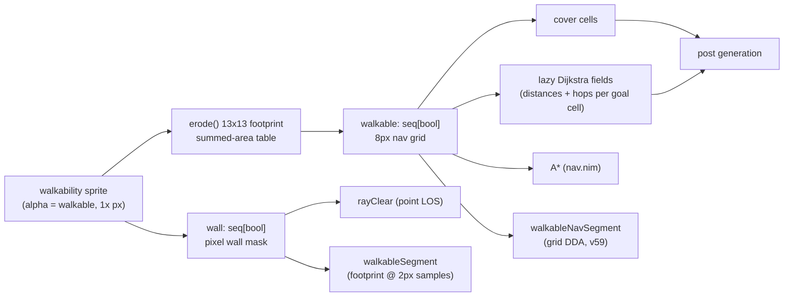

# Stencil Navigation Deep Dive

A complete map of everything that decides where the Paintbot player *stencil* moves and how it
gets there, written for James and the follow-on coding agent planning the navigation
simplification (TODO.md item 1). Date: 2026-08-08. All stencil paths abbreviate
`paintbot_lab/paintbot/stencil_nim/` to `stencil_nim/`; engine paths are in the cached game
source `paintbot_lab/.cache/coworld-ctf/9dedac0e…/src/ctf/` (see [version caveats](#12-version-caveats)).

## Executive summary

Stencil's navigation is small (~1,100 lines across `worldmap.nim`, `nav.nim`, and the movement
half of `action.nim`/`strategy.nim`) and architecturally sound — one objective ladder decides
*where*, one executor decides *how*, and the map layer's 13×13-pixel footprint erosion is an
exact mirror of the engine's own `canOccupy` test. The TODO's four questions all have
evidence-backed answers. **The eroded 8px grid is already the de facto source of truth**: A*,
the Dijkstra flow fields, `nearestWalkable`, and the new `walkableNavSegment` all think in it,
the engine validates every generated map with the same 13px erosion, and the map generator
guarantees ≥26px corridors — so the grid can be promoted to the authoritative predicate with
the pixel-footprint test (`walkableSegment`) retained only as a confirm-the-winner check, which
is exactly the pre-filter design the TODO already suggested (`TODO.md:22-27`). The only
behavioral cost sits at two small movement nudges (`action.nim:470,479`) that become slightly
more conservative. `rayClear`'s point-sized LOS is
correct for its twelve aim/vision call sites and wrong for none of them today, and `belief.danger`
should be deleted or deliberately wired into path costs in a dedicated experiment — it is
computed, decayed, and dilated every tick, read only by trace, and single-handedly bloated a
60-episode warehouse build to 12 GB.

The deep dive also surfaced structural debt the TODO didn't know about, severity-graded in
§9. The highest-leverage fix is not any single predicate: it is that **the intent-reason
string is the de facto nav API** — seven separate hard-coded string lists in `action.nim`
independently decide which planner runs, which micro-behaviors may override movement, and which
clamps apply, while the parallel `Objective.flowGoal` field is written and never read. Second
is a cluster of state-lifecycle hazards: `WorldMap` is mutated every tick through pedestal
writes that silently mint unbounded full-grid Dijkstra fields, `NavState` survives death, and
flow-field goals and A* goals fail in opposite directions when unreachable (freeze in place
vs. beeline into a wall). Three movement paths (spray pursuit, grenade evacuation,
carrier-heard escort) emit steering with no walkability check at all. The primary code paths
are inventoried with `file:line` citations, the engine ground truth is verified against game
source, and §9 ends with the recommended refactor shape and its tradeoffs — the direction
call stays with the human, per the lab's operating model.

## Table of contents

1. [Why navigation looks like this](#1-why-navigation-looks-like-this)
2. [The map layer](#2-the-map-layer)
3. [Route planning: flow fields, A*, and the follower](#3-route-planning-flow-fields-a-and-the-follower)
4. [The predicates: three ways to ask "can I go there?"](#4-the-predicates-three-ways-to-ask-can-i-go-there)
5. [Deciding where: the objective ladder and its goal producers](#5-deciding-where-the-objective-ladder-and-its-goal-producers)
6. [Executing how: resolveAction's precedence stack](#6-executing-how-resolveactions-precedence-stack)
7. [Engine ground truth](#7-engine-ground-truth)
8. [Answers to the TODO's four questions](#8-answers-to-the-todos-four-questions)
9. [Simplification opportunities, severity-graded](#9-simplification-opportunities-severity-graded)
10. [Observability and verification gaps](#10-observability-and-verification-gaps)
11. [Performance history](#11-performance-history)
12. [Version caveats](#12-version-caveats)
- [Appendix A — The seven reason-string lists](#appendix-a--the-seven-reason-string-lists)
- [Appendix B — Dead and trace-only code inventory](#appendix-b--dead-and-trace-only-code-inventory)
- [Appendix C — Nav-relevant constants](#appendix-c--nav-relevant-constants)
- [Appendix D — Version evolution ledger](#appendix-d--version-evolution-ledger)
- [Appendix E — Route-field minting sites](#appendix-e--route-field-minting-sites)
- [Appendix F — Sources](#appendix-f--sources)

---

## 1. Why navigation looks like this

- Stencil's predecessor (beacon) navigated from an **offline bake** of a fixed arena; Paintbot
  generates a fresh map per episode, so the bake scored 0.0 and was scrapped wholesale.
- Everything map-shaped is rebuilt **online, per episode**, from the wire's walkability sprite
  plus a handful of markers — deliberately with no module-level caches.
- Navigation is edited rarely and in large batches: only six commits have ever touched
  `nav.nim`/`worldmap.nim`.

The founding design decision is recorded in `paintbot_lab/docs/designs/stencil-v1-design.md:7-15`:
beacon's world model was "an offline bake of the fixed CTF arena (`nav.npz` flow fields,
hand-authored POIs, battle plans drawn on known coordinates)," and Paintbot "generates a fresh
map per episode in five size classes with 2-or-4 teams," so "everything predicated on a single
known map is dead weight." Stencil rebuilds beacon's one clean seam (`mapdata.py`) as an
**episode-scoped `WorldMap` object** constructed the first frame the init snapshot is complete
(`stencil-v1-design.md:29-47`), with flow fields computed "lazily per goal cell (Dijkstra,
cached on the instance)" and "deliberately no module-level caches (beacon's `lru_cache`
loaders were a latent cross-episode bug under procgen)" (`stencil-v1-design.md:43-47`).

The wire contract that seeds it (`paintbot_lab/docs/paintbot-gameplay.md:249-256`): a
`walkability map` RGBA sprite (alpha > 0 = walkable, always 1× map pixels — "*The* nav
source"), a `game teams <n> map <w>x<h>` marker, per-color `endzone` markers, and planted-heart
sightings that never fog. Authored constants became derived anchors: `CHOKE_X` →
`chokePoint(color)` (45% along the home→center axis, snapped to cover), `SQUAD_RALLY_X` →
`rallyPoint`/`pastRally` (65%), POIs and plans → gone (`stencil-v1-design.md:49-52`). Two of
those derived anchors are now themselves dead or trace-only (Appendix B).

Git history confirms navigation is a low-churn area: `nav.nim` and `worldmap.nim` have been
touched by exactly six commits (`1129931` Nim port, `39b7b0f` contract sync, `96e7617` nav
views, `1320a01` posts, `6c4c819` v47–v57, `45e33bb` v59).

## 2. The map layer

- One wire mask becomes **two representations**: a pixel wall mask and an 8px eroded nav grid.
- The erosion is an exact mirror of the engine's `canOccupy`: a 13×13 pixel footprint must be
  entirely wall-free.
- Cover cells, tactical posts, and all derived anchors hang off the same object.
- The `WorldMap` is *almost* immutable — pedestal positions are rewritten every tick a planted
  heart is visible, which has a hidden cost (§9, M2).

`WorldMap` (`stencil_nim/worldmap.nim:39-51`) is built in `policy.nim:40-51` whenever the
percept carries walkability + team count + endzones and the `(width, height, teams)` signature
changes. Construction (`worldmap.nim:131-158`):

1. **Pixel wall mask** — `wall[i] = not pixelWalkable[i]` (`worldmap.nim:141-142`), one bool
   per map pixel, straight from the sprite (`perception.nim:385-388`, decoded at
   `protocols.nim:243-261` from the alpha channel).
2. **Eroded nav grid** — `walkable`, at `NavCell = 8` px resolution (`config.nim:66`). A grid
   cell is walkable iff the 13×13 pixel footprint (`PlayerHalf = 6`, `worldmap.nim:10`)
   centered on the cell center contains zero wall pixels, computed with a summed-area table in
   O(pixels + cells) (`worldmap.nim:79-112`). Cells whose footprint would leave the map are
   unconditionally unwalkable (`worldmap.nim:99,106-107`).
3. **Cover cells** — walkable cells with ≥1 non-walkable 8-neighbor (`worldmap.nim:114-129`).
4. **Eager warm-up** — one Dijkstra field per team home (`worldmap.nim:154-155`), plus the own
   capture point right after construction (`policy.nim:49-51`).
5. **Post generation** — the tactical firing/duck-post pass (`worldmap.nim:156-158, 337-487`),
   whose candidates and posts later feed defender assignments and squad orders.



One mutation breaks the "episode-static" story: `belief_update.nim:17-20` writes
`map.pedestals[color] = heart.pos.get` — the pedestal being the map location where a team's
heart (flag) is planted — on every tick a planted heart is visible. `pedestal()`
(`worldmap.nim:553-554`) is the goal source for steal targets (`strategy.nim:195`), threat-axis
aim (`action.nim:90,92`), squad advance points (`squads.nim:215`), defensive threat scoring
(`fight.nim:121`), and the convert hunt (`squads.nim:189`) — so a replanted heart silently
retargets all five and mints a fresh full-grid Dijkstra field on the next lookup (§9, M2).

## 3. Route planning: flow fields, A*, and the follower

- Two planners share one grid and one neighbor model: goal-anchored **Dijkstra flow fields**
  (a per-goal grid of distances and next-step directions that any number of agents can follow
  toward a stable goal) and a per-agent **cached A\*** (one agent / arbitrary goal).
- Which planner runs is chosen by *string membership* of the intent reason, not by the
  `Objective.flowGoal` field that was designed to carry that fact.
- Stuck handling is minimal: a 1px/tick progress test, a +90° steering jitter, and (for A*
  only) a forced replan.

**Flow fields** (`worldmap.nim:260-311`): per goal cell, a full-grid Dijkstra produces
`distances` (in cells) and `hops` (a reverse-neighbor code per cell). `flowWaypoint(goal,
selfXy)` reads the hop at the agent's own (walkability-snapped) cell and returns the adjacent
cell center — a one-cell (8px) step, re-consulted every tick; hop 0 (at goal, or unreachable)
returns `selfXy` itself (`worldmap.nim:304-311`). `routeDistance` multiplies the field
distance by `NavCell` and returns **Inf** for unreachable goals (`worldmap.nim:313-316`) —
callers must `classify` it (e.g. `squads.nim:227,233`). Fields cache in
`WorldMap.fields: Table[int, RouteFields]` keyed by goal cell and are **never evicted**
(`worldmap.nim:296-302`); Appendix E lists every minting site.

**A\*** (`nav.nim:22-64`): same grid, same 8-connected `Neighbors` table, same
no-corner-cut diagonal rule and √2 diagonal cost as the Dijkstra; endpoints snapped by
`nearestWalkable`; returns a cell-center waypoint list, empty when unroutable.
`astarWaypoint` (`nav.nim:66-87`) caches one path in `Belief.nav: NavState` and replans when
the goal cell moved more than `ReplanGoalCells = 2` on either axis, when there is no cached
path, or when `stuckTicks >= StuckTicks = 8`. The follower advances its cursor while within
`NavCell` px of the current waypoint. An unroutable goal returns the **raw goal** — the agent
beelines — and retries A* every tick (a deliberate Python-parity choice, `nav.nim:77-79`).

**Stuck handling**: `noteProgress` (`nav.nim:89-94`) counts ticks with <1.0 px of movement;
at `StuckTicks` the A* path replans *and* `octantToward` rotates the steering angle +90°
(`nav.nim:102-103`, engaged only at `action.nim:472`). Two asymmetries matter:

- `noteProgress` runs only inside the `NavigateTo` branch (`action.nim:463`), so stuck ticks
  never accumulate during Hold, micro overrides, or fire freeze.
- Flow-reason intents have no path to replan, so the 90° jitter is their *only* unstick; and
  an unreachable flow goal returns `selfXy`, which lands in `octantToward`'s <1px deadband
  (`nav.nim:99-100`) — the agent **stands still**, while the same condition under A* makes the
  agent **walk into the wall** toward the raw goal. Same failure, opposite behaviors (§9, M4).

**The dispatch** (`action.nim:457-462`) — the executor fork for a `NavigateTo` intent:

| Intent reason | Executor |
|---|---|
| `clear_spray` | raw point — no planner (candidates were grid-validated in strategy) |
| `carry_home`, `steal`, `to_hold`, `to_post`, `early_defense`, `barrage_center` (`FlowReasons`, `action.nim:6-7`) | `flowWaypoint` |
| everything else (`intercept_thief(_heard)`, `clear_grenade`, `rejoin`, `escort_carrier(_heard)`, `fetch_medkit`, `fetch_item`, `convert_hunt`, `squad_move`, `squad_to_watch`, `squad_to_hold`, `hunt_fallback`) | `astarWaypoint` |

`Objective.flowGoal` (`strategy.nim:8`) is set at exactly the six `FlowReasons` sites and read
by **nothing but telemetry** (`policy.nim:103` → `trace.nim:457`, `replay.nim:79`); the live
dispatch is the string list (§9, H1).

## 4. The predicates: three ways to ask "can I go there?"

- `walkableSegment` — pixel-exact, footprint-aware, expensive. 5 callers.
- `walkableNavSegment` — grid DDA, conservative, ~600× cheaper. 2 callers (both v59 spray flee).
- `rayClear` — point-sized pixel LOS for aim/vision. 12 call sites, none of them movement.
- Plus `nearestWalkable`, the grid snap every planner endpoint passes through — which is
  neither nearest nor cheap.

**`walkableSegment(start, goal)`** (`worldmap.nim:194-213`) samples the segment every 2px and
scans the full 13×13 footprint against the pixel `wall` mask at each sample — on the order of
`length/2 × 169` pixel reads. Callers, each ≤ ~1 call/tick (`TODO.md:12-14`, verified):
`action.nim:202` (sidestep validation), `action.nim:251` (squad-post stance), `action.nim:470`
(formation-bias waypoint), `action.nim:479` (hold separation step), `worldmap.nim:393`
(init-time duck pairing).

**`walkableNavSegment(start, goal)`** (`worldmap.nim:215-253`, added in v59, current as of
2026-08-08) is an integer DDA (digital differential analyzer — a stepwise line walk that
visits every grid cell the segment touches) over the eroded grid with a no-corner-cut rule on
exact diagonal steps; false if either endpoint is off-map. Both callers are spray-flee scoring (`strategy.nim:121,181` — 32
candidates per fleeing tick, which is precisely the load that made `walkableSegment`
unaffordable: ~400k wall lookups per fleeing agent per tick vs ~24 cell lookups per candidate,
`docs/designs/spray-avoidance-v59-design.md:310-328`).

They disagree at the margins in both directions: the grid erosion only tests cell-center
footprints, so a segment can pass the DDA while its off-center pixels would fail the exact
test, and the grid's conservatism rejects tight-but-passable lines the pixel test would accept
(`TODO.md:12-20`).

**`rayClear(a, b, step=2.0)`** (`worldmap.nim:180-192`) is a point-sampled pixel-mask test.
Its twelve call sites are all aim/vision/throw semantics, not movement: spray-target LOS
(`action.nim:63`), sidestep LOS polarity (`action.nim:202`), cover-vs-threat
(`action.nim:219,270,284`), grenade wall-block detection (`action.nim:329,350`), the fire gate
(`action.nim:517`), the `lineClear` wrapper feeding target shootability (`fight.nim:21-22` →
`action.nim:154`), item in-view confirmation (`items.nim:37`), ally-coverage cones
(`strategy.nim:49`), duck contrast at init (`worldmap.nim:398`), and a replay probe
(`replay.nim:24`).

**`nearestWalkable(cell)`** (`worldmap.nim:167-178`) is the snap through which every A*
endpoint, every Dijkstra goal, `flowWaypoint`'s self-cell, `routeDistance`'s start, and
`capturePoint` pass. It expands square rings but rescans the **full** (2r+1)² box each ring
(O(r⁴) worst case) and returns the first hit in row-major scan order — biased up-and-left,
not actually nearest.

## 5. Deciding where: the objective ladder and its goal producers

- One stateless ladder (`decideObjective`) picks a single objective per tick; first match wins.
- Goal *positions* are produced by half a dozen upstream modules and parked in `Belief` fields.
- Only spray flee does an actual candidate search; everything else navigates to a
  precomputed point.

`strategy.nim:205-367`, in priority order (arrival radii noted where they differ):

| # | Reason | Trigger | Goal | Planner |
|---|---|---|---|---|
| 1 | `carry_home` | carrying a heart | own capture point | flow |
| 2 | `intercept_thief(_heard)` | own heart stolen | thief pos / chat fix | A* |
| 3 | `clear_grenade` | warning within 80px | radial step away (`strategy.nim:242-245`) | A* |
| 4 | `clear_spray` | v59 flee latch | best of 32 scored candidates | none (raw) |
| 5 | `barrage_center` | barrage depth > 0 | map center (hold within 80px) | flow |
| 6 | `early_defense` | phase not complete | seat's spawn cover cell (arrive 28px) | flow |
| 7 | `rejoin(_hold)` | respawn/consensus timeout | last squadmate track (arrive 40px) | A* |
| 8 | `escort_carrier(_heard)` | attacker, allied carrier known | carrier pos / extrapolated fix | A* |
| 9 | `fetch_medkit` / `fetch_item` | detour math accepts | item spawn | A* |
| 10 | `convert_hunt` | enemy wipe in reach | enemy / freshest track / weakest pedestal | A* |
| 11 | `squad_move` / `squad_to_watch` / `squad_to_hold` (+ arrived holds) | fresh consensus order | spread point or ranked post (arrive 56px) | A* |
| 12 | `to_post` / `to_hold` (+ `hold_post`/`hold_line`) | defender with holdPoint | assigned post / choke-band point (arrive 28px) | flow |
| 13 | `steal` (default) / `hunt_fallback` | — | planted heart pos or pedestal | flow / A* |

Goal producers upstream of the ladder: `roles.nim:12-62` (defender hold points from the choke
axis; post assignments ranked homeward), `squads.nim:214-247` (staged advance points at route
progress 0.22/0.38/0.55/0.70/0.84 against `routeDistance`), `squads.nim:112-121`
(`spreadPoint`, rank-based Y offsets snapped to cover), `squads.nim:495-522` (`orderPost`
re-snapping order positions to generated posts), `squads.nim:524-536` (`rejoinTarget`),
`worldmap.nim:512-548` (`spawnCoverPoint`), `items.nim:91-152` (route-distance detour
arithmetic), `belief_update.nim:40-49` (steal-target choice by shortest home→pedestal route),
and `fight.nim:120-122` (defensive threat term — route distance from an enemy to the own
pedestal, folded into target *scoring*, not movement).

**Spray flee** (`strategy.nim:68-185`) is the one true candidate search: a hysteretic latch
(enter ≤ 240px, release > 300px against velocity-projected spray tracks), then 16 directions ×
2 rings at 96px scored on threat clearance, ally-gun-coverage along the path, teammate
clumping, and conditional barrage centering — each candidate validated with
`walkableNavSegment`, and the winner steered **directly** (scoring one path then A*-walking
another was rejected in the design, `spray-avoidance-v59-design.md:301-308`).

## 6. Executing how: resolveAction's precedence stack

- Exactly one function writes movement buttons; nothing else in the codebase does (verified
  by exhaustive grep).
- Eight layers can modify or cancel the movement mask, in a fixed order.
- Three of them steer with no walkability check at all.

`action.nim:432-562`, in evaluation order:

| Order | Lines | Layer | Effect |
|---|---|---|---|
| 0 | 440-444 | no selfXy / no map | `heldMask: 0` |
| 1 | 453-455 | fire-windup freeze (`fireHoldTicks > 0`, not carrying, not spray-unsafe) | all movement stripped |
| 2 | 456 | peek/duck/cover/squad-post micro override | replaces navigation for the tick |
| 3 | 457-472 | NavigateTo waypoint (+ formation bias, `walkableSegment`-gated) | the planner output |
| 4 | 473-480 | Hold separation step (`walkableSegment`-gated) | anti-clump drift |
| 5 | 500-506 | spray (arc) pursuit | **overwrites** movement with a beeline at the enemy |
| 6 | 529-531 | fire trigger tick | movement cancelled, freeze armed |
| 7 | 547-555 | `early_defense` endzone clamp (4px lookahead) | strips movement that exits the endzone |
| 8 | 556-561 | grenade overlay | buttons only, never movement |

The micro-override layer (`action.nim:227-293`) implements peek (sidestep to gain LOS), duck
(sidestep to break LOS on cooldown), cover-from-threat, and the squad-post peek/duck stance —
all through `findSidestepCell` (`action.nim:190-206`), which scans ±3 grid cells, requires
grid walkability + `walkableSegment` + the desired `rayClear` polarity, and picks the nearest
qualifying cell.

**Unvalidated steering paths** (§9, M3): spray pursuit (`action.nim:501-506`) overwrites the
mask with a direct octant at the enemy — no walkability check, and it bypasses even the stuck
jitter. Grenade evacuation computes an unclamped radial point (`strategy.nim:242-245`) and
carrier-heard escort extrapolates a chat fix at 1.9 px/tick (`strategy.nim:288-292`) — both
A*-snap via `nearestWalkable`, so they self-heal, but the emitted goal can be off-map.

## 7. Engine ground truth

- Stencil's footprint model is *exactly* the engine's: `canOccupy` is the same 13×13 box.
- The map generator guarantees ≥26px corridors validated with a 13px erosion — the reason
  online erosion-based nav is always solvable.
- The engine's two collision masks are provably complements today, so stencil's single mask is
  safe — but that's an undocumented invariant, and the mask goes stale under spinning diamonds.
- The walkability mask is binary: trenches (1/5 speed), puddles, and barriers are invisible
  to it.

From the cached game source (0.7.211/GV41; constants attested unchanged through the 0.7.215
pin, `tools/versions.env:41-44`):

- **Footprint**: `PlayerHalf = 6` (`sim_types.nim:312`); `canOccupy(x,y)` requires the 13×13
  box entirely on walkable floor (`sim_state.nim:256-263`). Stencil duplicates the constant
  (`worldmap.nim:10`) and mirrors the test in both `erode` and `walkableSegment`.
- **Movement physics**: fixed-point per-axis integration — `Accel 76`, friction 144/256,
  `MaxSpeed 704` ≈ 2.75 px/tick, `StopThreshold 8` (`sim_types.nim:316-325`) — with **wall
  sliding** up to 3px perpendicular (`MovementSlideMaxScan`, `sim.nim:239-424`) and Y-then-X
  axis order (`sim.nim:1898-1899`). Stencil's 8-way octant steering implicitly relies on
  engine wall-slide to shed the blocked component along walls. Carrier speed 70%
  (`sim_types.nim:397`); trench climb-out at 1/5 speed (`sim_types.nim:554`).
- **Connectivity guarantee**: `MinCorridorWidth = 26` — "narrowest corridor for the 13px
  footprint" (`arena.nim:1245`) — enforced by a chamfer-distance (a fast integer
  approximation of distance-to-nearest-wall) + BFS validator (`arena.nim:2709-2790`) with up
  to 100 seed retries. Stencil's eroded grid therefore always
  contains a connected solution between the places that matter.
- **The two masks**: `walkMask` governs movement (`isWalkable`/`canOccupy`,
  `sim_state.nim:251-263`); `wallMask` governs projectiles and LOS (`isWall`,
  `sim.nim:427-430`). The walkability sprite is built from `walkMask`
  (`global.nim:3218-3234`), and stencil inverts it into `map.wall`, which it then uses for
  *both* movement predicates *and* `rayClear` aim/LOS. **Verified safe today**: at bake time
  the two images are written as exact complements (`map_art.nim:899-901`), and the spinning-
  diamond restamp updates both in sync (`sim.nim:2677-2678`). But nothing in the engine
  promises they stay complements — terrain that is shoot-through-but-impassable (or the
  reverse) would silently break stencil's fire gate and LOS model. Worth a one-line invariant
  comment where `map.wall` is built.
- **Stale-mask hazard**: the walkability sprite is emitted **only in the player init**
  (`global.nim:4362-4367`), while spinning diamonds restamp the live masks every frame
  (`sim.nim:2667-2678`, `arena.nim:1219-1230`). Stencil's mask is permanently stale at every
  spinning-diamond footprint, and nothing detects it — the stuck jitter is the only mitigation
  when an agent walks into a diamond position the init mask called open.
- **Binary-mask blindness**: trenches, puddles, and barriers never appear in the mask; trench
  and puddle markers are loose bounding boxes (`labels.nim:173-196`), and barriers block paint
  but never movement (`docs/paintbot-gameplay.md:158-169`). Stencil's route costs are pure
  geometry — the GV41 hazards recon already prescribes soft route costs for puddles when they
  activate (`docs/recon/paintbot-gv41-hazards-2026-08-07.md:326-340`).

The bundled reference bot (`baseline`) is the design-space counterpoint: same 8px grid and
footprint erosion, but an **exposure-weighted** Dijkstra cost field (entering a cell seen by a
remembered enemy costs extra), repath every 10 ticks, waypoint lookahead, and a random-burst
stuck detector (`rl/data/worktrees/gv35/players/baseline/README.md:69-86`). Proof that
soft-cost fields are feasible online at Paintbot scale.

## 8. Answers to the TODO's four questions

The deep dive's contract, verbatim from `TODO.md:29-34`: "The deep dive should settle: one
predicate or a documented hierarchy; whether the pixel mask or the eroded grid is the source
of truth for 'can a body go here' (they disagree at the margins); whether `rayClear`'s
point-sized LOS is being used anywhere it should be footprint-aware; and what to do about
`belief.danger`, which `belief_update.nim:225-293` computes every tick and nothing reads."

**Q1 — one predicate or a documented hierarchy?** A documented two-level hierarchy, with the
grid authoritative. The eroded grid already *is* how A*, the flow fields, `nearestWalkable`,
and `walkableNavSegment` think; the engine's own map validator uses the same 13px erosion; and
the generator's 26px-corridor guarantee means grid-conservatism can't strand an agent. The
pixel-footprint `walkableSegment` survives only as the confirm-the-winner check where exact
margins matter (the TODO's own pre-filter suggestion, `TODO.md:22-27`). Concretely: every
candidate filter and routing query asks the grid through one shared traversal helper, and only
a chosen winner that must be exact gets the pixel-footprint confirmation. `walkableSegment`'s
five call sites are all ≤1 call/tick, so the expensive test stays cheap in aggregate. The one behavioral
caveat: for short hops (the 24-48px bias steps), grid conservatism rejects slightly more than
the pixel test would — acceptable for optional drift nudges, which is what those callers are.

**Q2 — pixel mask or eroded grid as source of truth for "can a body go here"?** The grid —
because it encodes the same `canOccupy` semantics the engine enforces (§7), at the resolution
every planner already uses. The pixel mask remains the *source* the grid is derived from and
the substrate for aim/LOS queries; it stops being an alternative answer to the body question.

**Q3 — is `rayClear` used anywhere it should be footprint-aware?** No. All twelve call sites
are sight/shot/throw semantics (§4), where point-sampling matches the engine's own bullet
tests against `wallMask` — and stencil's `map.wall` is verifiably identical to `wallMask`
today (§7). Two refinements are optional, not corrections: the fire gate could model the
engine's 14px hit corridor (`PlayerHalf + BulletHalfWidth`, `VERSION_LOG.md:1211-1213`), and
the sidestep search's dual-use call (`action.nim:202`) is fine as-is because the movement leg
is separately `walkableSegment`-validated.

**Q4 — what to do about `belief.danger`?** Delete it, or wire it in a dedicated experiment —
not both, and not silently. It is computed, decayed, dilated, and stamped every tick
(`belief_update.nim:284-351`), read only by `trace.nim:535-548`, and its full-grid trace dump
is the identified cause of the 12 GB warehouse blowout (`TODO.md:177-184`). No decision code
reads it: A* and Dijkstra costs are pure step length (`nav.nim:59-60`, `worldmap.nim:285-286`)
— the "danger-aware A*" wording in `VERSION_LOG.md:385` and `stencil-v1-design.md:97` is
documentation drift. The lessons archive already warns: "do NOT quietly fold it into an
unrelated behavior change — global path-cost changes are unvalidatable inside a
single-behavior A/B" (`lessons_archive/TENTATIVE_LESSONS-20260808-122020.md:91-99`). If a
soft-cost field is ever wanted (puddles, exposure), the baseline bot is the working reference —
and that experiment should start from a deleted-or-quarantined danger grid, not this one's
accreted semantics.

## 9. Simplification opportunities, severity-graded

**High — structural, decision-changing:**

- **H1. The reason-string API.** Seven separate hard-coded string lists (Appendix A) decide
  planner choice, micro exemptions, bias application, freeze exemptions, and clamps. Adding an
  objective without updating every list silently gets A* + full micro. The seven lists:
  `action.nim:6-7` (planner=flow), `:458` (planner=direct), `:229-231` (micro exemption),
  `:464-465` (formation bias), `:474` (separation exclusion), `:503-504` (pursuit exemption),
  `:547` (endzone clamp). Replace them with fields on the `Intent` type (`types.nim:189-197`,
  built by the `navigate`/`hold` constructors at `strategy.nim:14-20`), set once per objective
  at its ladder rung — roughly:

  ```nim
  Intent = object
    kind: IntentKind            # NavigateTo | Hold (unchanged)
    point: Option[Point]
    reason: string              # stays, for telemetry only
    planner: Planner            # Flow | Astar | Direct
    allowMicro, allowBias, allowPursuit: bool
    clampToEndzone: bool
  ```

  `resolveAction` then branches on fields, never on `reason`; `Objective.flowGoal` is deleted
  (or becomes the flow-planner argument). This is the highest-leverage change and it is
  mechanical. Payoff: eliminates the silently-wrong-defaults failure mode for every future
  objective, and makes each objective's movement contract readable at its ladder rung.
- **H2. Predicate unification per Q1/Q2** — grid-authoritative hierarchy, `walkableSegment`
  demoted to confirmation. Fold `walkableNavSegment`'s DDA (`worldmap.nim:235-252`) and the
  no-corner-cut rule that A* (`nav.nim:55-58`) and Dijkstra (`worldmap.nim:281-284`) each
  implement separately into one shared traversal helper — an iterator shaped like
  `gridSegmentCells(map, start, goal): iterator[Point]`, living in `worldmap.nim` beside the
  grid it walks, yielding every cell the segment touches with the corner rule applied.
  `walkableNavSegment` becomes "all yielded cells walkable"; A* and Dijkstra keep their inline
  neighbor expansion but call the same shared diagonal-legality check. Confirm-the-winner then
  reads:

  ```nim
  if map.walkableNavSegment(selfXy, candidate) and      # cheap gate, all candidates
      map.walkableSegment(selfXy, winner):              # exact confirm, winner only
    accept(winner)
  ```

  Payoff: one predicate semantics instead of two that disagree at margins, and the corner rule
  exists once instead of three times.
- **H3. Danger grid per Q4** — delete, or quarantine behind an off-by-default env flag if the
  soft-cost experiment is genuinely near. Payoff: reclaims the per-tick decay/dilate/stamp
  compute on every seat and removes the full-grid trace payload behind the 12 GB warehouse
  blowout.

**Medium — real hazards, bounded today:**

- **M1. Unify the duplicate machinery**: `distanceAt` vs `routeDistance` (`worldmap.nim:331`
  vs `:313`), five copies of `distance()` (`nav.nim:19`, `action.nim:20`, `strategy.nim:12`,
  `fight.nim:6`, inline hypot in squads), three hand-rolled border margins
  (`worldmap.nim:593-594`, `roles.nim:26-27`, `squads.nim:116-117`), three arrival radii
  (28px `strategy.nim:263,353`; 56px `strategy.nim:326`; 40px `strategy.nim:273`).
- **M2. Bound the field cache / stop mutating WorldMap.** Pedestal writes
  (`belief_update.nim:17-20`) retarget five consumers and mint unbounded full-grid Dijkstra
  fields on giant maps (85,814 cells each). Options: quantize pedestal movement before
  minting, make the cache LRU-bounded, or key steal/convert goals off a stable snapshot.
  Recommended: quantize — only accept a pedestal update that moves the goal *cell* (the cache
  key already quantizes to cells, so guarding the write at `belief_update.nim:17-20` with a
  same-cell check is a two-line fix that keeps every consumer's semantics). Payoff: bounds the
  field cache and stops silent retargeting from pixel-level heart jitter.
- **M3. The unvalidated beeline paths** — spray pursuit (no check, overrides jitter), grenade
  evacuation and carrier-heard escort (unclamped emitted points; A* snap self-heals). Decide
  whether direct steering is a sanctioned third planner (it is, de facto, for `clear_spray`)
  and give it the same validation contract.
- **M4. Symmetrize unreachable-goal behavior** — flow: freeze; A*: beeline (§3). The A*
  beeline is deliberate Python parity (`nav.nim:77-79`), not an accident — symmetrizing
  replaces that parity choice. Pick one policy for both — probably: stand still and emit a
  `route_unreachable` field in the snapshot, following the existing `nav_stuck` pattern
  (`replay.nim:85`).
- **M5. `nearestWalkable`** — make it scan ring perimeters and return the true nearest; it
  backs every planner endpoint.

**Low — hygiene, self-healing, or trivial:**

- **L1. Dead code deletes** (Appendix B): `pastRally`, `insideBase`, `rallyPoint` (+
  `RallyFraction`), `walkabilityDecodeMs`.
- **L2. NavState lifecycle** — never reset on death/respawn; bounded in practice by the replan
  triggers, but a one-line reset at the existing respawn-detection site
  (`belief_update.nim:361-362`, where `respawnedTick` is stamped) removes the class. Note
  `chat.nim:198-201` reads
  `nav.lastXy` as a self-velocity estimator for the carrier shout — preserve or replace that
  coupling explicitly when touching NavState.
- **L3. Invariant comments** — the walkMask/wallMask complement assumption (§7) and the
  diamond staleness gap deserve one comment each where `map.wall` is built.

**Recommended shape.** This is a proposal awaiting James's direction call — no code has been
changed; the alternatives per item are listed above and in §8:

- One refactor version doing **H1 + H2 + H3-delete + M1 + L1/L2/L3**.
- Behavior-preserving by construction, with one known exception: the formation-bias and
  hold-separation nudges (`action.nim:470,479`) move from pixel-exact to grid-conservative
  acceptance and will reject a slightly larger set of tight steps.
- Validate with the wire-parity harness (`tools/compare_stencil.py`, after fixing its broken
  game-ref resolution, §10) plus a standard A/B.
- **M2–M5 are separable follow-ups**, each small enough to A/B individually.
- The alternative — pursuing the baseline-style exposure-cost path field (§7) now — is
  explicitly *not* recommended before the cleanup lands: the lessons file's warning about
  unvalidatable global path-cost changes applies, and the danger grid's fate should be
  settled first.

## 10. Observability and verification gaps

- **v59's flee is the least observable nav behavior**: `spray_flee_*` and `nav_stuck` are
  traced but no tool renders them — `render_nav.py` shows static knowledge, `viewer.html` has
  `nav_path`/goal/danger layers but no flee or stuck layer (verified: no consumer in
  `tools/`).
- **`tools/compare_stencil.py` is currently unrunnable**: it resolves the pinned game ref to
  `.cache/coworld-ctf/6c7a4c0e…/nim.cfg`, which does not exist on disk
  (`compare_stencil.py:24-31`). This is the parity harness the refactor needs; fix it first —
  either materialize the `6c7a4c0e` worktree into the cache (the other four refs there are
  `git worktree` checkouts) or point `--game-repo` at the existing `9dedac0e` directory.
- **stencil_nim has no unit tests** (`spray-avoidance-v59-design.md:513-514`); the loop is
  probe-then-A/B. A predicate unification is exactly the kind of change where a small
  golden-file test (grid vs pixel predicate agreement corpus over generated maps) would pay
  for itself.
- The event warehouse stores the full danger grid per snapshot in `data_json` — the 12 GB
  problem goes away with H3.

## 11. Performance history

- **Init cost is a solved problem** — measured worst case 453.5 ms on a giant map under
  16-process contention, one-time, inside the 5s start countdown
  (`docs/reports/nav-init-profile-2026-08-03.md:8-18`): Dijkstra 81.8% of giant startup,
  erosion 52.5 ms, cover 0.2 ms. **Caveat: those numbers are Python-era** (0.7.180, the day
  before the Nim port landed) and have never been re-run on Nim, whose whole-policy CPU came
  in at 0.17s vs Python's 0.40s on a 2,502-decision replay (`stencil-nim-port.md:79-82`).
  The `nav_init` instrument survived the port (`trace.nim:342`).
- **Post generation** was the one real cost fight: 29.6 s giant in its first implementation,
  reduced to 2.78 s through bucketing, bounded candidates, and own-fronts-only
  (`VERSION_LOG.md:1444-1482`, lesson at `lessons_archive/TENTATIVE_LESSONS-20260806-105051.md:38-44`).
- **Per-tick cost** is dominated by whatever calls the predicates: the v59 budget analysis
  (32 candidates × `walkableSegment` ≈ 6M pixel reads across 16 seats per tick) is what forced
  the second predicate into existence — and is the quantitative case for the grid-first
  hierarchy in Q1.
- Movement-behavior experiments have a poor track record worth remembering when scoping the
  refactor: of the 21 giant-map position/route experiments (v27–v47), **every one** was
  rejected against the plain guard-the-heart control (Appendix D). The refactor should be
  behavior-preserving, not behavior-improving.

## 12. Version caveats

- Stencil source read at working-tree state of 2026-08-08 (v59, post-`45e33bb`).
- Game-side citations are from `.cache/coworld-ctf/9dedac0e…` (0.7.211/GV41) because the
  pinned `PAINTBOT_GAME_REF=6c7a4c0e` (0.7.215) exists nowhere on this machine;
  `tools/versions.env:41-44` attests every nav-relevant constant is unchanged across the bump.
- The nav-init profile numbers (§11) are Python-implementation measurements at 0.7.180.
- Canonical Paintbot had already moved to 0.7.216 within hours of the 0.7.215 pin
  (`versions.env:46-53`); nothing in this report depends on the difference.

---

## Appendix A — The seven reason-string lists

| # | Location | List | Controls |
|---|---|---|---|
| 1 | `action.nim:6-7` | `FlowReasons`: carry_home, steal, to_hold, to_post, early_defense, barrage_center | planner = flow field |
| 2 | `action.nim:458` | clear_spray | planner = none (raw point) |
| 3 | `action.nim:229-231` | carry_home, clear_grenade, clear_spray, fetch_medkit, intercept_thief, intercept_thief_heard, early_defense, barrage_center | peek/duck micro exemption |
| 4 | `action.nim:464-465` | steal, to_hold, squad_move, squad_to_hold, squad_to_watch | formation-bias application |
| 5 | `action.nim:474` | early_defense, barrage_center, clear_spray (excluded) | Hold separation exclusion |
| 6 | `action.nim:503-504` | early_defense, barrage_center, clear_spray (excluded) | spray-pursuit exemption |
| 7 | `action.nim:547` | early_defense | endzone clamp |

Plus the vestigial parallel encoding: `Objective.flowGoal` set at `strategy.nim:227,256,265,360,361,367` — telemetry-only.

## Appendix B — Dead and trace-only code inventory

| Item | Location | Status |
|---|---|---|
| `pastRally` | `worldmap.nim:575-584` | zero callers |
| `insideBase` | `worldmap.nim:596-601` | zero callers |
| `rallyPoint` | `worldmap.nim:572-573` | trace-only (`trace.nim:236`) |
| `RallyFraction` | `config.nim:244` | referenced only by the two above |
| `walkabilityDecodeMs` | `types.nim:148` | declared, never assigned |
| `Objective.flowGoal` | `strategy.nim:8`, `policy.nim:103` | telemetry-only (`trace.nim:457`, `replay.nim:79`) |
| `belief.danger` + lifecycle | `belief_state.nim:53-54`, `belief_update.nim:284-351` | trace-only (`trace.nim:535-548`) |
| `distanceAt` | `worldmap.nim:331-335` | private duplicate of `routeDistance` |
| `cachedRouteFields`, `dijkstraMs`, init-timing fields | `worldmap.nim:50-51,318-329` | diagnostics (keep — they feed `nav_init`/`navigation_flow`) |

## Appendix C — Nav-relevant constants

| Constant | Value | Source |
|---|---|---|
| `NavCell` | 8 px | `config.nim:66` (= engine `FovCellSize`, RL `patch_stride`) |
| `PlayerHalf` | 6 px (13×13 footprint) | `worldmap.nim:10` = engine `sim_types.nim:312` |
| `MaxSpeedPxTick` | 2.75 | `config.nim:67` (= `MaxSpeed 704 / MotionScale 256`) |
| `ReplanGoalCells` | 2 cells | `config.nim:118` (`STENCIL_REPLAN_GOAL_CELLS`) |
| `StuckTicks` | 8 | `config.nim:119` (`STENCIL_STUCK_TICKS`) |
| `HoldArrivePx` | 28 | `config.nim:271` |
| `PeekDuckSearchCells` | 3 | `config.nim:129` |
| `SprayFleeTriggerPx` / `ReleasePx` / `StepPx` | 240 / 300 / 96 | `config.nim:173-179` (order validated `config.nim:302-304`) |
| `ChokeFraction` / `RallyFraction` | 0.45 / 0.65 | `config.nim:243-244` ("educated guesses, not tuned", `WORKING_CONTEXT.md:405-406`) |
| Engine `MinCorridorWidth` | 26 px | `arena.nim:1245` |
| Engine slide scan | ≤3 px | `sim_types.nim:322` |
| Map sizes | 1050×560 … 3211×1713 (2-team); ≤2496² (4-team) | `arena.nim:1350-1375` |
| Grid cells | 9,170 … 85,814 (97,344 4-team giant) | `nav-init-profile-2026-08-03.md:44-50` |

## Appendix D — Version evolution ledger

Nav-touching versions from `stencil_nim/VERSION_LOG.md` (chronological; A/B verdicts as
recorded there):

- **v1** (08-04): founding online nav stack; 169,235 decisions exact vs Python oracle.
- **v2–v5**: post-generation cost fight — 29.6 s → 2.78 s giant; v5 accepted, trace-only.
- **v6/v7**: defenders consume posts; v7's homeward-ranked assignment validated.
- **v10, v11, v14, v16, v17, v18**: post ranking, forward restriction, aim-align strafe,
  post-duck micro, score-banded ranking, sightline sweep axis — **all rejected on A/B**;
  movement micro removed; generated knowledge kept trace-only. The generated-axis lesson:
  runtime and scored axes differed mean 23.2°, max 90° (`VERSION_LOG.md:1147-1155`).
- **v26–v47** (giant-map 1v1 duel series): guard offsets, early push, route-sweep facing,
  cutoff, 600px flow-field lead intercept, 500px route ambush (worst, 1/20), stand-ground,
  leash, strafe orbit, shield/arc route-detour fetches — **all 21 rejected** vs v26's plain
  guard (6/20). v47 was briefly champion via submission timing, not superiority.
- **v48**: squad orders drive movement through post fronts at staged route progress.
- **v52** (champion): bounded rejoin on consensus timeout; **v53** (every-tick refreshed
  rejoin target) regressed 555 → 967 ticks and was reverted.
- **v55**: early-defense spawn-cover phase + endzone clamp (rejected at r399; ships default-on
  behind `STENCIL_EARLY_DEFENSE`).
- **v58** (champion): barrage centering via flow field; suppresses peek-duck/formation/spray
  pursuit while evacuating.
- **v59** (current): spray flee; **no runtime evidence yet** — compiles are the only
  pre-upload signal.

## Appendix E — Route-field minting sites

Each distinct goal cell = one full-grid Dijkstra, cached forever (`worldmap.nim:296-302`):

| Site | Goal | Growth behavior |
|---|---|---|
| `worldmap.nim:155` | each team home (init) | fixed (teams) |
| `policy.nim:49-51` | own capture point (init) | fixed |
| `policy.nim:87-90` | own pedestal, enemy homes (role assignment) | fixed |
| `belief_update.nim:46` | live enemy pedestals (steal choice) | grows when hearts replant |
| `fight.nim:120-122` | own pedestal (defender scoring) | grows when own heart replants |
| `items.nim:84,98,104-105` | item spawns + current anchor | bounded by spawns; anchor varies with orders |
| `squads.nim:222,232` | homes, pedestals, post candidates | bounded by post set |
| `action.nim:461` | any FlowReasons goal | carry/steal/hold goals; barrage center; spawn cover |

Observed in practice: 2 fields at startup, 3–7 total across variants
(`nav-init-profile-2026-08-03.md:34`, `VERSION_LOG.md:1540-1542`).

## Appendix F — Sources

**Stencil source (read in full)**: `stencil_nim/worldmap.nim`, `nav.nim`, `action.nim`,
`strategy.nim`, `belief_state.nim`, `belief_update.nim`, `squads.nim`, `items.nim`,
`fight.nim`, `roles.nim`, `policy.nim`, `config.nim`, `types.nim`; nav-relevant sections of
`trace.nim`, `perception.nim`, `protocols.nim`, `chat.nim`, `replay.nim`, `stencil.nim`.

**Lab docs**: `TODO.md`; `docs/designs/stencil-v1-design.md`, `stencil-nim-port.md`,
`spray-avoidance-v59-design.md`; `docs/reports/nav-init-profile-2026-08-03.md`;
`docs/paintbot-gameplay.md`; `docs/recon/paintbot-2026-08-03.md`,
`paintbot-gv41-hazards-2026-08-07.md`; `stencil_nim/VERSION_LOG.md`; `WORKING_CONTEXT.md`;
`lessons_archive/TENTATIVE_LESSONS-20260804-103458.md`, `-20260806-105051.md`,
`-20260808-122020.md`; `AGENTS.md`; `paintbot_lab/README.md`; `docs/README.md`.

**Engine source** (`.cache/coworld-ctf/9dedac0e…/src/ctf/`): `sim_types.nim`, `sim_state.nim`,
`sim.nim`, `arena.nim`, `global.nim`, `labels.nim`, `map_art.nim`, `mapgen_styles.nim`;
`docs/RULES.md`, `PROTOCOL.md`, `ENV_VARIATION.md`, `MAPKIT.md`; `tests/test_movement_slide.nim`.

**Tools & RL**: `tools/render_nav.py`, `viewer.html`, `viewer_bundle.py`,
`expand_replay_json.nim`, `event_warehouse.py`, `self_play.py`, `compare_stencil.py`,
`build_player.sh`, `build_expand_replay.sh`, `versions.env`; `paintbot/rl/episode_map.py`,
`modeling.py`, `policy.py`, `docs/designs/rl-policy.md`;
`rl/data/worktrees/gv35/players/baseline/README.md`; `self_play/nav-profile*/summary.json`.

Working files (bibliography, citation dump): `.reports-working/paintbot-navigation-2026-08-08/`.
