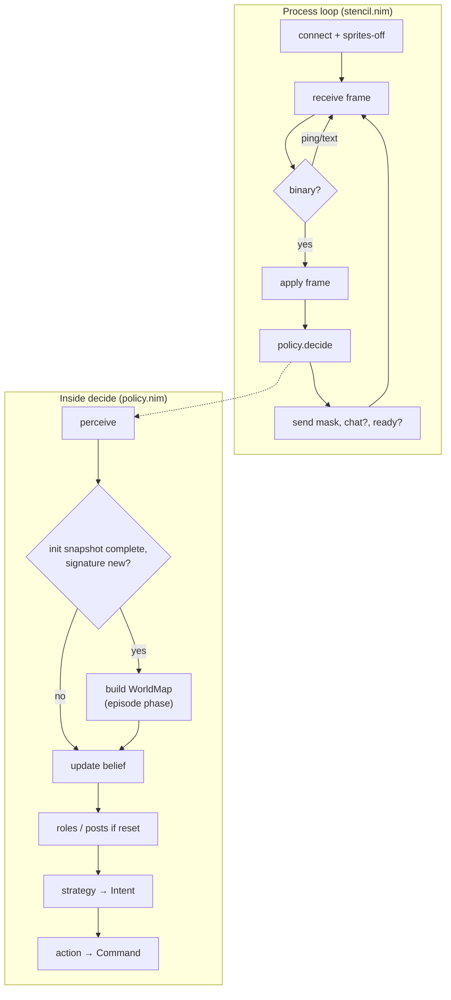
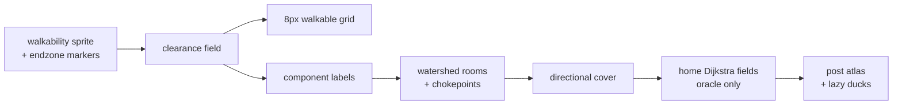
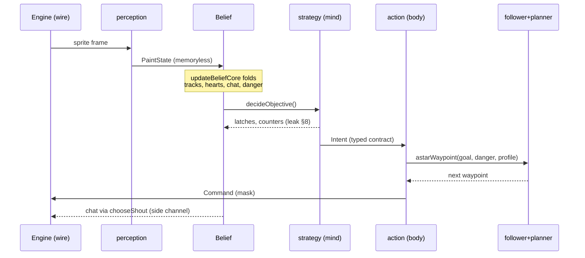
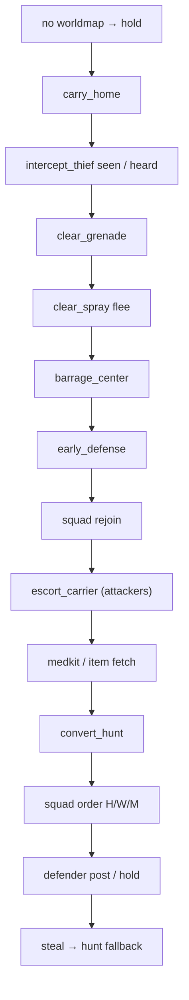
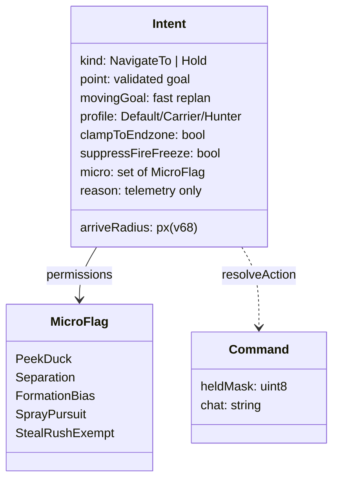
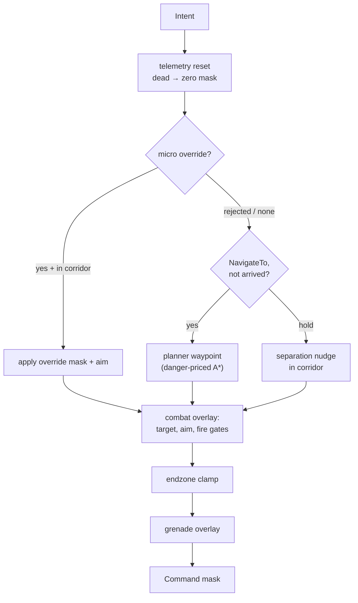
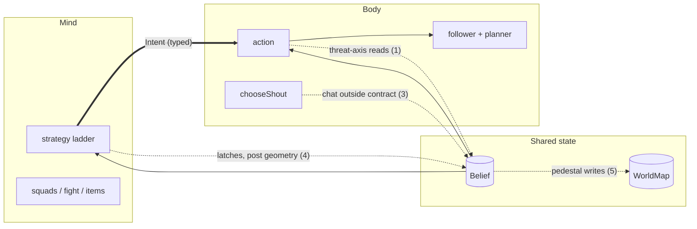

# The Stencil Decision Loop: Body and Mind

A reference explainer of the stencil Paintbot policy (`paintbot_lab/paintbot/stencil_nim/`) as shipped in v68, written 2026-08-29 for James ahead of the strategy rework — focused on the loop structure, the boundaries between its phases, the interfaces that connect them, and the places where those boundaries leak.

## Executive summary

Stencil runs three nested loops: a **process loop** that owns the socket and calls the policy once per world-changing packet; a **per-episode phase** that builds all map knowledge (the `WorldMap`) the first frame the init snapshot completes; and a **per-tick pipeline** that runs perceive → fold-into-belief → decide → act on every decision. Since the v66 Intent contract, the mind→body boundary is genuinely typed: strategy's only sanctioned output is one `Intent` — a pre-validated goal plus typed permissions — and the body (action, follower, planner) reads nothing else to move. Movement is one weighted-A* planner under belief-derived danger; micro may only perturb motion inside a corridor around the planned path (v68). That is the clean story, and it is mostly true.

The exceptions are the strategy rework's worklist, and this report names all of them with code citations: idle aim still steers off strategy-level state through `threatAxis`/`sweepTarget` inside action (the sketch's half-landed kill — **closed 2026-08-29 as v69**, see §8.1); defender post assignment lives in the orchestrator (`policy.nim`) rather than in strategy; outbound chat is chosen outside the Intent path entirely; strategy freely mutates Belief mid-decision (latches, counters, squad-post fields that action later reads back); and belief-update still writes pedestal positions into the supposedly immutable `WorldMap`. None of these is a bug today — each is a seam the rework should either formalize or close.

## Table of contents

1. [Three nested loops](#1-three-nested-loops)
2. [The per-tick pipeline: five stations](#2-the-per-tick-pipeline-five-stations)
3. [The mind: the strategy ladder](#3-the-mind-the-strategy-ladder)
4. [The contract: the typed Intent](#4-the-contract-the-typed-intent)
5. [The body: action, follower, planner](#5-the-body-action-follower-planner)
6. [The side channels: chat and trace](#6-the-side-channels-chat-and-trace)
7. [Loops within the loop: cadences](#7-loops-within-the-loop-cadences)
8. [Boundary leaks: the strategy-rework worklist](#8-boundary-leaks-the-strategy-rework-worklist)
- [Appendix A: module map](#appendix-a-module-map)
- [Appendix B: Intent flags by reason](#appendix-b-intent-flags-by-reason)
- [Sources](#sources)

## 1. Three nested loops

- The **process loop** (`stencil.nim`) owns transport only: connect, decode frames, call the policy once per applied binary packet, send mask + optional chat, optionally send fast-ready. It retries connection until first contact; after that, any socket error means the game ended and the process exits.
- The **per-episode phase** is triggered by data, not by a lifecycle event: the `WorldMap` is built the first tick the init snapshot is complete, and rebuilt if the map signature `(width, height, teams)` ever changes.
- The **per-tick loop** is everything else — and "tick" here means *decision*: one `decide` per world-changing packet the engine sends.

The process loop is deliberately dumb. `run()` (stencil.nim:38-99) connects, sends the sprites-off blob so the server stops streaming cosmetic sprites (stencil.nim:56-58), and then loops: apply frame → `policy.decide` → send the held-button mask, plus a chat packet only when the decision produced one (stencil.nim:66-83). With `STENCIL_FAST_READY=1` it also sends a ready packet after every decision so a bot-only server can advance without sleeping at the 24 tick/s wall clock (stencil.nim:43,84-87). Telemetry is recorded here, outside gameplay code, and the trace module's contract is that its failures never touch play: "Telemetry is isolated from gameplay: failures are reported and swallowed" (trace.nim:1-2).

The per-episode phase is the interesting one, because Paintbot generates a fresh map every episode: there is no offline bake, so *all* map knowledge is derived online. The trigger lives in the orchestrator: once walkability, the `game teams` marker, and every endzone are present, and the signature differs from any current map, `newWorldMap` runs and role assignment is reset (policy.nim:39-50).

Figure 1 — The process loop calls `decide` once per world-changing packet; the episode phase (WorldMap build) is a data-triggered branch inside the tick, not a separate lifecycle.

The build itself is a fixed derivation pipeline, each stage feeding the next (worldmap.nim:173-209): the pixel wall mask and endzones come straight off the wire; the L∞ **clearance field** is computed from walkability; the 8 px walkable grid is *derived* from clearance (the old erosion is gone); 4-connected **component labels** give O(1) reachability; the priority-flood **watershed** yields rooms and chokepoints; 16-sector **directional cover** masks come next; the per-team home **Dijkstra fields** are warmed (these survive only as the planner's heuristic oracle); and the **post atlas** — scored firing positions everywhere there is cover, with lazily-paired duck cells — is built last because it consumes everything before it.

Figure 2 — The per-episode WorldMap derivation pipeline (worldmap.nim:173-209). Everything downstream of the wire is computed, never authored.

## 2. The per-tick pipeline: five stations

- One tick = one pass through `policy.decide` (policy.nim:22-109), with five stations: **perceive**, **fold**, **orient** (roles/posts, only when reset), **decide** (strategy), **act**.
- Perception is *memoryless*: `perceive` produces a fresh `PaintState` every tick with no reference to the past (perception.nim:1).
- All memory lives in one place: the `Belief` object, folded forward by `updateBeliefCore` (belief_update.nim:362-441).
- The mind's output is exactly one typed `Intent`; the body's output is exactly one `Command` (a held-button mask plus optional chat text).

**Perceive.** The Sprite-v1 scene is label text plus geometry; `perceive` reads it into a `PaintState`: self position/color/facing and the authoritative `own aim` marker (with a 16-rotation sprite fallback), players matched to identity badges within 30 px to attach loadout (gun/spray/grenade/shield), hearts per color with planted/carried state, self-carry detection within 24 px, visible items, heard impacts, shouts, team scores, the barrage marker, and — only until the WorldMap exists — the decoded walkability mask (perception.nim:308-390).

**Fold.** `updateBeliefCore` merges that percept into `Belief` in a fixed order (belief_update.nim:362-441): liveness and respawn; color lock (the first `self <color>` sighting overrides the slot-parity guess); aim dead-reckoning corrected by the observed marker; a seats-per-team estimate that only grows as higher identity badges are observed; hearts, retirement, and steal-target choice; item spawns; enemy and teammate tracks (identity-first matching with velocity EMA and TTL); heard events and the under-fire flag; inbound chat effects; the legacy danger grid; the LOS plan-danger field (on a cadence, see §7); and the firefight state machine.

**Orient.** Role and defensive-post assignment run only when flagged stale — at WorldMap build or when the muster estimate changes (policy.nim:47,53-54). A defender gets a distinct atlas post (banded outward from home, separation-filtered, facing scored against believed enemy positions) or the geometric hold-point fallback (policy.nim:55-98, roles.nim:31-75). This station is mind-work that currently lives in the orchestrator — see §8.

**Decide and act.** `decideObjective` produces the Intent (§3-4); `resolveAction` turns it into a mask (§5); `chooseShout` may attach chat (§6).

Figure 3 — One tick. The solid path is the sanctioned pipeline; the dashed arrows are the two flows that bypass the Intent contract (strategy writing belief state, chat chosen outside the path).

## 3. The mind: the strategy ladder

- One module, one job: "The single-objective movement priority ladder" (strategy.nim:1) — first matching rung wins, every tick.
- Every rung's goal is **validated before the Intent exists**: producers route candidate points through `nearestReachable` (same-component, nearest standable pixel) and fall through to the next rung if nothing qualifies (strategy.nim:80-83; the v66 contract).
- Emergencies outrank roles; roles outrank the default steal push; squad consensus sits between item logic and role behavior.
- Two rungs also gate other machinery: early defense pauses squad consensus until its lives-lead condition releases (strategy.nim:315-320), and the arc-pursuit wrapper can override the whole base decision when the agent carries the spray weapon (strategy.nim:475-488).

The ladder in code order (strategy.nim:302-473):

Figure 4 — The priority ladder (strategy.nim:302-473), top rung first. Each box is a producer that validates its goal or falls through.

A few rungs deserve a word. **clear_spray** is a scored 16-direction flee over ally gun coverage, threat distance, clump risk, and (during a barrage) center pull, with a hysteresis latch so the agent doesn't flicker in and out of flee mode (strategy.nim:159-282). **barrage_center** picks the most open, least dangerous room peak from the watershed topology rather than the literal map center (strategy.nim:85-111). **Squad orders** ground the consensus directive into an atlas post near the agreed cell and stash that post's geometry on Belief for action's aim logic to find (strategy.nim:413-451) — one of the leaks in §8. The subsystems the ladder consults — squads' consensus state machine, fight's firefight scoring, items' discovered spawn table — are described in Appendix A; they are all mind-side.

## 4. The contract: the typed Intent

- The Intent is the **entire** sanctioned mind→body interface: one object per tick (types.nim:205-214).
- Its `point` is pre-validated at selection; its `reason` string is telemetry-only (grep-gated since v66); everything the body may or may not do is a **typed field**, not an inferred behavior.
- Construction is centralized: one helper, `makeIntent`, plus a per-reason flag table — the seven old dispatch lists made visible in one place (strategy.nim:13-72).
- The flags divide into *permissions* (the micro set), *executive orders* (kind, point, arriveRadius, movingGoal), and *modifiers* (profile, clampToEndzone, suppressFireFreeze).

Figure 5 — The typed contract (types.nim:189-218). Strategy constructs an Intent; action resolves it to a Command; the body dispatches on typed fields only.

Who consumes what: the **follower** consumes `kind`, `point`, `arriveRadius`, `movingGoal`, and `profile` (the last two decide replan cadence and danger pricing); the **micro layer** consults the `micro` permission set plus `kind` (Hold-context ducks are corridor-exempt); the **combat layer** consults `suppressFireFreeze` (a fleeing agent may shoot through its usual post-fire movement freeze — unless the sprayer is already lethally close, action.nim:438-442); and the **endzone clamp** consults `clampToEndzone` (action.nim:553-561). `arriveRadius` was transcribed in v68 from the five real arrive distances strategy already used (barrage 80 px, hold-family 28, rejoin 40, squad-move-family 56), so the follower can stop advancing without re-deriving strategy's thresholds.

The contract's enforcement teeth, from the v66 design: goals that cannot be validated never become Intents (the producer falls through); an unroutable goal that somehow reaches the planner is a **loud bug** (`plan_unroutable_bug`, plus a counter), not a beeline; and `intent.reason` may appear only in trace code.

## 5. The body: action, follower, planner

- `resolveAction` is a fixed resolution order, not a rule engine: micro override → planner waypoint → combat overlay → clamps → grenade overlay (action.nim:423-568).
- Movement truth is **one planner**: every NavigateTo routes through weighted A* on the pixel lattice; flow fields inform its heuristic and nothing else.
- Micro may *perturb* motion but never replace the route: every perturbation destination must pass `nudgeClear` (the engine-fidelity wall-slide law from v61) **and** lie within the follow corridor of the planned path (v68).
- Stuck handling is minimal by design: progress test → one penalty replan → loud telemetry; the old 90° jitter is deleted.

The resolution order in detail. After telemetry resets and the dead/no-map early-out, `resolveAction` computes the peek/duck micro override, applies the post-fire movement freeze, tests arrival against `arriveRadius`, and runs progress accounting (`noteProgress` for un-arrived pointed intents; reset otherwise, so holds and ducks never accrue stuck ticks) (action.nim:425-453). A micro override whose destination falls outside the corridor is rejected and counted (`micro_corridor_rejects`), falling back to the plain waypoint (action.nim:454-460). Then either the override's mask applies, or the planner supplies the next waypoint — `astarWaypoint(nav, map, selfXy, point, planDanger, tick, movingGoal, profile)` — optionally blended with the squad formation bias, corridor-checked again (action.nim:461-481). Hold intents instead get the separation nudge, same corridor check (action.nim:482-492). The combat overlay then chooses a target (firefight-scored, or the spray-weapon target), aims with lead, gates fire on alignment + line-of-sight + friendly-fire corridor, and freezes movement during the fire windup (action.nim:493-545). With no target, aim falls back to the override's aim or the sweep (the §8 leak). Finally the early-defense endzone clamp and the grenade charge/release overlay apply (action.nim:553-567).

Figure 6 — `resolveAction`'s fixed resolution order (action.nim:423-568). Micro can perturb but never replace the planned route; combat overlays aim/fire on top of whatever movement won.

Beneath action sits the **follower** (`NavState` on Belief, nav.nim:7-28). It caches the current path and replans on exactly four triggers: the goal moved more than `ReplanGoalCells`, a moving goal's replan TTL expired, the cost profile changed, or the stuck watchdog fired (nav.nim:67-84). The watchdog is the v68 ladder: a forced replan with a one-cell blocked-edge penalty (×8 cost, 96-tick TTL), and a `follow_stuck_bug` loud trace if it re-fires within the window (nav.nim:75-82). An unroutable plan returns the agent's own position — hold in place, count it — never the raw goal (nav.nim:108-109).

The **planner** itself is pure and reusable (planner.nim): endpoints ring-snap to the nearest standable pixel within 4 cells; a `sameComponent` gate refuses cross-component searches outright; the search runs on a 4 px lattice with a 4→2→1 px completeness cascade for narrow ridges; edges cost `step × (1 + dangerWeight × LOS-danger)`, where the LOS danger field is rebuilt from believed enemy positions on a cadence; and the init-minted Dijkstra home fields survive only inside the heuristic, tightening it toward true route distance (planner.nim:31-38,49-73,149-155,236-274). The profiles are the carrier/hunter danger multipliers from the Intent (2.5× and 0.25× by default).

## 6. The side channels: chat and trace

- **Inbound** chat is perception-like: shouts decode during belief update and only ever write belief state (tracks, fixes, warnings, consensus, presence, claims) (belief_update.nim:200-282).
- **Outbound** chat is a policy-level side effect: `chooseShout` runs in `policy.decide` *after* action resolution and attaches text to the Command — it does not pass through the Intent (policy.nim:105-109).
- Trace is one-directional: it reads policy/belief state and is contractually isolated from gameplay (trace.nim:1-2).

Outbound selection is a strict priority queue under a 24-tick sender cooldown: carrier position > own-thief position > consensus commit > vote > proposal > charged-grenade warning > identified spray carrier > under-fire > focus claim > enemy sighting > presence ping (chat.nim:168 onward; the full wire formats, cadences, and trust model live in `docs/stencil-communication.md`). Two structural facts matter for the rework: chat positions are quantized to the 8 px cell grid on the wire (one of that grid's surviving legitimate roles), and the inbound/outbound asymmetry is real — inbound is cleanly a belief input, while outbound is a second decision the mind makes each tick outside its single-Intent contract.

## 7. Loops within the loop: cadences

- Not everything the mind uses is recomputed per tick; several products run on their own clocks inside the tick loop.
- These cadences are the practical answer to "which loop does X live in" — most subsystems are per-tick *consumers* of slower *producers*.

| product | cadence | where |
| --- | --- | --- |
| WorldMap (all map knowledge) | once per episode, on signature change | policy.nim:39-50 |
| Role + defensive post assignment | on WorldMap build or muster change | policy.nim:47,53-98 |
| Planner path | on goal move / profile change / moving-goal TTL / stuck | nav.nim:67-84 |
| LOS plan-danger field | at most every `PlanMovingReplanTicks` | belief_update.nim:353-360 |
| Legacy danger grid | decay + stamps per tick; diffusion on a fractional-cell carry | belief_update.nim:331-351 |
| Enemy/teammate tracks | per tick fold, TTL retention | belief_update.nim:51-132 |
| Chat send | one shout per 24 ticks | chat.nim:172-173 |
| Squad consensus | epoch-driven; 45-tick rebroadcast, 480-tick timeout | squads.nim:429-499 |
| Item spawn beliefs | sighting-driven with respawn clocks | items.nim:19-67 |

## 8. Boundary leaks: the strategy-rework worklist

- The Intent contract holds for movement; the leaks below are everything *else* crossing the mind/body line informally.
- All are code-verified as of v68 (2026-08-29); none is a live bug — each is a seam to formalize or close.

1. **The threat axis (idle aim).** ~~`threatAxis` reads squad-post sightlines, the defensive post's opponent pedestal, and the steal target directly from Belief inside action; `sweepTarget` adds the squad sector offset and oscillates (action.nim:62-89, squads.nim:39). The nav-rework sketch ordered this concept killed; only its *movement* keying died. Idle aim is a mind decision being made in the body — the natural fix is an aim-intent (or an Intent field) produced where the strategy context lives. Being finished separately (handoff prompt exists).~~ **CLOSED 2026-08-29 (v69):** exactly that fix landed — `Intent.idleAimCenterBrads` is stamped post-ladder in strategy (with the dead-tick stamp in policy.nim), and the body keeps only the sweep oscillator (`idleSweepAim`). See `docs/designs/strategy-idle-aim-intent-2026-08-29.md`.
2. **Post assignment in the orchestrator.** Defender role and atlas-post selection run in `policy.nim` (policy.nim:55-98), not in strategy — so "what post do I defend" is decided outside the module that decides "am I defending."
3. **Outbound chat bypasses the contract.** `chooseShout` is a second per-tick decision with its own priority ladder, attached to the Command after action resolution (policy.nim:105-109). If the Intent is the mind's single output, communication intent belongs in it (or in a sibling typed output).
4. **Strategy writes Belief mid-decision.** Latches (`sprayFleeActive`, `earlyDefenseComplete`, `converting`), counters, and the squad-order post geometry that action later reads for stance/aim (strategy.nim:308-313,419-428). The last one is a real dataflow: mind → belief → body, invisible to the Intent.
5. **WorldMap is not actually immutable.** `updateHearts` writes observed pedestal positions into the map every percept (belief_update.nim:16-20), against the sketch's "WorldMap becomes immutable; anything dynamic moves to belief state" requirement. Newly caught in this audit — not previously recorded.
6. **Action writes telemetry onto Belief.** By design (trace reads Belief), but it makes Belief the body's scratchpad too (action.nim:425-430 and throughout the combat block); worth an explicit convention when the boundary is redrawn.
7. **A stale module doc.** `nav.nim:1` still says "Flow-field lookup…" — flow-field movement left that module in v66. Cosmetic, but it misleads exactly the boundary-reading this report exists for.

Figure 7 — The mind/body split as it stands. The double arrow is the sanctioned typed contract; dashed arrows are the numbered leaks from the worklist above.

## Appendix A: module map

| module | role | side |
| --- | --- | --- |
| stencil.nim | transport loop, process lifecycle | shell |
| protocols.nim / perception.nim | wire decode; memoryless percept | senses |
| belief_state.nim / belief_update.nim | the one memory; the fold | state |
| worldmap.nim | episode map model: clearance, topology, cover, atlas, oracle | state (per-episode) |
| danger_field.nim | LOS-exposure danger over believed enemies | state |
| roles.nim | seat→role, defender/early-defense posts | mind (invoked from policy.nim) |
| strategy.nim | the priority ladder → Intent | mind |
| squads.nim | parity squads, leaderless consensus, biases | mind |
| fight.nim | firefight hysteresis, target scoring, focus claims | mind (state updated in fold; consumed in body) |
| items.nim | discovered spawns, fetch evaluation | mind |
| types.nim | Intent, Command, shared domain types | contract |
| action.nim | Intent → controller mask; combat overlay | body |
| nav.nim | follower: path cache, corridor, watchdog | body |
| planner.nim | pure weighted-A* lattice planner | body |
| chat.nim | shout codec + sender arbitration | side channel |
| trace.nim | isolated telemetry | observer |
| config.nim | 152 `STENCIL_*` knobs | tuning |
| policy.nim | the per-tick orchestrator | shell (currently holds mind-work; §8.2) |

## Appendix B: Intent flags by reason

Transcribed from `makeIntent` (strategy.nim:13-72). Default micro set is {PeekDuck, Separation, SprayPursuit}; profile Default; nothing else set.

| reason | micro changes | other fields |
| --- | --- | --- |
| carry_home | −PeekDuck | profile=Carrier |
| steal | +FormationBias, +StealRushExempt | — |
| clear_grenade, fetch_medkit | −PeekDuck | — |
| clear_spray | −PeekDuck −Separation −SprayPursuit | movingGoal, suppressFireFreeze |
| intercept_thief(_heard) | −PeekDuck | movingGoal, profile=Hunter |
| early_defense | −PeekDuck −Separation −SprayPursuit | clampToEndzone; arrive 28 px |
| barrage_center | −PeekDuck −Separation −SprayPursuit | arrive 80 px |
| convert_hunt | — | movingGoal, profile=Hunter |
| escort_carrier(_heard) | — | movingGoal, profile=Carrier |
| arc_pursuit | — | movingGoal, profile=Hunter |
| to_hold, squad_move, squad_to_hold, squad_to_watch | +FormationBias | to_hold arrive 28 px; squad-family arrive 56 px |
| to_post | — | arrive 28 px |
| rejoin | — | arrive 40 px |

## Sources

- paintbot_lab/paintbot/stencil_nim/stencil.nim
- paintbot_lab/paintbot/stencil_nim/policy.nim
- paintbot_lab/paintbot/stencil_nim/types.nim
- paintbot_lab/paintbot/stencil_nim/perception.nim
- paintbot_lab/paintbot/stencil_nim/belief_state.nim
- paintbot_lab/paintbot/stencil_nim/belief_update.nim
- paintbot_lab/paintbot/stencil_nim/danger_field.nim
- paintbot_lab/paintbot/stencil_nim/roles.nim
- paintbot_lab/paintbot/stencil_nim/strategy.nim
- paintbot_lab/paintbot/stencil_nim/action.nim
- paintbot_lab/paintbot/stencil_nim/nav.nim
- paintbot_lab/paintbot/stencil_nim/planner.nim
- paintbot_lab/paintbot/stencil_nim/worldmap.nim
- paintbot_lab/paintbot/stencil_nim/squads.nim
- paintbot_lab/paintbot/stencil_nim/fight.nim
- paintbot_lab/paintbot/stencil_nim/items.nim
- paintbot_lab/paintbot/stencil_nim/chat.nim
- paintbot_lab/paintbot/stencil_nim/trace.nim
- paintbot_lab/paintbot/stencil_nim/config.nim
- paintbot_lab/docs/designs/nav-layer4-intent-contract-2026-08-13.md
- paintbot_lab/docs/designs/nav-layer5-follower-2026-08-14.md
- paintbot_lab/docs/designs/nav-rework-sketch-2026-08-11.md
- paintbot_lab/docs/stencil-communication.md
- paintbot_lab/paintbot/stencil_nim/VERSION_LOG.md
