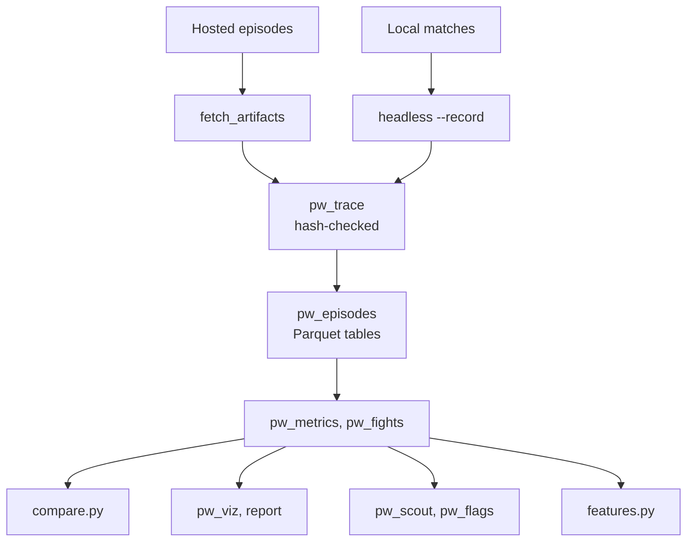
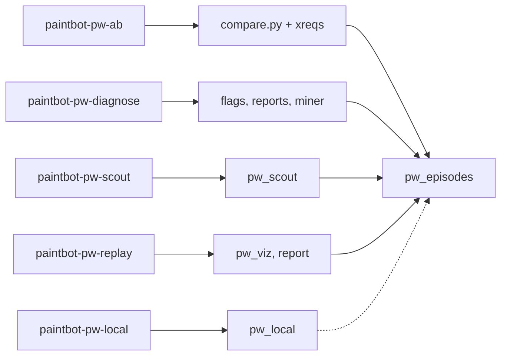

# Brief: Paintbot PW analysis tooling and skills plan

Doc type: design / plan. Date: 2026-09-29. Status: implemented 2026-09-29 (tool index: paintbot_pw_lab/docs/tools/README.md). Departures from this plan: 7 skills (added paintbot-pw-loop); an agent layer (pw.py dispatcher/doctor/tools/leaders, pw_cli contract, tools/release.env pin); design 2 (h2h) is local-only because hosted h2h is self-play; intent lines cannot carry instruction headroom (BASIC cannot read it; use PW_BASIC_PEAKS=1 locally); rerun.io not added. Audience: James.
Scope: every tool and agent skill the `paintbot_pw_lab` needs to diagnose, experiment on, and improve
our BASIC policy, with how to get each one. Researched against paintbot-pw tag `coworld-v0.3.77`
(`0ff41d2d`, rules 47), the league's build on 2026-09-29.

Citation roots: `pw:` = `~/coding/coworlds/paintbot-pw` at `0ff41d2d`; `lab:` =
`~/coding/personal_labs/personal_labs_paintbot_pw`; research notes are in
`lab:.reports-working/paintbot-pw-tooling-plan-2026-09-29/notes/` (`engine-surface.md`,
`sibling-labs.md`, `external.md`) and are cited as `notes/<file>`.

## Executive summary (source for the ≤2-paragraph summary)

The engine makes this unusually cheap. A hosted replay is a complete action tape with a per-tick
state hash, and re-simulating it with hooks the engine already has (`observeShot`, `observeHit`,
`observeTag`, and under `-d:pwTraining` `damageObserver`/`damageWeapon`) plus reading `World`
fields each tick yields every event we asked for — shots, hits with attacker/victim/weapon/distance,
armor versus HP damage, kills, respawns, pickups, capture start/pause/reset/complete, glory by kind,
shouts with text, disguises, trench and water entry — and full per-tick state for movement
diagrams. A scratch probe did this on all three sample league replays with zero hash mismatches in
0.5–1.0 s per match (events) or 2.7–4.5 s with all-pairs visibility (notes/engine-surface.md §0–3).
Only four things need an engine patch or our own logs: the exact outcome of a gun ray that reaches
a spawn-shielded or trench-dodging victim, the intended target of a shot, why/when a VM was
disabled, and the policy's internal intent. A native library also runs local 16-seat BASIC matches
with the league's exact rules and glory config at ~5.4 s per match, hash-identical to the headless
binary (§4). The sibling labs already solved the hard parts of the analysis side: Gods of the
Arena's episode-reader → A/B adapter → miner-features pipeline, the shared `coworld-ab` statistics
engine, and crewrift's survey/field-study discipline (notes/sibling-labs.md §9).

One finding from this research changes the measurement target. Since 2026-09-28 evening the paintbot-pw ladder rates each episode by glory margin, not win/draw/loss: `margin_scale: 1000` is set in the live league settings, so an episode's Elo outcome is `clamp(0.5 + (our glory − their glory) / 2000, 0, 1)` — a 500-glory win counts 0.75, a 950-glory win about 0.98, a zero-glory win a draw (metta `elo.py:82-87,183-187`, commit `6304974ffa`, live league settings read 2026-09-29). Glory size now moves rank, which reverses what the lab docs and the onboarding report say; T0 corrects them. It also helps the A/B: this per-episode outcome score is continuous, so tests need fewer episodes than a win/loss bit.

The plan is fifteen tools plus a currency repair (T0–T15) and six lab skills, built in five phases, all in `paintbot_pw_lab/` except
two game-agnostic statistics additions to the shared `coworld-ab` skill. Phase 0 re-verifies the lab
docs at rules 47 (they are two releases stale). Phase 1 builds the foundation everyone else reads:
a hash-checked trace tool (`pw_trace`), an episode reader with a signed cache, and per-event
Parquet tables queried with DuckDB. Phase 2 is the A/B stack: a `compare.py` adapter plus paired
and sequential (SPRT) tests that `coworld-ab` lacks today, a local batch harness, and the
`paintbot-pw-ab` skill. Phase 3 is movement diagrams and per-match reports on a real terrain
background. Phase 4 is opponent scouting, fight/trade metrics and the hypothesis-miner adapter.
Phase 5 holds higher-effort ideas (win-probability credit, intent telemetry and belief audits,
constant tuning). Four decisions need James: the A/B design default, whether to add SPRT to the
shared engine, the telemetry budget our BASIC may spend, and whether the optional rerun viewer
dependency is welcome.

## 1. Problem and goals

- We have no instruments yet. The lab has only `tools/deployed_ref.py` (league → release → commit)
  and `tools/build_tools.sh` (pinned engine build) (`lab:paintbot_pw_lab/README.md`, Instruments).
- James asked for: a good A/B skill; unpacking replays to get every event; movement diagrams for
  a chosen time span; measurement of accuracy, deaths, damage dealt/taken, score, glory, heart
  nearness; and anything else useful, taking inspiration from the other labs.
- Goals: (1) trustworthy numbers (hash-checked, never silently dropped); (2) fast iterations
  (speed-first lab doctrine, `lab:AGENTS.md` loop); (3) visible behavior a human can judge;
  (4) reuse the shared engines and sibling patterns; (5) everything version-pinned, because the
  game ships several releases a day.
- Non-goals: rebuilding the web replay viewer (needs Emscripten and a private art repo,
  notes/engine-surface.md §2); Heartland (now its own coworld with `heartland-v*` tags, out of
  scope); a Python Flatty decoder (the Nim loader already validates and versions the format).

## 2. What exists and what changed

- Existing lab tools: `deployed_ref.py`, `build_tools.sh`; docs `mechanics.md`,
  `policy-surface.md`, `field.md`, `community.md`, `evidence-pipeline.md` verified at
  `7b2b19f5`/`ef82196`.
- Drift since then (2026-09-28 → 29): the league moved 0.3.68 → 0.3.77. Rules 46–47 added
  "behind-in-cogs" glory (`gloryBehindCogs`: every 5 s, a team earns glory per cog it has out of the
  match beyond the enemy's count; league variants pay 10), BASIC gained `teamLives`, `teamCogsOut`,
  `awardBehind*`, seat count became per-match (2..256), `World.cogs/equipment/uniforms` became
  `seq`s, observation contract v3 and `pw_seat_state` were added (notes/engine-surface.md §7;
  `pw:examples/paintbot/sim.nim:143,946-950`; `pw:examples/paintbot/bots.nim:260-273`).
- Consequences: the lab's per-seat probe no longer compiles (`array[Seats,…]` fails; use `seq`/
  `MaxSeats`) (notes/engine-surface.md §0.4); `deployed_ref.py` cannot resolve Heartland's new
  `heartland-v*` tags; `build_tools.sh` defaults to 0.3.68; the mechanics/policy docs miss rules
  46–47.
- Shared skills and their fit (notes/sibling-labs.md §1–4):
  - `coworld-ab`: engine `ab_stats.py` with `build_deltas(base_groups, cand_groups, metrics,
    metric_value, value_fn, all_groups, sig_p)`; rates use Fisher exact on binary observations,
    means use Welch; BY correction; ≥30 episodes per arm per group for a significant verdict. It has
    **no paired test and no sequential stopping**.
  - `coworld-hypothesis-miner`: adapter exports `adapter(dict) -> Episode|None` and `METAS`;
    ≥8 episodes; "never" encoded as last tick + 1.
  - `coworld-episode-artifacts`: `fetch_artifacts.py` saves the paintbot-pw tape under two wrong
    names (`replay.json`, `replay.json.z`) (root `TODO.md`).
  - `coworld-experience-requests`: `xp_dashboard.py` requires a `results.win` array, which
    paintbot-pw results lack, so it shows progress only.
  - `coworld-local-run`: Docker-based; does not apply (no player container).

## 3. Design principles (each traced to evidence)

1. **One hash-checked source of truth.** Every number derives from a re-simulation that fails
   loudly on any hash mismatch (GotA `expand_replay.nim:397-405`; notes/sibling-labs.md §5, §9.2).
2. **Replay tells what happened; telemetry tells why.** The tape already holds every seat's
   executed command and the re-simulation gives outcomes for all 16 seats, so our BASIC prints only
   intent (notes/engine-surface.md §5; notes/sibling-labs.md §5b).
3. **Episode is the unit, one row per (episode, policy).** Eight seats of one policy in one episode
   are not eight samples (ctf-ab and GotA miner mistakes, notes/sibling-labs.md §10.1).
4. **Exact and inferred never mix; unknown is null, not zero; every exclusion is counted and
   printed** (GotA `compare.py:163-183`).
5. **Version-pinned everything.** Tools build at the recorded release; results carry
   `coworld_version`; comparisons never pool rules versions (lab WORKING_CONTEXT).
6. **Reuse before build.** Shared engines for statistics and mining; the repo's own Nim engine for
   simulation; existing Python deps only (pandas, pyarrow, DuckDB, matplotlib, scipy, Pillow,
   numpy, scikit-learn are already in `pyproject.toml`).
7. **Agent-readable and human-readable output.** Every report emits JSON beside HTML/PNG
   (notes/sibling-labs.md §3b).
8. **Local is for mechanisms and screening, never evidence against the field**
   (cue_n_woo's most re-learned lesson; lab AGENTS).

## 4. Architecture

Layers (a figure: data flow):

- Sources: hosted episode artifacts (episode.json, results.json, replay tape, our seat logs) via
  `fetch_artifacts.py`; local matches via the native library / headless binary.
- L1 Trace: `pw_trace` (Nim, built at the recording's release) → per-episode events + sampled
  per-tick state, hash-checked.
- L2 Tables: `pw_episodes.py` reads episodes, runs/caches traces (receipt signed over sha256 of
  replay, results, episode.json, binary, options), writes per-episode Parquet tables; DuckDB views
  across a batch.
- L3 Metrics: `pw_metrics.py` (+ `pw_fights.py`) — one definition of every metric, per seat, per
  (episode, policy), per team.
- L4 Consumers: `compare.py` (coworld-ab adapter + paired/SPRT), `features.py` (miner adapter),
  `pw_viz.py` (movement, heatmaps, timelines), `pw_match_report.py` (per-episode HTML), `pw_scout.py`
  (opponent profiles, policy×policy matrix), `pw_flags.py` (anomaly flags).
- L5 Skills: `paintbot-pw-replay`, `paintbot-pw-ab`, `paintbot-pw-diagnose`, `paintbot-pw-scout`,
  `paintbot-pw-local`, `paintbot-pw-tune` (later).
- Policy side: an intent telemetry line in our BASIC behind a knob, parsed by `pw_episodes.py`.

## 5. Tool catalog

Each: purpose; inputs → outputs; build/reuse; effort (S ≤2 h, M ≈ half day, L ≈ 1–2 days);
verification.

### T0. Currency repair (Phase 0) — S
- Re-verify `mechanics.md`/`policy-surface.md` at `0ff41d2d` for rules 46–47 (behind-in-cogs glory,
  new BASIC names, seat count); fix `deployed_ref.py` to resolve `heartland-v*` tags (or drop
  Heartland); bump `build_tools.sh` default; retire the evidence-pipeline appendix probe in favor of
  T1. Correct every lab statement that glory size does not move rank (AGENTS.md, README.md,
  TENTATIVE_LESSONS.md, mechanics.md §1, field.md, and the onboarding report §3/§12): the ladder
  now uses `margin_scale: 1000`. Verify with `deployed_ref.py` returning "current".

### T1. `pw_trace` — hash-checked replay expander (Nim) — M
- Purpose: unpack a replay into every event plus per-tick state.
- Build: lift the verified scratch probe (`pwtrace.nim`, notes/engine-surface.md §0, §3) into
  `paintbot_pw_lab/tools/pw_trace.nim`; compile inside the release worktree the way GotA copies its
  `.nim` into the engine tree (`gods_of_the_arena_lab/tools/build_expand_replay.sh`, notes/sibling-labs.md §5);
  extend `build_tools.sh` to build it. Flags `-d:pwTraining -d:headless --threads:on`.
- Hooks: `observeShot` (`pw:examples/paintbot/mechanics.nim:681`), `observeHit`
  (`mechanics.nim:370`, before armor), `observeTag` (`mechanics.nim:443`), `damageObserver`
  (`mechanics.nim:422`) with `damageWeapon`; World diffs for windup, spray bursts, grenade
  charge/throw/blast (`w.grenades`, `w.blasts`), pickups (`pickups[k].readyAt` jumps), captures
  (`heartCaptures`, `controlHearts.owner`), glory (`w.gloryEvents`, dedupe by
  (tick, team, kind, amount) because hearts pay before the tick increments), glory-heart takers
  (`w.gloryPickups`), disguise (`w.uniforms`), trench/water transitions, spawns, commands and shouts
  from the tape (`recording.communications`) (notes/engine-surface.md §1.1–1.2).
- Output (schema v1): `meta` row (episode, rules, seed, seats, names, config, binary sha);
  `event` rows (tick, kind, seat, other, x, y, weapon, amount, …); `state` rows every N ticks
  (default 6 = 4 Hz; positions, aim point, goal, hp, armor, lives, alive, charge, in_water,
  trench) and every tick for a requested window; optional visibility sets every M ticks (costly:
  ~1 ms/tick for all pairs); `summary` row (final hash, ticks, glory, meter, per-seat counters).
- Rules: exit non-zero and write a failed summary on any hash mismatch; one process per replay
  (engine globals; GotA `replay-format.md:514-516`); `seq`/`MaxSeats` everywhere.
- Identity checks: sum of deduped glory events + countdown == final team glory; results.json
  ticks/scores/seed match; kills == sum of `SeatStats.kills`.
- Known gaps, recorded as nulls with a flag: shielded-victim and trench-dodge rays look like misses
  (approximate from ray geometry; exact needs a hook at `mechanics.nim:712-714`); VM-disabled tick
  only from our logs or an "all-zero commands while alive" heuristic.
- Cost: 0.5–1.0 s/match events; 2.7–4.5 s with full visibility; 128–216 KB events JSONL
  (notes/engine-surface.md §3). Verify on the 3 sample replays plus one fresh hosted rules-47
  replay (not yet checked: hosted builds use Nim 2.2.10, ours 2.2.6).

### T2. `pw_episodes.py` — episode reader, trace cache, tables — M
- Model: GotA `gota_episodes.py` + `replay_stats.py` (notes/sibling-labs.md §5, §9.1–9.4).
- Reads `episode.json`, `results.json`, finds the tape under any of the fetcher's names, sniffs the
  `POLYWORLDREPLAY` magic and gzip; runs `pw_trace` at the recording's release (resolved from the
  replay header rules/coworld version); caches output with a receipt signed over sha256 of replay,
  results, episode.json, binary and options; promotes atomically; lists failures and exits 1.
- Joins seats by `position` (never array order); team from `game_config.slots`/participants with a
  parity cross-check that raises on disagreement (notes/sibling-labs.md §10.2); policy identity by
  exact `policy_version_id`.
- Writes per-episode Parquet tables (pyarrow) in an awpy-style layout (notes/external.md §2):
  `episodes`, `seats`, `shots`, `damage`, `kills`, `spawns`, `pickups`, `captures`, `glory`,
  `shouts`, `states` (sampled), `visibility` (optional), `policy_log` (our intent lines). A batch
  is a directory; DuckDB views over `**/*.parquet` answer ad hoc questions.
- Parses our seat logs: intent lines (T13), `BASIC error:` → `vm_error`, oracle journal if used.

### T3. `pw_metrics.py` — the metric library — M
- One definition per metric, computed from T2 tables at three levels: seat, (episode, policy),
  team. Catalog in §8.
- Every metric carries units and a denominator; null when its input is missing.

### T4. `pw_fights.py` — engagements, trades, openings — M (Phase 4)
- Segment hits/kills into engagements by time and distance (defaults: events within 48 ticks and
  1,500 units join one engagement; revisit after the first batch) (OpenDota teamfight idea, ctf
  `find_firefights.py` space-time graph, notes/external.md §2, notes/sibling-labs.md §4b); per
  engagement: participants N-vs-M, who saw first, who hit first, winner, hearts affected.
- Trades: a kill avenged within 72 ticks (CS2 practice; default); opening duel per heart contest;
  time-to-first-hit after first sighting (needs visibility sampling).

### T5. `compare.py` — coworld-ab adapter — M
- Skeleton from `paintbot_lab/tools/compare.py` (episode rows, exact version selection, groups per
  version/side) plus GotA's exclusion counter and `ops_fail_rate` (notes/sibling-labs.md §0, §1.4).
- Groups: `red`, `blue`, `all`, and per-opponent. Primary mean metric: the Elo outcome score per
  episode. Rate metrics are binary per episode (win, draw, win-with-zero-glory, first capture);
  other mean metrics are per-episode means over our 8 seats.
- Emits via `render_markdown`/`emit_json`; stores the request ids and bodies with the result
  (sugarscape practice; player_ade gap analysis, notes/sibling-labs.md §9.14).

### T6. Paired and sequential statistics — shared, game-agnostic — S/M
- Add to `.claude/skills/coworld-ab/scripts/`: (a) a paired test for designs where the two arms
  share seeds, sides and opponents (paired t-test on per-pair outcome-score differences with a
  Wilcoxon signed-rank check; McNemar on discordant pairs for win rate); (b) a head-to-head test
  (one-sample t-test of the outcome score against 0.5; exact binomial on decisive games; side-split);
  (c) a sequential probability ratio test on the mean outcome-score difference, as fishtest's GSPRT
  does for Elo (notes/external.md §3, top-12 #1).
- Acceptance: the new paths inherit the existing guardrails — the ≥30-episodes-per-arm floor
  before any "significant" verdict (`SMALL_N = 30`), Benjamini-Yekutieli correction across reported
  metrics, exclusion counting, and ops failures as a metric — with a contract test for each.
- Root change (game-agnostic), so it needs James's go-ahead; contract tests in
  `tools/tests/test_analysis_contracts.py` style.

### T7. `pw_local.py` — local batch harness — M
- Drives the native library (`native_env.nim` built `--app:lib -d:pwTraining`) via ctypes:
  `pw_set_rules(47)`, `pw_set_config_json` with the league's glory config, 16 seat scripts, seeds;
  `pw_results` → winner, glory, meter, hearts (notes/engine-surface.md §4). Parallel processes
  across cores (~2.5 matches/s estimated, not load-tested).
- Uses: compile check of a candidate (seconds), mechanism checks, screening against `base.bas` and
  our own older versions with side swaps, recording selected matches via
  `paintbot-headless --record` for T1. Never evidence against the field.
- Parity guard: before trusting a batch, compare a few final hashes with the headless binary
  (verified identical on seeds 7–9); refuse to run if the library build ref differs from the
  target release (paintbot_lab `render_topology.py` drift-guard idea, notes/sibling-labs.md §3b).

### T8. `pw_map.nim` + map cache — S
- ~40-line exporter sampling `terrainHeight`, `inWater`, `blocked`, `trenchAt` on a grid from
  `newWorld`, plus JSON of bounds, hearts, pickups, trenches, cover, homes (verified: Heartwick at
  25-unit cells = 640×384 in 0.18 s; generated maps from `.pbmap` grids) (notes/engine-surface.md
  §2). Cached per (release, map) as `.npy` + JSON.

### T9. `pw_viz.py` — movement diagrams and charts — M
- Movement trails for a chosen tick window (`--from/--to` ticks or seconds, `--seats`, `--team`,
  `--policy`) over the T8 terrain background: one polyline per seat, breaks at death/respawn,
  arrowheads for direction, markers for events in the window (kill ×, death ○, capture ◆, pickup ▲,
  grenade blast ring, shots as short rays from shooter), hearts colored by owner at the window end.
- Small multiples: the same window across several episodes, or per opponent.
- Batch heatmaps: position density and death locations (hexbin/KDE, notes/external.md §4),
  per-policy occupancy comparison with an overlap score (crewrift `heat_compare.py`
  Bhattacharyya overlap, notes/sibling-labs.md §3b).
- Timelines: meter and glory per team over time with capture/kill ticks; heart ownership strip
  ("control over time").
- Optional animated GIF of a window via matplotlib + Pillow (no ffmpeg on this machine).
- matplotlib only (already a dependency); PNG + JSON of the plotted data.

### T10. `pw_match_report.py` — one-page per-episode report — M
- HTML (Ink & Print) + JSON: result, glory composition, timeline, per-seat table (T3 metrics),
  top moments (largest swings: first capture, multi-kills, lost hearts), movement panels for those
  moments (T9), and replay deep links at those ticks. The paintbot-pw web viewer accepts
  `?replay=<uri>&t=<tick>` (`pw:coworld/paintbot/viewer.js:638-639,1654-1655`); whether the
  Observatory wrapper forwards `t` is unverified.

### T11. `pw_scout.py` — opponent scouting and field survey — M (Phase 4)
- From public league episodes (no credits): policy×policy win matrix with Wilson intervals
  (crewrift-survey; natural here because each episode is one policy per team), per-opponent
  profiles: opening routes and first heart targets (ctf `infer_battle_plan.py` idea, with team
  from metadata not parity), heart order, weapon mix, grenade/spray use, pickup habits, typical win
  time, glory composition, and **their shout protocol** — shout text is in the tape and readable
  (e.g. `FIRE22 1137 1763` in a sample; notes/engine-surface.md §1.1). A shout carries the speaker's
  exact position to anyone within 12.8 m, including us.
- Flagged episodes with agent-written one-line reasons (crewrift-survey `reasons.json`).
- Field-study discipline: check one fresh replay through T1 before pulling a batch; a flat 0% or
  100% aggregate is a tooling bug until proven otherwise (crewrift-field-study).

### T12. `pw_flags.py` — anomaly flags — S/M (Phase 4)
- Rule-based flags linked to ticks: stuck or oscillating cogs (goal unchanged and displacement
  small), idle alive seats (all-zero commands, also the VM-disabled heuristic), dying alone in enemy
  vision, heart lost with allies within reach, wasted grenade (blast with no victims), friendly-fire
  hits, long wades (≥ 72 ticks in water), glory-zero wins. Defaults: stuck = goal unchanged and
  displacement < 200 units over 72 ticks while alive; idle = all-zero commands for ≥ 48 ticks while
  alive. Every threshold is a named constant in one place and printed with the report. Sort our losses by margin and review worst first (Halite
  triage, notes/external.md §5).

### T13. BASIC intent telemetry + parser — S
- One compact line per decision at most, behind a config knob, recording only intent: mode, chosen
  heart, target seat, reason code, instruction headroom. Budget: ≤ 1 print per decision and ≤ ~200
  bytes, far under the 1,024-byte / 128-event per-decision limit whose breach disables the seat
  (`pw:examples/paintbot/bots.nim:160`; `pw:src/polyworld/basic.nim:2423-2430`), and averaging
  < ~700 bytes/tick to stay under the 10 MiB log cap over a full match (notes/engine-surface.md
  §5). Emit on change plus every N ticks, like GotA's `LH` line (notes/sibling-labs.md §6).
- Parser in T2; enables a belief/intent audit: join intent to replay truth (crewrift-belief-audit
  pattern).

### T14. Win-probability model and credit — L (Phase 5)
- Logistic model on (hearts held per team, meter difference, cogs alive and lives per team, time
  left, glory) fit on league episodes; credit each capture, kill, death by its change in win
  probability (Leetify / Xenopoulos CS:GO practice, notes/external.md §2, top-12 #7). Shows which
  minutes and hearts lose games; feeds the miner as features.

### T15. Tuning harness — L (Phase 5)
- SPSA or Optuna over the policy's config knobs against the local harness, then confirm against the
  field with the A/B skill (notes/external.md top-12 #12). Guardrail: local results only screen.

## 6. Skills (agent procedures, in `paintbot_pw_lab/.claude/skills/`)

Each lab skill binds a shared method skill to this lab's tools (crewrift pattern: survey →
warehouse → belief audit → diagnose → experiment → A/B; notes/sibling-labs.md §6b).

- **`paintbot-pw-replay`** — "unpack/look at this replay/episode". Steps: resolve release → build
  if needed → T2 trace + tables → T3 summary → T9 diagram for the asked window → T10 report with
  viewer links. Answers "what happened at tick X", "show me seat N's movement from 1:10 to 1:40".
- **`paintbot-pw-ab`** — "did the change help". Binds `coworld-ab`. Steps: pick design (§7),
  compose xreq bodies (pinned 8-seat rosters, seeds, side swaps), create, stream artifacts, stop by
  SPRT or fixed N, run `compare.py`, render, review 2–3 replays per arm qualitatively, record
  request ids with the verdict.
- **`paintbot-pw-diagnose`** — "why are we losing / what should we change". Steps: batch → T3
  metrics + T12 flags → worst losses first → T10 reports → hypotheses as mechanisms pinned to a
  BASIC module with predicted per-group effect (crewrift-diagnose schema) → hand to
  `coworld-experiment`; miner (T-features) when nothing specific is suspected.
- **`paintbot-pw-scout`** — "what are the leaders doing". Steps: pull recent public league rounds
  → T11 matrix + profiles + shout-protocol decode → flagged episodes with reasons → report.
- **`paintbot-pw-local`** — "compile/screen this locally". Steps: T7 compile check, screening vs
  `base.bas` and our last accepted version with side swaps and the league glory config; state
  plainly that it is not field evidence.
- **`paintbot-pw-tune`** (Phase 5) — constant search on T15, confirmation via `paintbot-pw-ab`.
- Plus the miner adapter `features.py` (+ rows builder) for `coworld-hypothesis-miner`: one row per
  (episode, our policy); score = the Elo outcome score (primary) or win; timing features use last tick + 1
  for never; `change_hint` names the BASIC module; score components excluded
  (GotA `features.py:19-25,82,111-112`).

## 7. The A/B design (deep dive)

Unit and outcome: one episode = two policies, one per team. **Primary metric: the Elo outcome
score** the ladder itself uses, `clamp(0.5 + (our glory − their glory) / 2000, 0, 1)`, a
continuous value per episode (metta `elo.py:183-187`; live settings `margin_scale: 1000`). An
episode that fails and is attributed to one policy scores 0 or 1 for that side (forfeit branch,
`elo.py:171-179`). Secondary: win rate (a draw counts as a non-win), time to win, glory
composition, glory-zero wins, and heart-seconds as a lower-variance margin check.

Three designs, with the recommended default first:

1. **Common opponent, paired seeds and sides (recommended default).** Candidate and baseline each
   play the same opponent policy (all 8 opposing seats pinned to one explicit `policy_ref`) over
   the same seed list and both sides. Pair episodes by (seed, side); test the primary outcome score
   with a paired t-test on per-pair differences (Wilcoxon signed-rank as the robustness check);
   test win rate with McNemar on discordant pairs, where a draw counts as a non-win and pairs with
   the same result in both arms are concordant and dropped. Answers "better against X".
   Repeat per leader and pool with per-opponent reporting.
2. **Head-to-head.** Candidate vs baseline in the same episode, sides swapped across the batch;
   a one-sample t-test of the candidate's outcome score against 0.5 (exact binomial on decisive
   games as the win-rate view), reported per side. Cheapest per bit, but a change can beat our
   old version and still do worse against the field (Battlecode "Just Woke Up" warning,
   notes/external.md §1).
3. **Field sample.** Both arms against a mix of the current leaders, unpaired; `coworld-ab`'s
   Fisher/Welch as today. Closest to the ladder; most expensive.

Stopping: a sequential probability ratio test on the mean outcome-score difference (normal
approximation, as fishtest's GSPRT does for Elo), e.g. H0 = 0 vs H1 = +0.05 with α=β=0.05, checked
as episodes stream; or fixed N with no peeking. Scale: for the win-rate view, the guide estimates
~250 episodes to separate a 62% win rate from 50%; the continuous outcome score needs fewer, to be
measured on the first batch (`lab:paintbot_pw_lab/docs/evidence-pipeline.md` §7); at ~0.3 credits per episode that
is ~75 credits per arm against a 20,000 balance refilling ~1,429/day (`lab:paintbot_pw_lab/docs/field.md`).

Variance control: league episodes carry `game_config.seed` 2026; whether the engine seed varies per
job is unconfirmed (open question). Pairing by explicit seeds via `game_config_overrides.seed` makes
the arms comparable regardless.

Guardrails from sibling labs: ≥30 episodes per arm per group before any "significant"; BY
correction across reported metrics; exclusion counter; ops failures reported as a metric; never
pool rules versions; a confirmatory fresh run before adopting a mined effect (notes/sibling-labs.md
§1.3, §10.4; notes/external.md §3).

## 8. Metric catalog (definitions for T3)

| Metric | Definition | Level |
| --- | --- | --- |
| Elo outcome score | `clamp(0.5 + (our glory − their glory) / 2000, 0, 1)`; forfeit = 0/1 | episode |
| Win / draw / loss | from results (`outcome`, scores) | episode |
| Winning glory | our team's glory when we win; null otherwise (a selected sample, flagged) | episode |
| Glory composition | countdown + quiet supplies + glory hearts + behind lives + behind cogs, from deduped `gloryEvents` | team |
| Meter curve, time to win | `scoreTicks/24` per tick; tick of match end | team |
| First capture tick, lead changes | first `controlHearts.owner` flip to our team; sign changes of meter difference | team |
| Hearts held (mean, at end), heart-seconds | per tick ownership counts | team |
| Gun accuracy | hits ÷ fired rays (`observeShot`); shield/trench-dodge misses flagged as inferred | seat |
| Accuracy by distance band | hits by `damageObserver` distance; misses by ray length or nearest enemy on the aim line (inferred target) | seat |
| Spray / grenade effectiveness | bursts or blasts with ≥1 enemy victim; friendly victims counted separately | seat |
| Damage dealt / taken | HP removed and armor absorbed, by weapon, attacker, victim | seat |
| Kills, deaths, K/D, trades | `observeTag`; trade = a teammate's killer killed within 72 ticks (3 s; default, revisit after the first batch) | seat |
| Friendly fire | hits and kills on teammates | seat |
| Time alive, lives used, cogs out | `hp > 0` ticks; `lives`; `teamCogsOut` | seat/team |
| Heart nearness | ticks within 140 units of a heart with a traversable line (capture reach, `mechanics.nim:327`); ticks in own/enemy/neutral territory (`territoryOwner`); contested ticks | seat |
| Capture credit | captures started, completed (`cogs.captures`), and interrupted | seat |
| Water / trench time | `inWater` / `trenchAt` ticks | seat |
| Pickups | taken by kind; supply-free stretches (the quiet-supplies award) | seat/team |
| Shouts | count, bytes; heard by enemies (recomputed from positions within 1,280 units) | seat |
| Idle / stuck | alive ticks with all-zero commands; small displacement with unchanged goal | seat |
| VM disabled | from our logs (`BASIC error:`); heuristic for others | seat |
| Budget headroom | peak instructions and work units per decision, measured with `PW_BASIC_PEAKS=1` on a local paintbot-headless run (BASIC cannot read its own instruction count, so no intent line can carry it) | seat |

## 9. Shared (root) changes proposed

- T6 paired/SPRT statistics in `coworld-ab` (game-agnostic).
- `fetch_artifacts.py`: sniff the `POLYWORLDREPLAY` magic and save as `replay.bin` (existing root
  TODO; also affects GotA).
- `xp_dashboard.py`: accept a per-game outcome hook instead of requiring `results.win` (fixes GotA
  and paintbot-pw).
- Link every new lab tool from `docs/capabilities.md`; run `tools/audit_docs.py`.

## 10. Phasing and effort

| Phase | Contents | Effort | Unlocks |
| --- | --- | --- | --- |
| 0 | T0 currency repair | ~2 h | trustworthy docs at rules 47 |
| 1 | T1 `pw_trace`, T2 `pw_episodes`, T3 `pw_metrics`, T8 map export, skill `paintbot-pw-replay` | ~2 days | every number and event; single-episode inspection |
| 2 | T5 `compare.py`, T6 paired/SPRT, T7 `pw_local`, skills `paintbot-pw-ab`, `paintbot-pw-local`; T13 intent line in the first policy | ~2 days | first real A/B; fast local screening |
| 3 | T9 `pw_viz`, T10 match report | ~1.5 days | movement diagrams, heatmaps, timelines, per-match pages |
| 4 | T4 fights/trades, T11 scout, T12 flags, miner `features.py`, skills `paintbot-pw-scout`, `paintbot-pw-diagnose` | ~2.5 days | opponent intelligence, ranked hypotheses |
| 5 | T14 win-probability credit, T15 tuning + `paintbot-pw-tune`, belief/intent audit, optional rerun viewer | ~3 days | deeper diagnosis; systematic tuning |

Phases 1–2 are the critical path to the first measured policy change. Phase 3 can run in parallel
with Phase 2 after T2 exists. Validation per tool: T1 on the 3 samples + 1 fresh hosted rules-47
replay (hash, glory identity, kill identity); T2 cache hit/miss and failure listing; T3 metrics
spot-checked against the probe's per-seat counters; T5/T6 contract tests; T7 hash parity with the
headless binary; T9 visual check of one known moment against the web viewer.

## 11. Creative extras (smaller ideas worth listing)

- **Shout-protocol decoder.** Opponents coordinate by shout, the text is in every tape, and a shout
  reveals the speaker's exact position to anyone within 12.8 m. Decoding leaders' protocols (T11)
  tells us their plans; our own policy could listen in-game via `heardText` (a strategy question
  for James, not a tooling one).
- **Seat-log "intent vs truth" audit** (crewrift-belief-audit) once T13 exists: find ticks where
  our policy's belief (target visible, heart ours) disagrees with the replay.
- **Highlight detection** by reusing the repo's action-camera interest scoring
  (`pw:examples/paintbot/camdirector.nim`, `camera_eval.nim`, added in 0.3.71) to pick moments for
  match reports.
- **Occupancy prior as policy input** (heartleaf pattern): feed batch position/death heatmaps back
  into route choices.
- **Scenario regression cases** cut from real replays once the native library can set state
  (screeps-server-mockup pattern) — deferred; the library has no set-state call today.

## 12. Alternatives considered (and why rejected or deferred)

- **Python Flatty decoder of tapes** (GotA `replay_actions.py`): cannot certify determinism or
  produce outcomes; the Nim engine is the only faithful source. Rejected.
- **Warehouse first** (crewrift/ctf DuckDB+Parquet warehouse as the core): heavier; start with
  per-episode Parquet tables plus DuckDB views, which is the same storage without a separate
  build step. Adopted in the lighter form.
- **Engine patch for exact shot outcomes** (hook at `mechanics.nim:712-714`): small, but a fork of
  a repo that ships many releases a day; start with geometric approximation and flags; request the
  hook from the maintainer if the gap matters. Deferred.
- **Counterfactual branch-from-tick** (StarCraft "Take Command"): after tick T the opponents'
  recorded commands no longer fit the changed world and their BASIC is private, and our VM's
  globals would restart empty; valid only for a few ticks. Rejected for now.
- **Building the web viewer locally** for richer playback: needs Emscripten and the private
  `polyworld_art` checkout (`pw:coworld/paintbot/tools/build_replay_viewer.sh`); deep links to the
  hosted viewer cover the need. Rejected.
- **rerun.io scrubbable timeline** (notes/external.md top-12 #4): strong for per-tick debugging,
  but a new dependency; offer as optional in Phase 5 after matplotlib panels exist.
- **Local batch results as evidence**: rejected by lab doctrine; local only screens.
- **Reusing the shared `coworld-local-run` skill**: Docker-only, no player container here.

## 13. Open questions and decisions for James

1. A/B default design: common-opponent paired on the Elo outcome score (recommended),
   head-to-head, or field sample?
2. Approve adding paired tests and SPRT to the shared `coworld-ab` engine (root change)?
3. Telemetry budget: may our BASIC spend one print line per decision (≤ ~200 bytes) on intent,
   behind a knob that defaults on?
4. rerun.io as an optional dependency in Phase 5, yes or no?
5. The existing user preference "one copy of our policy per request with random fill" was stated
   for GotA's 10 seats; in 8v8 one policy fills a team. Confirm "our 8 seats vs 8 pinned opponent
   seats" as the default roster.
6. Unverified platform facts to settle early: whether engine seeds vary per job under a fixed
   `game_config.seed`; whether hosted seat logs return for our own policy in our xp-requests;
   whether the Observatory viewer forwards a tick parameter; whether a hosted rules-47 replay
   re-simulates hash-exactly with local Nim 2.2.6 (hosted pins 2.2.10).

## 14. Risks

- Release churn: every tool pins a release and refuses mismatches; T0-style currency checks become
  routine (`deployed_ref.py` first).
- Nim version skew (2.2.6 local, 2.2.10 hosted): hash check is the guard; install 2.2.10 if a
  mismatch appears.
- Cost of visibility sampling: compute every N ticks or only for our seats.
- Telemetry breaking the policy: hard budget in code review; one line per decision.
- Over-building before the first policy exists: Phases 1–2 only, then iterate on real questions.

## Figures (mermaid sources; render as SVG)

Figure A — data flow:

Figure B — skills over tools:

## Sources

- `pw:examples/paintbot/mechanics.nim` (hooks at 370, 422, 443, 681; captures 320-360; pickups 527-553; trench dodge 712-714)
- `pw:examples/paintbot/sim.nim` (glory kinds 143, behind-cogs 946-950, World fields 103-182, visibility 711-722)
- `pw:examples/paintbot/bots.nim` (PRINT limits 160; new BASIC names 260-273)
- `pw:src/polyworld/basic.nim:2423-2430` (print overrun is a runtime error)
- `pw:examples/paintbot/native_env.nim`, `native_env.h` (batch library)
- `pw:coworld/paintbot/viewer.js:638-639,1654-1655` (viewer deep links)
- `pw:examples/paintbot/camdirector.nim`, `camera_eval.nim`
- `pw:coworld/paintbot/tools/build_replay_viewer.sh`
- metta `packages/observatory-competitions/src/observatory_competitions/v2/ladders/rankings/elo.py:82-87,171-187` (commit `6304974ffa`, margin_scale); live league settings `league_b9458ff8…` read 2026-09-29
- `lab:.claude/skills/coworld-ab/scripts/ab_stats.py:103` (build_deltas contract)
- `lab:.claude/skills/coworld-hypothesis-miner/` (miner contract)
- `lab:.claude/skills/coworld-episode-artifacts/scripts/fetch_artifacts.py`
- `lab:.claude/skills/coworld-experience-requests/scripts/xp_dashboard.py:128-132`
- `lab:gods_of_the_arena_lab/tools/{gota_episodes.py,compare.py,features.py,expand_replay.nim,build_expand_replay.sh,replay_stats.py,viz_replay.py}`
- `lab:paintbot_lab/tools/compare.py`
- `lab:crewrift_lab/.claude/skills/{crewrift-survey,crewrift-field-study,crewrift-diagnose,crewrift-belief-audit}`
- `lab:paintbot_pw_lab/docs/{evidence-pipeline.md,field.md}`
- notes: `engine-surface.md`, `sibling-labs.md`, `external.md` (external URLs inside: fishtest, awpy, OpenDota, Leetify/Xenopoulos, Battlecode postmortems)
